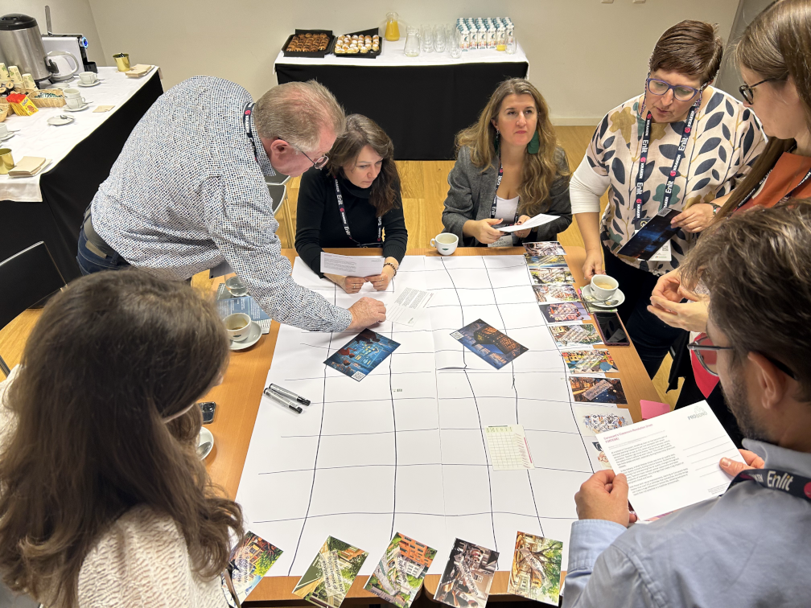
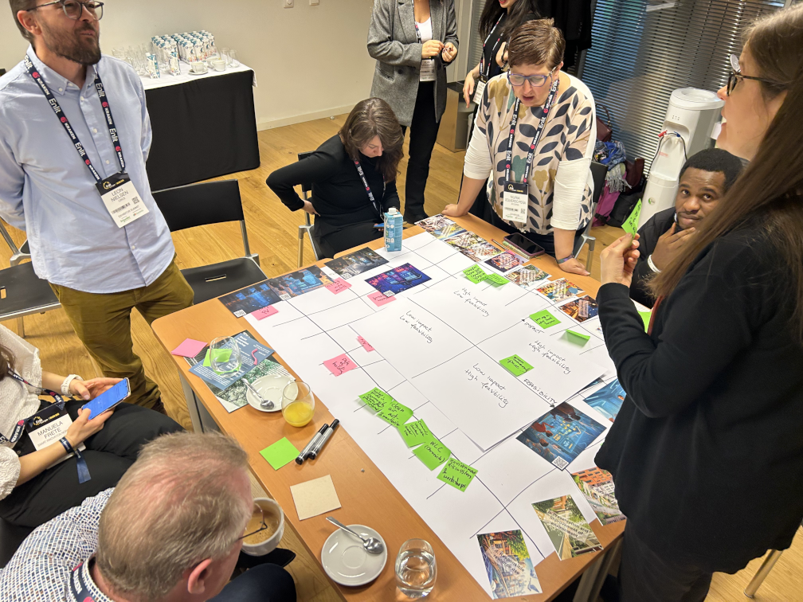
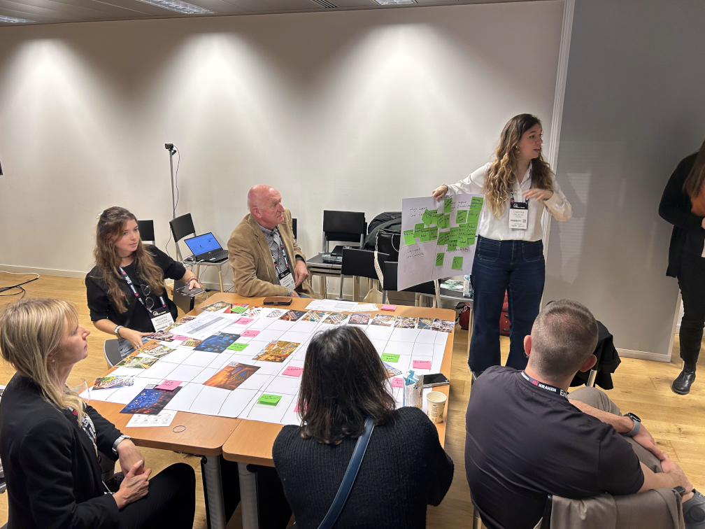

## How This Workshop Actually Works (No Boring Lectures, We Promise!)

### Welcome to the Placemaking Maptivity, Let's Build a Better City Together! 🏙️

Think of this workshop like a massive multiplayer strategy game, but instead of conquering territories or building virtual empires, we're mapping out how to make our neighborhoods and cities actually awesome to live in. We've got 90 minutes to change the world (or at least understand it better), so here's how we'll make it happen:

### **The Warm-Up Round** (15 minutes)
First things first, we'll do a quick icebreaker so you're not sitting there awkwardly wondering who everyone is. Nothing cringe, just introductions and getting comfortable with the tools we'll use. If we're online, we'll mess around with Miro (it's like a giant digital whiteboard) to make sure everyone knows how to move stuff around. If we're in person, we'll gather around a huge map on the table. We'll also explain what we're actually doing here and why it matters.

### **Level 1: Building the Game Board** (10 minutes)
Here's where it gets interesting, and fast! You'll help create the actual game board by placing cards that represent different aspects of what makes a city work. Think of it like setting up a board game, but instead of properties and hotels, we're dealing with real stuff like:
- big sustainability goals (like making our city resilient, bringing people together, using resources wisely)  
- actual services and areas (like transport, education, parks, housing)

It's a speed round, so don't overthink it, we'll figure it out together as we go!

### **Level 2: Reality Check, What's Actually Happening** (20 minutes)
Now for the real deal. You'll get cards representing actual projects and initiatives happening in your area, think bike lanes, community gardens, youth programs, recycling initiatives, whatever. Your mission? Place them on the map where they belong. 

Here's the twist: most projects hit multiple goals at once. A community garden isn't just about environment, it's also about bringing neighbors together and maybe even education. So if you think a card fits in multiple spots, speak up! This is where we start seeing how everything connects (or doesn't).

As you place cards, explain your thinking out loud. There's no "wrong" answer here, if you can defend it, it's valid. You'll probably notice some parts of the map getting crowded while others look like ghost towns. That's not a bug, it's a feature, we're discovering where your city is killing it and where it's... not.

### **Level 3: Fill the Gaps, Your Ideas Matter** (20 minutes)
Okay, so we've seen what exists. Now it's your turn to be the city planner. Look at those empty spaces on the map, what's missing? What would make your neighborhood actually slap? 

Grab sticky notes and start brainstorming:
- That sketchy underpass that needs lighting? Write it down.
- A youth center with actual stuff teens want? Add it.
- Better bus routes that don't take 2 hours to go 3 miles? Yes please.
- Pop-up markets for local businesses? Absolutely.

Don't filter yourself, if you think it would help, write it down and slap it on the map. We want your wildest ideas AND your practical ones.

### **Boss Level: The Reality Filter** (10 minutes)
Time to get strategic. We'll take your best ideas and run them through the reality check matrix:
- **Impact**: Will this actually make a difference or is it just nice to have?
- **Feasibility**: Can we realistically pull this off with current resources and constraints?

The sweet spot? High impact + actually doable = let's make it happen!
But here's the thing, even "impossible" ideas are worth discussing. Today's pipe dream might be tomorrow's funded project if we figure out what would make it feasible.

### **The Grand Finale** (15 minutes)
This is where we pull it all together:
- What patterns did we spot?
- Which gaps surprised us the most?
- What's one idea that everyone's hyped about?
- What can we actually DO next week?

You'll get to share your biggest "aha!" moment or the one thing you're taking away from this session. We'll also figure out concrete next steps, because this isn't just an exercise, it's about making real change happen.

### **Why This Workshop Doesn't Suck**
- **It's fast-paced**, no time to get bored
- **It's visual**, you literally see how your city works (or doesn't)
- **Your ideas matter**, this isn't some expert telling you what's best for your neighborhood
- **It's real**, we're working with actual projects and actual problems
- **You'll leave with a plan**, not just "awareness" but actual next steps

**Pro tip**: Don't worry if you're not a sustainability expert or urban planning nerd. If you live, work, study, or hang out in this city, you're already an expert on what works and what doesn't. Your daily experience navigating these spaces is exactly the perspective we need.

Ready to redesign your world in 90 minutes? Let's go! 🚀