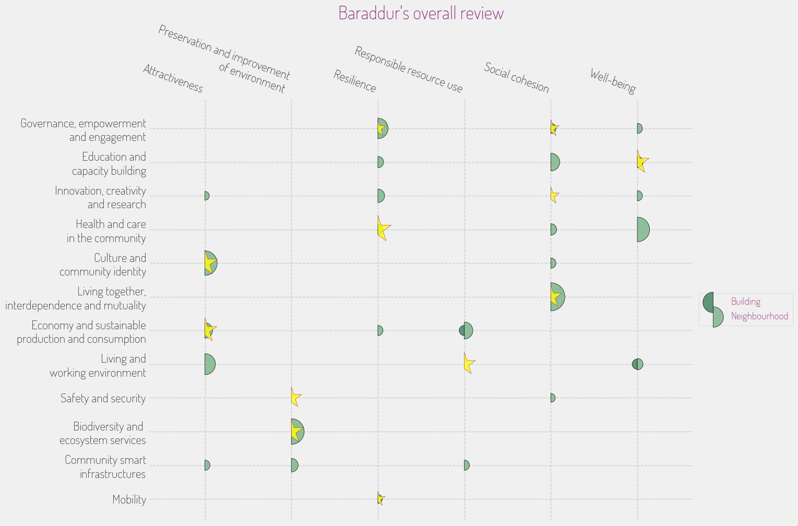

## **INITIATIVE PORTFOLIO**

### **Initiative #1: Ashen Fields Green Space Revitalization**

**Category:** Green Space & Environment  
**Scale:** Neighborhood  
**Lead Stakeholder Type:** Community Group  
**Timeline:** Short (1 year)  

**What it is:** This initiative focuses on transforming parts of the Ashen Fields into accessible green spaces, featuring community gardens, play areas for children, and relaxing spots for residents. It includes programs for residents to plant drought-resistant flora, enhancing biodiversity and providing spaces for social gatherings.  

**Why here:** Given the reported lack of access to safe parks in Barad-dûr, this initiative directly addresses community concerns while leveraging local indigenous flora that has adapted to the environment.   

**Who benefits most:** Families with children and younger residents looking for communal spaces.  

**Quick win or deep change:** Quick win  
**Estimated complexity:** Simple  

### **Initiative #2: Market Share – Supporting Local Commerce**

**Category:** Economic Development & Local Business  
**Scale:** District  
**Lead Stakeholder Type:** Public-Private Partnership  
**Timeline:** Medium (2-3 years)  

**What it is:** This initiative aims to promote and support local artisans and small businesses through the establishment of a Barad-dûr marketplace, which combines a physical space and an online platform connecting local products to broader markets while offering business development workshops. 

**Why here:** With a rich tradition of craftsmanship and an emerging creative industry, fostering local commerce could invigorate the economy and align with the cultural heritage of Barad-dûr.  

**Who benefits most:** Local artisans, small business owners, and consumers seeking unique products.  

**Quick win or deep change:** Both  
**Estimated complexity:** Moderate  

### **Initiative #3: Together We Rise – Community Resilience Hubs**

**Category:** Community Safety & Resilience  
**Scale:** City-wide  
**Lead Stakeholder Type:** Non-profit  
**Timeline:** Short (1 year)  

**What it is:** Establish community resilience hubs throughout Barad-dûr that provide resources, including emergency preparedness training, workshops on sustainable practices, and access to local advocacy groups focused on environmental justice.  

**Why here:** Given the risks from volcanic activity and community desires for improved representation, these hubs can empower residents, enhance safety, and provide a voice in governance.  

**Who benefits most:** Vulnerable populations who may lack resources and knowledge about disaster preparedness.  

**Quick win or deep change:** Systems change  
**Estimated complexity:** Moderate  

### **Initiative #4: Art and Architecture Walkway**

**Category:** Arts, Culture & Heritage  
**Scale:** Neighborhood  
**Lead Stakeholder Type:** Academic Institution  
**Timeline:** Medium (2-3 years)  

**What it is:** Create an artistic walkway in Barad-dûr that features murals, sculptures, and interactive installations by local artists, celebrating the community's aspects of history and culture, while offering guided tours to educate residents and tourists.  

**Why here:** This embraces Barad-dûr’s rich cultural diversity and history, fostering social cohesion and attracting cultural tourism that can benefit local businesses.  

**Who benefits most:** Artists, cultural tourists, and community members interested in heritage.  

**Quick win or deep change:** Both  
**Estimated complexity:** Complex  

### **Initiative #5: Learning Together – Eco-hosted Workshops**

**Category:** Education & Skills  
**Scale:** Neighborhood  
**Lead Stakeholder Type:** Community Group  
**Timeline:** Immediate (< 6 months)  

**What it is:** Launch a series of eco-hosted workshops focused on sustainable practices, such as composting, gardening, and water conservation, led by community members to build skills and resilience in everyday living.  

**Why here:** Many community members are already involved in eco-education efforts; this builds on their passion while addressing local environmental challenges.  

**Who benefits most:** Young families and those interested in sustainability practices.  

**Quick win or deep change:** Quick win  
**Estimated complexity:** Simple  

### **Initiative #6: Geothermal Power Awareness Campaign**

**Category:** Digital Infrastructure & Innovation  
**Scale:** City-wide  
**Lead Stakeholder Type:** Government  
**Timeline:** Medium (2-3 years)  

**What it is:** Implement an awareness campaign highlighting the potential of geothermal energy sources for residential use, including informational resources, workshops, and partnership programs to facilitate access to renewable energy technology for low-income households.  

**Why here:** Given the region's unique geothermal resources, this initiative can help reduce reliance on fossil fuels and promote energy equity within the community.  

**Who benefits most:** Low-income residents struggling with energy costs.  

**Quick win or deep change:** Systems change  
**Estimated complexity:** Complex  

### **Initiative #7: Safe Streets Initiative**

**Category:** Mobility & Transportation  
**Scale:** Neighborhood  
**Lead Stakeholder Type:** Government  
**Timeline:** Short (1 year)  

**What it is:** Implement safety improvements in key pedestrian pathways and public transit routes, including better lighting, signage, and community-designed public spaces to encourage walking and cycling while improving safety.  

**Why here:** Residents have expressed concerns about isolation and safety in dense city layouts; enhancing mobility can promote social engagement and reduce reliance on vehicles.  

**Who benefits most:** Pedestrians, cyclists, and residents using public transportation.  

**Quick win or deep change:** Quick win  
**Estimated complexity:** Moderate  

## **PORTFOLIO OVERVIEW**

### **Interconnections:**
- The “Market Share” initiative can benefit from the “Art and Architecture Walkway,” as local artisans' works can be showcased along the walkway, creating a unique blend of commerce and culture.
- “Together We Rise” hubs can host “Learning Together” workshops, further strengthening community resilience and sustainable practices.
- The “Safe Streets Initiative” promotes access to neighborhood markets and green spaces, enhancing the appeal and usability of the spaces created.

### **Sequencing Recommendation:**
Start with the “Learning Together” initiative to build awareness and community engagement in sustainable practices. This would create a foundation for resilience and support for other initiatives like the resilience hubs.

### **Coverage Check:**
- Age groups served: Children, Youth, Working Age
- Economic spectrum: Low-income, Middle-income
- Spatial distribution: Concentrated in neighborhoods with vulnerable populations

### **Missing Voice:**
The voices of the elderly and those with disabilities may still be overlooked by these initiatives, particularly in terms of mobility, accessibility of green spaces, and economic opportunities.