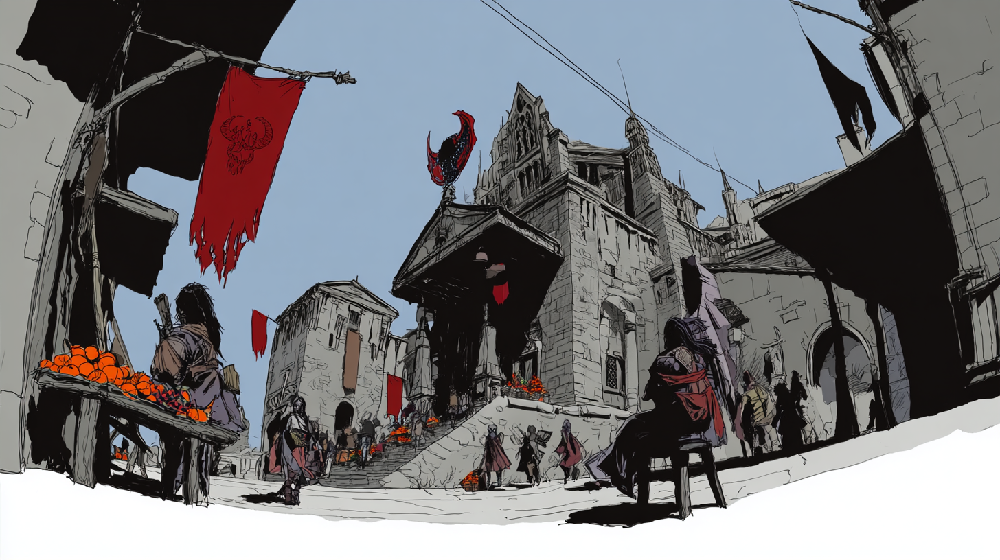

# Neighborhood Assessment Report: Barad-dûr, the City of Sauron

## Overview & Sustainability Profile

### **Neighborhood Snapshot** 
Barad-dûr, often referred to as the Citadel of Sauron, is a unique and multifaceted urban space where history, power, and creativity converge. With its imposing dark towers and rich tapestry of life, it embodies a complex narrative marked by both grandeur and challenge. This neighborhood is set in the rugged plains of Mordor, characterized by stark volcanic landscapes and a harsh climate. Three defining characteristics include its iconic architecture, predominantly crafted from black stone with intricate carvings, its strategic military significance in Middle-earth, and its eclectic community of inhabitants ranging from scholars to laborers. Physically, Barad-dûr presents an intricate layout with sprawling markets, winding alleyways, and stark contrasts between the opulence of the citadel and the less fortunate areas surrounding it.

### **Sustainability & Resilience** 
Barad-dûr faces considerable **environmental challenges** due to its geological makeup and climate. The area is prone to volcanic eruptions and ash fall, which can disrupt daily life and impact local agriculture. Yet, it boasts **environmental assets**, such as the Ashen Fields, where unique flora has adapted to its harsh conditions, showcasing resilience in nature. Local initiatives have emerged to address sustainability, including recent efforts to introduce **green infrastructure**. Efforts are underway to incorporate **green roofs** on new developments to help alleviate urban heat and improve air quality.

The **development of resilient communities** is gaining traction in Barad-dûr. Recent projects aim to create **resilience hubs**, which are community centers equipped with resources for emergency preparedness and sustainable living practices. In terms of energy transition, the city is exploring renewable energy sources harnessed from the geothermal activity prevalent in the region, aiming to reduce reliance on fossil fuels.

**Environmental justice** remains a pressing issue in Barad-dûr, as lower-income neighborhoods often bear the brunt of environmental hazards. Many community members voice concern over the lack of access to clean resources and green spaces. "We want our children to play in safe parks, not just beneath looming towers,” says Elda, a local resident. 

Collective actions have been seeded among community organizations focusing on **eco-education** and sustainable practices, striving to elevate the standards of living while advocating for environmental equity.

## **Economic Drivers & Market Forces**

### **Economic Ecosystem**
The **employment landscape** in Barad-dûr is diverse, incorporating elements of both traditional labor and emerging industries. The **primary sectors** include mining, craftsmanship, and trade, which revolve around the resources of Mordor, particularly **ore extraction**. However, there is a noticeable shift towards creative industries such as artifact restoration and cultural tourism, signaling potential economic transformation.

Barad-dûr’s **business dynamics** illustrate a blend of established enterprises and innovative startups. Markets buzz with local craftsmen selling handmade goods, while tech startups focusing on gaming and virtual experiences are rising in prominence. Importantly, the **real estate market** is experiencing renewed investment, particularly with the development of mixed-use spaces that cater to both residential and commercial needs. Current indicators show a gradual increase in property values, which reflects growing confidence in the neighborhood.

Despite economic advancements, Barad-dûr is challenged by **fiscal health** issues, as public funding for infrastructure and services often falls short. However, community-driven initiatives, particularly in sustainable practices, offer hopeful signs of economic rejuvenation. Local leaders are advocating for policies that boost funding for public spaces and local businesses, setting the stage for revitalization.

## **People & Community Dynamics**

### **Demographic Composition**
Barad-dûr features a vibrant **demographic composition**, with a population of approximately 50,000. Recent trends indicate an increase in younger inhabitants drawn to the city’s unique character and opportunities. The community is culturally diverse, with families from various backgrounds, including Humans, Elves, and Dwarves. This diversity enriches the social fabric, although it also introduces complexities in cultural coexistence.

### **Social Infrastructure**
The **community assets** in Barad-dûr include libraries, cultural centers, and local markets that serve as hubs for social interaction. These assets foster strong **social networks**, allowing residents to connect and collaborate on initiatives. However, the sense of community is often strained; many residents report feeling isolated due to the dense layout and socioeconomic disparities. “It’s easy to lose a sense of belonging here,” shares Faron, a shopkeeper.

### **Movement & Stability**
**Migration patterns** reflect both the allure and challenges of Barad-dûr. Many are drawn to the promise of work, yet the high cost of living and competition often dissuades potential residents from settling. Daily rhythms in the city exhibit a mix of bustling market activity by day and cultural gatherings at night, yet the feeling of **stability** is occasionally disrupted by social unrest or economic hardships.

### **Community Tensions & Aspirations**
Several **pressure points** exist within Barad-dûr, particularly regarding resource allocation and environmental safety. Residents express a strong desire for increased representation in local governance to address their concerns effectively. The community showcases a collective vision for a more inclusive neighborhood where voices are heard, and sustainability is prioritized.

**Social cohesion indicators** present a mixed picture; while there are strong ties among local organizations advocating for change, there is also division stemming from inequality. The commitment to fostering a collaborative community spirit continues to grow as residents increasingly participate in dialogues to bridge these gaps.

In conclusion, Barad-dûr stands as an intricate landscape shaped by its history, environment, and the relentless spirit of its community. Strengthening the bonds among its residents, addressing its challenges head-on, and embracing sustainable practices will be crucial for shaping a prosperous future for this storied city.

### ISO37101 mapping for 'Barad-dûr: Complex, diverse, resilient community.'

#### Scores

|   Score | Purpose                                     | Issue                                              | Justification                                                                                                                                                                                                                                                                                                                                                                                           |
|--------:|:--------------------------------------------|:---------------------------------------------------|:--------------------------------------------------------------------------------------------------------------------------------------------------------------------------------------------------------------------------------------------------------------------------------------------------------------------------------------------------------------------------------------------------------|
|       4 | Attractiveness                              | Economy and sustainable production and consumption | Barad-dûr's economy is diversifying with emerging industries such as cultural tourism and creative sectors. There are established enterprises and innovative startups contributing to the market's vibrancy, which indicates a strong appeal for residents and businesses. The local craft markets and new mixed-use developments reflect the neighborhood’s attractiveness and economic opportunities. |
|       4 | Preservation and improvement of environment | Biodiversity and ecosystem services                | The Ashen Fields in Barad-dûr showcase unique flora that has adapted to volcanic conditions, indicating efforts to protect local biodiversity. Initiatives for green roofs and environmental stewardship aim to enhance ecosystem services, demonstrating a commitment to preservation and improvement.                                                                                                 |
|       5 | Resilience                                  | Health and care in the community                   | Barad-dûr is implementing resilience hubs to prepare for environmental challenges and improve health services. The focus on community preparedness and sustainable living practices directly relates to enhancing the health and well-being of its inhabitants in the face of adversity.                                                                                                                |
|       3 | Responsible resource use                    | Living and working environment                     | The area faces challenges related to resource allocation and equitable access to clean resources. Efforts towards sustainable practices and eco-education advocate for responsible resource use, although issues of inequality still persist in the living environment.                                                                                                                                 |
|       4 | Social cohesion                             | Governance, empowerment and engagement             | The community expresses a desire for better representation in governance and engages in dialogues about sustainability and resource allocation. Local organizations are strengthening social networks and advocacy for change, thus enhancing community cohesion and engagement.                                                                                                                        |
|       4 | Well-being                                  | Education and capacity building                    | Barad-dûr has emerging community-driven initiatives focusing on eco-education and skill-building. The community's efforts to raise awareness and knowledge about sustainable practices contribute to the overall well-being and empowerment of its residents.                                                                                                                                           |
|       4 | Attractiveness                              | Culture and community identity                     | The cultural diversity of Barad-dûr, with its mix of Humans, Elves, and Dwarves, enhances its identity and attractiveness. The local markets and cultural hubs foster a sense of place and opportunity for cultural exchange, enriching the community's appeal.                                                                                                                                         |
|       3 | Preservation and improvement of environment | Safety and security                                | Environmental challenges, including volcanic eruptions and ash fall, pose safety risks to the community. The need for improved public spaces and responsible planning to enhance safety in these contexts is critical for community well-being and preservation.                                                                                                                                        |
|       3 | Social cohesion                             | Living together, interdependence and mutuality     | Social isolation stemming from socioeconomic disparities indicates a need for stronger interdependence among community members. Collective actions and mutual support are growing, aiming to bridge community gaps and foster collaboration.                                                                                                                                                            |
|       3 | Resilience                                  | Mobility                                           | Barad-dûr's mobility options reflect challenges due to high living costs and competition, affecting stability for potential residents. Enhancing transport systems and accessibility is vital for promoting economic interaction and community resilience.                                                                                                                                              |
|       4 | Attractiveness                              | Economy and sustainable production and consumption | Barad-dûr's economic dynamics reflect a balance of traditional labor and emerging creative industries. The presence of diverse markets with local craftsmanship and the rise of tech startups highlight its attractiveness and potential for economic transformation, fostering a vibrant community environment.                                                                                        |
|       4 | Preservation and improvement of environment | Biodiversity and ecosystem services                | The unique flora of the Ashen Fields showcases the resilience of local biodiversity despite the harsh volcanic climate of Barad-dûr. Initiatives of green infrastructure, such as green roofs, directly address environmental challenges while promoting ecological regeneration in the neighborhood.                                                                                                   |
|       5 | Resilience                                  | Health and care in the community                   | Barad-dûr focuses on developing resilience hubs that enhance community preparedness for environmental challenges. These centers not only address the physical infrastructure needs but also emphasize the importance of mental well-being and safe living areas, critical in a community vulnerable to environmental hazards.                                                                           |
|       4 | Responsible resource use                    | Living and working environment                     | Barad-dûr's initiatives towards sustainable practices, like eco-education and resource sharing, showcase a commitment to responsible resource use. This is essential in facilitating fair access to quality living conditions while managing the challenges posed by its environment.                                                                                                                   |
|       4 | Social cohesion                             | Living together, interdependence and mutuality     | Despite the challenges of socioeconomic disparities, community organizations in Barad-dûr promote social networks and collaborative initiatives, fostering interdependence and supporting mutual benefits among residents. This is pivotal for building a sense of belonging even amid tensions.                                                                                                        |
|       4 | Well-being                                  | Education and capacity building                    | Collective actions and local initiatives focusing on eco-education contribute to raising awareness and skills among community members. This enhances overall well-being and empowers residents to participate actively in sustainable practices.                                                                                                                                                        |
|       5 | Attractiveness                              | Culture and community identity                     | Barad-dûr's rich historical narrative, marked by unique architecture and cultural diversity, significantly contributes to its attractiveness. The interplay between tradition and emerging industries enhances community identity and a sense of place.                                                                                                                                                 |
|       4 | Resilience                                  | Governance, empowerment and engagement             | Residents express a strong desire for greater representation and involvement in local governance, which is essential for resilience. Enhancing community engagement in decision-making processes can effectively address the challenges faced by Barad-dûr.                                                                                                                                             |
|       3 | Preservation and improvement of environment | Safety and security                                | The ongoing concerns regarding environmental hazards and access to clean resources highlight the need for improved safety measures in Barad-dûr. Addressing these issues is vital for ensuring a secure living environment in a community marked by natural challenges.                                                                                                                                 |
|       4 | Social cohesion                             | Innovation, creativity and research                | The blend of traditional and emerging industries in Barad-dûr invites innovation and creativity, serving as a catalyst for social cohesion. Collaborations among diverse community members foster a dynamic atmosphere conducive to sharing knowledge and driving collective growth.                                                                                                                    |

