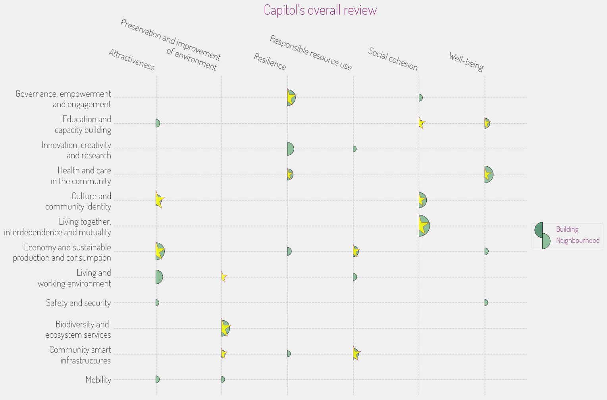

## **INITIATIVE PORTFOLIO**

### **Initiative #1: Urban Green Networks**

**Category:** Green Space & Environment  
**Scale:** District  
**Lead Stakeholder Type:** Public-Private Partnership  
**Timeline:** Medium (2-3 years)  

**What it is:** This initiative seeks to create a network of interconnected green spaces throughout The Capitol, linking parks, gardens, and public squares. By developing eco-corridors that enhance biodiversity and improve air quality, these green spaces will serve not only as recreational areas but also as critical ecological resources that promote urban resilience.

**Why here:** The Capitol already possesses several green assets, which can be utilized to enhance connections between communities, particularly for marginalized populations who have limited access to such spaces.

**Who benefits most:** Residents in lower-income areas who have less access to parks and recreational opportunities.

**Quick win or deep change:** Both  
**Estimated complexity:** Moderate  

### **Initiative #2: Skills for the Future**

**Category:** Education & Skills  
**Scale:** Neighborhood  
**Lead Stakeholder Type:** Non-profit  
**Timeline:** Short (1 year)  

**What it is:** This initiative focuses on establishing skill-building workshops and vocational training programs in community centers throughout The Capitol. Topics may include digital literacy, green technology, and creative arts, designed to empower residents with valuable skills to improve their employability in the changing landscape.

**Why here:** The Capitol's employment landscape reveals a need for upskilling, particularly for those stuck in low-wage service roles. This initiative will help bridge the gap for newly migrated residents seeking better job opportunities.

**Who benefits most:** Youth and working-age adults from impoverished districts.

**Quick win or deep change:** Quick win  
**Estimated complexity:** Simple  

### **Initiative #3: Affordable Housing Co-ops**

**Category:** Housing & Built Environment  
**Scale:** City-wide  
**Lead Stakeholder Type:** Community Group  
**Timeline:** Long (3+ years)  

**What it is:** This initiative will develop community-led affordable housing cooperatives, allowing residents to collectively manage their housing situation, ensuring affordability and stability while fostering community engagement. This can be achieved through securing land leases and resources from local government.

**Why here:** The Capitol faces significant gentrification and increasing costs of living. Establishing cooperatives offers a sustainable solution to address these challenges directly within the community.

**Who benefits most:** Low-income families and marginalized populations.

**Quick win or deep change:** Deep change  
**Estimated complexity:** Complex  

### **Initiative #4: Cultural Convergence Festivals**

**Category:** Arts, Culture & Heritage  
**Scale:** City-wide  
**Lead Stakeholder Type:** Non-profit  
**Timeline:** Short (1 year)  

**What it is:** This initiative will create annual cultural festivals, celebrating the diversity of The Capitol's population. Activities will include art installations, performances, food fairs, and collaborative workshops, promoting the rich cultural heritage of all residents while fostering connection and solidarity.

**Why here:** With its diverse cultural identity, The Capitol can benefit from initiatives that enhance community ties and celebrate its unique character, especially amid rising social tensions.

**Who benefits most:** All residents, particularly immigrant and minority populations.

**Quick win or deep change:** Both  
**Estimated complexity:** Simple  

### **Initiative #5: Community Resilience Hubs**

**Category:** Community Safety & Resilience  
**Scale:** Neighborhood  
**Lead Stakeholder Type:** Local Government  
**Timeline:** Medium (2-3 years)  

**What it is:** This initiative focuses on establishing community resilience hubs that offer resources and support during times of crisis—be it climate-related or social. They will provide emergency preparedness training, psychological support, and access to essential supplies in vulnerable neighborhoods.

**Why here:** Given the Capitol's climate vulnerabilities and social disparities, creating spaces that enhance resilience and foster community solidarity is timely and essential.

**Who benefits most:** Vulnerable populations in high-risk areas.

**Quick win or deep change:** Deep change  
**Estimated complexity:** Complex  

### **Initiative #6: The Green Economy Marketplace**

**Category:** Economic Development & Local Business  
**Scale:** Neighborhood  
**Lead Stakeholder Type:** Public-Private Partnership  
**Timeline:** Short (1 year)  

**What it is:** This initiative aims to create a marketplace for local, sustainable businesses and green start-ups, allowing residents to access eco-friendly goods and services. It will also serve as a platform for local entrepreneurs to network and collaborate.

**Why here:** With The Capitol’s growing focus on sustainability and circular economy principles, a dedicated marketplace can drive engagement and support local economic resilience.

**Who benefits most:** Small business owners and conscious consumers.

**Quick win or deep change:** Quick win  
**Estimated complexity:** Simple  

### **Initiative #7: Digital Inclusion for All**

**Category:** Digital Infrastructure & Innovation  
**Scale:** City-wide  
**Lead Stakeholder Type:** Non-profit  
**Timeline:** Long (3+ years)  

**What it is:** This initiative aims to establish accessible internet infrastructure across the Capitol, creating public Wi-Fi zones in parks and community centers while offering digital literacy courses to ensure everyone can utilize the technology effectively.

**Why here:** Many residents in poorer districts face barriers to accessing technology, a disparity that exacerbates social inequities and limits economic opportunities.

**Who benefits most:** Low-income residents and students without reliable internet.

**Quick win or deep change:** Both  
**Estimated complexity:** Moderate  

## **PORTFOLIO OVERVIEW**

### **Interconnections:**
Initiatives like the **Cultural Convergence Festivals** and **Affordable Housing Co-ops** can work together to create a strong sense of belonging within neighborhoods, making the events inclusive and drawing more community engagement into affordable housing discussions. Additionally, **Community Resilience Hubs** can provide the support needed to build cohesiveness among various cultural groups throughout the festivals.

### **Sequencing Recommendation:**
Starting with **Skills for the Future** is recommended, as this can immediately empower residents to seek better employment opportunities, setting a foundation for subsequent initiatives. Once residents are more skilled, the **Affordable Housing Co-ops** and **Community Resilience Hubs** can develop simultaneously to address pressing housing needs and climate vulnerabilities.

### **Coverage Check:**
- Age groups served: Children, Youth, Working Age, Seniors 
- Economic spectrum: Low-income, Middle-income, Mixed  
- Spatial distribution: Dispersed  

### **Missing Voice:**
While these initiatives address various community needs, the voices of local artists and cultural workers may still be overlooked, highlighting a need for specific support structures that empower these individuals within The Capitol’s vibrant creative landscape.