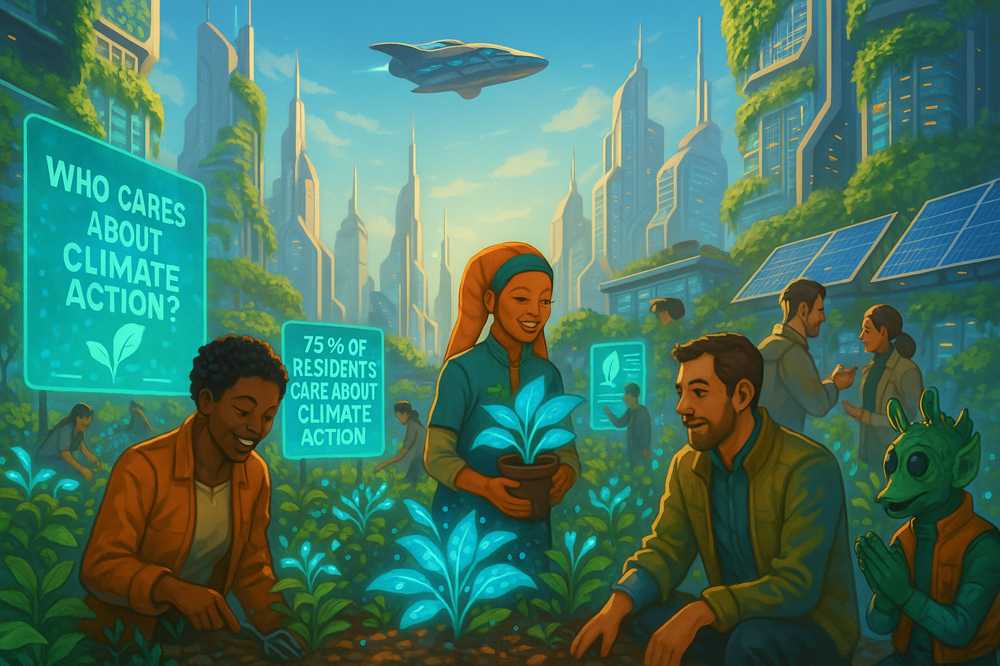

## **PROJECT IDENTIFICATION**

### **Project Title:** 
**Coruscant Climate Connect**

### **Project Type:** 
Hybrid

### **Scale:** 
Neighborhood

### **Timeline:** 
Short-term (1 year)

### ISO37101 mapping for 'Community engagement for climate action.'

#### Scores

|   Score | Purpose                                     | Issue                                              | Justification                                                                                                                                                                                                                                                 |
|--------:|:--------------------------------------------|:---------------------------------------------------|:--------------------------------------------------------------------------------------------------------------------------------------------------------------------------------------------------------------------------------------------------------------|
|       5 | Attractiveness                              | Culture and community identity                     | The 'Coruscant Climate Connect' project enhances the appeal of the neighborhood by fostering a sense of identity through community-driven climate action initiatives, encouraging residents to engage with one another and strengthening their shared values. |
|       5 | Responsible resource use                    | Economy and sustainable production and consumption | By fostering sustainable practices such as the Green Pledge Challenge, the project promotes responsible resource use within the community, encouraging local businesses and residents to adopt sustainable consumption habits.                                |
|       5 | Social cohesion                             | Living together, interdependence and mutuality     | The project aims to combat feelings of isolation among residents by creating connections through climate initiatives, thus nurturing bonds and promoting a collaborative approach towards mutual community goals.                                             |
|       4 | Well-being                                  | Health and care in the community                   | By promoting environmentally friendly practices and community engagement, 'Coruscant Climate Connect' contributes to the mental and social well-being of residents, ensuring a healthier community environment.                                               |
|       4 | Preservation and improvement of environment | Biodiversity and ecosystem services                | The initiative emphasizes environmental stewardship and encourages residents to adopt practices that may help protect local ecosystems and biodiversity within the community.                                                                                 |
|       4 | Resilience                                  | Governance, empowerment and engagement             | This initiative seeks to empower residents by involving them directly in climate action and governance processes, thus building climate resilience within the community.                                                                                      |
|       4 | Attractiveness                              | Innovation, creativity and research                | The project stimulates innovative approaches to community engagement around climate issues, leveraging creative communication strategies to develop a stronger community ethos.                                                                               |
|       5 | Social cohesion                             | Education and capacity building                    | A key component of the project is the Neighborhood Climate Ambassadors Program, which builds capacity within the community, educating residents and empowering them to become local leaders in climate action.                                                |
|       4 | Well-being                                  | Living and working environment                     | By enhancing community engagement and fostering a sense of belonging, the project improves the living environment for residents, addressing their social needs alongside environmental ones.                                                                  |
|       4 | Well-being                                  | Living and working environment                     | The project not only raises awareness about climate issues but also emphasizes the need for an inclusive and participatory environment to improve overall community quality of life.                                                                          |

## **CONTEXTUAL FOUNDATION**

### **Specific Local Challenge Addressed:**
The main challenge that "Coruscant Climate Connect" addresses is the widespread feeling of isolation among residents regarding their environmental concerns, a phenomenon known as pluralistic ignorance. According to the CERNA assessment, many residents underestimate how many others share their commitment to climate action, which impedes collective efforts to combat climate issues effectively. By addressing this psychological barrier, we can enhance community engagement in climate initiatives, thus amplifying the impact of our actions.

### **Local Assets Leveraged:**
This initiative will build upon the community’s existing environmental stewardship groups and local advocacy organizations that already show a commitment to climate issues. Additionally, Coruscant has several community centers and parks that can serve as venues for workshops, gatherings, and activities. These local assets provide the foundation for fostering connectivity among residents and facilitating climate action discussions.

### **Cultural/Social Fit:**
"Coruscant Climate Connect" aligns with the community’s values of sustainability, collaboration, and civic engagement. The project respects and enhances local practices by promoting grassroots involvement and peer education about environmental efforts. By connecting individuals who already care about the climate, the initiative reinforces a culture of mutual support, neighborly cooperation, and shared responsibility towards Coruscant’s ecological future.

## **PROJECT DESCRIPTION**

### **Core Concept:** 
"Coruscant Climate Connect" aims to create an inclusive community network that showcases the collective concerns and actions of residents toward climate change. Through targeted communication and educational campaigns, the initiative will clarify misconceptions about neighborhood attitudes, promote effective sustainability practices, and organize local climate initiatives.

### **Key Components:**
1. **Neighborhood Climate Ambassadors Program:** This will recruit and train residents to become local leaders in climate education and action, enabling them to organize workshops, share educational materials, and engage with neighbors directly.
2. **The Green Pledge Challenge:** A month-long program where residents commit to adopting specific sustainable practices—ranging from reducing waste to using public transport—tracking their commitments both online and in person through community boards at local centers.
3. **Community Climate Festival:** A celebratory event marking the culmination of the Green Pledge Challenge, featuring local eco-vendors, educational booths, art installations, and climate speakers that highlight the successes and stories from the community.

### **Implementation Approach:**
- **Phase 1:** Launch an awareness campaign to invite residents to join the Neighborhood Climate Ambassadors Program, utilizing local social media channels and flyers in community spaces. Initial training sessions will focus on effective communication and grassroots organizing.
- **Phase 2:** Roll out the Green Pledge Challenge, encouraging neighborhoods to compete in tracking sustainable behaviors while rewarding those who achieve the most significant reductions in individual carbon footprints. This phase will also include workshops and community forums to foster discussion on effective climate action.
- **Phase 3:** Organize the Community Climate Festival to celebrate the completion of the challenge, engage residents in further dialogue about sustainability, and build community ties through shared successes.

## **STAKEHOLDER ECOSYSTEM**

### **Champions:** 
Local environmental organizations and committed residents will serve as champions for this initiative, including key figures from the city council who have been vocal about climate action.

### **Partners:** 
This initiative will partner with local schools, universities, non-profits focused on environmental education, and businesses that are committed to sustainable practices. Collaboration will also occur with regional agencies focused on climate resilience.

### **Beneficiaries:** 
Community members of all ages will benefit through education, enhanced community cohesion, and actionable steps to reduce their carbon footprint. Local businesses may also see increased patronage from residents engaged in sustainability.

### **Potential Opposition:** 
Some might resist due to perceived inconvenience or skepticism regarding the effectiveness of individual actions. Addressing concerns through transparent communication regarding the collective impact of small changes and promoting early successes can mitigate resistance.

## **FEASIBILITY & IMPACT**

### **Success Indicators:**
- Quantitative metric: Increase in the number of households participating in the Green Pledge Challenge by 30% over the first year.
- Qualitative metric: Resident feedback and stories regarding the impact of the program on their perception of community engagement concerning climate issues.
- Community-defined metric: An increase in social media engagement related to climate actions and a growth in local climate advocacy groups.

### **Ripple Effects:** 
This initiative may encourage deeper civic involvement and awareness about other critical community issues such as local food systems, public transport advocacy, and green job training opportunities.

### **Risk Mitigation:** 
A primary risk is a lack of community engagement. To mitigate this risk, we will hold an initial community meeting to gather input and enthusiasm before formal engagements and ensure inclusive and meaningful participation throughout.

## **LOCAL ADAPTATION NOTES**

### **What makes this project uniquely suited to this place:**
The existing environmental consciousness among residents in Coruscant and the infrastructure of community centers and cultural venues provide a ripe context for this project. Unlike other neighborhoods, Coruscant’s unique blend of diverse communities and strong local values around democracy and collaboration makes this initiative particularly suited for fostering action and connection.

### **How locals would likely describe this project in their own words:**
“Coruscant Climate Connect is just what we need! It’s about bringing us together to share our passion for the planet and taking meaningful action right here in our neighborhood, showing that we’re all in this together.” 

This initiative is designed not just to raise awareness, but to foster a vibrant community dialog that feels personal, local, and immediately impactful. By prioritizing individual stories and collective efforts, "Coruscant Climate Connect" can help transform the neighborhood into a beacon of communal climate action.