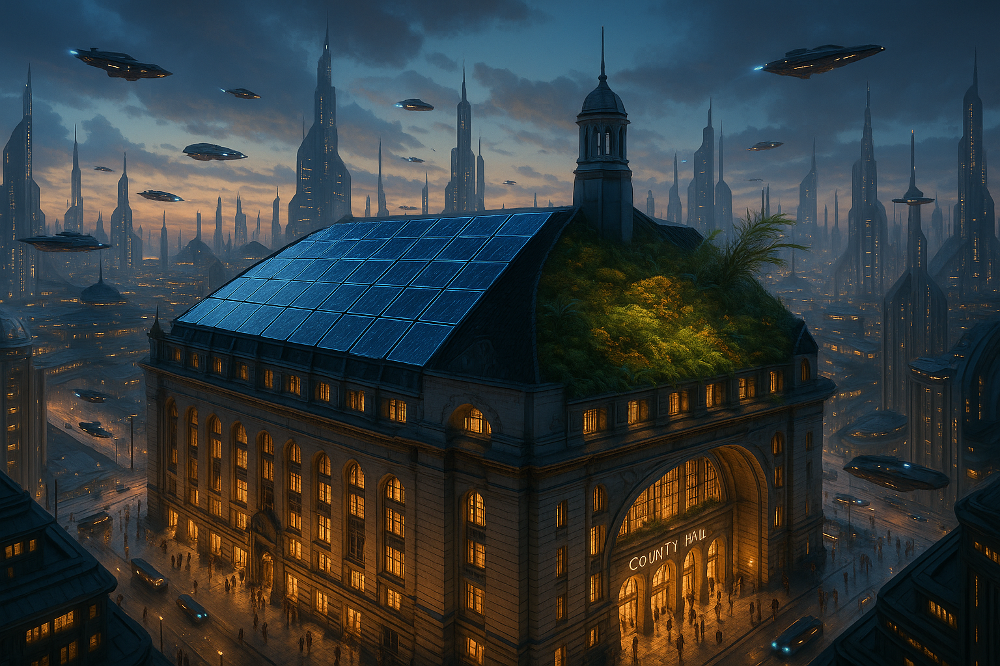

## **PROJECT IDENTIFICATION**

### **Project Title:**
Urban Oasis: The Green Roof Initiative

### **Project Type:**
Environmental

### **Scale:**
City-wide

### **Timeline:**
Medium-term (2-3 years)

### ISO37101 mapping for 'Urban green roofs for sustainability.'

#### Scores

|   Score | Purpose                                     | Issue                                              | Justification                                                                                                                                                                                                                                                                                                                                                |
|--------:|:--------------------------------------------|:---------------------------------------------------|:-------------------------------------------------------------------------------------------------------------------------------------------------------------------------------------------------------------------------------------------------------------------------------------------------------------------------------------------------------------|
|       5 | Attractiveness                              | Biodiversity and ecosystem services                | The Urban Oasis initiative aims to transform rooftops into green spaces which enhances the city's aesthetic appeal while promoting local biodiversity. The integration of native plant species on green roofs fosters urban wildlife, improving ecosystem services and attracting more residents and businesses to participate in this sustainable endeavor. |
|       5 | Preservation and improvement of environment | Biodiversity and ecosystem services                | The project directly targets the improvement of biodiversity by integrating green roofs with solar panels, thus enhancing the urban ecology of Coruscant. This initiative not only reduces energy consumption but actively contributes to restoring ecological balance within the urban setting.                                                             |
|       5 | Responsible resource use                    | Economy and sustainable production and consumption | Implementing green roofs integrates renewable energy solutions with urban gardening practices, promoting responsible resource management and sustainable consumption patterns among the community, hence enhancing local economic activities.                                                                                                                |
|       4 | Social cohesion                             | Living together, interdependence and mutuality     | Through community workshops and establishing the Green Roof Stewards program, the initiative encourages participation, shared responsibilities, and interactions among community members, fostering social bonds and a collaborative spirit.                                                                                                                 |
|       4 | Well-being                                  | Health and care in the community                   | The project aims to improve air quality and provide educational opportunities in community gardens, contributing to mental and physical wellness of local residents amidst the urban environment.                                                                                                                                                            |
|       5 | Attractiveness                              | Culture and community identity                     | By integrating a green roof with solar power while respecting the historical character of County Hall, the project enhances local identity and fosters community pride, merging innovation with heritage.                                                                                                                                                    |
|       5 | Well-being                                  | Education and capacity building                    | The initiative includes educational programs that build awareness and skills surrounding urban gardening and renewable energy practices, therefore enhancing community capacity to embrace sustainability.                                                                                                                                                   |
|       4 | Social cohesion                             | Governance, empowerment and engagement             | The project emphasizes community engagement through transparent communication and inclusive decision-making about construction, fostering collective responsibility and ownership in enhancing urban environments.                                                                                                                                           |
|       5 | Resilience                                  | Living and working environment                     | By transforming rooftops into green spaces, the project not only provides ecological benefits but also creates multifunctional living environments that enhance urban livability and community interaction during disruptions.                                                                                                                               |

## **CONTEXTUAL FOUNDATION**

### **Specific Local Challenge Addressed:**
Coruscant faces an urgent need for sustainable infrastructure that aligns with its coastal climate, while also improving urban biodiversity and community well-being. The existing plan to transform the County Hall's roof into a greener space captures an opportunity to not only enhance the building's durability and energy efficiency but also create a model for sustainability throughout the city. The dual zones of solar panels and a green roof propose a unique blending of energy generation and ecological healing in a bustling urban context, addressing issues of climate resilience, energy sustainability, and declining biodiversity in urban settings.

### **Local Assets Leveraged:**
This initiative builds on Coruscant's commitment to sustainability as reflected in existing governmental support for renewable energy and modern urban development projects. The city's existing biodiversity officers and conservation architects are invaluable assets, providing expertise and design knowledge that will amplify the project’s impact. Moreover, the existing community of environmentally conscious residents will contribute through engagement, advocacy, and stewardship, strengthening both community bonds and ecological practices.

### **Cultural/Social Fit:**
Coruscant's local values emphasize heritage, innovation, and community welfare. Integrating a green roof with solar power reflects the city's dedication to merging historical preservation with modern sustainability efforts. This initiative respects the historic character of County Hall by ensuring modifications are confined to newer structures, thereby preserving the town's architectural narrative while enhancing it for future generations. By showcasing sustainable practices, the project fosters a sense of pride in local identity and encourages collective responsibility towards the environment.

## **PROJECT DESCRIPTION**

### **Core Concept:**
The Urban Oasis initiative seeks to transform building rooftops across Coruscant into vibrant urban landscapes that not only generate clean energy but also foster local biodiversity. By implementing proxy green roofs alongside solar panels, the program aims to produce actionable data on energy efficiency gains, enhance the city’s aesthetic appeal, and provide community spaces for relaxation and education about green practices.

### **Key Components:**
1. **Physical/spatial element:** Installation of green roofs featuring native plant species interspersed with solar panels on County Hall as a pilot model, and outreach to other public buildings.
   
2. **Programming/activity element:** Establishment of community workshops and educational programs focused on urban gardening, the importance of biodiversity, and renewable energy practices that encourage local participation.

3. **Community engagement element:** Formation of a "Green Roof Stewards" program that empowers local volunteers to maintain and monitor the health of green roofs, reinforcing community ownership of public spaces.

### **Implementation Approach:**
- **Phase 1:** Immediate actions would include finalizing the design plans for the County Hall roof, securing funding through local grants and public-private partnerships, and beginning marketing campaigns to raise awareness and excitement within the community.

- **Phase 2:** Building momentum will be achieved through the activation of workshops to engage community members in design and maintenance activities, alongside installing the pilot project on County Hall. Monitoring will begin to analyze energy production and biodiversity benefits.

- **Phase 3:** Full realization will include the rollout of retrofitting initiatives to other strategic buildings around Coruscant, adapting lessons learned from the pilot project. A city-wide sustainability strategy may emerge, encouraging other sectors to adopt similar practices, creating a network of green rooftops citywide.

## **STAKEHOLDER ECOSYSTEM**

### **Champions:**
Local environmental organizations and sustainability advocates, along with the County Hall’s leadership, particularly the biodiversity officer and conservation architect, will champion this initiative, supporting funding efforts and mobilizing the community.

### **Partners:**
Collaboration will be established with local universities (for research support about performance data), NGOs focused on urban ecology, landscape architects for green roofs, and the local government for policy integration and funding.

### **Beneficiaries:**
The main beneficiaries will be local residents of Coruscant who will enjoy improved air quality, aesthetic enhancements, educational opportunities, and community engagement. Additionally, urban wildlife will benefit from the green spaces created, contributing to enhanced biodiversity in the city.

### **Potential Opposition:**
Some residents may oppose the initial cost, noise, and disruption associated with construction. Addressing these concerns through transparent communication, showing detailed maintenance plans, and emphasizing long-term cost savings in energy consumption can help mitigate resistance.

## **FEASIBILITY & IMPACT**

### **Success Indicators:**
- **Quantitative metric:** Increase in solar energy production percentages and biodiversity counts as tracked through a monitoring system.
- **Qualitative metric:** Community feedback gathered through surveys about satisfaction with green spaces and educational programming.
- **Community-defined metric:** Number of volunteer hours contributed by community members to the Green Roof Stewards program.

### **Ripple Effects:**
This initiative could inspire other neighborhoods within Coruscant and beyond to adopt similar green space strategies, improving overall urban ecology. Furthermore, as community members become more engaged in sustainability practices, it may foster a stronger sense of community and collective responsibility for environmental stewardship.

### **Risk Mitigation:**
A primary risk lies in potential maintenance challenges. To mitigate this, training workshops will equip local stewards with the knowledge required to care for these green roofs, ensuring long-term success and sustainability for the initiative.

## **LOCAL ADAPTATION NOTES**

### **What makes this project uniquely suited to this place:**
The combination of historical preservation and innovative environmental solutions directly addresses Coruscant's identity as a town merging the old with the new. Unlike other urban settings where space is often scarce, Coruscant's existing architectural framework makes rooftop conversion an ideal solution for enhancing biodiversity and renewable energy.

### **How locals would likely describe this project in their own words:**
"It's about time we turned our rooftops into green spaces - they are not just for resting on. We’ll be the pioneers of a greener future, showcasing what our beautiful city can accomplish for itself and the environment while keeping our history intact!" 

This sentiment embodies local pride and a forward-thinking attitude, demonstrating community engagement in shaping a sustainable future.