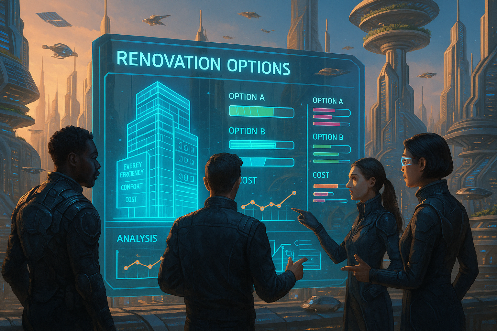

## **PROJECT IDENTIFICATION**

### **Project Title:**  
**Eco-Coruscant: Energy Initiative for Sustainable Living**

### **Project Type:**  
Environment

### **Scale:**  
City-wide

### **Timeline:**  
Medium-term (2-3 years)

### ISO37101 mapping for 'Sustainable energy initiative for Coruscant.'

#### Scores

|   Score | Purpose                                     | Issue                                              | Justification                                                                                                                                                                                                                                                                                                                                                                                   |
|--------:|:--------------------------------------------|:---------------------------------------------------|:------------------------------------------------------------------------------------------------------------------------------------------------------------------------------------------------------------------------------------------------------------------------------------------------------------------------------------------------------------------------------------------------|
|       5 | Attractiveness                              | Living and working environment                     | The initiative aims to enhance the living conditions in Coruscant by improving energy efficiency in existing buildings, which directly affects residents' quality of life and the overall appeal of the city. By fostering community pride and engagement while addressing energy usage, the project enhances the attractiveness of the neighborhood, making it a more desirable place to live. |
|       4 | Preservation and improvement of environment | Biodiversity and ecosystem services                | The Eco-Coruscant initiative contributes to reducing the overall carbon footprint of the city, which is a significant environmental concern. By promoting energy-efficient practices and renovations, the project aims to improve the environmental performance of buildings in Coruscant, ultimately protecting both local biodiversity and ecosystem services.                                |
|       4 | Resilience                                  | Living together, interdependence and mutuality     | The initiative addresses community resilience by fostering collaboration among residents and local organizations to adapt and modernize energy practices. Through the creation and use of the digital tool, the project aims to prepare households for economic and environmental changes, encouraging mutual support and interaction within the community.                                     |
|       5 | Responsible resource use                    | Economy and sustainable production and consumption | The use of a digital platform that promotes energy-efficient renovations highlights responsible resource management by educating residents about sustainable practices. This approach not only reduces energy consumption but also encourages responsible use of economic resources, aligning well with the broader goals of sustainable production and consumption.                            |
|       5 | Social cohesion                             | Education and capacity building                    | Through community workshops and training programs, the Eco-Coruscant initiative emphasizes social cohesion and the importance of equitable access to resources. By fostering dialogue and educating residents about sustainable practices, the project enhances community connections and encourages collective action towards shared sustainability goals.                                     |
|       4 | Well-being                                  | Health and care in the community                   | By promoting energy-efficient and comfortable living conditions through renovations, the initiative contributes to the physical and mental well-being of residents. Improved environmental quality and energy efficiency lead to healthier living spaces, thereby enhancing the overall quality of life in Coruscant.                                                                           |
|       4 | Attractiveness                              | Culture and community identity                     | The project respects and integrates Coruscant's unique architectural heritage while promoting modernization through energy efficiency. By leveraging local cultural elements, the initiative aims to enhance community identity, making the space more attractive and retaining its historical significance.                                                                                    |
|       4 | Resilience                                  | Governance, empowerment and engagement             | The Eco-Coruscant initiative involves community engagement and local partnerships to ensure stakeholder participation in decision-making processes. This enhances the community’s capacity to respond to challenges related to energy consumption and sustainability, fostering resilience within the urban environment.                                                                        |
|       5 | Preservation and improvement of environment | Community smart infrastructures                    | By implementing a digital tool that facilitates energy-efficient renovations, the initiative supports the development of smart infrastructures that focus on sustainability. This aligns with the goal of improving resource efficiency and environmental performance city-wide.                                                                                                                |

## **CONTEXTUAL FOUNDATION**

### **Specific Local Challenge Addressed:**  
Coruscant, a city known for its architectural advancements and vibrant culture, faces a critical challenge in balancing energy consumption with sustainability and comfort in its aging buildings. Many structures lack energy-efficient designs, leading to high emissions and costs for residents. The proposed "Eco-Coruscant" initiative addresses this issue by offering a comprehensive digital tool that empowers residents and city officials alike to make informed decisions regarding energy renovations. This tool will not only enhance individual building performance but also contribute to larger municipal sustainability goals, reducing Coruscant's overall carbon footprint.

### **Local Assets Leveraged:**  
Coruscant is rich in community spirit, with various neighborhood associations and local advocacy groups committed to promoting sustainability. By leveraging these existing networks, the Eco-Coruscant initiative can amplify community engagement. Additionally, the city’s diverse architectural heritage provides a unique opportunity to innovate within established aesthetics rather than imposing radical changes, fostering community pride while enhancing energy efficiency.

### **Cultural/Social Fit:**  
The initiative aligns with Coruscant’s deep roots in innovation and community-driven solutions. Local values emphasize legacy and tradition, making it crucial for the initiative to respect these elements while enabling modernization. By involving residents in the decision-making process regarding their homes, the project not only respects local autonomy but fosters a sense of ownership and pride in contributions towards a sustainable future. 

## **PROJECT DESCRIPTION**

### **Core Concept:**  
The "Eco-Coruscant" project centers around introducing an energy efficiency digital tool tailored for the city’s unique building landscape. This initiative will guide residents through energy renovation processes, ensuring comfort while also maintaining cost-effectiveness. The bigger vision encompasses integrating this tool into city planning strategies, ultimately paving the way for a greener Coruscant.

### **Key Components:**  
1. **Digital Decision-Making Platform:** A user-friendly, web-based application that provides tailored recommendations for energy-efficient renovations based on individual building assessments. 
2. **Workshops and Training Programs:** Free community workshops hosted in partnership with local organizations to teach residents how to use the platform effectively and understand energy-efficient practices.
3. **Community Celebration Events:** Regularly scheduled events celebrating successful renovations and innovative energy solutions, fostering community pride and shared learning experiences.

### **Implementation Approach:**  
- Phase 1: **Immediate Actions** - Develop and launch the digital platform, collaborating closely with local tech startups to ensure usability. Conduct outreach to engage community leaders and local associations for initial feedback on tool functionalities.
- Phase 2: **Building Momentum** - Host community workshops across neighborhoods to educate residents on the digital tool and energy efficiency practices. Gather feedback to continually enhance the tool and its resources.
- Phase 3: **Full Realization** - Evaluate data from renovations undertaken, share successful case studies at community events, and integrate findings into city planning efforts, ensuring alignment with larger sustainability goals.

## **STAKEHOLDER ECOSYSTEM**

### **Champions:**  
The initiative will be spearheaded by the Coruscant City Council’s sustainability office, in collaboration with respected local figures from environmental groups and housing advocacy organizations. 

### **Partners:**  
Key partnerships will include local universities (for research and tool development), technology firms (to create the digital platform), and resident associations (to facilitate outreach).

### **Beneficiaries:**  
The primary beneficiaries are the residents of Coruscant, who will gain access to resources enabling them to renovate their homes cost-effectively and sustainably. Additionally, the wider community will benefit from improved air quality and reduced energy costs.

### **Potential Opposition:**  
Some property owners and developers who prioritize profit margins may resist the initiative due to perceived costs of energy renovations. To address these concerns, the project will provide clear examples of long-term savings and potential curtailment of municipal costs related to energy consumption, appealing to both the hearts and minds of stakeholders.

## **FEASIBILITY & IMPACT**

### **Success Indicators:**  
- **Quantitative Metric:** A 15% reduction in energy consumption across participating households within three years. 
- **Qualitative Metric:** Increased resident satisfaction levels regarding home comfort and energy efficiency as measured through periodic surveys.
- **Community-defined Metric:** Recognition from local organizations and community groups for transformative impacts on building efficiency and local engagement.

### **Ripple Effects:**  
The initiative may catalyze broader discussions and actions around urban agriculture, local renewable energy sources, and even potential partnerships with businesses focusing on sustainable materials and practices, thus fostering a holistic approach to sustainability in Coruscant.

### **Risk Mitigation:**  
A primary risk is the potential underutilization of the digital tool. To mitigate this, the program will prioritize robust training and support for residents, ensuring accessibility and understanding of the tool’s functionalities.

## **LOCAL ADAPTATION NOTES**

### **What makes this project uniquely suited to this place:**  
Coruscant’s juxtaposition of historic architecture with modern technology gives this initiative a unique flavor. Other cities might lack the depth of community involvement seen here, restricting the tool's acceptance and adaptation. The integration of local assets, traditions, and stakeholder participation creates a sense of place that resonates uniquely with Coruscant’s identity.

### **How locals would likely describe this project in their own words:**  
“This is about us taking the next step to be smarter with our homes and energy, while still honoring the character of Coruscant. It feels good to know that we can be part of the solution, together.”