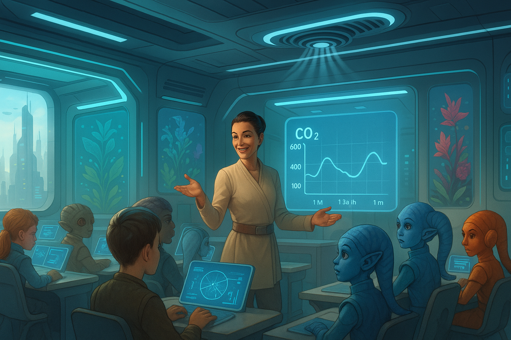

## **PROJECT IDENTIFICATION**

### **Project Title:** 
Fresh Start: Coruscant's Air Quality Improvement Initiative

### **Project Type:** 
Environmental / Social Program

### **Scale:** 
Neighborhood

### **Timeline:** 
Medium-term (2-3 years)

### ISO37101 mapping for 'Coruscant's air quality improvement initiative.'

#### Scores

|   Score | Purpose                                     | Issue                                              | Justification                                                                                                                                                                                                                                                                               |
|--------:|:--------------------------------------------|:---------------------------------------------------|:--------------------------------------------------------------------------------------------------------------------------------------------------------------------------------------------------------------------------------------------------------------------------------------------|
|       5 | Attractiveness                              | Culture and community identity                     | The project fosters community identity and cultural involvement, as local educators and students engage in the initiative. It promotes a shared sense of purpose in improving air quality, enhancing the attractiveness of the neighborhood through collective action and community events. |
|       5 | Preservation and improvement of environment | Biodiversity and ecosystem services                | The initiative aims to improve air quality significantly, a crucial aspect of environmental health. The actions taken to monitor and enhance the environment contribute to the overall preservation of ecological systems and create a healthier ecosystem for local flora and fauna.       |
|       5 | Well-being                                  | Health and care in the community                   | By addressing air quality, the project directly impacts public health and well-being. Improved air quality can enhance students' health and their ability to learn effectively, thereby creating a healthier community atmosphere.                                                          |
|       4 | Social cohesion                             | Living together, interdependence and mutuality     | The initiatives, such as community events and educational workshops, bring together diverse community members, fostering social bonds and collaborative efforts toward a common goal.                                                                                                       |
|       4 | Responsible resource use                    | Economy and sustainable production and consumption | The project promotes community engagement in environmental practices, which encourages sustainable behavior and consumption choices among local residents, thereby optimizing the use of resources.                                                                                         |
|       4 | Resilience                                  | Governance, empowerment and engagement             | Community involvement in decision-making processes empowers residents to take charge of local environmental issues. This fosters resilience as the community adapts to air quality challenges and develops innovative responses.                                                            |
|       3 | Attractiveness                              | Mobility                                           | The initiative indirectly enhances mobility by creating more attractive public spaces and promoting outdoor activities, which could encourage walking and community engagement in different areas of Coruscant.                                                                             |
|       3 | Preservation and improvement of environment | Innovation, creativity and research                | The project showcases innovative approaches to environmental monitoring and education, aligning with modern sustainability practices and research opportunities.                                                                                                                            |
|       4 | Well-being                                  | Education and capacity building                    | The initiative includes educational workshops, increasing community awareness and understanding of air quality and environmental responsibility, thereby building capacity for residents to engage in sustainable practices.                                                                |
|       3 | Social cohesion                             | Community smart infrastructures                    | Installing air quality sensors enhances the technological infrastructure of the community, making data accessible to residents, which aligns with building a smart neighborhood focused on health and well-being.                                                                           |

## **CONTEXTUAL FOUNDATION**

### **Specific Local Challenge Addressed:**
The air quality in Coruscant's classrooms has become a silent contributor to student fatigue and discontent during the learning process, which can hinder educational outcomes. The innovative air quality monitoring system described by teacher Liga Ozola shows positive impacts, demonstrating the need for a more systemic approach to air quality across schools and the community. By exposing students to real-time monitoring of CO₂ levels, educators have observed improved alertness and fewer behavioral complaints among pupils. This initiative will ultimately address the broader challenge of air pollution not just in schools but across the neighborhood’s public spaces, thus enriching students' overall well-being and academic performance.

### **Local Assets Leveraged:**
Coruscant's active educational community forms a strong backbone for this initiative. By utilizing schools as focal points, the project capitalizes on existing infrastructure and community engagement already demonstrated by teachers and students. The idea builds upon the successful pilot of air quality sensors, demonstrating the community's readiness to support innovative solutions that enhance educational environments through actionable data.

### **Cultural/Social Fit:**
This initiative aligns perfectly with local values that prioritize education, health, and community welfare. By fostering awareness of air quality, the project respects and enhances existing educational practices that focus on science and environmental responsibility, promoting a culture that is conscious of health and well-being. This reflects the community's desire to support future generations in an increasingly complex world where environmental issues are at the forefront.

## **PROJECT DESCRIPTION**

### **Core Concept:**
The "Fresh Start" initiative aims to establish a neighborhood-wide air quality improvement program building on the successes of Coruscant's Classroom Revolution. By expanding air quality monitoring systems beyond schools to parks, community centers, and public spaces, we will not only create healthier spaces for students but also raise community awareness about air pollution and promote collective action toward better environmental practices.

### **Key Components:**
1. **Physical/Spatial Element:** Installation of air quality sensors throughout key public areas in the neighborhood, including parks, playgrounds, and community gathering spaces. These will feature real-time data displays to engage the community continuously.
   
2. **Programming/Activity Element:** Development of workshops and educational programs in collaboration with local schools, aimed at teaching students and residents about air quality, its measurement, and how they can actively participate in improving it through behavior changes.

3. **Community Engagement Element:** Organizing community events such as "Fresh Air Days," where families gather in outdoor spaces to partake in activities like tree planting, clean-up drives, and science fairs centered around air quality awareness.

### **Implementation Approach:**
- **Phase 1:** In the initial six months, the focus will be on installing air quality sensors in targeted areas, working with local schools and environmental organizations to gauge optimal locations while engaging students in the monitoring process.

- **Phase 2:** After establishing the monitoring infrastructure, the project will pivot to education and community programming. Educational workshops will be launched at schools involving students and parents, explaining the significance of air quality data while introducing simple actions to improve local air conditions.

- **Phase 3:** The final stage will fully realize the community-oriented approach. Public events will design an annual “Fresh Air Festival” inviting local businesses, non-profits, and health professionals to showcase their contributions to public health and environmental responsibility while fostering a network of support for sustainable practices.

## **STAKEHOLDER ECOSYSTEM**

### **Champions:**
Local educators, schools’ parent-teacher associations, and passionate environmental advocates will be instrumental in driving the initiative forward. Key proponents may include influential teachers like Liga Ozola, who understand the impact of air quality on education.

### **Partners:**
Collaboration with the local government, environmental NGOs, health organizations, and academic institutions will ensure that the project has the necessary resources and expertise to succeed. Local businesses could be involved in sponsorship to incentivize sustainable operations and increase community engagement.

### **Beneficiaries:**
Students will benefit directly from healthier learning and playing environments, which, in turn, would enhance their focus and academic performance. The broader community will also enjoy improved air quality, fostering a healthier living environment for all ages.

### **Potential Opposition:**
Concerns may arise related to the costs and installation of infrastructure and potential disruptions during implementation. Careful planning and transparent communication regarding the short- and long-term benefits of the initiative will be essential in mitigating resistance.

## **FEASIBILITY & IMPACT**

### **Success Indicators:**
- Quantitative metric: Reduction in CO₂ readings in monitored areas by at least 20% within two years.
- Qualitative metric: Increased satisfaction ratings from students and parents regarding the school environment and outdoor public spaces.
- Community-defined metric: Attendance numbers at workshops and events, with feedback collected to gauge community sentiment.

### **Ripple Effects:**
An uplifted awareness of air quality issues will generate a foundation for further green initiatives, potentially leading to investments in green architecture, more parks, and community gardens, creating a cycle of environmental responsibility.

### **Risk Mitigation:**
A primary risk involves community disengagement post-implementation. Regular follow-ups, community feedback sessions, and transparent communication outlining progress and celebrating successes will keep the initiative vibrant and relevant.

## **LOCAL ADAPTATION NOTES**

### **What makes this project uniquely suited to this place:**
Coruscant's dedication to quality education and community involvement makes it an ideal testing ground for such an initiative. The active participation of educators and students highlights a communal spirit that facilitates collaboration, positioning it at the forefront of environmental and educational reform.

### **How locals would likely describe this project in their own words:**
“This is our chance to breathe easy and learn better. With our kids leading the charge, we can clean up the air and make our neighborhood healthier for everyone - turning every school into a fresh air champion!”

By positioning the "Fresh Start" initiative within the context of Coruscant's unique characteristics and values, it reconnects community members with their environment and each other, creating a more vibrant and sustainable neighborhood for generations to come.