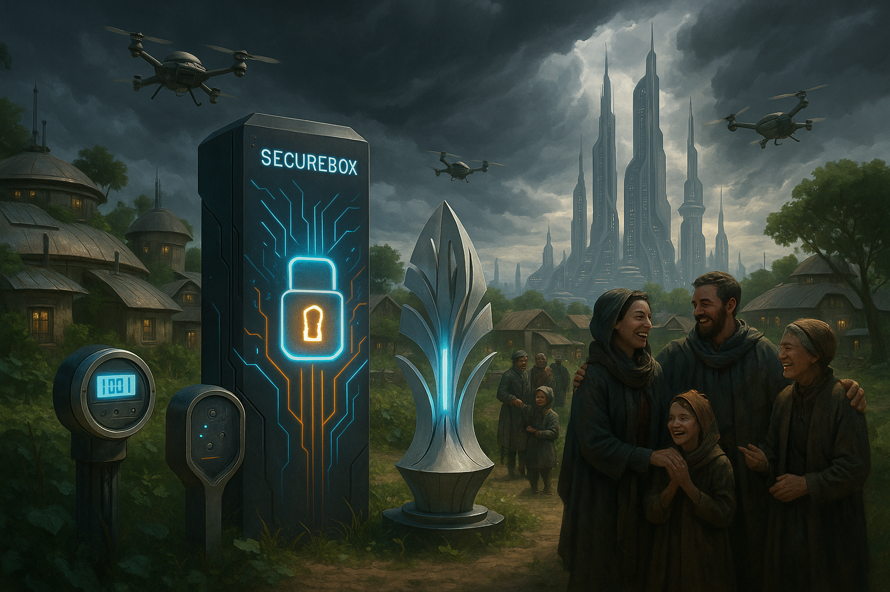

## **PROJECT IDENTIFICATION**

### **Project Title:** 
StormGrid Community Shield

### **Project Type:** 
Infrastructure

### **Scale:** 
Neighborhood

### **Timeline:** 
Medium-term (2-3 years)

### ISO37101 mapping for 'Secure energy network for storms.'

#### Scores

|   Score | Purpose                                     | Issue                                              | Justification                                                                                                                                                                                                                                                                                                                                                        |
|--------:|:--------------------------------------------|:---------------------------------------------------|:---------------------------------------------------------------------------------------------------------------------------------------------------------------------------------------------------------------------------------------------------------------------------------------------------------------------------------------------------------------------|
|       5 | Resilience                                  | Living and working environment                     | The project addresses the community's capacity to cope with storm-related disruptions by optimizing energy access during severe weather events. By implementing SecureBox technology, it not only enhances the reliability of the energy supply but also improves the overall living and working environment for residents, ensuring that disruptions are minimized. |
|       5 | Social cohesion                             | Community smart infrastructures                    | The initiative fosters social cohesion by establishing a Community Energy Committee comprised of local residents, which enhances collective engagement and input on energy issues. This participatory approach strengthens community ties and mutual support, integral to the project's success.                                                                     |
|       4 | Well-being                                  | Health and care in the community                   | By providing improved energy security and reducing blackout durations, the project contributes directly to residents' physical and mental well-being. The community workshops enhance understanding and use of energy technologies, promoting overall health and safety in the neighborhood.                                                                         |
|       3 | Attractiveness                              | Economy and sustainable production and consumption | The project reflects economic vitality by using local skills and resources, promoting sustainable energy practices. It aims to attract local tech innovators and support local employment, enhancing both the community's economic landscape and its attractiveness.                                                                                                 |
|       3 | Preservation and improvement of environment | Biodiversity and ecosystem services                | While the main focus is on energy management, the initiative's emphasis on renewable energy practices suggests a commitment to environmental stewardship. It has the potential to integrate sustainable energy solutions that help preserve ecosystem services.                                                                                                      |
|       4 | Responsible resource use                    | Economy and sustainable production and consumption | By optimizing resource use in the microgrid, the initiative promotes responsible management of energy consumption and sustainable practices in the neighborhood. It encourages efficient energy solutions that support the local economy and reduce waste.                                                                                                           |
|       5 | Resilience                                  | Living and working environment                     | The project addresses the community's capacity to cope with storm-related disruptions by optimizing energy access during severe weather events. By implementing SecureBox technology, it not only enhances the reliability of the energy supply but also improves the overall living and working environment for residents, ensuring that disruptions are minimized. |
|       5 | Social cohesion                             | Community smart infrastructures                    | The initiative fosters social cohesion by establishing a Community Energy Committee comprised of local residents, which enhances collective engagement and input on energy issues. This participatory approach strengthens community ties and mutual support, integral to the project's success.                                                                     |
|       4 | Well-being                                  | Health and care in the community                   | By providing improved energy security and reducing blackout durations, the project contributes directly to residents' physical and mental well-being. The community workshops enhance understanding and use of energy technologies, promoting overall health and safety in the neighborhood.                                                                         |
|       3 | Attractiveness                              | Economy and sustainable production and consumption | The project reflects economic vitality by using local skills and resources, promoting sustainable energy practices. It aims to attract local tech innovators and support local employment, enhancing both the community's economic landscape and its attractiveness.                                                                                                 |
|       3 | Preservation and improvement of environment | Biodiversity and ecosystem services                | While the main focus is on energy management, the initiative's emphasis on renewable energy practices suggests a commitment to environmental stewardship. It has the potential to integrate sustainable energy solutions that help preserve ecosystem services.                                                                                                      |
|       4 | Responsible resource use                    | Economy and sustainable production and consumption | By optimizing resource use in the microgrid, the initiative promotes responsible management of energy consumption and sustainable practices in the neighborhood. It encourages efficient energy solutions that support the local economy and reduce waste.                                                                                                           |

## **CONTEXTUAL FOUNDATION**

### **Specific Local Challenge Addressed:**
Coruscant faces significant challenges related to its frequent storms, leading to prolonged energy blackouts and unstable electricity supply. The existing microgrid infrastructure struggles with data security and communication failures during outages, resulting in longer restoration times and privacy incidents. The StormGrid Community Shield initiative aims to create a robust, secure network that protects residents’ access to energy and data privacy, directly addressing these vulnerabilities. By implementing the SecureBox technology, the challenges of data flow disruption, security breaches during outages, and inefficient restoration processes will be mitigated, ultimately empowering the community with shorter blackout durations.

### **Local Assets Leveraged:**
Coruscant is enriched by its tight-knit community, local tech-savvy residents, and a growing interest in sustainable energy practices. The existing microgrid system, albeit struggling, serves as a foundational asset. Leveraging local skills from residents with expertise in technology and infrastructure will amplify this project’s reach and effectiveness. Additionally, the community's familiarity with collective action for infrastructure improvement, as seen in past neighborhood projects, will help inspire involvement and foster a sense of ownership.

### **Cultural/Social Fit:**
The StormGrid Community Shield aligns perfectly with the values of resilience, security, and innovation that resonate within Coruscant. Taking a community-centered approach, this initiative respects the local tradition of mutual support, where neighbors come together to solve shared problems. By enhancing the reliability of energy access, it strengthens community ties, encourages collaboration, and respects the neighborhood's ethos of safeguarding shared resources.

## **PROJECT DESCRIPTION**

### **Core Concept:**
The StormGrid Community Shield is a strategic initiative designed to implement SecureBox technology to safeguard Coruscant's microgrid. This project aims to protect data integrity and optimize energy access during storms, ensuring that the community experiences shorter, manageable outages, a safer energy environment, and enhanced contributory participation in smart energy systems.

### **Key Components:**
1. **Physical/Spatial Element:** The installation of SecureBox devices across strategic points in the neighborhood's microgrid, including residences and communal energy hubs, to ensure robust communication and encryption between smart meters and DER devices.
   
2. **Programming/Activity Element:** Organizing community workshops to educate residents about energy management, the significance of data security, and how to effectively use the SecureBox technology, thereby involving community members in operating and maintaining the system.
   
3. **Community Engagement Element:** Establishing a Community Energy Committee comprised of local residents to facilitate ongoing feedback, share experiences, and drive engagement efforts, ensuring that the initiative evolves with the residents' needs and technological advancements.

### **Implementation Approach:**
- **Phase 1:** Initiate community outreach to explain the importance of energy security and the benefits of the SecureBox technology. Gather input from residents regarding their experiences with energy disruptions to inform specific deployment strategies.
  
- **Phase 2:** Begin the installation of SecureBox devices in pilot locations identified by community feedback. Conduct workshops for residents on how to use and benefit from these devices while collecting data on performance and resident interaction.
  
- **Phase 3:** Expand the program based on pilot results, fully deploying SecureBox across the neighborhood. Regularly host community forums to discuss outcomes, adjustments, and future initiatives, ensuring consistent community involvement and feedback.

## **STAKEHOLDER ECOSYSTEM**

### **Champions:**
Local environmental groups, tech innovators within the community, and resident champions passionate about sustainability and energy issues will lead the effort. Collaborating with these proactive locals ensures grassroots support and engagement.

### **Partners:** 
Key partnerships will form with local tech companies specializing in energy solutions, municipal authorities committed to resilience planning, and non-profits focused on community development and energy security.

### **Beneficiaries:** 
All residents of Coruscant will benefit from reduced blackout times, enhanced energy stability, and improved data privacy, leading to overall improved quality of life. Additionally, by empowering residents as active participants in energy management, they can become advocates for sustainable practices.

### **Potential Opposition:** 
A minority within the community may resist the initiative due to concerns about new technology, privacy, and the potential costs. Transparent communication about the project’s benefits and safeguards will be crucial, as will actively involving dissenters in open forums to address their concerns.

## **FEASIBILITY & IMPACT**

### **Success Indicators:**
- **Quantitative metric:** Reduction in average blackout duration by at least 50% within the first year of full implementation.
- **Qualitative metric:** Increased community awareness and participation in energy management, demonstrated through workshop attendance and committee engagement rates.
- **Community-defined metric:** Establishing a local satisfaction survey to gauge resident perceptions of energy stability and privacy post-implementation.

### **Ripple Effects:**
The implementation of the StormGrid Community Shield may inspire further advancements in community-led infrastructure projects, creating a culture of innovation and sustainability within Coruscant. Additionally, successes in energy management may inspire local economic development through tech-related jobs and services.

### **Risk Mitigation:**
One primary risk is the potential for technological failures causing disruptions instead of alleviating them. A comprehensive training program for residents, along with a responsive technical support team, will ensure quick solutions to any issues that arise.

## **LOCAL ADAPTATION NOTES**

### **What makes this project uniquely suited to this place:**
Coruscant's specific challenge of frequent storms combined with its commitment to sustainable practices makes the StormGrid Community Shield a nuanced response to local needs. The combination of a proactive community and innovative technology creates a tailored solution that resonates with residents' lived experiences.

### **How locals would likely describe this project in their own words:**
“Finally, we have a way to make sure our energy is secure, even when the storms come rolling in! With these new tools, I know we can stay connected and keep our homes running without the worry of power cuts.”