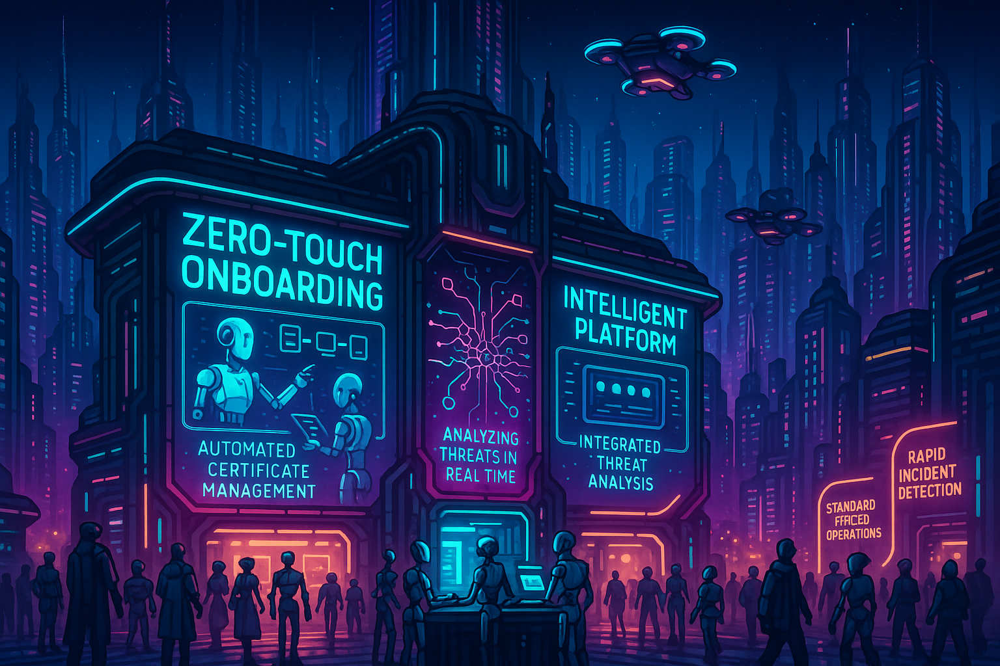

## **PROJECT IDENTIFICATION**

### **Project Title:** 
Coruscant Connection: Smart Substation for Safer Streets

### **Project Type:** 
Hybrid

### **Scale:** 
City-wide

### **Timeline:** 
Medium-term (2-3 years)

### ISO37101 mapping for 'Smart substation project for safety.'

#### Scores

|   Score | Purpose                                     | Issue                                              | Justification                                                                                                                                                                                                                                                                                                                                   |
|--------:|:--------------------------------------------|:---------------------------------------------------|:------------------------------------------------------------------------------------------------------------------------------------------------------------------------------------------------------------------------------------------------------------------------------------------------------------------------------------------------|
|       5 | Attractiveness                              | Safety and security                                | The project addresses safety by upgrading the urban infrastructure with advanced technologies to ensure improved safety and efficiency in responses to emergencies and threats. This focus on safety enhances the appeal of the area, making it more attractive for residents and stakeholders who value a secure environment.                  |
|       4 | Resilience                                  | Health and care in the community                   | The initiative incorporates community-oriented design by fostering engagement and educating residents, which builds resilience and health within the community. By ensuring that residents are equipped to adapt to new technological infrastructures, the project promotes overall community well-being, preparing them for future challenges. |
|       5 | Social cohesion                             | Governance, empowerment and engagement             | By establishing a resident advisory board for ongoing dialogue and input on community needs, the project promotes social cohesion and collaborative governance. This empowerment of residents enhances community solidarity and encourages active participation in urban governance.                                                            |
|       5 | Well-being                                  | Education and capacity building                    | The project's focus on workshops to educate the community about new technologies promotes well-being through access to knowledge and improved living conditions. This not only enhances individual skills but also contributes to the broader well-being of the neighborhood.                                                                   |
|       4 | Responsible resource use                    | Community smart infrastructures                    | The project aims to upgrade the urban infrastructure to be more efficient, highlighting responsible resource use. Through smart technology, it aligns with sustainable practices in managing utilities and services, fostering a framework for smart community infrastructures.                                                                 |
|       4 | Attractiveness                              | Economy and sustainable production and consumption | By fostering partnerships with local tech firms and educational institutions, the project enhances economic opportunities, supporting local businesses and promoting responsible consumption patterns, which contributes to the area's attractiveness.                                                                                          |
|       3 | Resilience                                  | Living together, interdependence and mutuality     | The focus on community engagement and collaborative workshops encourages interdependence among residents, fostering relationships that are essential for resilience in the face of urban challenges.                                                                                                                                            |
|       3 | Preservation and improvement of environment | Biodiversity and ecosystem services                | While the project primarily focuses on safety and technology, the long-term enhancements in urban infrastructure can also contribute to the preservation of local environments by improving overall urban management and potentially integrating green solutions.                                                                               |
|       4 | Attractiveness                              | Living and working environment                     | By improving the safety and responsiveness of urban infrastructure, the project enhances the quality of the living and working environment, promoting a more attractive community for residents and businesses.                                                                                                                                 |
|       3 | Social cohesion                             | Culture and community identity                     | The project's alignment with the community's cultural aspirations for innovation while respecting local identity fosters a sense of belonging and cultural continuity among residents.                                                                                                                                                          |

## **CONTEXTUAL FOUNDATION**

### **Specific Local Challenge Addressed:**
Coruscant faces issues related to security and inefficiencies in urban infrastructure management, which can lead to slower responses to emergencies and cyber threats. The digital transformation of the substation with advanced technologies represents an essential response to these challenges. Current outdated systems risk compromising the safety of local neighborhoods. By upgrading to features like automated certificate management and advanced intrusion detection, the community can benefit from improved safety and efficiency in urban infrastructure, which directly addresses these challenges.

### **Local Assets Leveraged:**
Coruscant already has a robust network of community groups focused on safety, urban development, and tech innovation. This project can build on these existing networks, tapping into local knowledge and creating partnerships that harness residents' expertise and enthusiasm for improving their environment. The presence of local tech firms and educational institutions capable of providing training and support stands as a strong asset for this initiative.

### **Cultural/Social Fit:**
The digital transformation of the substation aligns with Coruscant's aspiration to be a tech-forward community while respecting its cultural identity and social fabric. The community values safety, accessibility, and innovation, which the project enhances. Through this initiative, residents will not only feel safer but also empowered to engage with new technologies, leading to greater community solidarity and participation in urban governance.

## **PROJECT DESCRIPTION**

### **Core Concept:** 
The "Coruscant Connection: Smart Substation for Safer Streets" initiative envisions a community-centered transformation of the urban power infrastructure, focusing on safety, responsiveness, and efficiency through advanced digital technologies. This modernized system will serve as a critical resource for residents, enhancing public safety and improving the overall quality of life through better management of emergencies and urban services.

### **Key Components:**
1. **Physical/spatial element:** The main component will be the physical refurbishment of the existing substation, integrating smart technology and ensuring it is user-friendly for tech-savvy and less tech-oriented community members alike.
2. **Programming/activity element:** Community workshops will be held to educate residents on the new technologies, providing them with tools and knowledge to engage effectively with their smart infrastructure.
3. **Community engagement element:** Establishing a resident advisory board to foster ongoing dialogue between the city, utility providers, and citizens, ensuring community needs are integrated into the project’s implementation.

### **Implementation Approach:**
- **Phase 1:** Initial assessment and planning will involve engaging with local residents to gather input regarding safety and technological needs. Early workshops will educate the community about the project and determine specific local priorities.
- **Phase 2:** Begin the refurbishment of the substation, including tech installation and start community-centered training programs. Also, build partnerships with local tech companies for program delivery.
- **Phase 3:** Launch the fully upgraded substation along with public safety services relying on the enhanced system. This will include real-time incident reporting platforms and community feedback mechanisms to ensure continuous improvement.

## **STAKEHOLDER ECOSYSTEM**

### **Champions:** 
The initiative would benefit from leadership from local elected officials and community advocates who have previously championed tech-related projects in Coruscant, providing momentum and visibility.

### **Partners:** 
Collaboration will be essential, including local tech companies, educational institutions, public safety organizations, and the city’s infrastructure department to ensure successful implementation and outreach.

### **Beneficiaries:** 
Residents of Coruscant will see improved response times in emergencies and greater overall safety. Individuals involved in tech workshops can gain skills and knowledge applicable in broader contexts, enhancing employment opportunities and engagement in civic matters.

### **Potential Opposition:** 
Some local residents may fear the risks associated with increased technological surveillance or technology-related job losses. It’s important to address these concerns through transparent communication and by emphasizing that the project aims to enhance security rather than infringe on personal privacy.

## **FEASIBILITY & IMPACT**

### **Success Indicators:**
- Quantitative metric: Reduce emergency response times by at least 30% as measured by local emergency services data.
- Qualitative metric: A community survey demonstrating increased resident satisfaction with public safety.
- Community-defined metric: Participation rates in community tech workshops, aiming for at least 50% of households engaged.

### **Ripple Effects:**
The establishment of a smart substation could catalyze further technological advancements in other areas of urban life in Coruscant, such as smart lighting or traffic management systems, while fostering an innovation-focused local economy.

### **Risk Mitigation:**
The primary risk involves a technophobia response from community members. To mitigate this, extensive outreach and education programs will promote understanding and acceptance of the technology, including demonstrations and hands-on experiences.

## **LOCAL ADAPTATION NOTES**

### **What makes this project uniquely suited to this place:**
Coruscant’s embrace of technology, combined with an existing commitment to community values, means this initiative is perfectly aligned with both local aspirations for progress and the need for safety. Unlike other places, this city has a unique blend of culture and community where residents actively seek to influence decision-making.

### **How locals would likely describe this project in their own words:**
"Finally, making our city safe with the tech we talk about all the time! I love that we’re taking charge of our streets and using what we know to create something better for all of us.” 

Through collaborative efforts that emphasize local engagement, “Coruscant Connection: Smart Substation for Safer Streets” not only enhances urban infrastructure but also strengthens community ties and fosters a shared vision for a safer, more innovative Coruscant.