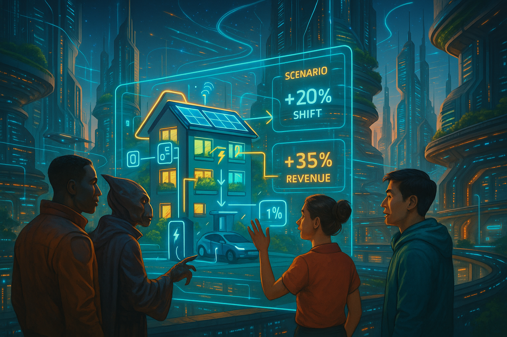

## **PROJECT IDENTIFICATION**

### **Project Title:** 
Coruscant Energy Harmony

### **Project Type:** 
Hybrid

### **Scale:** 
Neighborhood

### **Timeline:** 
Medium-term (2-3 years)

### ISO37101 mapping for 'Energy management for neighborhood sustainability.'

#### Scores

|   Score | Purpose                                     | Issue                                              | Justification                                                                                                                                                                                                                                                                                                 |
|--------:|:--------------------------------------------|:---------------------------------------------------|:--------------------------------------------------------------------------------------------------------------------------------------------------------------------------------------------------------------------------------------------------------------------------------------------------------------|
|       5 | Attractiveness                              | Economy and sustainable production and consumption | The project enhances the neighborhood's appeal by leveraging technology to optimize energy consumption, which can reduce costs for residents while stimulating local economic growth through monetization of energy flexibility. This aligns with the goal of creating more economically vibrant communities. |
|       4 | Preservation and improvement of environment | Biodiversity and ecosystem services                | The initiative promotes environmental sustainability by encouraging residents to adopt renewable energy systems and optimize energy usage. This can contribute to a reduction in greenhouse gas emissions and promote a healthier environment in Coruscant.                                                   |
|       4 | Resilience                                  | Health and care in the community                   | By providing residents with tools to manage energy consumption effectively, the project directly contributes to community resilience by alleviating financial burdens and enhancing the overall well-being of residents through improved energy affordability.                                                |
|       5 | Responsible resource use                    | Living and working environment                     | The project fosters responsible resource management by integrating smart technology that allows residents to optimize their energy use, which contributes to more sustainable consumption patterns within the neighborhood.                                                                                   |
|       5 | Social cohesion                             | Living together, interdependence and mutuality     | The initiative emphasizes community engagement and collaboration among residents to share insights and strategies for energy efficiency, fostering a sense of belonging and mutual support which is essential for social cohesion.                                                                            |
|       5 | Well-being                                  | Education and capacity building                    | Through workshops and community events, the project enhances residents' understanding of energy management and promotes collective empowerment, directly contributing to the overall well-being of the community.                                                                                             |
|       4 | Attractiveness                              | Culture and community identity                     | The project resonates with the tech-forward identity of Coruscant, furthering community values around sustainability and transparency. This cultural fit enhances the attractiveness of the initiative to residents.                                                                                          |
|       4 | Resilience                                  | Governance, empowerment and engagement             | The project incorporates participatory planning, ensuring residents are actively engaged in decision-making processes, which reinforces social ties and enhances community resilience.                                                                                                                        |
|       3 | Preservation and improvement of environment | Safety and security                                | Although the main focus is on energy efficiency, the project promotes safety by introducing transparent governance and community engagement, which can indirectly contribute to a safer neighborhood environment.                                                                                             |
|       5 | Responsible resource use                    | Community smart infrastructures                    | The implementation of the digital twin interface as a smart infrastructure initiative enhances residents' understanding of their energy usage, promoting more efficient resource management and integrating sustainable technologies into the community.                                                      |

## **CONTEXTUAL FOUNDATION**

### **Specific Local Challenge Addressed:**
In Coruscant, many households struggle to manage energy consumption effectively while often facing high energy costs. The pilot program from Denmark reveals that residents can utilize smart technology to optimize energy usage,, which can ease financial burdens and stimulate local economic growth by monetizing flexibility in energy demand. There's a distinct opportunity for residents in Coruscant to harness new technologies that will empower them to understand their energy use, optimize it, and potentially earn revenue from energy flexibility.

### **Local Assets Leveraged:**
Coruscant is home to a tech-savvy population eager for innovative solutions. The existing infrastructure already accommodates various smart devices, and many residents have adopted solar energy systems. The initiative builds upon the community’s awareness of sustainability and enthusiasm for renewable resources, tapping into the local knowledge and interest in energy efficiency to uplift the entire neighborhood’s approach to energy consumption.

### **Cultural/Social Fit:**
Coruscant's citizens value community engagement, transparency, and sustainability. Implementing a digital twin interface resonates with their tech-forward identity and aligns perfectly with Denmark's pilot program, which emphasizes participatory energy planning. This initiative enhances Coruscant's existing community values by furthering collective empowerment around energy management, reinforcing social ties as neighbors collaborate on energy solutions.

## **PROJECT DESCRIPTION**

### **Core Concept:** 
Coruscant Energy Harmony proposes the creation of a digital twin environment that allows residents to visualize and manage their energy needs. By simulating real-time interactions between various energy systems, residents will not only become more informed about their energy usage but also learn how to shift their consumption patterns to potentially monetize their energy flexibility.

### **Key Components:**
1. The digital twin platform will allow residents to visualize their energy consumption and collective energy performance at the neighborhood level, integrating real-time data from smart devices and renewable energy sources.
2. Workshops and community events will be organized to educate residents about energy management, the importance of flexibility, and successful strategies for using the digital twin interface effectively.
3. A community engagement initiative will gather local feedback while encouraging collaboration among households to share insights and strategies on maximizing energy efficiency and flexibility.

### **Implementation Approach:**
- Phase 1: Within the first six months, we will establish partnerships with local tech providers to develop the digital twin interface while launching an awareness campaign that informs residents about the upcoming initiative, inviting input and personal stories as tools to increase buy-in.
- Phase 2: Over the next year, we will pilot the digital twin technology among volunteer households in Coruscant, facilitating workshops to expand their knowledge on utilizing data for energy optimization. Feedback will inform iterative improvements to the platform.
- Phase 3: By the third year, we will expand the platform to all households in the neighborhood, integrating lessons learned from the pilot, organizing monthly community gatherings that foster collaboration, and tracking collective energy savings and earnings from flexibility events.

## **STAKEHOLDER ECOSYSTEM**

### **Champions:** 
Local environmental organizations and tech incubators will be instrumental in championing this initiative. Community leaders and neighborhood associations will play a critical role in grassroots outreach efforts.

### **Partners:** 
We will collaborate with local energy providers, University research departments focused on renewable energy, and tech firms specializing in data visualization and smart home technologies.

### **Beneficiaries:** 
Every household in Coruscant stands to benefit from reduced energy costs, increased financial opportunities through monetizing flexibility, and a strengthened community spirit rooted in joint efforts toward sustainability.

### **Potential Opposition:** 
Some residents may be wary of digital technology or perceive the initiative as intrusive. To address these concerns, we will involve residents in the planning and implementation processes, ensuring transparency about how data is used and prioritizing privacy.

## **FEASIBILITY & IMPACT**

### **Success Indicators:**
- Quantitative metric: A 30% increase in household participation in flexibility events, tracked through the digital twin interface.
- Qualitative metric: Resident surveys indicating increased understanding of energy efficiency and satisfaction with the platform.
- Community-defined metric: A collective goal to achieve a 25% reduction in neighborhood energy consumption within three years.

### **Ripple Effects:**
This initiative can foster a culture of collaboration and innovation in Coruscant, paving the way for future projects focused on sustainable living. By uniting residents through shared technology, we can nurture local entrepreneurship in green energy solutions.

### **Risk Mitigation:**
The primary risk of low engagement can be mitigated by implementing a robust community outreach strategy and providing incentives for participation, such as rebates on energy bills for active engagement in flexible energy practices.

## **LOCAL ADAPTATION NOTES**

### **What makes this project uniquely suited to this place:**
The geographic and demographic context of Coruscant, alongside its existing infrastructure and community character, creates an ideal foundation for the Coruscant Energy Harmony initiative. This localized approach capitalizes on the tech-enthusiastic mindset and the community’s pre-existing commitment to sustainability, which may not resonate in less informed regions.

### **How locals would likely describe this project in their own words:**
Residents might say, “Finally, a way we can take control of our energy bills without feeling lost! It’s neat that we get to work together while using tech to save money and help the planet. This is exactly the kind of teamwork we need!”