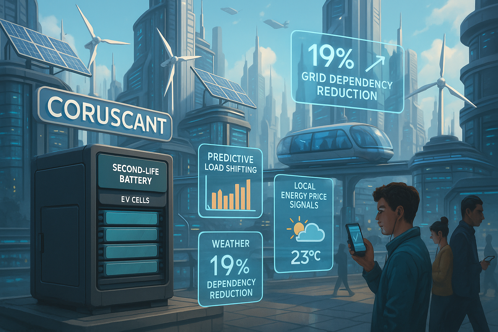

## **PROJECT IDENTIFICATION**

### **Project Title:** 
"Coruscant Power Collective"

### **Project Type:** 
Hybrid

### **Scale:** 
Neighborhood

### **Timeline:** 
Medium-term (2-3 years)

### ISO37101 mapping for 'Community energy independence initiative.'

#### Scores

|   Score | Purpose                                     | Issue                                              | Justification                                                                                                                                                                                                                                                                                                                                                                  |
|--------:|:--------------------------------------------|:---------------------------------------------------|:-------------------------------------------------------------------------------------------------------------------------------------------------------------------------------------------------------------------------------------------------------------------------------------------------------------------------------------------------------------------------------|
|       4 | Attractiveness                              | Economy and sustainable production and consumption | The project enhances the attractiveness of Coruscant by proposing a local energy market that encourages sustainable consumption practices. By fostering economic diversity and promoting local production of renewable energy, the initiative contributes to community vibrancy and resilience. It also creates economic opportunities through energy education and workshops. |
|       3 | Preservation and improvement of environment | Biodiversity and ecosystem services                | The project aims to improve the environmental performance of Coruscant by promoting the use of renewable energy through a microgrid system. By reducing dependency on the grid, it implicitly supports the preservation of local ecosystems and biodiversity. However, explicit actions towards biodiversity are not detailed in the project description.                      |
|       4 | Well-being                                  | Health and care in the community                   | The initiative contributes to the well-being of community members by providing education on energy efficiency and promoting collective engagement in energy management. By enhancing energy independence and reducing costs, it supports both the physical and mental well-being of local residents, fostering a sense of empowerment and community spirit.                    |
|       5 | Social cohesion                             | Living together, interdependence and mutuality     | This project directly emphasizes social cohesion by promoting community collaboration and engagement through the 'Coruscant Power Collective'. It creates platforms for residents to interact, share resources, and collaborate on energy management, enhancing mutual support and collective action for sustainability.                                                       |
|       4 | Resilience                                  | Economy and sustainable production and consumption | By fostering a local energy marketplace, the initiative aims to bolster the economic resilience of Coruscant. It prepares the community to become less dependent on external energy suppliers, creating a robust local economy that can withstand energy market fluctuations.                                                                                                  |
|       4 | Attractiveness                              | Governance, empowerment and engagement             | The project emphasizes community engagement and collective decision-making, improving governance structures within Coruscant. Through workshops and education, it empowers residents to actively participate in the management of their energy resources, increasing civic engagement and community governance.                                                                |
|       5 | Responsible resource use                    | Living and working environment                     | The initiative promotes responsible use of energy resources by encouraging energy efficiency and peer-to-peer energy trade. It supports sustainable consumption and incentivizes efficient energy use among residents, which contributes to a healthier living and working environment.                                                                                        |
|       4 | Social cohesion                             | Culture and community identity                     | The project aligns closely with Coruscant's cultural values surrounding sustainability, reinforcing the community's identity. It respects and enhances local historical efforts towards collaboration in sustainable energy practices, fostering a shared vision for the future.                                                                                               |
|       5 | Well-being                                  | Education and capacity building                    | Through workshops and Energy Hubs, the project focuses on raising community awareness and skills regarding energy management. This capacity-building approach not only enhances individual well-being but also strengthens community resilience and promotes sustainable practices.                                                                                            |

## **CONTEXTUAL FOUNDATION**

### **Specific Local Challenge Addressed:**
Coruscant faces significant energy challenges, particularly during peak hours when reliance on the central grid is at its highest. The existing microgrid enhanced by AI-driven flexibility services has demonstrated the potential for improved energy independence, as evidenced by a recorded 19% reduction in grid dependency during peak periods. However, many residents and local businesses remain largely unaware of how they can effectively participate in and benefit from this system. The "Coruscant Power Collective" initiative addresses these gaps by improving community engagement, education, and active participation in local energy markets.

### **Local Assets Leveraged:**
Coruscant boasts a network of smart buildings that are already integrated into the existing microgrid system. The local technology sector, which has shown a passion for sustainability, is another significant asset. This project will build on the strengths of these smart infrastructures, tapping into the existing enthusiasm for renewable energy and community-led solutions. By encouraging residents to engage actively with the AI-driven system and local flexibility markets, this initiative aims to amplify the capabilities of these assets.

### **Cultural/Social Fit:**
The initiative resonates well with Coruscant's progressive values and the community’s commitment to sustainability. By emphasizing local ownership of energy resources and promoting collective decision-making, "Coruscant Power Collective" aligns with the population's desire for equitable participation in sustainable practices. This project respects and enhances the community's historical collaborative efforts, drawing on social cohesion to build a greener future.

## **PROJECT DESCRIPTION**

### **Core Concept:** 
"Coruscant Power Collective" aims to empower local residents and businesses to take part in the life of their energy community. Through workshops, community forums, and interactive tech installations, residents will learn how to optimize their energy use through the existing AI-driven microgrid, while also having a voice in the management of local energy resources. The initiative will enhance community solidarity and minimize energy disparities by promoting a shared, transparent approach to energy consumption.

### **Key Components:**
1. **Energy Education Hubs:** Establish physical "Energy Hubs" at community centers where residents can access resources about energy efficiency, renewable options, and the benefits of the microgrid. These hubs will serve as the focal point for community engagement and information sharing.
2. **Local Energy Markets:** Create an easy-to-navigate digital platform that allows residents to trade excess energy generated from their homes (through solar panels or other means) within a community framework, thus fostering a peer-to-peer energy marketplace.
3. **Community Workshops:** Develop a series of interactive workshops that will engage residents in hands-on activities about managing energy consumption, leveraging AI in their homes, and understanding their role in the broader energy community. These workshops will include real-time data on energy usage, price signals, and predicted load shifts.

### **Implementation Approach:**
- **Phase 1:** Launch immediate outreach and awareness campaigns to educate residents about the existing microgrid’s benefits and set up the foundational infrastructure for Energy Hubs.
- **Phase 2:** Begin community workshops focused on hands-on learning and establish the digital platform for local energy markets, gathering feedback to refine its usability.
- **Phase 3:** Roll out a robust promotion of Energy Hubs and support theirs continued usage while driving participation in both community workshops and local energy markets, ensuring sustainability and active engagement.

## **STAKEHOLDER ECOSYSTEM**

### **Champions:** 
Local city council members committed to sustainability initiatives and technology-savvy community leaders passionate about energy independence and community-building would serve as champions for this project.

### **Partners:** 
Potential partners include local universities with energy programs, local non-profit organizations focused on sustainability, and technology firms experienced in smart grid solutions.

### **Beneficiaries:** 
Primarily, local residents will benefit from lower energy prices, improved energy independence, and a deeper understanding of energy management. Local businesses may also find enhanced resilience and operational efficiency through the community energy market.

### **Potential Opposition:** 
Some energy providers may resist due to concerns about reduced sales from diminished grid dependency. Engaging them early in dialogue about how this initiative can complement existing structures and improve overall communal energy efficiency should mitigate resistance.

## **FEASIBILITY & IMPACT**

### **Success Indicators:**
- **Quantitative metric:** Achieve a 25% participation rate in workshops and local energy markets within the first year.
- **Qualitative metric:** Collect resident testimonials to gauge enhanced community spirit and feelings of empowerment regarding energy management.
- **Community-defined metric:** Develop a community survey to measure shifts in knowledge and attitudes toward energy use and sustainability before and after implementation.

### **Ripple Effects:**
The initiation of the "Coruscant Power Collective" would likely lead to a stronger emphasis on resilience within the local economy, decreased energy-related costs for residents, and a reinforced cultural identity rooted in self-sufficiency and sustainability.

### **Risk Mitigation:**
The primary risk revolves around technology adoption and changing consumer behavior; hence, a continuous feedback loop with residents, building incentives, and ensuring user-friendly interfaces will establish confidence in the new systems.

## **LOCAL ADAPTATION NOTES**

### **What makes this project uniquely suited to this place:**
The "Coruscant Power Collective" builds upon an existing technological framework and complements local values surrounding environmental consciousness and community engagement. Its focus on inclusivity ensures that citizens feel vested in their energy resources, reflecting the unique character and aspirations of Coruscant’s population.

### **How locals would likely describe this project in their own words:**
Locals would resonate with phrases like, “This is about us taking back our energy,” or “Together we can make Coruscant greener and more sustainable while saving money!” Such expressions reflect a desire for empowerment and community-led solutions, fundamentally capturing the essence of what "Coruscant Power Collective" embodies.