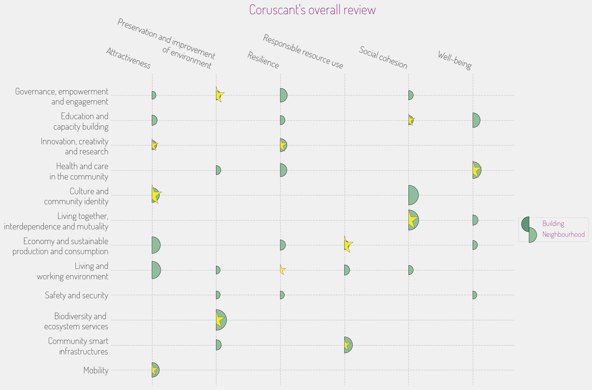

## **INITIATIVE PORTFOLIO**

### **Initiative #1: Urban Cooling Network**

**Category:** Community Safety & Resilience  
**Scale:** City-wide  
**Lead Stakeholder Type:** Public-Private Partnership  
**Timeline:** Short (1 year)  

**What it is:** Establish a network of urban cooling centers equipped across Coruscant to provide refuge during heatwaves, utilizing existing public buildings as cooling locations. Innovative cooling technologies and management strategies will be employed to mitigate extreme heat effects, especially in lower-income neighborhoods that lack effective climate control at home.  

**Why here:** Given Coruscant’s vulnerability to rising temperatures and the risks posed by extreme weather events, this initiative directly targets the community’s urgent need for safety and resilience during climate-related challenges.  

**Who benefits most:** Primarily seniors and low-income families who may not have adequate air conditioning or access to cooling options at home.  

**Quick win or deep change:** Both  
**Estimated complexity:** Moderate  

### **Initiative #2: Stormwater Management Greenways**

**Category:** Green Space & Environment  
**Scale:** District  
**Lead Stakeholder Type:** Government  
**Timeline:** Medium (2-3 years)  

**What it is:** Develop greenways throughout Coruscant that integrate natural stormwater management solutions. This involves the creation of bio-swales, rain gardens, and permeable pavements designed to absorb excess rainfall, reduce flooding, and improve water quality.

**Why here:** With urban infrastructure increasingly burdened by heavy rainfall and inadequate drainage due to climate change, this initiative directly addresses environmental degradation while also enhancing green spaces accessible to all residents.  

**Who benefits most:** Residents in lower-elevation areas prone to flooding and those seeking accessible, green recreational spaces.  

**Quick win or deep change:** Systems change  
**Estimated complexity:** Complex  

### **Initiative #3: Local Innovation Market Hubs**

**Category:** Economic Development & Local Business  
**Scale:** Neighborhood  
**Lead Stakeholder Type:** Community Group  
**Timeline:** Short (1 year)  

**What it is:** Set up pop-up market hubs across various neighborhoods that focus on promoting local artisans, tech startups, and affordable local food vendors. This initiative fosters entrepreneurship, encourages community engagement, and showcases the cultural diversity of Coruscant through local products.

**Why here:** Coruscant's rich cultural tapestry can be leveraged to strengthen local economies while creating inclusive spaces that reflect the community’s heritage and stimulate job creation.  

**Who benefits most:** Local artisans, small business owners, and the general public seeking unique products and experiences.  

**Quick win or deep change:** Quick win  
**Estimated complexity:** Simple  

### **Initiative #4: Intergalactic Culinary Festival**

**Category:** Arts, Culture & Heritage  
**Scale:** City-wide  
**Lead Stakeholder Type:** Non-profit  
**Timeline:** Medium (2-3 years)  

**What it is:** An annual festival celebrating Coruscant's diversity through food, art, and cultural performances from different species and communities. This event will include workshops, demonstrations, and cultural exchanges to promote understanding and cooperation among residents.

**Why here:** The cultural melting pot of Coruscant offers a unique opportunity to celebrate its diversity, strengthen social ties, and promote inclusivity amid rapid urbanization.  

**Who benefits most:** Cultural practitioners, local businesses in the food industry, and residents looking for greater community engagement.  

**Quick win or deep change:** Both  
**Estimated complexity:** Moderate  

### **Initiative #5: Affordable Multi-species Housing Project**

**Category:** Housing & Built Environment  
**Scale:** District  
**Lead Stakeholder Type:** Government  
**Timeline:** Long (3+ years)  

**What it is:** Develop mixed-income housing that caters to the diverse populations of Coruscant, emphasizing affordability, accessibility, and ecological smart design. Housing units would incorporate flexible layouts to accommodate various species and family structures.

**Why here:** Given the stark housing disparities in Coruscant, this initiative is crucial for maintaining social equity and ensuring that diverse communities can thrive within the city.  

**Who benefits most:** Low to middle-income families, particularly those from marginalized species or communities.  

**Quick win or deep change:** Deep change  
**Estimated complexity:** Complex  

### **Initiative #6: Digital Skills for All Initiative**

**Category:** Education & Skills  
**Scale:** Neighborhood  
**Lead Stakeholder Type:** Academic Institution / Non-profit  
**Timeline:** Short (1 year)  

**What it is:** Create a digital skills training program accessible to all residents, focusing on technology literacy, coding, and digital entrepreneurship. Classes will be offered through local libraries and community centers with flexible scheduling to accommodate working adults.

**Why here:** With Coruscant's emphasis on technological innovation, equipping all residents with digital skills will empower the community economically and socially, helping to bridge the digital divide.  

**Who benefits most:** Youth and working-age adults looking to improve their job prospects and digital literacy.  

**Quick win or deep change:** Quick win  
**Estimated complexity:** Simple  

### **Initiative #7: Renewable Energy Cooperative**

**Category:** Digital Infrastructure & Innovation  
**Scale:** City-wide  
**Lead Stakeholder Type:** Public-Private Partnership  
**Timeline:** Medium (2-3 years)  

**What it is:** Establish community-led renewable energy cooperatives that enable residents to collectively invest in and manage renewable energy sources such as solar panels. This project would provide resources, education, and financial support to democratize energy access.

**Why here:** As Coruscant pushes for an energy transition from fossil fuels, this initiative aligns with the community’s need for sustainable practices and will empower local voices in energy management.  

**Who benefits most:** Lower-income households seeking reduced energy costs and increased energy independence.  

**Quick win or deep change:** Both  
**Estimated complexity:** Complex  

## **PORTFOLIO OVERVIEW**

### **Interconnections:**
Initiatives like the **Urban Cooling Network** and **Stormwater Management Greenways** can reinforce each other by providing climate-resilient infrastructure that addresses both heat and water management challenges in Coruscant. Meanwhile, the **Intergalactic Culinary Festival** could utilize the **Local Innovation Market Hubs** to attract a wider audience and stimulate local economies.

### **Sequencing Recommendation:**
The **Local Innovation Market Hubs** should start first as a quick win to initiate community engagement and boost the economy, followed by **Digital Skills for All Initiative** to equip residents with necessary skills that can benefit them in the market spaces.

### **Coverage Check:**
- Age groups served: Children, Youth, Working Age, Seniors
- Economic spectrum: Low-income, Middle-income, Mixed
- Spatial distribution: Dispersed

### **Missing Voice:**
The initiatives may still overlook the input and needs of older residents or those with disabilities who could benefit from accessible programs and services tailored to their unique limitations and experiences in a bustling urban environment.