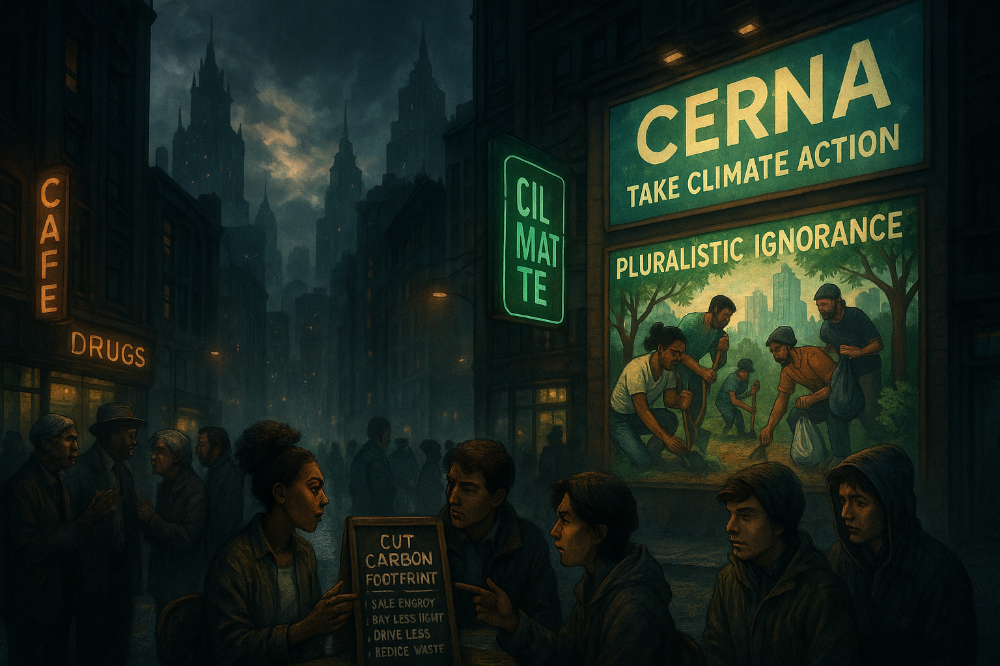

## **PROJECT IDENTIFICATION**

### **Project Title:** 
Green Together Gotham

### **Project Type:** 
Social Program

### **Scale:** 
Neighborhood

### **Timeline:** 
Short-term (1 year)

### ISO37101 mapping for 'Community-driven climate action initiative.'

#### Scores

|   Score | Purpose                                     | Issue                                              | Justification                                                                                                                                                                                                                                                                                   |
|--------:|:--------------------------------------------|:---------------------------------------------------|:------------------------------------------------------------------------------------------------------------------------------------------------------------------------------------------------------------------------------------------------------------------------------------------------|
|       5 | Social cohesion                             | Living together, interdependence and mutuality     | The project aims to create connections among residents, facilitating collective responses to environmental challenges. By addressing feelings of isolation and promoting community engagement, it enhances social cohesion and encourages mutual support within neighborhoods.                  |
|       5 | Well-being                                  | Health and care in the community                   | The initiative focuses on improving residents' sense of community and mental health through interactive storytelling, workshops, and shared experiences. By breaking down barriers created by isolation and promoting socialization, it contributes to the overall well-being of the community. |
|       4 | Attractiveness                              | Culture and community identity                     | The project aligns with Gotham's cultural richness and community spirit, fostering collaborative values. It promotes local identities through storytelling, enhancing both the environment and the attractiveness of the neighborhood.                                                          |
|       4 | Resilience                                  | Governance, empowerment and engagement             | The initiative encourages a systemic approach to evidence-based decision-making by strengthening community member participation and engagement regarding climate actions. This builds resilience by preparing the community to tackle climate challenges collectively.                          |
|       3 | Responsible resource use                    | Economy and sustainable production and consumption | By involving local businesses and communities in sustainability practices, the project promotes responsible consumption and resource use, encouraging participants to adopt sustainable practices in their daily lives.                                                                         |
|       4 | Preservation and improvement of environment | Biodiversity and ecosystem services                | The focus on climate action fosters a network of residents committed to environmental stewardship, which is vital for safeguarding biodiversity and ecosystem services in the urban environment.                                                                                                |
|       3 | Attractiveness                              | Community smart infrastructures                    | The project's workshops may lead to improvements in local infrastructure by inspiring community-led initiatives, enhancing the neighborhood's appeal through active environmentalism.                                                                                                           |
|       5 | Social cohesion                             | Living and working environment                     | By fostering collaboration through workshops and shared experiences, the initiative improves the quality of social interactions and the living environment, encouraging a more integrated community.                                                                                            |
|       4 | Well-being                                  | Safety and security                                | As the project builds community connections and trust among residents, it contributes to perceived safety and security in the neighborhood by empowering individuals to engage in collective action.                                                                                            |

## **CONTEXTUAL FOUNDATION**

### **Specific Local Challenge Addressed:**
The initiative aims to tackle the phenomenon of pluralistic ignorance surrounding climate action in Gotham, where residents underestimate the number of their neighbors concerned about environmental issues. According to the CERNA assessment, many citizens feel isolated in their passion for climate change, which stymies collective action. By addressing this misunderstanding, we can bolster community engagement and mobilize collective responses to environmental challenges.

### **Local Assets Leveraged:**
This project will build on Gotham's existing network of community organizations, local environmental groups, and vibrant neighborhood networks. Gotham boasts a tradition of grassroots activism and strong community bonds, with many residents already engaged in sustainability efforts but lacking the visibility necessary to inspire wider action. Leverage these local strengths to create a platform for shared experiences and collective climate action.

### **Cultural/Social Fit:**
Gotham is a city known for its fierce community spirit and cooperative values. Residents often work together on initiatives that matter to them, from urban gardening projects to local arts. By aligning the Green Together Gotham initiative with existing community practices, this project is rooted in respect for local culture and amplifies their voices through collaborative storytelling and shared aspirations around climate action.

## **PROJECT DESCRIPTION**

### **Core Concept:**
Green Together Gotham aims to cultivate a culture of collaboration and support among residents regarding climate action, illuminating the collective consciousness about environmental stewardship. Through interactive storytelling, public outreach, and hands-on engagement, we will highlight the environmental commitment of neighbors while providing residents with practical, actionable steps to reduce their carbon footprint.

### **Key Components:**
1. **Green Neighborhood Ambassadors:** Identify and train local environmental leaders who will represent their neighborhoods to foster connections among residents, share success stories, and facilitate discussions around climate action. 
2. **Community Climate Action Workshops:** Host a series of hands-on workshops covering topics such as energy efficiency, sustainable gardening, and waste reduction strategies. These workshops will not only educate residents but also promote socializing, thereby breaking down the isolation created by pluralistic ignorance.
3. **Storytelling Platforms:** Create a digital and physical space (such as a community board) for residents to share their experiences, efforts, and commitment to climate action. This platform will showcase local champions committed to environmental initiatives, inspiring others through relatable stories.

### **Implementation Approach:**
- **Phase 1:** Launch the Green Neighborhood Ambassadors initiative and recruit an initial cohort to spread awareness and gather stories from their neighborhoods. A kick-off community event can facilitate connections and allow residents to share their passion.
- **Phase 2:** Organize monthly workshops led by Ambassadors and local experts, expanding community knowledge and showcasing practical techniques and success stories. Collect participant feedback to refine programs continually.
- **Phase 3:** Establish a permanent and interactive online platform where community members can share their stories and results from the workshops, creating a self-sustaining loop of encouragement and action.

## **STAKEHOLDER ECOSYSTEM**

### **Champions:** 
Local leaders and environmental activists—individuals respected in their communities for their commitment to sustainability—will champion this initiative. 

### **Partners:** 
Collaboration will take place with local non-profits focused on environmental education, universities for research expertise, and local government to ensure alignment with municipal climate goals.

### **Beneficiaries:** 
All Gotham residents, especially those who are concerned about climate change but feel isolated, will benefit from enhanced social connections and collective action.

### **Potential Opposition:** 
Some community members may express skepticism about the efficacy of grassroots efforts or believe that change requires top-down approaches. To mitigate this, we will remain transparent about project goals and gather data to demonstrate community impact, alongside engaging skeptics in dialogue to level concerns.

## **FEASIBILITY & IMPACT**

### **Success Indicators:**
- Quantitative metric: Number of community members actively participating in workshops and sharing their stories, aiming for a 25% increase in participation over the first year.
- Qualitative metric: Improvement in community sentiment towards climate action as measured by follow-up surveys.
- Community-defined metric: Success will be indicated by the formation of at least five new local groups or projects stemming directly from connections made through this initiative.

### **Ripple Effects:**
This initiative can spark interest in further community-driven projects, lead to broader adoption of sustainable practices, and strengthen local ties. It may also inspire partnerships with local businesses aiming to adopt sustainable practices.

### **Risk Mitigation:**
The primary risk is apathy or disengagement from residents. To mitigate this, we will incorporate fun, informative, and celebratory events that underline the importance of community in overcoming climate challenges, keeping engagement light and socially driven rather than strictly educational.

## **LOCAL ADAPTATION NOTES**

### **What makes this project uniquely suited to this place:**
Gotham’s distinctive blend of community engagement and cultural richness can elevate the impact of this initiative. The project considers the existing social dynamics, leveraging local stories and relationships that other cities may lack.

### **How locals would likely describe this project in their own words:**
“Finally, a way for us all to connect and do something about climate change together! It’s nice to know that I am not alone in caring about our planet and can talk with my neighbors about what we can do for our community.” 

Green Together Gotham embodies not just an environmental initiative but a celebration of the power of community in shaping a sustainable future.
