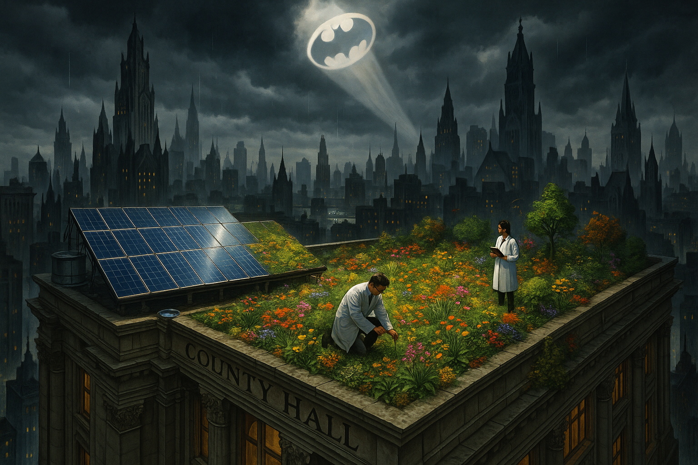

## PROJECT IDENTIFICATION

### Project Title: 
**Gotham Green Roof & Solar Haven**

### Project Type: 
Hybrid

### Scale: 
City-wide

### Timeline: 
Medium-term (2-3 years)

### ISO37101 mapping for 'Gotham's sustainable green roof initiative.'

#### Scores

|   Score | Purpose                                     | Issue                                              | Justification                                                                                                                                                                                                                                                                                                             |
|--------:|:--------------------------------------------|:---------------------------------------------------|:--------------------------------------------------------------------------------------------------------------------------------------------------------------------------------------------------------------------------------------------------------------------------------------------------------------------------|
|       5 | Attractiveness                              | Culture and community identity                     | The project transforms County Hall, a historical asset, into a green roof and solar haven, enhancing its attractiveness through innovative design that connects sustainability with local cultural pride. Engaging the community through educational programs and workshops reinforces a sense of identity and belonging. |
|       5 | Preservation and improvement of environment | Biodiversity and ecosystem services                | Integrating native plant species on the green roof improves urban biodiversity, providing habitats for urban wildlife and promoting ecological health within the city. This effort directly addresses environmental challenges by enhancing ecosystem services.                                                           |
|       5 | Resilience                                  | Health and care in the community                   | The project enhances resilience by promoting physical and mental health through green spaces that improve air quality and provide a relaxing environment. The educational workshops and volunteer opportunities are essential in building community resilience against climate change impacts.                            |
|       5 | Responsible resource use                    | Economy and sustainable production and consumption | By generating energy through solar panels and enhancing local biodiversity, the project exemplifies responsible resource use. It supports local consumption patterns and encourages sustainable practices among community members, contributing to a circular economy.                                                    |
|       5 | Social cohesion                             | Living together, interdependence and mutuality     | Volunteering opportunities foster interdependence and mutuality among community members. Through active participation in the maintenance of the green roof and involvement in educational workshops, residents build social bonds while addressing common goals.                                                          |
|       5 | Well-being                                  | Living and working environment                     | The project's focus on enhancing the living environment through green roofs directly contributes to the well-being of locals by creating healthier urban spaces. It encourages outdoor activities and community interaction, bolstering overall life satisfaction.                                                        |
|       4 | Attractiveness                              | Community smart infrastructures                    | The solar panels represent a smart infrastructure initiative that attracts attention to sustainable technologies within the community. This visible support for renewable energy enhances the overall appeal of the County Hall.                                                                                          |
|       4 | Resilience                                  | Governance, empowerment and engagement             | The project emphasizes community input and stakeholder engagement in the planning and design phases, fostering ownership and accountability. This transparent governance approach strengthens the community's adaptive capacity to address climate challenges.                                                            |
|       4 | Preservation and improvement of environment | Safety and security                                | The transformation of County Hall also enhances safety by improving the site's environmental quality and aesthetics, leading to a safer, more inviting space for community engagement. A well-maintained green space can deter vandalism and promote positive use.                                                        |
|       5 | Social cohesion                             | Education and capacity building                    | The project includes educational programs that raise awareness and build the community's competencies in sustainability practices. Capacity building through workshops and training will empower residents to contribute to the project's goals actively.                                                                 |

## **CONTEXTUAL FOUNDATION**

### Specific Local Challenge Addressed:
Gotham is grappling with the dual challenges of climate change and the need for sustainable practices that reconcile development with environmental stewardship. The existing County Hall structure, while a historical asset, acts as a potential showcase for innovative sustainable practices that could be replicated throughout the city. The proposed project addresses the pressing need for cleaner urban energy sources and promotes biodiversity by integrating green roofs and solar power—principally by transforming the roof of County Hall into a greener space that simultaneously generates energy and habitats.

### Local Assets Leveraged:
This initiative harnesses Gotham's existing cultural reverence for its historical buildings, such as County Hall, and the community’s readiness to embrace sustainability through visible, impactful actions. The integration of living plants with clean energy technology can capitalize on Gotham's growing environmental awareness while creating a model for other historic structures throughout the city. Engaging local scientists, architects, and gardeners can utilize their expertise to enhance the design and implementation of the green roof and solar panels.

### Cultural/Social Fit:
Gothamites take pride in their city’s history and architecture while increasingly valuing sustainability. Thus, the transformation of County Hall’s roof into a dual-function space appeals to both environmental objectives and community sentiment. The project encourages social engagement and participation through workshops, educational programs, and volunteer opportunities, fostering a sense of collective responsibility in protecting the environment while respecting Gotham's character.

## PROJECT DESCRIPTION

### Core Concept:
The Gotham Green Roof & Solar Haven initiative envisions the inspiring transformation of County Hall's rooftop into a sustainable site that embodies urban resilience. By introducing green roofs and solar panels side by side, the project not only aims to generate clean energy but also celebrates nature while providing an educational resource for residents and an attractive space for wildlife.

### Key Components:
1. **Physical/spatial element:** A biodiverse green roof featuring native plant species that will withstand coastal weather while enhancing the building's lifespan and resilience. The solar panel area will deliver electricity to County Hall’s operations and serve an educational purpose.
  
2. **Programming/activity element:** Initiatives including workshops about urban gardening, solar energy efficiency, and wildlife preservation will be organized. Regular community events will promote environmental stewardship and foster a deeper connection between residents and their sustainable urban environment.
  
3. **Community engagement element:** Establishing a volunteer program for local residents to participate in the maintenance of the roof’s gardens will not only facilitate education about green practices but also forge stronger community bonds.

### Implementation Approach:
- **Phase 1:** Immediate actions will encompass initial planning and design workshops involving local residents, soliciting their input on plant choices and project vision. A pilot program for community learning activities focused on sustainability will begin concurrently.
- **Phase 2:** Building momentum involves constructing the green roof and solar panels, alongside establishing partnerships with local schools and environmental organizations for educational programming. This phase will also include marketing campaigns to raise awareness regarding the project’s significance.
- **Phase 3:** Full realization entails the celebration of project completion, with an inaugural community event. Feedback mechanisms will be in place to assess community engagement and educational impact, allowing for continuous improvements to the initiative.

## STAKEHOLDER ECOSYSTEM

### Champions:
Local government officials from County Hall, particularly the conservation architect, the biodiversity officer, and community leaders representing different neighborhoods within Gotham. 

### Partners:
Collaborating with local environmental organizations, educational institutions, gardening clubs, and possibly corporate sponsors focused on sustainability will be instrumental. Engaging relevant specialists in botany and renewable energy will also enhance the project’s scope.

### Beneficiaries:
Local residents, school children, urban wildlife, and the broader community will benefit from enhanced education about sustainability practices, improved air quality through increased vegetation, and greater aesthetic appeal to a cherished historical building.

### Potential Opposition: 
Local businesses concerned about reduced visibility due to the green roof or residents wary of maintenance costs might resist. Addressing these concerns through transparent communication and demonstrating the economic and environmental benefits of sustainability will be essential.

## FEASIBILITY & IMPACT

### Success Indicators:
- Quantitative metric: The amount of energy generated by solar panels annually will be tracked and publicized, showcasing the project's measurable impact on reducing the carbon footprint of County Hall.
- Qualitative metric: Community engagement will be gauged through participation rates in workshops and educational programs, emphasizing the project’s cultural resonance.
- Community-defined metric: Satisfaction surveys from local residents about their sense of involvement and feeling of ownership over the project will be vital for ongoing assessments.

### Ripple Effects:
This project can catalyze further sustainability efforts across Gotham, inspiring additional initiatives around urban green spaces and educational programs. It can spark a city-wide movement for historic buildings to adopt similar transformations, bolster local biodiversity, and improve overall urban resilience.

### Risk Mitigation:
The primary risk relates to the complexity of maintaining the green roof and solar systems. By establishing a clear maintenance plan, engaging volunteers, and potentially offering educational training on upkeep, this risk can be effectively mitigated.

## LOCAL ADAPTATION NOTES

### What makes this project uniquely suited to this place:
The initiative reflects Gotham's historical context and the community’s identity while addressing the very contemporary issues of climate change and urban biodiversity. The blend of heritage preservation and cutting-edge sustainability embodies the spirit of innovation that Gotham is becoming known for.

### How locals would likely describe this project in their own words:
“Gotham Green Roof & Solar Haven – it’s all about giving our historic County Hall a fresh breath of life while making sure we stay true to our roots. It’s green, it’s smart, and it's a community effort that shows we care about our future!"

This initiative not only raises the bar on environmental practices but also constructs a vibrant vision of what Gotham's future holds, one that is inherently connected to its past. By fostering collaboration and community spirit, this project holds the promise of a sustainable yet deeply human-centered urban landscape.