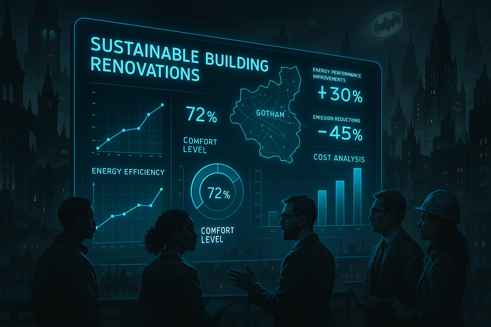

## **PROJECT IDENTIFICATION**

### **Project Title:** 
Gotham Green Renovation Navigator

### **Project Type:** 
Environmental

### **Scale:** 
City-wide

### **Timeline:** 
Medium-term (2-3 years)

### ISO37101 mapping for 'Gotham's energy renovation digital tool.'

#### Scores

|   Score | Purpose                                     | Issue                                              | Justification                                                                                                                                                                                                                                                                                                                                                                                                |
|--------:|:--------------------------------------------|:---------------------------------------------------|:-------------------------------------------------------------------------------------------------------------------------------------------------------------------------------------------------------------------------------------------------------------------------------------------------------------------------------------------------------------------------------------------------------------|
|       5 | Attractiveness                              | Culture and community identity                     | The project aims to enhance Gotham's building infrastructure while respecting its historical architecture, integrating local aesthetics with modern sustainability practices. By providing tailored renovation suggestions, it helps maintain the unique cultural identity of Gotham while addressing energy efficiency and cost-saving measures, increasing the overall attractiveness of the neighborhood. |
|       4 | Preservation and improvement of environment | Biodiversity and ecosystem services                | The Gotham Green Renovation Navigator focuses on energy-efficient renovations that contribute to reducing carbon emissions. This indirectly supports biodiversity and ecosystem services by fostering buildings that can integrate with and enhance the local ecological context while promoting environmental stewardship.                                                                                  |
|       5 | Resilience                                  | Health and care in the community                   | By improving energy efficiency in the housing stock, the Gotham Green Renovation Navigator addresses long-term community health issues related to poor living conditions. Creating comfortable living environments leads to improved physical and mental health amongst residents, contributing to the overall resilience of the community.                                                                  |
|       5 | Responsible resource use                    | Economy and sustainable production and consumption | The project's focus on energy renovations promotes responsible resource use by encouraging sustainable consumption patterns. By educating homeowners and landlords about long-term savings and energy efficiency, it promotes circular economy principles and addresses resource scarcity effectively.                                                                                                       |
|       4 | Social cohesion                             | Living together, interdependence and mutuality     | The initiative fosters community engagement through workshops and feedback systems, promoting dialogue and collaboration among residents, landlords, and municipal planners. By creating a shared sense of ownership and mutual support, it enhances social cohesion within neighborhoods.                                                                                                                   |
|       4 | Well-being                                  | Education and capacity building                    | The Gotham Green Renovation Navigator supports well-being by providing education and workshops to enhance residents' understanding of energy renovations. Increasing awareness of energy efficiency contributes to improved living conditions and a healthier community.                                                                                                                                     |
|       3 | Attractiveness                              | Governance, empowerment and engagement             | The project's community engagement initiatives empower local stakeholders to participate in decision-making processes about energy renovations. By facilitating their input and feedback, it builds a governance structure that enhances the attractiveness of the overall community.                                                                                                                        |
|       4 | Preservation and improvement of environment | Innovation, creativity and research                | The project encourages innovative approaches to energy renovations by leveraging community data and existing case studies. The integration of research within the platform reflects a commitment to improving sustainability practices and environmental quality in Gotham.                                                                                                                                  |
|       3 | Resilience                                  | Mobility                                           | By improving the energy efficiency of buildings, the project indirectly supports a more resilient mobility system through reduced emissions and improved living conditions. As neighborhoods thrive with renovations, the overall accessibility and mobility within them may improve in conjunction.                                                                                                         |
|       4 | Responsible resource use                    | Community smart infrastructures                    | The project encourages the creation of smart infrastructures designed for energy efficiency. The renovations promoted through the Gotham Green Renovation Navigator inspire the development of buildings that align with community needs while adhering to environmental sustainability initiatives.                                                                                                         |

## **CONTEXTUAL FOUNDATION**

### **Specific Local Challenge Addressed:**
Gotham faces a dual challenge of aging building infrastructure and the pressing need for energy efficiency. Many of the city’s buildings are not equipped to meet modern energy standards, which often leads to high operational costs and subpar living conditions for residents. The Gotham Green Renovation Navigator addresses these issues by providing a digital platform that informs building owners and municipal planners about effective energy renovations tailored to their specific needs and conditions. This tool empowers stakeholders to understand the balance of energy efficiency, comfort, and costs, all while considering the long-term impact on emissions.  

### **Local Assets Leveraged:**
Gotham boasts a rich historical architecture and a committed community of architects, urbanists, and environmental activists. The existence of local civic groups advocating for sustainability is a significant asset in implementing this project. Additionally, the community’s prior initiatives promoting energy conservation and awareness can serve as foundational networks to spread awareness about the new tool, amplifying its reach and effectiveness.

### **Cultural/Social Fit:**
Gotham residents value both their historical roots and modern sustainability ethics. Projects that seek to enhance the energy efficiency of their buildings resonate deeply with local aspirations for a greener future. By engaging with community members throughout the development of this tool, Gotham can ensure that cultural contexts and shared values of resilience are respected and woven into the learning process.

## **PROJECT DESCRIPTION**

### **Core Concept:** 
The Gotham Green Renovation Navigator is envisioned as a user-friendly digital tool tailored for homeowners, landlords, and municipal planners. It allows users to explore energy renovation options for their buildings that improve energy efficiency while enhancing comfort and reducing costs. By using a life-cycle assessment modality, users can anticipate emissions and expenses over time, aligning with Gotham's broader sustainability goals.

### **Key Components:**
The project will integrate three key components. First, a robust digital platform will serve as the central repository for renovation options, simulations, and customization based on building characteristics. Second, hands-on workshops will be organized to explore and promote the tool, enabling users to understand renovation opportunities directly. Third, a continuous community engagement program will facilitate discussions, feedback, and success stories from users, fostering a sense of shared ownership over the initiative.

### **Implementation Approach:**
- Phase 1: The project begins with researching existing energy renovation case studies and collecting local building data. This phase will also involve consultations with community stakeholders to ensure the tool reflects local needs. 
- Phase 2: Following development, a pilot version of the Gotham Green Renovation Navigator will be launched in select neighborhoods. Workshops will be organized to introduce community members to the tool, and feedback will be actively sought to improve functionality.
- Phase 3: The final phase will see the tool's full-scale launch across the entire city, including enhanced features based on pilot feedback. A marketing campaign will be rolled out to encourage widespread adoption, with emphasis on inclusivity and accessibility.

## **STAKEHOLDER ECOSYSTEM**

### **Champions:** 
Local universities’ urban planning departments and environmental organizations will champion this initiative by providing expertise in building renovation and sustainability practices.

### **Partners:** 
The city government, real estate associations, local business groups, and community advocacy organizations will be essential partners. Collaboration with these entities will ensure that the tool aligns with local regulations and housing policies while meeting community needs.

### **Beneficiaries:** 
Homeowners, landlords, and municipal planners are the primary beneficiaries, gaining access to valuable insights and affordable renovation options that can enhance living conditions and reduce energy costs.

### **Potential Opposition:** 
Resistance may arise from landlords concerned about costs associated with necessary renovations. This can be addressed through targeted workshops illustrating the long-term cost savings of energy-efficient upgrades, coupled with municipal incentives for compliance with the energy renovation recommendations.

## **FEASIBILITY & IMPACT**

### **Success Indicators:**
- Quantitative metric: A 20% increase in buildings undertaking energy renovations within five years of the tool's launch.
- Qualitative metric: Positive feedback from users regarding the usefulness of the tool, measured through surveys and interviews.
- Community-defined metric: Community engagement levels, assessed through workshop attendance rates and forum discussions.

### **Ripple Effects:**
The initiative may catalyze a broader cultural shift towards sustainability, increasing community dialogue around energy usage and conservation practices. Additionally, improved building conditions can enhance neighborhood pride, leading to increased civic engagement around other local projects.

### **Risk Mitigation:**
The primary risk of underutilization can be mitigated by actively engaging community members in the tool's development and promotion. By ensuring stakeholders are integral to the process, the initiative can build trust and maximize impact.

## **LOCAL ADAPTATION NOTES**

### **What makes this project uniquely suited to this place:**
Gotham's historical context necessitates a careful balance between preservation and modernization. The Green Renovation Navigator respects this by providing renovation suggestions tailored to maintain aesthetic integrity while enhancing energy efficiency. This dual focus is something other cities with less architectural diversity may overlook.

### **How locals would likely describe this project in their own words:**
Locals might say that the Gotham Green Renovation Navigator is "a clever way for us to keep our buildings standing strong while making sure we’re saving money and the planet.” They would appreciate it as a tool that helps them understand how to improve their homes without sacrificing the character that makes Gotham unique. 

By launching the Gotham Green Renovation Navigator, the city can effectively empower its residents to engage in meaningful renovations that enhance both their living environment and contribute to a sustainable future. Residents will see a tool built by and for them, amplifying their collective efforts toward a greener Gotham.