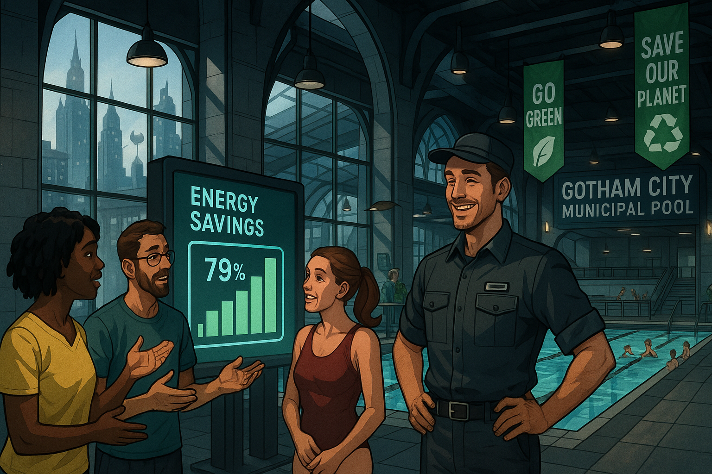

## **PROJECT IDENTIFICATION**

### **Project Title:** 
**Gotham Green Splash Initiative**

### **Project Type:** 
Hybrid

### **Scale:** 
Neighborhood

### **Timeline:** 
Short-term (1 year)

### ISO37101 mapping for 'Gotham Green Splash Initiative: community sustainability.'

#### Scores

|   Score | Purpose                                     | Issue                                              | Justification                                                                                                                                                                                                                                                                                                                                                                                                          |
|--------:|:--------------------------------------------|:---------------------------------------------------|:-----------------------------------------------------------------------------------------------------------------------------------------------------------------------------------------------------------------------------------------------------------------------------------------------------------------------------------------------------------------------------------------------------------------------|
|       5 | Attractiveness                              | Culture and community identity                     | The Gotham Green Splash Initiative enhances the community's appeal by transforming a public space into a center for learning and engagement. It fosters a sense of belonging through communal activities, promoting cultural identity through shared values around sustainability. By connecting local traditions with modern initiatives, it strengthens the neighborhood's social fabric and attracts participation. |
|       5 | Preservation and improvement of environment | Biodiversity and ecosystem services                | The initiative includes the development of outdoor learning areas with sustainable landscaping and demonstration gardens, which actively contribute to biodiversity in the community. It encourages residents to engage with the local environment and learn about practices that protect ecosystem services, making it a model for environmental stewardship.                                                         |
|       4 | Well-being                                  | Health and care in the community                   | By promoting educational outreach on energy efficiency and creating spaces for community gatherings, the initiative enhances the overall quality of life for residents. The focus on sustainability helps improve public health through better environmental conditions and community engagement, which can lead to improved mental and social well-being.                                                             |
|       5 | Social cohesion                             | Living together, interdependence and mutuality     | The initiative aims to foster ownership and leadership within the community through the Green Ambassador program. This encourages collaboration among residents and cultivates a sense of mutual support, strengthening neighborhood ties and promoting inclusive participation in sustainability practices.                                                                                                           |
|       4 | Responsible resource use                    | Economy and sustainable production and consumption | The project emphasizes energy efficiency and sustainability, which aligns with responsible resource management. By educating the community on sustainable practices and promoting local resources, it contributes to a mindset of conservation and responsible consumption within Gotham.                                                                                                                              |
|       4 | Resilience                                  | Education and capacity building                    | The initiative's focus on education, through programs and workshops on energy efficiency, builds capacity within the community. This empowers residents to adapt to environmental changes and promotes resilience against future climate challenges by instilling knowledge and practices that enhance sustainability.                                                                                                 |
|       4 | Attractiveness                              | Governance, empowerment and engagement             | The Gotham Green Splash Initiative engages community leaders and local advocates in the development process, ensuring that the initiative aligns with community values and needs. This participatory approach enhances governance and community empowerment, making the project more attractive to residents.                                                                                                          |
|       4 | Well-being                                  | Living and working environment                     | The enhancements to the municipal pool and surrounding areas improve the living environment by creating accessible spaces for recreation and learning. This contributes positively to the overall living conditions of residents, allowing for healthier lifestyles and active community participation.                                                                                                                |
|       3 | Resilience                                  | Innovation, creativity and research                | The initiative encourages innovative educational programming and creative community engagement tactics, which can adapt to the changing needs and interests of residents, fostering a culture of continuous improvement and responsiveness.                                                                                                                                                                            |
|       3 | Preservation and improvement of environment | Community smart infrastructures                    | By integrating energy monitoring and sustainable practices into the municipal infrastructure, the initiative serves as a model for smart community development, promoting sustainable technologies and practices that align with environmental preservation.                                                                                                                                                           |

## **CONTEXTUAL FOUNDATION**

### **Specific Local Challenge Addressed:**
Gotham faces a significant need to promote community engagement and awareness regarding energy efficiency following the reopening of its municipal swimming pool. While the recent renovations have improved air quality and water temperature, the challenge remains in transforming the pool into a hub for discussions and educational activities on sustainability. The preliminary success of displaying real-time energy savings has sparked unwarranted conversations among visitors, signaling an opportunity for deeper engagement with local energy goals and environmental stewardship.

### **Local Assets Leveraged:**
This initiative builds upon the success of the pool renovation and the existing community interest in energy efficiency. The recently upgraded facilities create a welcoming environment where residents can gather, and the lobby's energy monitoring display already serves as a catalyst for conversation. The neighborhood's history of strong community ties and active involvement in local initiatives positions it as an ideal setting for fostering a culture of sustainability.

### **Cultural/Social Fit:**
The Gotham Green Splash Initiative aligns perfectly with the city’s values of resource conservation and community connection. Gotham residents take pride in their public amenities, and the emphasis on energy efficiency resonates with a growing awareness of climate change. This initiative respects local traditions of community engagement through shared activities, making it not just a project but an opportunity to reinforce the social fabric of the neighborhood.

## **PROJECT DESCRIPTION**

### **Core Concept:** 
The Gotham Green Splash Initiative aims to enhance the municipal pool as a center for community learning and engagement around energy efficiency and environmental stewardship. By developing programs and activities that encompass educational outreach, hands-on demonstrations, and community gatherings, the initiative will transform the pool into a model for sustainable urban living.

### **Key Components:**
1. **Physical/Spatial Element:** A new outdoor learning area complete with sustainable landscaping, demonstration gardens, and shaded seating, encouraging visitors to explore energy-efficient practices and biodiversity.
   
2. **Programming/Activity Element:** Monthly “Green Splash Days” with workshops led by local experts, aimed at educating community members about energy efficiency, sustainable practices, and the benefits of conservation efforts.

3. **Community Engagement Element:** Creation of a Green Ambassador program, where local residents can volunteer to lead environmental workshops and promote sustainability efforts at the pool, fostering a sense of ownership and leadership within the community.

### **Implementation Approach:**
- **Phase 1:** Establish the outdoor learning area and begin a marketing campaign to generate interest in the Green Splash Initiative. The first Green Splash Day will be organized, featuring local sustainability experts and community activities.
  
- **Phase 2:** Expand education programs based on community feedback, integrate seasonal themes (winter energy saving, summer water conservation), and form partnerships with local schools and organizations dedicated to environmental education.

- **Phase 3:** Evaluate the program’s success through feedback from participants and visits to the pool, with plans for long-term sustainability of the initiative through a dedicated budget and continued community involvement.

## **STAKEHOLDER ECOSYSTEM**

### **Champions:** 
Local environmental advocates and the municipal park and recreation department could drive this initiative forward. Engaging community leaders passionate about sustainability and public health will foster greater credibility and outreach.

### **Partners:** 
Key partners could include local environmental organizations, universities with sustainability programs, and businesses focused on green technologies. Collaboration with them will enhance the educational content and resources for the community.

### **Beneficiaries:** 
The primary beneficiaries are residents, particularly families and youth, who will gain firsthand knowledge about energy efficiency and sustainable living practices, enriching their quality of life and fostering community resilience.

### **Potential Opposition:** 
Some residents might perceive this project as an unnecessary expense. Addressing concerns through transparent communication about the benefits, both environmental and economic, will be crucial in winning over skeptics.

## **FEASIBILITY & IMPACT**

### **Success Indicators:**
- **Quantitative metric:** A 25% increase in pool attendance during Green Splash Days over 12 months.
- **Qualitative metric:** Positive feedback from participants who express increased knowledge about energy efficiency and sustainability practices.
- **Community-defined metric:** An increase in local participants for the Green Ambassador program with at least 20 volunteers within the first year.

### **Ripple Effects:**
The initiative could inspire similar programs across other city facilities, lead to increased participation in local sustainability events, and promote partnerships between residents, local businesses, and environmental organizations.

### **Risk Mitigation:**
The primary risk lies in potential under-participation in programs. To mitigate this, marketing campaigns will communicate the program’s benefits clearly and involve local influencers to boost awareness and engagement.

## **LOCAL ADAPTATION NOTES**

### **What makes this project uniquely suited to this place:**
The Gotham Green Splash Initiative is tailor-made for the community's existing enthusiasm for its public amenities and the emerging focus on sustainability. It utilizes existing infrastructure and community interest, making the transition to an energy-efficient ethos natural and engaging.

### **How locals would likely describe this project in their own words:**
“Let’s turn our pool into a place where we not only swim but also learn and connect about saving energy. It’s about making our community stronger and greener!”

This initiative not only seeks to improve energy efficiency and raise awareness but aims to cultivate an environment where sustainability becomes a way of life, enriching the community and enhancing the quality of life for all Gotham residents. 