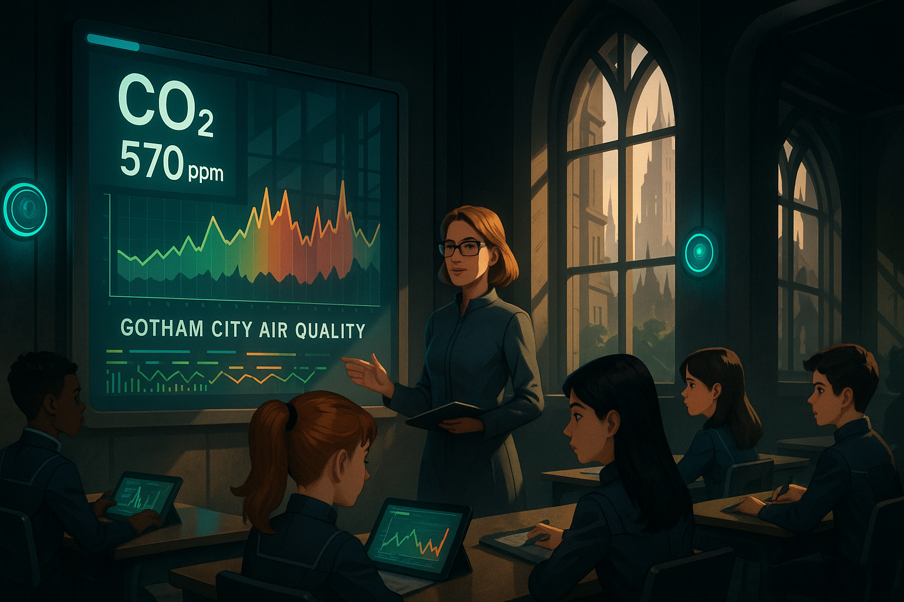

## **PROJECT IDENTIFICATION**

### **Project Title:** 
Gotham's Fresh Air Initiative (GFAI)

### **Project Type:** 
Environmental / Social Program

### **Scale:** 
Neighborhood

### **Timeline:** 
Medium-term (2-3 years)

### ISO37101 mapping for 'Gotham's Fresh Air Initiative improves air quality.'

#### Scores

|   Score | Purpose                                     | Issue                                              | Justification                                                                                                                                                                                                                                                                                                                                    |
|--------:|:--------------------------------------------|:---------------------------------------------------|:-------------------------------------------------------------------------------------------------------------------------------------------------------------------------------------------------------------------------------------------------------------------------------------------------------------------------------------------------|
|       5 | Attractiveness                              | Education and capacity building                    | The initiative promotes community awareness and education regarding air quality, which is a critical factor in making the area more attractive for families and educators. Engaging students and the local community creates a vibrant atmosphere where public health and education intersect, enhancing the overall appeal of the neighborhood. |
|       5 | Preservation and improvement of environment | Health and care in the community                   | By addressing the air quality issue in Gotham's classrooms, the initiative directly contributes to the physical and mental well-being of students. This aligns with the goal of improving health outcomes in the community while simultaneously preserving the environmental conditions necessary for a healthy living space.                    |
|       4 | Social cohesion                             | Culture and community identity                     | The project fosters a sense of community responsibility and collaboration among students, parents, and local stakeholders. By working together to monitor and improve air quality, residents are likely to strengthen their communal ties and share a common identity centered around public health and environmental stewardship.               |
|       5 | Well-being                                  | Living and working environment                     | The initiative is centered on improving the air quality within educational environments, thus directly enhancing the quality of life for students and their families. This focus on well-being ensures that community members are more equipped to thrive in their living and working environments.                                              |
|       3 | Resilience                                  | Mobility                                           | While not directly aimed at mobility, the initiative's promotion of outdoor classes and community involvement could indirectly support healthier mobility patterns, encouraging activities such as walking and cycling. This also promotes a more resilient environment in the face of urban challenges.                                         |
|       4 | Responsible resource use                    | Economy and sustainable production and consumption | The initiative encourages sustainable practices by promoting technology such as CO₂ monitoring and involving local businesses focused on environmental education and technology. This aligns with responsible resource use in terms of civic engagement and sustainable economic practices.                                                      |
|       3 | Attractiveness                              | Community smart infrastructures                    | The initiative may promote and invest in smart infrastructures, such as air quality monitoring systems, that increase the attractiveness of the neighborhood through enhanced environmental management and community involvement.                                                                                                                |
|       3 | Preservation and improvement of environment | Biodiversity and ecosystem services                | Efforts to improve air quality through green landscaping and community greening efforts may support local biodiversity and ecosystem services, promoting a healthier urban environment.                                                                                                                                                          |
|       4 | Social cohesion                             | Living together, interdependence and mutuality     | The collective actions embarked on by residents and students to monitor and improve air quality signify a commitment to interdependence and mutual support within the community, encouraging shared responsibility for their environment.                                                                                                        |
|       4 | Well-being                                  | Governance, empowerment and engagement             | Engaging students, parents, and community stakeholders in the initiative promotes empowerment and a sense of agency regarding environmental health and community governance, fostering greater involvement in local decision-making processes.                                                                                                   |

## **CONTEXTUAL FOUNDATION**

### **Specific Local Challenge Addressed:**
Gotham's classrooms have been experiencing declining air quality, which negatively impacts students' concentration and overall well-being. With increasing air pollution and limited awareness about the environment, the project aims to directly address the vitality of the school environment. Teacher Liga Ozola highlights that students are affected by “stuffy” air, leading to tiredness and a decline in alertness, particularly in the afternoons. The project directly tackles the challenges of poor indoor air quality that can exacerbate stressors already present in urban life.

### **Local Assets Leveraged:**
This initiative builds upon the existing infrastructure of Gotham Academy, which has already demonstrated a proactive approach to air quality management through the installation of CO₂ sensors. The project can amplify this by directly involving students, parents, and the surrounding community in collective air quality monitoring efforts and educational programming. This not only utilizes the school's facilities but also engages local interest, turning Gotham Academy, a community asset, into a hub of environmental education and awareness.

### **Cultural/Social Fit:**
Gotham is a city filled with pride for its community and local institutions. The Fresh Air Initiative aligns with values of collaboration, education, and a commitment to public health, resonating with local educators, parents, and students. It reinforces the belief that everyone has a stake in improving their surroundings and fosters a sense of community responsibility. The initiative respects the tradition of public engagement and education prominent in Gotham, while enhancing community-linked environmental values.

## **PROJECT DESCRIPTION**

### **Core Concept:** 
The Gotham's Fresh Air Initiative seeks to create a community-centered approach to maintaining and improving air quality within schools by bringing together technology, education, and community involvement. By empowering students and families to be “Fresh Air Guardians,” this initiative aims to transform awareness about air quality into action that benefits all residents.

### **Key Components:**
1. **Air Quality Monitoring Stations:** Installation of additional CO₂ monitoring systems across key areas within the school and local parks, ensuring real-time, accessible data for students and families, making air quality a shared concern.
2. **Educational Programming:** Hands-on learning opportunities such as workshops, classes, and projects where students engage with air quality data, the science behind it, and strategies to mitigate pollution.
3. **Community Engagement Initiatives:** Organizing events—such as air quality awareness days, outdoor classes, and 'Clean Air Walks'—to foster community involvement, increase awareness, and encourage local action to maintain and improve air quality in and around schools.

### **Implementation Approach:**
- **Phase 1:** Establish partnerships with local environmental organizations and tech companies to acquire funding and resources for air quality sensors. Begin a community dialogue to gauge interest and gather input, with an emphasis on inclusive discussions involving students, parents, and local leaders.
- **Phase 2:** Deploy air quality monitoring stations and conduct a community launch event at Gotham Academy to educate the public on air quality issues and how the initiative works. Begin implementing educational workshops within classrooms.
- **Phase 3:** Expand successful programming—a second phase could focus on outdoor classes and community-led air quality improvement projects in tandem with local city officials to install green landscaping that can enhance air quality.

## **STAKEHOLDER ECOSYSTEM**

### **Champions:** 
Teacher Liga Ozola will lead the initiative at Gotham Academy, working closely with passionate students and their parents. Local environmental advocates and community leaders, including members from the Neighborhood Association and school board, will also champion the cause.

### **Partners:** 
This initiative requires collaboration with local non-profits focused on environmental education, local government bodies, and businesses that specialize in air quality technology. Partnerships with universities could facilitate research and provide volunteer support.

### **Beneficiaries:** 
All students at Gotham Academy will benefit from improved air quality, leading to enhanced learning experiences. Families will become more informed about air quality issues affecting their health. In the long run, the broader community will experience better air quality, promoting overall public health.

### **Potential Opposition:** 
Some community members may be resistant due to concerns around the perceived financial burden of implementing the program. To address this, outreach sessions can communicate the long-term health benefits and explore potential funding sources, emphasizing the initiative's value in enhancing education and public awareness.

## **FEASIBILITY & IMPACT**

### **Success Indicators:**
- **Quantitative metric:** A reduction in CO₂ levels measured in classrooms throughout the year.
- **Qualitative metric:** Improved student feedback regarding classroom engagement and alertness.
- **Community-defined metric:** Increased participation rates in community awareness events and educational workshops.

### **Ripple Effects:**
This initiative may inspire similar programs in other schools across Gotham, create community advocacy for green policies, and potentially initiate broader conversations on air quality regulation and urban planning.

### **Risk Mitigation:**
A primary risk is community apathy or disengagement. To mitigate this, ongoing communication and regular community feedback sessions will be vital, ensuring that stakeholders feel invested and involved in the initiative’s success.

## **LOCAL ADAPTATION NOTES**

### **What makes this project uniquely suited to this place:**
The initiative is designed specifically for Gotham, focusing on its existing community education culture, environmental concerns, and prioritizing local children’s health. The engagement with schools taps into established networks of parents and educators who already care deeply about their children's well-being.

### **How locals would likely describe this project in their own words:**
"This project is about giving our kids the clean air they deserve! It helps us all learn more about our environment while being part of something that improves our neighborhood together."