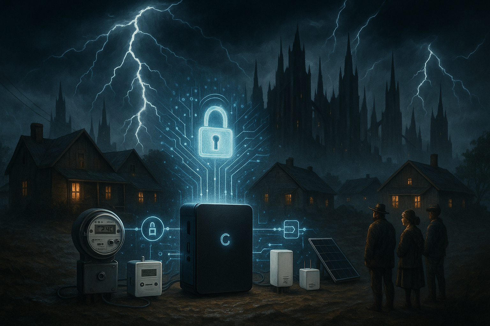

## **PROJECT IDENTIFICATION**

### **Project Title:** 
The Gotham Energy Guardian

### **Project Type:** 
Hybrid

### **Scale:** 
Neighborhood

### **Timeline:** 
Medium-term (2-3 years)

### ISO37101 mapping for 'Community-driven energy resilience initiative.'

#### Scores

|   Score | Purpose                                     | Issue                                              | Justification                                                                                                                                                                                                                                                                                                                                                                           |
|--------:|:--------------------------------------------|:---------------------------------------------------|:----------------------------------------------------------------------------------------------------------------------------------------------------------------------------------------------------------------------------------------------------------------------------------------------------------------------------------------------------------------------------------------|
|       5 | Attractiveness                              | Living and working environment                     | The Gotham Energy Guardian project enhances the living and working environment by addressing vital energy needs in the neighborhood, ensuring that residents have reliable access to energy. It also aims to establish community hubs and educational workshops that enhance local engagement and create a sense of place, making Gotham an attractive area for residents.              |
|       4 | Preservation and improvement of environment | Economy and sustainable production and consumption | By implementing a microgrid system, the project helps in creating an efficient energy usage model that can reduce the reliance on traditional energy sources while promoting local energy independence. This could also encourage the local economy by enabling neighborhood-scale energy solutions and supporting local businesses involved in the project's implementation.           |
|       5 | Resilience                                  | Health and care in the community                   | The Gotham Energy Guardian aims to improve community resilience by addressing storm-related power outages, which directly impacts residents' safety and well-being. By fostering community engagement and self-reliance through energy education and support, the project enhances the capacity of residents to deal with health and care challenges associated with energy insecurity. |
|       5 | Responsible resource use                    | Community smart infrastructures                    | The implementation of the SecureBox system symbolizes a blend of innovative technology with community infrastructure. This project promotes responsible resource use by establishing a smart energy system that optimizes local energy resources and ensures efficient management, contributing towards a sustainable urban infrastructure.                                             |
|       4 | Social cohesion                             | Living together, interdependence and mutuality     | The initiative actively encourages participation and collaboration among diverse community members, fostering a spirit of unity and mutual support. The creation of the Local Energy Guardians Task Force and community workshops promote dialogue and shared experiences, enhancing social ties among residents.                                                                       |
|       5 | Well-being                                  | Education and capacity building                    | The Gotham Energy Guardian project focuses on the education and empowerment of residents through workshops focused on energy management, thereby directly contributing to community well-being. It enhances residents' understanding of energy processes, leading to increased confidence and satisfaction regarding their living conditions.                                           |
|       4 | Attractiveness                              | Safety and security                                | By increasing energy resilience and minimizing power outages, the Gotham Energy Guardian contributes to a safer environment for residents, positively affecting community perceptions of safety and security within their neighborhood.                                                                                                                                                 |
|       3 | Preservation and improvement of environment | Biodiversity and ecosystem services                | While primarily focused on energy resilience, the integration of energy solutions can indirectly benefit local ecosystems by reducing reliance on centralized power plants that might negatively impact biodiversity. This project underscores the importance of sustainable energy practices that align with broader environmental goals.                                              |
|       5 | Resilience                                  | Governance, empowerment and engagement             | This initiative incorporates community engagement at its core through stakeholder involvement and an inclusive decision-making process. It empowers residents to take ownership of their energy systems and reinforces community governance structures.                                                                                                                                 |
|       4 | Social cohesion                             | Culture and community identity                     | By aligning with local cultural values of safety and self-sufficiency and promoting community engagement, the Gotham Energy Guardian enhances local identity and community spirit. It respects and builds upon Gotham’s traditions of neighborly support during crises.                                                                                                                 |

## **CONTEXTUAL FOUNDATION**

### **Specific Local Challenge Addressed:**
Gotham faces the pressing challenge of frequent and prolonged power outages due to storms, impacting not just the utility services but also the safety and well-being of its residents. The introduction of 'The Gotham Microgrid Shield' aims to address these outages by implementing a SecureBox system, which will encrypt essential data flows between smart meters and distributed energy resources (DER devices). This response is crucial as residents currently experience lengthy blackouts during storm incidents, disrupting day-to-day life and creating anxiety around energy dependence.

### **Local Assets Leveraged:**
Gotham's diverse community possesses a wealth of local knowledge about storm preparedness, as well as existing neighborhood associations that are eager to enhance community resilience. Additionally, numerous schools, community centers, and local businesses can serve as potential hubs for educational outreach and communication regarding this initiative. By utilizing these existing assets, the project can build upon a collective understanding of energy use and security, fostering greater community involvement and advocacy.

### **Cultural/Social Fit:**
The Gotham Energy Guardian project aligns with local values emphasizing safety, self-sufficiency, and communal support. Gotham's residents have a history of coming together in times of crisis, and this initiative respects the community's spirit by empowering them through technology while also enhancing their ability to adapt to environmental challenges. The use of the term "Guardian" conveys a protective role, resonating culturally with residents who see their energy infrastructure as a lifeline.

## **PROJECT DESCRIPTION**

### **Core Concept:** 
The Gotham Energy Guardian serves as an innovative, community-centered initiative designed to fortify Gotham’s energy microgrid against storm-related disruptions. By implementing a SecureBox to safeguard data collections and enhance communication among energy devices, residents can enjoy improved energy resilience. This initiative not only mitigates the effects of outages but fosters a culture of self-reliance and collaboration among residents.

### **Key Components:**
1. Physical/Spatial Element: Establishment of community hubs where the SecureBox technology can be installed and monitored. These hubs might be existing community centers or newly designated spaces equipped with adaptive signage and energy monitoring tools, making them accessible and relevant to all residents.
2. Programming/Activity Element: A series of community workshops and training sessions focusing on energy management, storm preparedness, and microgrid functionality. These educational programs will promote energy literacy and resilience practices within the neighborhood.
3. Community Engagement Element: Creation of a Local Energy Guardians Task Force, comprising residents, local officials, and utility representatives, to oversee the implementation and maintenance of the SecureBox network, ensuring ongoing community input and collaboration.

### **Implementation Approach:**
- Phase 1: Immediate actions would involve identifying suitable community hubs for installations, engaging local residents in discussions about their energy needs, and holding introductory workshops on the SecureBox technology.
- Phase 2: Build momentum through pilot programs that integrate the SecureBox in a few selected neighborhoods. Residents would actively participate in monitoring the system, sharing feedback, and celebrating successful outages mitigations through community events.
- Phase 3: Full realization of the project would expand the SecureBox network throughout Gotham, incorporating lessons learned from pilot phases and continuously evolving the workshops to reflect community interests, thus establishing a lasting culture of energy resilience.

## **STAKEHOLDER ECOSYSTEM**

### **Champions:** 
The project may be championed by local community leaders like neighborhood council members, PTA presidents from local schools, as well as engaged citizens who have been advocating for energy justice and sustainability initiatives in Gotham.

### **Partners:** 
Key partners will include local utility companies, environmental NGOs, technology providers specializing in energy management systems, academic institutions for research backing, and local government entities responsible for urban planning and disaster management.

### **Beneficiaries:** 
All residents of Gotham, especially low-income households that feel the impact of power outages most acutely. Improved grid resilience will reduce the frequency and duration of outages, enhancing overall quality of life.

### **Potential Opposition:** 
Resistance may stem from individuals wary of new technology, fearing surveillance or loss of control over personal energy consumption. To address this, open forums will be organized to discuss privacy issues, ensuring residents that the system prioritizes data protection and community autonomy.

## **FEASIBILITY & IMPACT**

### **Success Indicators:**
- Quantitative metric: Reduction in the frequency of power outages post-implementation, measured over the course of several storm seasons.
- Qualitative metric: Resident satisfaction surveys indicating increased community confidence in energy resilience.
- Community-defined metric: Increased community participation rates in workshops and task force meetings, reflecting ownership of the project.

### **Ripple Effects:**
The Gotham Energy Guardian could catalyze additional initiatives focused on urban sustainability, such as local renewable energy projects, enhanced emergency response plans, and stronger partnerships among community organizations.

### **Risk Mitigation:**
A primary risk involves technical failures or resident distrust of the SecureBox system. Comprehensive testing and transparent communication strategies, alongside engaging trusted community leaders, will help mitigate these concerns.

## **LOCAL ADAPTATION NOTES**

### **What makes this project uniquely suited to this place:**
The convergence of Gotham's storm-prone climate with its active community engagement creates a unique opportunity for the Energy Guardian project. Unlike other urban areas with more stable energy management systems, Gotham residents feel the daily implications of energy insecurity. This grassroots, community-oriented approach is designed for local ownership and adaptability.

### **How locals would likely describe this project in their own words:**
"They're putting us in control of our energy and making sure we’re ready for the storms. It’s about time we had a way to really protect ourselves—this feels like a true Gotham move, keeping everyone safe and connected."

This initiative not only secures a vital resource for Gotham but also enhances local ties, fostering a sense of community resilience that is urgently needed in today’s changing climate.