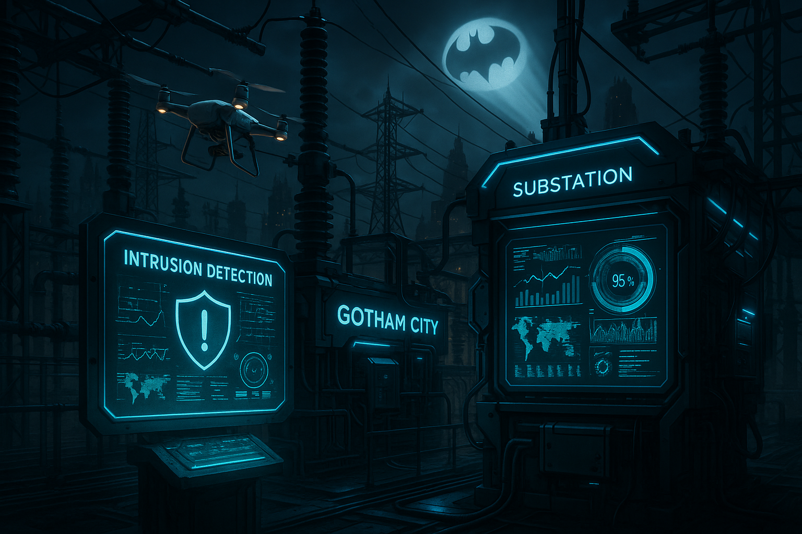

## **PROJECT IDENTIFICATION**

### **Project Title:** 
**Gotham Rewired: The Smart Substation Initiative**

### **Project Type:** 
Hybrid

### **Scale:** 
District

### **Timeline:** 
Medium-term (2-3 years)

### ISO37101 mapping for 'Gotham's smart substation project.'

#### Scores

|   Score | Purpose                                     | Issue                                              | Justification                                                                                                                                                                                                                                                                                                                    |
|--------:|:--------------------------------------------|:---------------------------------------------------|:---------------------------------------------------------------------------------------------------------------------------------------------------------------------------------------------------------------------------------------------------------------------------------------------------------------------------------|
|       5 | Attractiveness                              | Community smart infrastructures                    | The Smart Substation Initiative aims to enhance Gotham's infrastructure, making it more secure and efficient. By creating an Energy Awareness Pavilion and community workshops, the project draws citizens' interest and fosters engagement, thus enhancing the area's attractiveness through modern technological advancements. |
|       4 | Preservation and improvement of environment | Economy and sustainable production and consumption | This project is expected to improve energy reliability and awareness, which can promote sustainable energy practices among residents. By creating an educational hub and engaging the community in energy management, it supports long-term sustainable consumption and aligns with broader environmental goals.                 |
|       5 | Resilience                                  | Health and care in the community                   | The project directly addresses Gotham's need for improved security and operational reliability of its infrastructure, contributing to community resilience. The engagement with local citizens ensures that the community adapts to potential challenges and integrates health-related education about energy and cybersecurity. |
|       4 | Responsible resource use                    | Mobility                                           | By focusing on energy management and cybersecurity, the initiative promotes responsible energy consumption and resource usage. Enhancing understanding of energy resources within the community encourages residents to adopt more sustainable practices.                                                                        |
|       5 | Social cohesion                             | Governance, empowerment and engagement             | The establishment of the Community Advisory Board and community-led workshops ensures that various demographics, especially underserved populations, are included in decision-making processes. This nurtures social bonds and strengthens community ties as residents collaborate towards a shared goal.                        |
|       5 | Well-being                                  | Education and capacity building                    | The initiative promotes resident engagement in learning about energy management and cybersecurity, enhancing community well-being. Access to education around these topics increases overall community safety while empowering individuals through knowledge.                                                                    |
|       4 | Attractiveness                              | Innovation, creativity and research                | Integrating cutting-edge technology into Gotham's existing infrastructure positions the city as an innovator within its domain. This initiative not only showcases technological advancements but also aims to inspire other communities, thereby enhancing the attractiveness of the area.                                      |
|       4 | Social cohesion                             | Culture and community identity                     | The Energy Awareness Pavilion incorporates elements that are reflective of Gotham's identity, marrying technology with local culture. The participatory approach champions community identity while fostering a sense of belonging and shared initiatives.                                                                       |
|       5 | Resilience                                  | Safety and security                                | With a strong focus on enhancing the safety and integrity of the substation's digital infrastructure, the initiative contributes to both physical safety and residents' sense of security, essential for community resilience.                                                                                                   |
|       3 | Preservation and improvement of environment | Biodiversity and ecosystem services                | While not the main focus, the initiative indirectly supports the preservation of urban biodiversity through improved infrastructure and potential future projects that prioritize ecosystem services alongside technological advancements.                                                                                       |

## **CONTEXTUAL FOUNDATION**

### **Specific Local Challenge Addressed:**
Gotham's existing substation faces challenges in efficiency, rapid response to incidents, and ensuring the safety and integrity of its digital infrastructure. As outlined in the project description, the upgrade to incorporate automated certificate management, advanced intrusion detection, and integrated threat analysis addresses the need for enhancements in operational reliability and security. These upgrades are essential for a city with a unique combination of historic infrastructure and modern demands.

### **Local Assets Leveraged:**
Gotham has a rich technological ecosystem, with local universities, tech incubators, and a vibrant community of tech-savvy residents. By collaborating with these local assets, Gotham Rewired can maximize its potential. The existing community's engagement with technology, guided by a desire for more secure and efficient urban services, establishes a fertile ground for this initiative to take root. 

### **Cultural/Social Fit:**
This initiative aligns with Gotham's values of resilience and innovation. The community has a longstanding history of adapting to challenges; therefore, the integration of cutting-edge technology within the substation reflects Gotham's spirit of adaptability. Rather than imposing technology from outside, this initiative respects local character by emphasizing security, efficiency, and accessibility for all residents.

## **PROJECT DESCRIPTION**

### **Core Concept:** 
The Smart Substation Initiative aims to digitally transform Gotham's power substation via state-of-the-art technologies, making it more secure and efficient while ensuring community involvement. By incorporating cutting-edge monitoring and maintenance systems, the project enhances reliability while facilitating community awareness and education about energy management and security.

### **Key Components:**
1. **Physical/spatial element:** The construction of an interactive Energy Awareness Pavilion adjacent to the substation will serve as both an educational hub and a community gathering space, featuring real-time energy data displays, artworks emblematic of Gotham's identity, and facilities for workshops.
   
2. **Programming/activity element:** Launch a series of community-led workshops and hackathons to teach residents about managing their energy usage, understanding cybersecurity in relation to their digital footprint, and engaging them in the decision-making process for future tech implementations within the city. 

3. **Community engagement element:** Establish a Community Advisory Board composed of local residents, tech experts, educators, and business leaders. This board will oversee the implementation process and ensure that the technology remains accessible and beneficial to all demographics, particularly underserved communities.

### **Implementation Approach:**
- **Phase 1:** Conduct community feedback sessions and needs assessments to gather insights on local energy usage and security concerns while forming partnerships with local universities and tech organizations for educational programming.
  
- **Phase 2:** Begin the digital upgrade of the substation, ensuring that community members can witness the transformation. During this time, the projects from the Community Advisory Board will be initiated, promoting local engagement and keeping citizens informed on developments.

- **Phase 3:** Organize an inaugural event at the Energy Awareness Pavilion to celebrate the completion of the upgrade, featuring demonstrations of real-time monitoring and engagement activities. This event would aim to build community ownership of the initiative and showcase the partnership between technology and local needs.

## **STAKEHOLDER ECOSYSTEM**

### **Champions:** 
The Gotham Technology Office and local university engineering departments are well-positioned to lead this initiative, aided by supportive local politicians committed to community-focused technology development.

### **Partners:** 
Collaboration will be sought from local businesses, tech firms specializing in cybersecurity, educational institutions for knowledge-sharing, and advocacy groups focused on energy equity and sustainability.

### **Beneficiaries:** 
Residents of Gotham, particularly low-income households, will benefit through improved energy reliability, increased awareness of their energy consumption, and better cybersecurity practices. The initiative aims to uplift the community’s capacity to engage with and influence technological changes.

### **Potential Opposition:** 
Some resistance may arise from established utility companies concerned about changes in operational procedures or local skepticism about technology. These concerns can be addressed through transparent communication outlining the benefits and increased security associated with the upgrades.

## **FEASIBILITY & IMPACT**

### **Success Indicators:**
- **Quantitative metric:** Reduction in reported outages and incidents within the substation by 30% within the first year after the upgrade.
- **Qualitative metric:** Survey feedback indicating a 70% increase in community awareness around energy management and cybersecurity post-engagement.
- **Community-defined metric:** The establishment of a community-driven energy Safe Harbor initiative that measures public engagement in energy conservation activities.

### **Ripple Effects:**
The Smart Substation Initiative may inspire other cities to tackle technology-based challenges in a community-focused manner, encouraging further development of smart infrastructure across Gotham and enhancing regional connectivity and innovation.

### **Risk Mitigation:**
The primary risk lies in technological integration setbacks. Employing pilot programs to test components of the new systems on a smaller scale before full implementation can help mitigate these risks.

## **LOCAL ADAPTATION NOTES**

### **What makes this project uniquely suited to this place:**
Gotham's historical blend of past and present creates opportunities for integrating innovative solutions in an aging infrastructure. The local culture values civic engagement, making the participatory approach to the Smart Substation Initiative particularly fitting.

### **How locals would likely describe this project in their own words:**
"This is our chance to take control of our city's power. Gotham Rewired feels like it's for us—bringing our community into the digital age while keeping an eye on things that matter like security and stability. It’s about making sure we all benefit together." 

Through the Smart Substation Initiative, Gotham can position itself as a leader in responsible and inclusive technological advancement, ensuring that all residents thrive in a secure and resilient environment.