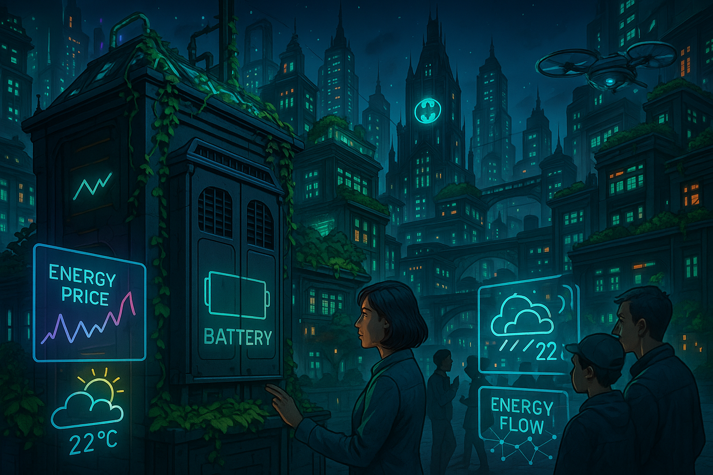

## **PROJECT IDENTIFICATION**

### **Project Title:** 
**Gotham Energy Nexus**

### **Project Type:** 
Hybrid

### **Scale:** 
Neighborhood

### **Timeline:** 
Medium-term (2-3 years)

### ISO37101 mapping for 'Local energy independence initiative.'

#### Scores

|   Score | Purpose                                     | Issue                                              | Justification                                                                                                                                                                                                                                                                                                                      |
|--------:|:--------------------------------------------|:---------------------------------------------------|:-----------------------------------------------------------------------------------------------------------------------------------------------------------------------------------------------------------------------------------------------------------------------------------------------------------------------------------|
|       5 | Attractiveness                              | Living and working environment                     | The Gotham Energy Nexus project emphasizes enhancing local energy independence and integrating community involvement into energy management. This approach not only improves living conditions through reliable energy access but also fosters an attractive, vibrant neighborhood that aligns with sustainable living principles. |
|       4 | Preservation and improvement of environment | Economy and sustainable production and consumption | The project's focus on reducing grid dependency through modular battery systems highlights its commitment to improving environmental performance. By promoting renewable energy solutions and local resource utilization, it also fosters sustainable consumption patterns within the community.                                   |
|       4 | Resilience                                  | Safety and security                                | The adoption of AI-driven microgrid systems enhances Gotham's capacity to respond to energy-related stresses, thereby improving resilience. Creating a local energy solution mitigates risks associated with reliance on external grids, ensuring the community's stability during peak consumption times.                         |
|       5 | Responsible resource use                    | Community smart infrastructures                    | Utilizing modular batteries and renewable resources demonstrates a strong commitment to responsible resource management. The project's implementation fosters circular economy principles while ensuring that energy usage aligns with sustainability goals.                                                                       |
|       5 | Social cohesion                             | Living together, interdependence and mutuality     | By encouraging community participation in energy management through the Gotham Green Energy Collective, the project cultivates social bonds and interdependence among residents. This initiative reinforces a sense of collective responsibility and fosters inclusivity.                                                          |
|       4 | Well-being                                  | Health and care in the community                   | The project's educational workshops and emphasis on renewable energy directly contribute to community well-being by promoting health, safety, and environmental quality. It supports residents’ mental and physical health through active engagement.                                                                              |
|       4 | Attractiveness                              | Culture and community identity                     | The project aligns with Gotham's cultural values, promoting innovation and sustainability. By respecting the neighborhood's character while enhancing its infrastructure, it reinforces local identity and pride.                                                                                                                  |
|       5 | Resilience                                  | Governance, empowerment and engagement             | The project’s participatory governance model fosters community engagement in decision-making processes, which is vital for resilience. By involving residents and local stakeholders, it ensures that the microgrid system adapts to evolving needs.                                                                               |
|       3 | Preservation and improvement of environment | Biodiversity and ecosystem services                | While the primary focus is on energy independence, incorporating natural habitats within community spaces can enhance urban biodiversity, supporting the overall ecological well-being of the area.                                                                                                                                |

## **CONTEXTUAL FOUNDATION**

### **Specific Local Challenge Addressed:**
Gotham is experiencing an increasing dependency on external energy grids, particularly during peak hours, which places stress on both the environment and local residents. The implementation of artificial intelligence in managing energy systems has highlighted the need for localized energy independence and resilience in the face of rising energy costs. The deployment of an AI-driven microgrid with modular second-life batteries has begun to mitigate these challenges, showcasing a preliminary 19% reduction in grid dependency, yet there remains significant potential for expansion and community engagement to fully leverage these advancements.

### **Local Assets Leveraged:**
The initiative builds upon Gotham's existing investment in smart building technology and the recent implementation of modular battery systems. Local universities and tech-savvy community groups can provide expertise and manpower, fostering collaboration between academic institutions and the public sector. The project can further harness the community's interest in sustainability and technology, creating a sense of ownership and investment among residents who are eager to contribute to local green initiatives.

### **Cultural/Social Fit:**
This project aligns with Gotham's pride in innovation and resilience, enhancing local values of sustainability, community engagement, and technological advancement while respecting the character of the neighborhood. Gotham residents value practical, future-forward solutions that improve their quality of life. By involving local stakeholders and utilizing local materials wherever possible, the project reinforces community ties and emphasizes participatory practices, which are central to the city's ethos.

## **PROJECT DESCRIPTION**

### **Core Concept:**
The Gotham Energy Nexus aims to enhance local energy independence by expanding the AI-driven microgrid model into a fully integrated community system. This system will utilize modular batteries and renewable resources while facilitating community participation in energy management. By engaging residents in energy production and consumption decisions, the project encourages local engagement, promotes sustainability, and cultivates a robust sense of community.

### **Key Components:**
1. **Physical/spatial element:** Deploy additional modular battery hubs within community centers and parks, where residents can gather and engage with the technology actively while enhancing public spaces.
2. **Programming/activity element:** Establish educational workshops and hands-on training programs in local schools and community centers that focus on renewable energy technologies, battery maintenance, and energy efficiency.
3. **Community engagement element:** Create a "Gotham Green Energy Collective" comprising volunteers and stakeholders who will contribute ideas, guidance, and management to the microgrid system, ensuring that it serves local needs.

### **Implementation Approach:**
- **Phase 1:** Conduct a community audit to assess local energy needs and identify key locations for battery hubs. Launch a public awareness campaign about the project, emphasizing its benefits and soliciting community involvement.
- **Phase 2:** Initiate the installation of modular battery systems at selected community sites. Begin workshops and trainings to familiarize residents with energy management tools and the microgrid system operations.
- **Phase 3:** Optimize microgrid performance via feedback from community members and implement the “Gotham Green Energy Collective” to maintain a continuously improving system that adapts to evolving local needs.

## **STAKEHOLDER ECOSYSTEM**

### **Champions:**
The project would be primarily championed by the Gotham City Council with support from local energy activists, university partners specializing in energy systems, and neighborhood associations focused on sustainability.

### **Partners:**
Key partnerships would include local universities for research and development, energy companies involved in renewable resources, and non-profits focused on environmental equity. Additionally, municipalities and local government agencies will play a critical role in facilitating zoning and regulatory approvals.

### **Beneficiaries:**
The direct beneficiaries include Gotham residents who will have reduced energy costs and increased energy independence. Local businesses will also benefit from improved energy reliability. Furthermore, educational institutions will gain valuable insights that can drive further curriculum development in sustainable practices.

### **Potential Opposition:**
Potential resistance may come from established energy companies concerned about the reduction in demand for traditional energy sources and from residents hesitant to engage in new technologies without sufficient educational resources. To mitigate concerns, transparent communication outlining the benefits and safety of AI-driven systems, along with continued educational efforts, will be essential.

## **FEASIBILITY & IMPACT**

### **Success Indicators:**
- **Quantitative metric:** A target of achieving 35% reduction in overall grid dependency during peak hours within the first two years of implementation.
- **Qualitative metric:** Surveys indicating increased knowledge and engagement in energy practices among residents.
- **Community-defined metric:** Active participation rates in workshops and local energy management initiatives, aiming for a minimum of 50% of households involved.

### **Ripple Effects:**
This initiative could catalyze further local sustainability initiatives and potentially inspire neighboring districts to adopt similar practices, fostering a regional movement toward decentralized energy independence. As community members become more involved in energy management, increased civic engagement may lead to broader participatory governance, ultimately enhancing community resilience across the city.

### **Risk Mitigation:**
The primary risk involves technology adoption resistance. To address this, an ongoing feedback loop with residents will be established, ensuring they have input in the system's evolution and providing demonstrations and incentives to encourage buy-in.

## **LOCAL ADAPTATION NOTES**

### **What makes this project uniquely suited to this place:**
The Gotham Energy Nexus leverages Gotham’s existing infrastructure and the community's inclination towards technological solutions. Its focus on education and collaboration adds a personal touch that resonates deeply with Gotham’s culture of innovation and collective empowerment, making it a model tailored for local conditions that might not be as successful elsewhere.

### **How locals would likely describe this project in their own words:**
“Gotham Energy Nexus is our chance to take charge of our energy future. We’re no longer just saying ‘yes’ to the grid—we’re creating a local solution where we control how we power our homes and neighborhoods. It’s about learning together, staying connected, and supporting each other as we go green!”