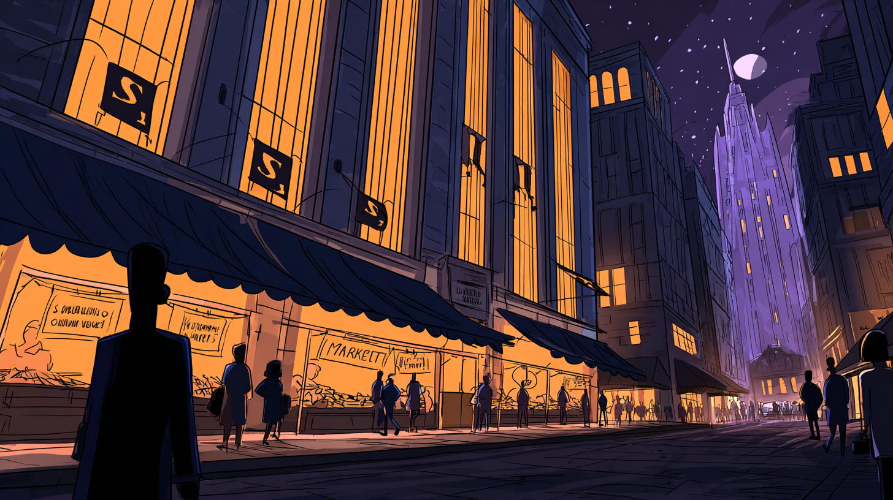

# Neighborhood Assessment Report: Gotham City

## Overview & Sustainability Profile

### Neighborhood Snapshot
**Gotham City** embodies both the struggles and the resilience of a metropolis defined by its juxtaposition of dark alleys and luminous hope. As a center of industry, culture, and crime, Gotham is marked by significant urban challenges, including crime rates that are among the highest in the nation, alongside vibrant arts and community initiatives that demonstrate the spirit of its residents. Spanning approximately 150 square miles along the coast, this city’s geography is characterized by a river cutting through the heart of its industrial legacy and sprawling, diverse neighborhoods.

Three defining characteristics of Gotham include its **iconic skyline**, dominated by towering Gothic architecture, its **gritty urban landscape**, reflecting decades of economic ups and downs, and its **unique cultural fabric**, which combines influences from various ethnicities and socioeconomic backgrounds. The physical character of the city is marked by a stark contrast; while some neighborhoods showcase modern amenities and green spaces, others remain trapped in cycles of neglect and disrepair.

### Sustainability & Resilience
Gotham City faces significant **environmental challenges**, particularly with climate vulnerability. Frequent flooding, exacerbated by the city’s aging infrastructure, poses risks to neighborhoods, especially those along the waterfront like the East End and Gotham Harbor. Additionally, air pollution from congested transport routes presents a public health hazard. However, the city boasts potential for **green infrastructure**; initiatives to revitalize abandoned spaces into parks, such as the proposed "Gotham Greenway," aim to tackle climate resilience while enhancing livability.

In recent years, there have been advances in **sustainable development activities**. A notable project, the renovation of the former Wayne Enterprises building into a multi-purpose green space, includes energy-efficient features and serves as a community center. The city's transit system is also undergoing a transformation, with efforts to expand bike lanes and promote the use of electric buses. Moreover, local businesses are increasingly adopting **circular economy** principles, aiming to minimize waste by reusing materials and fostering local sourcing.

Despite progress, efforts related to **climate action and adaptation** face hurdles. The establishment of resilience hubs in more vulnerable neighborhoods remains crucial. While plans for a **community microgrid** are underway, ensuring accessibility and energy transition for under-resourced areas continues to be a challenge. **Nature-based solutions**, such as the installation of urban rain gardens, provide hope; however, these initiatives require broader support to be sustainably implemented.

Importantly, **environmental justice indicators** illustrate disparities; lower-income communities often suffer from the highest pollution exposure and receive fewer resources for climate adaptation. This highlights the need for policies that prioritize equity, ensuring that environmental benefits are shared across all neighborhoods.

## Economic Drivers & Market Forces

### Economic Ecosystem
Gotham City's **employment landscape** is diverse, with strength in sectors such as finance, technology, healthcare, and the growing creative industries. However, the overall job market struggles with high unemployment rates, particularly among youth and marginalized groups. This disparity appears even more pronounced as neighborhoods like **Crime Alley** experience stunted economic growth. Meanwhile, businesses in **Gotham Heights** thrive and attract young professionals, highlighting economic polarization within the city.

The **business dynamics** in Gotham are complex. While large corporations like Wayne Enterprises provide significant employment opportunities, many local businesses remain vulnerable. A number of entrepreneurial initiatives support local start-ups, particularly in arts and tech, fostering a sense of community ownership and persistence despite economic uncertainties.

The **real estate market** is experiencing a mixed climate. In desirable areas, there is a booming development pipeline fueled by gentrification, with luxury condos emerging. However, in historically marginalized neighborhoods, vacant properties abound. Market indicators reveal a cumulative **associated risk** where lower-income residents face increasing rents without corresponding income growth. Recent studies point toward a housing affordability crisis, with rental prices rising at a rate over 10% annually.

Gotham shows signals of **economic transformation**; however, progress is uneven. As the city invests in infrastructure updates and **fiscal health priorities**, there is a cautious optimism about potential job growth stemming from new projects. City officials are advocating for the development of affordable housing as a critical factor for sustainable growth.

## People & Community Dynamics

### Demographic Composition
Gotham's **population trends** indicate a city of approximately 1.6 million residents, with an ebb and flow influenced by internal and external migration patterns. Notably, younger residents are moving in, attracted to new job opportunities and cultural amenities. However, continued out-migration by families seeking safer environments poses a demographic challenge that could impact future neighborhood vitality.

Gotham is culturally diverse, with large communities representing Latino, Black, Asian, and immigrant populations. This **cultural diversity** enriches the city but also highlights community tensions surrounding integration and representation. Local festivals and cultural events, such as the **Gotham Arts Festival**, showcase this mosaic, promoting unity in diversity.

### Social Infrastructure
The presence of **community assets** is vital in Gotham; these include libraries, schools, and community centers, which provide necessary resources. Social networks thrive in the arts and activism spaces, with many organizations working tirelessly to address issues such as homelessness and food insecurity.

**Movement patterns** in the city illustrate the rhythms of daily life. Residents regularly navigate their neighborhoods via public transport and on foot, contributing to a sense of community and interconnectedness. However, those living in more isolated areas report difficulty accessing essential services, indicating a need for improved transportation links.

### Community Tensions & Aspirations
Currently, Gotham teeters on crucial **pressure points**, including crime, poverty, and inadequate public services. Community voices express the desire for increased safety, better schools, and more green spaces. As one local leader noted, “We want Gotham to be a city where our families can thrive, not just survive.”

The **collective vision** among residents leans toward a future rich in opportunities—their aspirations emphasize sustainable development that respects community heritage while fostering economic growth. Citizens are advocating for increased dialogue with city officials to ensure that development reflects the needs and desires of all residents.

### Social Cohesion Indicators
Despite challenges, there are positive **social cohesion indicators**. Community organizations and local initiatives are creating safe spaces for dialogue, which help bridge divides. Residents often speak passionately about their neighborhoods and their hopes for future collaboration, indicating a deep-rooted connection to their city. “Gotham is home,” states a long-term resident, expressing the unyielding spirit that embodies the people of this unique city.

In summary, Gotham City is a place of contrasts and complexities, where challenges coexist with an extraordinary potential for renewal. By fostering inclusive policies and sustainable development, all community stakeholders can work together in revitalizing Gotham into a resilient and thriving urban environment that respects its rich history and future aspirations.

### ISO37101 mapping for 'Gotham City: resilient, diverse, challenged.'

#### Scores

|   Score | Purpose                                     | Issue                                              | Justification                                                                                                                                                                                                                                                                                                                                                                                                                                                                         |
|--------:|:--------------------------------------------|:---------------------------------------------------|:--------------------------------------------------------------------------------------------------------------------------------------------------------------------------------------------------------------------------------------------------------------------------------------------------------------------------------------------------------------------------------------------------------------------------------------------------------------------------------------|
|       4 | Attractiveness                              | Economy and sustainable production and consumption | Gotham City displays a diverse economic landscape with strengths in various sectors, but also faces challenges such as high unemployment rates among marginalized groups. The presence of entrepreneurial initiatives that support local startups showcases a determination to foster community ownership and economic resilience. However, disparities exist, particularly in neighborhoods like Crime Alley, indicating a need for balanced economic opportunities across the city. |
|       4 | Preservation and improvement of environment | Biodiversity and ecosystem services                | Gotham City has been working on green infrastructure initiatives, such as the conversion of abandoned spaces into parks and the development of urban rain gardens, aimed at improving local biodiversity and fostering ecosystem services. However, environmental justice indicators reveal that lower-income communities suffer from higher pollution exposure, which highlights the ongoing necessity for promoting equitable access to environmental initiatives.                  |
|       5 | Resilience                                  | Health and care in the community                   | The city's transformation, including efforts to develop resilience hubs and community microgrids, emphasizes critical adaptation strategies addressing the environmental vulnerabilities that residents face. Given the significant climate challenges Gotham City endures, enhancing health and care systems will be key in ensuring community resilience, especially in the most affected neighborhoods.                                                                            |
|       4 | Responsible resource use                    | Community smart infrastructures                    | The ongoing efforts to modernize the city's infrastructure, such as the expansion of bike lanes and promotion of electric buses, demonstrate a strong commitment to sustainable resource management. Local businesses adopting circular economy principles further highlight the need for resource efficiency and sustainable practices in neighborhood development.                                                                                                                  |
|       5 | Social cohesion                             | Living together, interdependence and mutuality     | Despite facing challenges, Gotham City exhibits strong social cohesion through community organizing and local initiatives aimed at enhancing dialogue among residents. Cultural festivals and grassroots activism serve as vehicles for collective identity and interdependence among various social groups. The desire for increased collaboration with city officials showcases the community's commitment to inclusivity.                                                          |
|       4 | Well-being                                  | Education and capacity building                    | Gotham's diverse population benefits from local assets like libraries and community centers that aim to provide educational opportunities and resources. However, disparities in accessing such facilities indicate that ongoing efforts are needed to enhance capacity building and ensure equitable access to educational initiatives.                                                                                                                                              |
|       4 | Attractiveness                              | Culture and community identity                     | The city’s cultural fabric, enriched by its diverse populations and art initiatives, enhances its attractiveness and sense of community identity. Festivals and cultural events promote unity and appreciation of shared heritage, but challenges in integration highlight the ongoing need for cultivating inclusivity.                                                                                                                                                              |
|       3 | Preservation and improvement of environment | Innovation, creativity and research                | The projects aiming to develop green spaces and infrastructure showcase innovative solutions to address both environmental and social challenges in Gotham. While these efforts indicate momentum toward sustainability, ongoing research and community innovation are needed to drive further improvements.                                                                                                                                                                          |
|       4 | Resilience                                  | Governance, empowerment and engagement             | Efforts to involve community voices in decision-making processes signal a vital move toward inclusive governance. The active engagement of residents, alongside city officials, is crucial in ensuring that development reflections align with community needs and that empowerment strategies are effectively implemented.                                                                                                                                                           |
|       4 | Responsible resource use                    | Safety and security                                | Addressing environmental hazards and improving safety are interconnected challenges in Gotham City. Efforts to foster safer public spaces and enhance environmental protection reflect a commitment to responsible resource use while ensuring community safety and resilience.                                                                                                                                                                                                       |
|       4 | Attractiveness                              | Economy and sustainable production and consumption | Gotham City shows a mixed economic landscape where thriving local start-ups and large corporations like Wayne Enterprises coexist. However, the contrasting fortunes of neighborhoods highlight a polarization, with some areas booming while others like Crime Alley struggle. A focus on supporting local businesses and promoting responsible consumption and production patterns is evident.                                                                                      |
|       4 | Preservation and improvement of environment | Biodiversity and ecosystem services                | The report indicates significant environmental challenges, including climate vulnerability and pollution, which are being addressed through green infrastructure initiatives. Although Gotham's ecological footprint shows stress, projects like the Gotham Greenway and urban rain gardens demonstrate efforts to restore ecosystem services while enhancing livability.                                                                                                             |
|       4 | Social cohesion                             | Culture and community identity                     | Gotham's rich cultural diversity contributes to its social fabric, fostering unity through local festivals and community events. Nevertheless, tensions surrounding integration and representation call for continual efforts to strengthen community identity while promoting inclusive dialogue.                                                                                                                                                                                    |
|       5 | Well-being                                  | Health and care in the community                   | Author's emphasis on public health hazards due to air pollution and the community's needs for improved safety, green spaces, and health services shows the critical importance of addressing well-being through infrastructural upgrades and improved access to healthcare.                                                                                                                                                                                                           |
|       3 | Responsible resource use                    | Governance, empowerment and engagement             | While Gotham City is trying to adopt circular economy principles among local businesses, the challenges of equitable resource sharing and environmental justice particularly for lower-income areas demonstrate the need for enhanced governance and community engagement.                                                                                                                                                                                                            |
|       4 | Attractiveness                              | Living and working environment                     | While development in Gotham Heights is flourishing, the disparity in living conditions impacting housing affordability and neighborhood investment indicates the importance of ensuring equitable access to quality living and working environments to enhance the city's attractiveness.                                                                                                                                                                                             |
|       3 | Resilience                                  | Living together, interdependence and mutuality     | Emerging entrepreneurial initiatives and community-centric projects emphasize the importance of promoting mutual support among residents. Yet, disparities within neighborhoods concerning economic growth hampered by crime and neglect challenge collaboration efforts.                                                                                                                                                                                                             |
|       3 | Well-being                                  | Community smart infrastructures                    | The transformations in the transit system focusing on bike lanes and electric buses reflect a step toward establishing smart infrastructures that cater to residents' mobility needs. However, access to these services is still uneven across neighborhoods.                                                                                                                                                                                                                         |
|       3 | Social cohesion                             | Education and capacity building                    | Community assets such as libraries and schools play a significant role in fostering community connections and supporting capacity building for sustainable practices. However, disparities in access and local services require further development to ensure comprehensive participation and uplift marginalized groups.                                                                                                                                                             |

