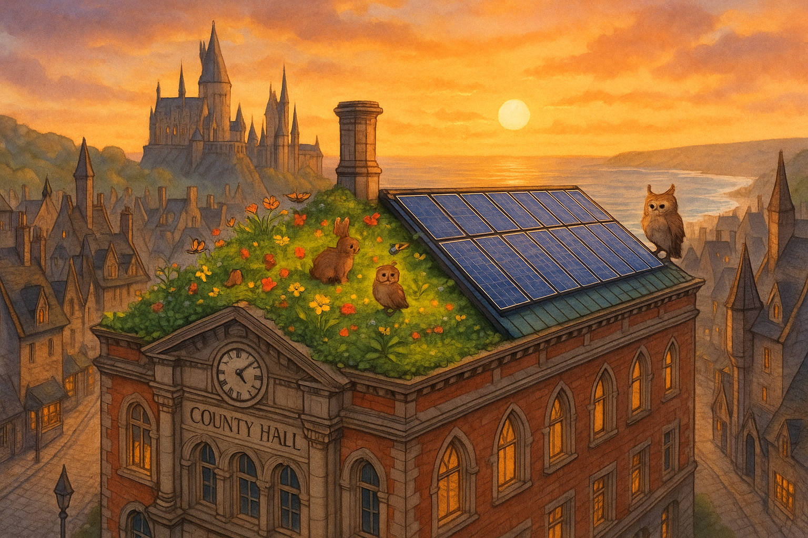

## **PROJECT IDENTIFICATION**

### **Project Title:** 
**Hogsmeade’s Living Roof Renaissance**

### **Project Type:** 
Hybrid

### **Scale:** 
Neighborhood

### **Timeline:** 
Medium-term (2-3 years)

### ISO37101 mapping for 'Hogsmeade's sustainable rooftop transformation project.'

#### Scores

|   Score | Purpose                                     | Issue                                              | Justification                                                                                                                                                                                                                                                                                                                                          |
|--------:|:--------------------------------------------|:---------------------------------------------------|:-------------------------------------------------------------------------------------------------------------------------------------------------------------------------------------------------------------------------------------------------------------------------------------------------------------------------------------------------------|
|       5 | Attractiveness                              | Culture and community identity                     | This project enhances the local identity of Hogsmeade by transforming a historic building into a modern sustainable space, thus maintaining a balance between historical charm and contemporary sustainability initiatives. The mix of green technology and local craftsmanship will appeal to the community and attract residents and visitors alike. |
|       5 | Preservation and improvement of environment | Biodiversity and ecosystem services                | The project introduces a green roof that not only addresses energy efficiency but also contributes to local biodiversity through the cultivation of native plants and pollinator habitats. This focus on ecological restoration and enhancement of habitats is a direct response to local environmental needs.                                         |
|       4 | Resilience                                  | Health and care in the community                   | By improving energy efficiency and ecological support through the solar green roof, the project enhances Hogsmeade's resilience to climate change impacts. It also provides educational opportunities that promote community health and well-being.                                                                                                    |
|       4 | Responsible resource use                    | Economy and sustainable production and consumption | The integration of solar technology with sustainable building practices reflects a commitment to responsible resource use. The project promotes local craftsmanship and supports the economy by involving local businesses in its execution.                                                                                                           |
|       5 | Social cohesion                             | Living together, interdependence and mutuality     | The initiative encourages community participation in the planning, design, and maintenance of the living roof, fostering a sense of ownership and mutual support. Programming and engagement strategies enhance social bonds within the community.                                                                                                     |
|       5 | Well-being                                  | Education and capacity building                    | Educational workshops designed to engage residents in sustainable practices significantly enhance community well-being. By providing hands-on learning related to sustainability, the project aims to improve residents’ quality of life.                                                                                                              |
|       4 | Attractiveness                              | Community smart infrastructures                    | The installation of smart technologies like solar panels not only beautifies County Hall but also enhances its functionality, making the building more attractive and relevant in terms of modern sustainability standards.                                                                                                                            |
|       4 | Preservation and improvement of environment | Governance, empowerment and engagement             | The project directly involves community input and engagement in the planning process, ensuring that local governance is respected. This involvement fosters greater community empowerment and encourages civic engagement.                                                                                                                             |
|       4 | Social cohesion                             | Health and care in the community                   | The community's involvement in landscaping and maintaining the living roof promotes health and care, enhancing social ties as individuals work together towards a common, green goal.                                                                                                                                                                  |
|       5 | Resilience                                  | Innovation, creativity and research                | The project embodies innovative approaches to sustainability by integrating advanced green technologies with community values and historical architecture, showcasing modern resilience strategies in urban settings.                                                                                                                                  |

## **CONTEXTUAL FOUNDATION**

### **Specific Local Challenge Addressed:**
Hogsmeade has an urgent need to enhance its urban sustainability while respecting the historic charm of its neighborhoods. The proposed transformation of County Hall’s rooftop into a combined solar and green roof addresses both environmental sustainability and urban biodiversity. The current issue revolves around preserving the integrity of historic structures while utilizing modern technology to combat climate change. The rooftop project will not just improve energy efficiency through the addition of solar panels but will also create green space that contributes to local biodiversity, addressing the lack of natural areas in urban settings.

### **Local Assets Leveraged:**
The project builds upon Hogsmeade’s commitment to community and legacy by utilizing County Hall, a key municipal building. The location serves as a central hub where residents convene, meaning the rooftop will become a semi-public space that invites community interaction. The existing local knowledge in sustainability and conservation can be harnessed to ensure the project reflects local ecological practices and community values. Additionally, Hogsmeade has a strong tradition of craftsmanship, which can be employed in the design and construction of the green roof.

### **Cultural/Social Fit:**
This initiative aligns with Hogsmeade’s identity as a quaint, historical village, and echoes the local desire to maintain its character while progressing towards a sustainable future. The project respects the community’s history and architectural styles by ensuring that modifications to County Hall remain sympathetic to the building’s historic status. It enhances local values around sustainability, community engagement, and care for the environment, which resonate deeply with residents, especially younger generations actively seeking positive change.

## **PROJECT DESCRIPTION**

### **Core Concept:** 
Hogsmeade’s Living Roof Renaissance aims to transform County Hall’s rooftop into a dynamic, multifunctional space that showcases a blend of green technology and ecology. By installing solar panels alongside a vibrant green roof, this project will serve as a community demonstration site for sustainable practices, providing educational opportunities while fostering environmental awareness and local wildlife.

### **Key Components:**
1. A dual-purpose roof housing state-of-the-art solar panels complemented by a diverse array of native plants, improving aesthetics and air quality while promoting pollinator habitats.
2. Programmed educational workshops and community events focused on sustainable living, gardening, and renewable energy practices, allowing residents to engage with their environment and learn hands-on strategies for personal and communal sustainability.
3. A community engagement strategy that invites residents to participate in the planning, design, and maintenance of the living roof, ensuring a sense of ownership and pride in the project.

### **Implementation Approach:**
In Phase 1, preliminary designs will be created in collaboration with local architects and environmental scientists. Community consultation will be vital to incorporate feedback. The second phase will involve construction, beginning with structural assessments and preparations for both solar installation and planting. The final phase will see the launch of community workshops and an inaugural event to engage the public and highlight the importance of green infrastructure.

## **STAKEHOLDER ECOSYSTEM**

### **Champions:** 
Local councils, environmental nonprofits, and community leaders who emphasize sustainability and green initiatives will drive this forward. A designated project lead from the County Hall staff will be crucial for coordination and outreach.

### **Partners:** 
Collaboration with local environmental organizations, educational institutions for educational programming, and businesses focused on green technologies will be key. Potential partnerships could be formed with universities studying urban ecology.

### **Beneficiaries:** 
All residents, particularly children and schools, benefit through educational opportunities and increased green space. Local wildlife populations will also gain from the revitalization of native habitats.

### **Potential Opposition:** 
Concerns may arise from those worried about the structural changes to a historic building. Addressing these concerns through transparent communication and emphasizing the respectful nature of the project will be vital. Engaging with heritage preservationists early in the planning will also alleviate potential resistance.

## **FEASIBILITY & IMPACT**

### **Success Indicators:**
- Quantitative metric: Achieve a 30% reduction in County Hall’s energy consumption within the first year of the solar panel installation.
- Qualitative metric: Positive feedback from surveys conducted after community workshops regarding increased knowledge and engagement in sustainability.
- Community-defined metric: Measure participation rates and interest levels in follow-up community activities related to sustainability practices launched post-initiation.

### **Ripple Effects:**
The project will likely spur additional green initiatives within the neighborhood, encourage similar transformations of public and private roofs, and foster a sense of environmental stewardship among residents.

### **Risk Mitigation:**
The primary risk involves potential structural challenges when retrofitting County Hall. Engaging specialist architects and engineers during the planning phase to assess and respond to structural limitations will be crucial in avoiding complications during implementation.

## **LOCAL ADAPTATION NOTES**

### **What makes this project uniquely suited to this place:**
Hogsmeade’s deep sense of history and community pride make the adaptation of County Hall a uniquely relatable project. Unlike larger urban areas, Hogsmeade can intimately fuse its historical architectural charm with contemporary sustainable practices in a way that is visible and accessible to everyone.

### **How locals would likely describe this project in their own words:**
Residents might say, "It’s about time we started caring for our buildings like they care for us. A living roof on County Hall is just what we need to brighten up our town and help the environment!" 

This project embodies the spirit of Hogsmeade: merging the old with the new to foster a vibrant, sustainable future.