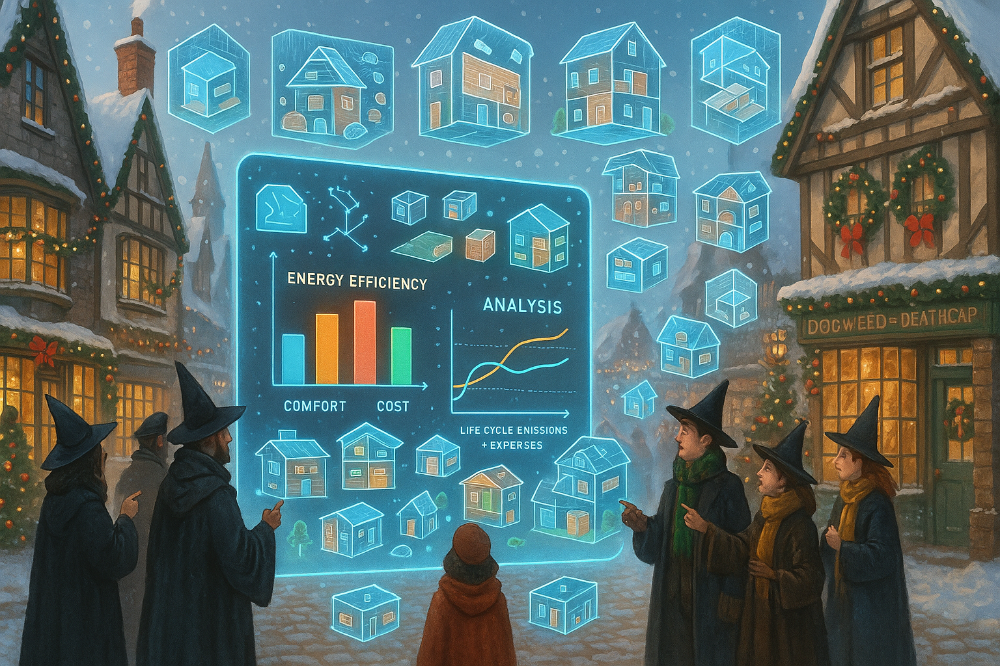

## **PROJECT IDENTIFICATION**

### **Project Title:** 
Hogsmeade Green Renewal Initiative

### **Project Type:** 
Environmental

### **Scale:** 
Neighborhood

### **Timeline:** 
Medium-term (2-3 years)

### ISO37101 mapping for 'Hogsmeade sustainability-focused renovation initiative.'

#### Scores

|   Score | Purpose                                     | Issue                                              | Justification                                                                                                                                                                                                                                                                                    |
|--------:|:--------------------------------------------|:---------------------------------------------------|:-------------------------------------------------------------------------------------------------------------------------------------------------------------------------------------------------------------------------------------------------------------------------------------------------|
|       5 | Attractiveness                              | Culture and community identity                     | The project aims to enhance the appeal of Hogsmeade by promoting sustainable practices while preserving its historical character. The initiative respects the local heritage and architecture, making it attractive for both residents and visitors, thereby enriching the community's identity. |
|       4 | Preservation and improvement of environment | Biodiversity and ecosystem services                | The initiative focuses on energy efficiency improvements while maintaining the integrity of historic architecture, contributing to local environmental performance. This aligns with preserving and enhancing the unique landscapes and biophilia inherent in Hogsmeade.                         |
|       4 | Well-being                                  | Health and care in the community                   | By improving energy efficiency in homes, the project enhances living conditions, contributing to overall well-being and comfort for residents. The focus on community workshops also facilitates collective engagement and health through shared learning.                                       |
|       5 | Social cohesion                             | Living together, interdependence and mutuality     | The project promotes social integration through community workshops, bringing residents together to share experiences and learn from one another. This fosters a sense of belonging, mutual support, and strengthens community ties.                                                             |
|       4 | Responsible resource use                    | Economy and sustainable production and consumption | The initiative encourages energy-efficient renovations and the use of sustainable materials, promoting responsible practices among homeowners. This approach also supports long-term local economic resilience through the promotion of local craftspeople.                                      |
|       4 | Resilience                                  | Governance, empowerment and engagement             | By involving the community in decision-making processes through workshops and feedback, the initiative builds community resilience. Local advocacy and partnerships with various stakeholders enhance the project's adaptability to future challenges.                                           |
|       4 | Attractiveness                              | Economy and sustainable production and consumption | The project aims to revitalize the local economy through energy efficiency improvements that can lead to lower living costs for residents, encouraging local spending and sustainable economic development.                                                                                      |
|       4 | Preservation and improvement of environment | Health and care in the community                   | This initiative addresses environmental performance by improving energy efficiency, which reduces carbon emissions and improves air quality, subsequently benefiting health outcomes within the community.                                                                                       |
|       5 | Social cohesion                             | Education and capacity building                    | The community workshops serve as a platform for education, enhancing knowledge and skills related to energy renovations. This builds community capacity and encourages collective engagement in sustainable practices.                                                                           |
|       4 | Well-being                                  | Living and working environment                     | Improving energy efficiency contributes to better living environments for residents, as reduced energy costs enhance overall financial security, thus positively impacting their quality of life.                                                                                                |

## **CONTEXTUAL FOUNDATION**

### **Specific Local Challenge Addressed:**
Hogsmeade faces several challenges regarding the sustainability of its historic architecture and general energy efficiency. The town is characterized by older buildings that often do not meet modern energy standards, leading to excessive energy use and higher living costs for residents. The ‘Hogsmeade’s Sustainable Renovation Oracle’ seeks to remedy this by not only improving building energy performance but also preserving the local character of historically significant structures. This initiative will provide a structured framework for energy renovations that balances practical necessities with cultural integrity.

### **Local Assets Leveraged:**
Hogsmeade has a unique charm and a deep-rooted community ethos tied to its historic significance and picturesque landscapes. The community’s affinity for traditional architecture serves as an asset, as it creates a strong motivation for residents to improve their homes without compromising their historical value. Existing local organizations, such as Hogsmeade Heritage Society, can be vital in promoting sustainability while educating residents on maintaining the town's unique aesthetic.

### **Cultural/Social Fit:**
The essence of Hogsmeade is found in its connection to history and community. This initiative resonates with local values by promoting sustainable practices while respecting traditional craftsmanship and design. Locals treasure their village’s enchanting ambiance, and the project’s focus on energy efficiency will enhance living comfort, create more affordable housing through reduced energy costs, and ultimately contribute to preserving the town’s charm for future generations.

## **PROJECT DESCRIPTION**

### **Core Concept:** 
The Hogsmeade Green Renewal Initiative is a community-driven digital tool intended to support homeowners in navigating the complexities of energy renovation. The tool will provide tailored recommendations for energy-efficient upgrades that align with historical aesthetic guidelines, allowing residents to modernize their homes without sacrificing their unique character.

### **Key Components:**
1. **Digital Renovation Interface:** A user-friendly platform where homeowners can input their specific building details and receive customized suggestions for energy-efficient renovations.
2. **Community Workshops:** Regularly scheduled gatherings to educate residents on energy renovation techniques and sharing success stories and best practices from the community.
3. **Partnership with Local Craftspeople:** Collaboration with local artisans and contractors experienced in sustainable renovation to ensure that upgrades maintain historical integrity while promoting energy efficiency.

### **Implementation Approach:**
- **Phase 1:** In the immediate future, initial workshops will be organized to introduce the concept of sustainable renovation while gathering input on the specific needs and challenges residents face regarding their buildings. The design of the digital tool will begin, taking community feedback into account.
- **Phase 2:** Following the completion of the digital tool, the focus turns to training local contractors and craftspeople on how to implement the recommendations. Community workshops will expand, engaging both homeowners and professionals to create a network of support within Hogsmeade.
- **Phase 3:** The initiative culminates in creating an ongoing digital platform for users to not only track their renovation progress but also share successes and tips, fostering a community of green practices and historical preservation.

## **STAKEHOLDER ECOSYSTEM**

### **Champions:** 
Key advocates will include members of the Hogsmeade Heritage Society, local environmental groups, and engaged citizens with a passion for sustainability and local culture to drive this initiative forward.

### **Partners:** 
Collaborative efforts with local government departments, sustainability organizations, and educational institutions will be essential to provide resources, expertise, and potential funding.

### **Beneficiaries:** 
Homeowners will benefit through reduced energy costs and improved home comfort. The community as a whole will experience enhanced local aesthetics and a more robust local economy through increased engagement in sustainable practices.

### **Potential Opposition:** 
Some residents may resist the initiative due to concerns about costs or changes in the visual appearance of their homes. Addressing these concerns through transparent communication, education on long-term savings, and emphasizing the historical preservation aspect of the renovations will be crucial.

## **FEASIBILITY & IMPACT**

### **Success Indicators:**
- **Quantitative metric:** A measurable reduction in energy bills for participating households over a two-year span.
- **Qualitative metric:** Positive feedback from community members on their experiences with the renovation process and satisfaction levels regarding home comfort.
- **Community-defined metric:** Increase in the local participation rate in workshops and knowledge-sharing platforms, indicative of community engagement.

### **Ripple Effects:**
As renovations take hold, the town can expect a surge in local pride and investment in the community, heightening property values while promoting a culture of environmental stewardship. Additionally, this initiative could serve as a model for nearby towns facing similar challenges, paving the way for regional collaboration on sustainability.

### **Risk Mitigation:** 
The primary risk involves ensuring widespread community participation and buy-in. This can be mitigated through ongoing community engagement, providing clear communication about the benefits, financial support resources available for renovations, and celebrating early adopters as community role models.

## **LOCAL ADAPTATION NOTES**

### **What makes this project uniquely suited to this place:**
The Hogsmeade Green Renewal Initiative is designed with a keen understanding of local history, architecture, and community dynamics, ensuring that it respects and promotes the town’s heritage while encouraging modern sustainable practices unique to Hogsmeade. This framework couldn't be easily replicated elsewhere, as it integrates local traditions into contemporary needs for energy efficiency.

### **How locals would likely describe this project in their own words:**
"This project feels like a true win for Hogsmeade! It’s a way for us to modernize and save on our energy bills without losing the look and feel of our beloved village. Finally, a way to renovate that honors our history while making our homes more comfortable and sustainable!"