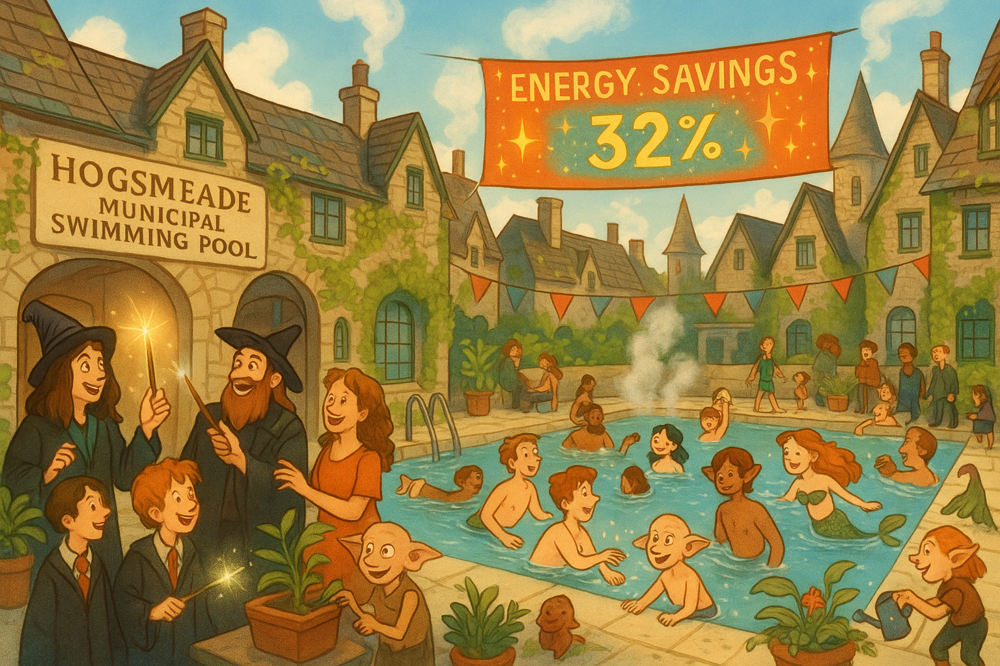

## **PROJECT IDENTIFICATION**

### **Project Title:** 
Hogsmeade Watershed Wellness Hub

### **Project Type:** 
Hybrid

### **Scale:** 
Neighborhood

### **Timeline:** 
Short-term (1 year)

### ISO37101 mapping for 'Hogsmeade community wellness hub initiative.'

#### Scores

|   Score | Purpose                                     | Issue                                              | Justification                                                                                                                                                                                                                                      |
|--------:|:--------------------------------------------|:---------------------------------------------------|:---------------------------------------------------------------------------------------------------------------------------------------------------------------------------------------------------------------------------------------------------|
|       5 | Attractiveness                              | Culture and community identity                     | The project leverages Hogsmeade's cultural identity and local charm by transforming the municipal swimming pool into a wellness hub that incorporates community-led programming, facilitating social interaction and enhancing community identity. |
|       5 | Well-being                                  | Health and care in the community                   | The initiative focuses on health and wellness by providing access to various activities and classes at the swimming pool, which promotes physical and mental well-being for residents of all ages.                                                 |
|       5 | Social cohesion                             | Living together, interdependence and mutuality     | The establishment of a resident advisory board and informal community events fosters dialogue and collective experiences among residents, contributing to social integration and mutual support.                                                   |
|       4 | Preservation and improvement of environment | Biodiversity and ecosystem services                | The creation of a wellness garden with native plants not only enhances the local environment but also serves as an educational resource about local ecology, supporting biodiversity.                                                              |
|       4 | Attractiveness                              | Living and working environment                     | By transforming a community space into a health and wellness hub, the initiative improves the overall living conditions in Hogsmeade, attracting residents to engage and participate.                                                              |
|       4 | Responsible resource use                    | Community smart infrastructures                    | The focus on energy efficiency in the renovated swimming pool demonstrates a commitment to responsible resource management, enhancing the sustainability of the community infrastructure.                                                          |
|       3 | Resilience                                  | Governance, empowerment and engagement             | The project's approach to community engagement through forums and advisory boards promotes resilience by ensuring that residents have a voice in the development of initiatives that affect them.                                                  |
|       3 | Well-being                                  | Economy and sustainable production and consumption | By collaborating with local businesses and schools, the initiative not only promotes wellness but also supports the local economy through sustainable practices and partnerships.                                                                  |
|       3 | Social cohesion                             | Education and capacity building                    | The initiative's focus on providing swimming and wellness classes that incorporate local traditions enhances cultural capacity and promotes social inclusion among residents.                                                                      |

## **CONTEXTUAL FOUNDATION**

### **Specific Local Challenge Addressed:**
The recent renovation of the municipal swimming pool, now equipped with updated heating and ventilation systems, has reinvigorated this community space. The displayed real-time energy savings have opened conversations about sustainability and energy efficiency, highlighting a growing local interest in environmental responsibility. However, there's a need for more inclusive community engagement to ensure that residents feel empowered by and connected to this initiative. Increasing awareness and participation in community wellness activities at the swimming pool can address potential disparities in health and wellness access across socioeconomic groups in Hogsmeade.

### **Local Assets Leveraged:**
Hogsmeade has a strong sense of community and a commitment to preserving local charm. The municipal swimming pool is a beloved space for residents, providing an ideal foundation upon which to build further community-centric initiatives. The maintenance team's dedication to energy efficiency not only enhances the swimming experience but also invites opportunities for educational programming about sustainability. By capitalizing on these existing strengths, this project seeks to weave deeper connections among residents around shared values of health, wellness, and environmental stewardship.

### **Cultural/Social Fit:**
This initiative aligns well with Hogsmeade's cultural identity as a community that values charm, historical significance, and neighborly connections. Hogsmeade residents pride themselves on their magical and whimsical roots, and a project centered around wellness and sustainability can potentially enhance these attributes. Moreover, incorporating community-led programs and events in the pool's usage allows residents to express and share their traditions and values, making it a focal point for social interaction and collective growth.

## **PROJECT DESCRIPTION**

### **Core Concept:** 
The Hogsmeade Watershed Wellness Hub will transform the municipal swimming pool into a vibrant community health and wellness center. By integrating programming focused on physical wellness, environmental education, and community engagement, the initiative fosters a holistic approach to health that aligns with the interests of local residents.

### **Key Components:**
1. **Physical/Spatial Element:** A designated wellness garden will be established adjacent to the swimming pool, featuring native plants and educational signage about local ecology. This space would serve as both a relaxation area and an outdoor classroom for eco-friendly workshops.
   
2. **Programming/Activity Element:** Regularly scheduled community swim sessions would be organized alongside wellness classes (yoga, aqua aerobics, meditation) that cater to residents of all ages and backgrounds, incorporating local traditions and practices.

3. **Community Engagement Element:** A resident advisory board will be established to ensure local voices shape the development of programming and events, fostering ownership and investment in the wellness hub. Informal events, such as “swim and chat” forums focused on sustainability topics, will encourage connection among diverse community members.

### **Implementation Approach:**
- **Phase 1:** In the first month, local stakeholders will convene to brainstorm and refine the project’s vision. The wellness garden’s layout and programming calendar will be developed, leveraging input from residents and professionals. Initial events can include a garden party to celebrate the garden's launch and introduce the wellness hub concept.
  
- **Phase 2:** Over the next six months, promotional activities will increase visibility for the wellness hub. Efforts will be made to engage local businesses for sponsorships, ensuring their involvement in community programming events. Partnerships with local schools for educational outreach around wellness and sustainability will be initiated.

- **Phase 3:** Following the successful launch of programs, a community celebration will be held at the pool to reinforce the hub’s role in bringing the neighborhood together. Regularly scheduled programming will be evaluated and adjusted based on community feedback, ensuring continuous alignment with local needs and desires.

## **STAKEHOLDER ECOSYSTEM**

### **Champions:** 
Key local champions include the facility manager and a dedicated resident committee passionate about community health and environmental sustainability. Their leadership will be essential in driving the initiative forward.

### **Partners:** 
Collaboration with local non-profits focused on health education, local businesses willing to sponsor events or provide expertise, and schools for youth engagement will be crucial. The local parks department can also aid in the development of the wellness garden.

### **Beneficiaries:**
The primary beneficiaries will include Hogsmeade residents of all ages seeking improved health and wellness. The initiative enhances access to wellness activities regardless of socioeconomic background, providing a community focal point that promotes social interactions.

### **Potential Opposition:** 
Some residents may feel apprehensive about the introduction of new community programs or the changes around the swimming pool. Addressing concerns through open forums and informational materials will be critical to gaining community trust and support.

## **FEASIBILITY & IMPACT**

### **Success Indicators:**
- Quantitative metric: Increase in usage of the swimming pool and attendance at wellness classes by 30% over the first year.
- Qualitative metric: Positive feedback from residents regarding program offerings and community engagement.
- Community-defined metric: Regular surveys to assess residents’ perceived improvements in community connection and wellness.

### **Ripple Effects:**
By fostering stronger community ties, the initiative may lead to increased volunteerism, local business growth, and enhanced collaboration among residents. The wellness hub can become a template for similar community initiatives throughout Hogsmeade, promoting broader participation in sustainability efforts.

### **Risk Mitigation:**
The primary risk involves underutilization of the hub due to lack of awareness or engagement. A robust marketing campaign, leveraging community newsletters and social media, will ensure awareness of events and programming while addressing feedback promptly.

## **LOCAL ADAPTATION NOTES**

### **What makes this project uniquely suited to this place:**
This project uniquely aligns with the historic and whimsical nature of Hogsmeade, leveraging its rich community ethos and existing infrastructure. Unlike generic wellness initiatives in urban environments, it embraces local character and drives community pride, showing that enhancing health and wellness can be done in ways that respect and uplift community identity.

### **How locals would likely describe this project in their own words:**
Residents might say, “Finally, a place where we can come together to swim, learn about our land, and connect with one another while keeping the magic of Hogsmeade alive!” The project embodies a shared desire for a healthier community while cherishing the enchanting spirit of their beloved locale.