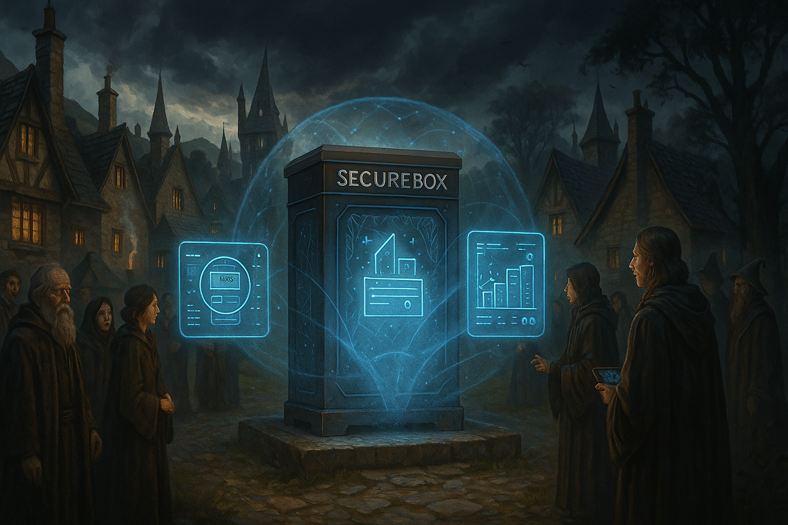

## **PROJECT IDENTIFICATION**

### **Project Title:** 
Hogsmeade Resilient Grid Initiative (HRGI)

### **Project Type:** 
Infrastructure

### **Scale:** 
Neighborhood

### **Timeline:** 
Medium-term (2-3 years)

### ISO37101 mapping for 'Hogsmeade's power grid resilience initiative.'

#### Scores

|   Score | Purpose                                     | Issue                                              | Justification                                                                                                                                                                                                                                                                                                                                                                                                      |
|--------:|:--------------------------------------------|:---------------------------------------------------|:-------------------------------------------------------------------------------------------------------------------------------------------------------------------------------------------------------------------------------------------------------------------------------------------------------------------------------------------------------------------------------------------------------------------|
|       5 | Resilience                                  | Governance, empowerment and engagement             | The Hogsmeade Resilient Grid Initiative emphasizes community involvement in decision-making processes, fostering transparency and engagement among residents. By establishing a local energy committee comprising residents, business owners, and local leaders, the initiative ensures that community voices direct the project, aligning with principles of governance and empowerment essential for resilience. |
|       4 | Attractiveness                              | Economy and sustainable production and consumption | The project aims to enhance the reliability of energy supply which is crucial for local businesses to thrive, thus supporting economic growth and sustainability. By providing a stable power source through the SecureBox system, local businesses can operate more consistently, improving Hogsmeade's overall attractiveness as a place to live and work.                                                       |
|       4 | Responsible resource use                    | Community smart infrastructures                    | The implementation of the SecureBox system reflects responsible resource use by optimizing energy management and integrating smart technology into the neighborhood's infrastructure. This initiative promotes efficient energy consumption and contributes to a smart infrastructure within Hogsmeade, ensuring that energy resources are utilized effectively.                                                   |
|       4 | Well-being                                  | Health and care in the community                   | Enhancing the reliability of energy supply directly contributes to the well-being of residents by minimizing outages that could disrupt daily life. A stable power supply supports not just economic activities but also promotes a healthier living environment where residents do not have to experience extended blackouts.                                                                                     |
|       5 | Social cohesion                             | Living together, interdependence and mutuality     | The project fosters social cohesion by involving local residents in all stages of the initiative, thus strengthening community bonds and mutual support. The emphasis on collaboration and communal effort to secure energy resources highlights collective responsibility and interdependence among residents.                                                                                                    |
|       3 | Preservation and improvement of environment | Biodiversity and ecosystem services                | While the main focus is on energy security, improving infrastructure can have positive implications for environmental quality. Reducing reliance on traditional energy sources and enhancing technical systems may support local biodiversity by improving overall ecological health within the neighborhood.                                                                                                      |
|       4 | Attractiveness                              | Living and working environment                     | By securing a stable energy supply and engaging the local community, the initiative enhances Hogsmeade as a desirable place to live and work. Improved living conditions through reliable power access contribute to higher quality of life and attractiveness of the area for both residents and potential businesses.                                                                                            |
|       5 | Resilience                                  | Innovation, creativity and research                | The initiative employs innovative technology with the SecureBox system to create a resilient energy infrastructure. This focus on innovation in managing energy resources positions the neighborhood to adapt to changing conditions and demands, reinforcing the importance of creativity in community resilience.                                                                                                |
|       4 | Social cohesion                             | Culture and community identity                     | The project respects and enhances local cultural practices by involving residents in decision-making, which strengthens community identity. By integrating traditional values of cooperation and innovation within the initiative, it reinforces a shared sense of belonging and pride in Hogsmeade's communal efforts.                                                                                            |
|       4 | Attractiveness                              | Safety and security                                | By addressing power outages, the initiative improves safety and security for residents, ensuring that community members feel protected during extreme weather events. Securing energy access supports not only stability but also reinforces the overall safety framework within the neighborhood, enhancing its attractiveness to potential residents and businesses.                                             |

## **CONTEXTUAL FOUNDATION**

### **Specific Local Challenge Addressed:**
Hogsmeade, a storm-prone rural community, suffers from frequent and prolonged power outages due to its vulnerable existing infrastructure. The lack of an efficient and secure microgrid exacerbates the challenges faced during extreme weather conditions, resulting in residents experiencing extended blackouts that disrupt daily life. This initiative aims to enhance the reliability and security of Hogsmeade’s energy supply by implementing the SecureBox system, which encrypts data flows and improves communication between energy devices.

### **Local Assets Leveraged:**
The existing community in Hogsmeade has a strong sense of tradition and cooperativeness, with many residents engaged in local governance and community activities. There is also a current infrastructure of small businesses that rely heavily on steady power supply. This project will build on local residents' knowledge, their willingness to participate in communal activities, and the pre-existing trust within community organizations. 

### **Cultural/Social Fit:**
The proposed project aligns with Hogsmeade’s values of resilience, community support, and innovation. By involving local people in the decision-making and implementation processes—from securing a secure microgrid to managing energy resources—the initiative respects and enhances the community’s established practices of collaboration and self-sufficiency. Furthermore, protecting energy sources will allow local businesses to flourish without the burden of inconsistent power supply, nurturing the community’s economy and social fabric.

## **PROJECT DESCRIPTION**

### **Core Concept:** 
The Hogsmeade Resilient Grid Initiative aims to secure the neighborhood’s energy infrastructure by implementing the SecureBox system. By creating a robust microgrid that encrypts data, the project offers residents not just protection against storms but increased peace of mind regarding their energy needs during times of crisis.

### **Key Components:**
1. **Physical/spatial element:** Installation of the SecureBox infrastructure, including smart meters and distributed energy resources throughout the neighborhood.
2. **Programming/activity element:** Workshops and informational sessions designed to educate residents about energy management, the importance of cybersecurity in energy systems, and the operational aspects of the SecureBox.
3. **Community engagement element:** Establishment of a local energy committee comprising residents, business owners, and local leaders to oversee the project, ensuring community voices guide the initiative.

### **Implementation Approach:**
- **Phase 1:** Conduct community outreach to assess interest, gather support, and recruit local volunteers for a pilot program. 
- **Phase 2:** Coordinate with energy providers and technology partners to install the SecureBox system while providing training sessions for residents to understand and use this new technology.
- **Phase 3:** Evaluate the program’s success through feedback and data collection, potentially expanding the system to integrate renewable energy sources and energy efficiency programs driven by community input.

## **STAKEHOLDER ECOSYSTEM**

### **Champions:** 
Local leaders and volunteers who understand the community dynamics will spearhead this initiative, including the Hogsmeade Town Council and energy committee formed within the community.

### **Partners:** 
Collaboration with energy providers, technology firms specializing in secure grid solutions, and local universities can provide vital expertise, funding, and manpower. State and federal grants dedicated to rural energy infrastructure will also be sought to support the initiative.

### **Beneficiaries:** 
All residents will benefit from shorter blackouts, enhanced security of their power supply, and increased understanding of energy management. Local businesses will also be able to operate more reliably, fostering economic growth within the community.

### **Potential Opposition:** 
Some residents may express concerns about privacy and the perceived overreach of technology in their daily lives. It is crucial to address these concerns through awareness campaigns that educate residents on the benefits and privacy protections embedded in the SecureBox system.

## **FEASIBILITY & IMPACT**

### **Success Indicators:**
- **Quantitative metric:** Reduction in the average duration of power outages by 50% within the first year post-implementation.
- **Qualitative metric:** Increased resident satisfaction rates related to power reliability, measured through surveys.
- **Community-defined metric:** Successful establishment of the energy committee with at least 80% community participation.

### **Ripple Effects:**
The project could lead to increased community cohesion as residents work together toward a common goal. Moreover, enhanced energy reliability can attract new businesses seeking a stable operating environment, resulting in increased economic activity and development.

### **Risk Mitigation:**
The primary risk may revolve around the technical implementation by local energy providers. A proactive risk management strategy including constant communication and phased testing will help mitigate potential technical failures.

## **LOCAL ADAPTATION NOTES**

### **What makes this project uniquely suited to this place:**
Hogsmeade’s specific geography, being storm-prone, coupled with its tightly-knit community ethos, creates a fertile ground for a project such as this. Other settings may not have the same historical context of vulnerability combined with a community-centered approach, which makes the Hogsmeade Resilient Grid Initiative particularly suitable.

### **How locals would likely describe this project in their own words:**
“Finally, we can keep our lights on no matter what the weather throws at us! This project is all about us—our community working together, using smart solutions to protect what makes Hogsmeade home.” 

Through strategic collaboration, community engagement, and a focus on resilience, the Hogsmeade Resilient Grid Initiative has the potential to redefine how residents experience stability and security in their everyday lives while fostering a culture of cooperation and innovation.
