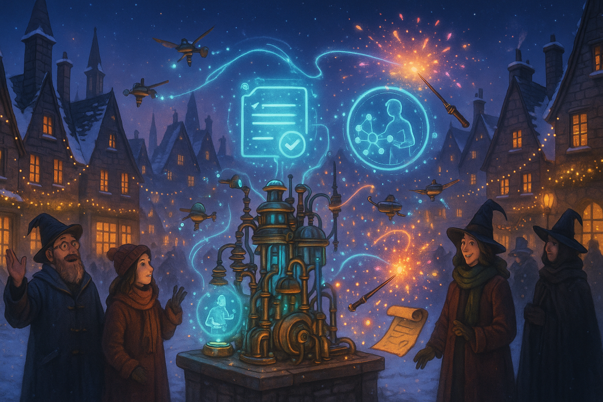

## **PROJECT IDENTIFICATION**

### **Project Title:** 
Hogsmeade Digital Commune

### **Project Type:** 
Hybrid

### **Scale:** 
Neighborhood

### **Timeline:** 
Medium-term (2-3 years)

### ISO37101 mapping for 'Hogsmeade community digital transformation project.'

#### Scores

|   Score | Purpose                                     | Issue                                          | Justification                                                                                                                                                                                                                                                                                                              |
|--------:|:--------------------------------------------|:-----------------------------------------------|:---------------------------------------------------------------------------------------------------------------------------------------------------------------------------------------------------------------------------------------------------------------------------------------------------------------------------|
|       5 | Attractiveness                              | Living and working environment                 | The project aims to enhance Hogsmeade's appeal by upgrading its technological infrastructure while preserving its historic charm. This dual focus on modernity and tradition creates an attractive environment that caters to both residents and potential visitors, enhancing quality of life and economic opportunities. |
|       4 | Preservation and improvement of environment | Living and working environment                 | The project seeks to incorporate advanced technologies that facilitate improved safety and efficiency, which indirectly contributes to maintaining the community's environment by promoting responsible resource management and reducing negative impacts.                                                                 |
|       5 | Resilience                                  | Safety and security                            | By enhancing the substation's operational efficiency and ensuring faster incident response times, the project bolsters the community's resilience against technological breakdowns and security threats. This proactive approach improves the overall safety of the neighborhood.                                          |
|       4 | Responsible resource use                    | Community smart infrastructures                | The integration of smart technology into local infrastructure exemplifies responsible resource use, as it emphasizes efficiency and sustainability. By modernizing the substation, the community can better manage energy and digital resources, minimizing waste.                                                         |
|       5 | Social cohesion                             | Education and capacity building                | The project fosters social cohesion by engaging residents in community discussions and educational workshops. By empowering community members with technological knowledge, it encourages collective ownership and collaboration, strengthening local bonds.                                                               |
|       4 | Well-being                                  | Health and care in the community               | The project enhances overall well-being by creating a safer, more informed community that is equipped with modern tools and technology. The focus on educational initiatives promotes mental and physical health through increased community participation and safety.                                                     |
|       4 | Attractiveness                              | Culture and community identity                 | The project carefully balances modernization with the preservation of Hogsmeade’s unique cultural identity, making it attractive to both current residents and potential visitors by showcasing local traditions alongside technological advancements.                                                                     |
|       4 | Resilience                                  | Living and working environment                 | By modernizing the local infrastructure, the project demonstrates resilience in adapting to changing technological landscapes, thereby ensuring that community functions can continue without disruption.                                                                                                                  |
|       4 | Social cohesion                             | Living together, interdependence and mutuality | The project encourages interdependence amongst community members through workshops and collaborative initiatives, fostering a sense of mutual support and shared responsibility in the face of technological advancements.                                                                                                 |
|       5 | Well-being                                  | Governance, empowerment and engagement         | The emphasis on community engagement and transparent governance allows residents to have a say in the digital transformation process, contributing to their sense of ownership and well-being within the community.                                                                                                        |

## **CONTEXTUAL FOUNDATION**

### **Specific Local Challenge Addressed:**
The initiated project aims to address the evolving technological needs of Hogsmeade while enhancing the community's safety and operational efficiencies. The existing substation has likely remained static in terms of technological advancement, limiting the town's capacity for rapid incident detection, maintenance, and operational standards. The digital transformation will facilitate faster response times to outages and security breaches, making the community more resilient and secure in a world that increasingly relies on digital empowerment. Moreover, aligning these upgrades with the local context ensures that the town’s charm and heritage are preserved while modernizing its infrastructure. 

### **Local Assets Leveraged:**
Hogsmeade has a rich history and a strong sense of community, characterized by its quaint architecture and localized commerce. The successful local businesses, community gathering spots, and the iconic presence of the wizarding community provide formidable assets upon which to build. Leveraging local traditions of collaboration and mutual support, this project can weave in the virtues of community engagement, bringing together stakeholders from various sectors to drive this initiative.

### **Cultural/Social Fit:**
Hogsmeade’s unique character thrives on the balance of tradition and innovation. The community values its history, yet it simultaneously cherishes advancements that enhance its residents' quality of life. The Hogsmeade Digital Commune project resonates with the local ethos of growth and safety, allowing residents to embrace new tools while consulting existing customs and craftsmanship.

## **PROJECT DESCRIPTION**

### **Core Concept:**
The Hogsmeade Digital Commune aims to digitally transform the city’s substation into a community-centered technological hub, where automated systems enhance safety and operations without compromising the town's identity. By integrating advanced communication technologies and fostering a collaborative environment for both residents and businesses, the project seeks to create a digitally-savvy destination while retaining Hogsmeade’s charm.

### **Key Components:**
1. **Infrastructure Enhancement:** Redesigned substation facilities will incorporate sleek, invisible technology. This will include upgraded communication systems for automated incident responses, allowing maintenance staff to address issues swiftly to ensure public safety.
2. **Community Engagement Initiatives:** Workshops and informational series will be offered for residents and local businesses, educating them on cybersecurity, technology best practices, and the importance of community safety. This to foster not just understanding but also communal ownership over the technology.
3. **Partnership with Local Institutions:** Cooperation with local schools and community organizations will be essential. Digital tools can enhance learning experiences, providing access to tools that benefit both academic engagement and community cohesion.

### **Implementation Approach:**
- **Phase 1:** Immediate actions will include a community forum to gather inputs from residents about their needs, concerns, and ideas for the digital transformation. Early designs and concepts will be shared for public review while forming partnerships with local educators and tech-focused organizations.
- **Phase 2:** Building momentum will involve initiating small-scale community tech workshops, digital safety initiatives, and pilot tests of new substation technology. Residents will actively participate in programming, allowing them to utilize the upgrades firsthand and suggest improvements.
- **Phase 3:** Full realization will encompass the comprehensive unveiling of the upgraded substation and the established educational programming. The data collected will be analyzed, ensuring continuous feedback loops, guiding adjustments to the project as the community grows and evolves.

## **STAKEHOLDER ECOSYSTEM**

### **Champions:** 
Key community leaders, such as the mayor, local business owners, and school administrators, will be critical in advocating for and advancing the project. Their established relationships within the community can enhance buy-in for the initiative.

### **Partners:** 
Engagement with local tech firms, educational institutions, cybersecurity experts, and non-profits focused on community welfare. These partnerships will provide necessary expertise and resources while promoting technology literacy among the residents.

### **Beneficiaries:** 
The entire Hogsmeade community will benefit from increased safety, improved technology literacy, and a sense of ownership over local developments. Residents will feel empowered, while small businesses will have increased operational efficiency.

### **Potential Opposition:** 
Some might resist due to fears of technological overreach, costs, or disruptions during the implementation process. Addressing these concerns will involve transparency throughout the project phases and providing clear communication on benefits and support structures.

## **FEASIBILITY & IMPACT**

### **Success Indicators:**
- **Quantitative metric:** Reduction in response time to incidents reported through the new system by 50% within the first year of rollout.
- **Qualitative metric:** Positive feedback from community workshops will be gathered, aiming for at least 80% satisfaction from participants.
- **Community-defined metric:** The creation of a resident-led tech advisory committee that reflects the community’s voice in future tech interventions.

### **Ripple Effects:** 
The initiative could inspire local businesses to adopt digital tools, thus improving trade and collaboration. Additionally, Hogsmeade may become a model for other towns grappling with similar technological challenges, promoting engagement and resilience.

### **Risk Mitigation:** 
The primary risk lies in ensuring technology does not overshadow local culture. Regular community consultations and reviews will help align the project with local norms and aesthetics, safeguarding Hogsmeade’s character throughout the process.

## **LOCAL ADAPTATION NOTES**

### **What makes this project uniquely suited to this place:**
The blend of traditional community ties with emerging technologies is uniquely suited to Hogsmeade, a place where history and modernity can coexist. The small size of the community also allows for more personalized engagement and feedback, ensuring that local identity remains central to project development.

### **How locals would likely describe this project in their own words:**
"Hogsmeade Digital Commune is all about bringing our town up to speed with the times without losing what makes us special. It’s a place where we can learn together, stay safe, and keep our charm while embracing the future!"