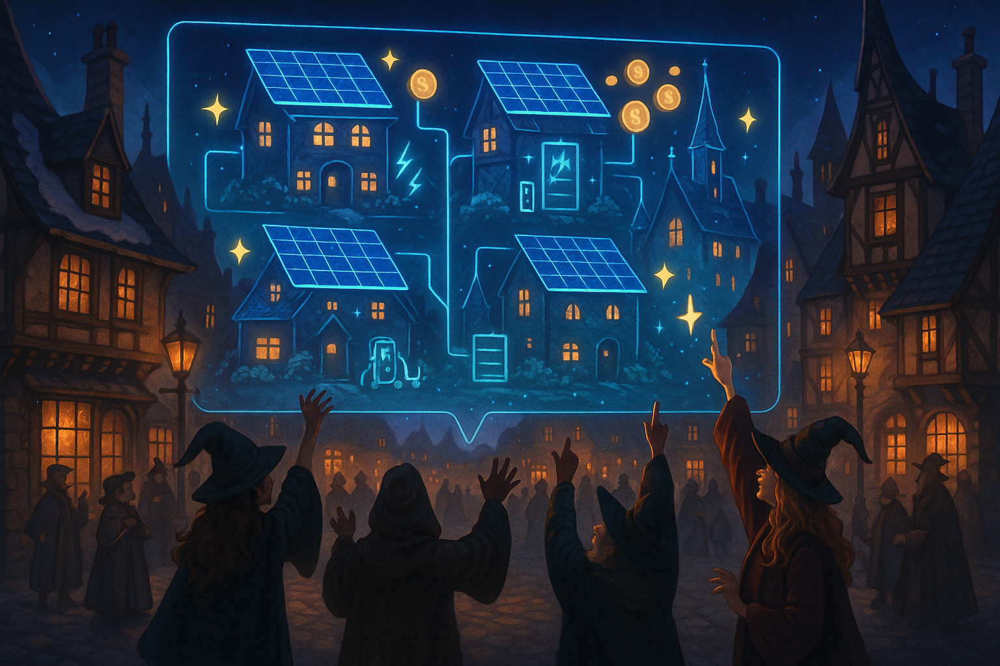

## **PROJECT IDENTIFICATION**

### **Project Title:**
Hogsmeade Harmony Hub

### **Project Type:**
Environmental and Economic Development

### **Scale:**
Neighborhood

### **Timeline:**
Medium-term (2-3 years)

### ISO37101 mapping for 'Sustainable energy community initiative.'

#### Scores

|   Score | Purpose                                     | Issue                                              | Justification                                                                                                                                                                                                                                                                                                                                                         |
|--------:|:--------------------------------------------|:---------------------------------------------------|:----------------------------------------------------------------------------------------------------------------------------------------------------------------------------------------------------------------------------------------------------------------------------------------------------------------------------------------------------------------------|
|       5 | Attractiveness                              | Culture and community identity                     | The Hogsmeade Harmony Hub enhances the community's cultural identity by fostering collaboration among residents and promoting sustainability practices linked to local traditions. By creating a shared energy community that resonates with the existing cultural values, the project not only addresses environmental concerns but also strengthens community ties. |
|       4 | Preservation and improvement of environment | Biodiversity and ecosystem services                | The initiative is designed to optimize energy usage, which can lead to reduced greenhouse gas emissions and a lower environmental impact. By focusing on sustainable practices and community engagement, the project contributes positively to ecological stewardship and corridor preservation, even though its primary focus is on energy management.               |
|       5 | Resilience                                  | Governance, empowerment and engagement             | The project involves residents actively in monitoring and managing their energy consumption through a digital twin platform. This empowers the community to adapt to energy challenges and engages them in the governance of sustainability practices, supporting resilience in the face of rising utility costs.                                                     |
|       4 | Responsible resource use                    | Economy and sustainable production and consumption | By creating economic opportunities through the optimization of energy use and promoting local self-sufficiency, the Hogsmeade Harmony Hub encourages responsible consumption patterns. It taps into local technology firms and energy providers which further supports sustainable practices.                                                                         |
|       5 | Social cohesion                             | Living together, interdependence and mutuality     | The project encourages interaction among residents through community workshops, collaborative energy events, and competitions. This cultivates a strong sense of belonging and mutual support, reinforcing social bonds and inclusivity within the neighborhood.                                                                                                      |
|       4 | Well-being                                  | Health and care in the community                   | Improving energy management contributes to better living conditions by potentially lowering energy costs and enhancing financial well-being. The community's engagement in energy-saving practices translates to both physical and mental health improvements through shared achievements and reducing environmental stressors.                                       |
|       4 | Attractiveness                              | Living and working environment                     | The initiative aims to create a vibrant energy community that enhances the quality of living conditions in Hogsmeade. Providing training and creating a digital platform contribute to a more attractive living and working environment for residents.                                                                                                                |
|       5 | Well-being                                  | Education and capacity building                    | The workshops and training programs within the Hogsmeade Harmony Hub provide residents with the skills and knowledge necessary to manage their energy efficiently. This not only educates the community but also fosters confidence and enhances the overall quality of life.                                                                                         |

## **CONTEXTUAL FOUNDATION**

### **Specific Local Challenge Addressed:**
Hogsmeade boasts a picturesque environment with a rich community spirit, yet like many places, its residents face challenges related to energy management and sustainability. The traditional methods of energy consumption are no longer viable when considering rising utility costs and the urgent need for climate action. The local challenge lies in equipping residents with the tools and knowledge to optimize their energy usage while also creating economic opportunities through innovative practices. The description highlights a pilot project utilizing a digital twin interface to aid in visualizing energy systems, showcasing a model that could foster enhanced engagement and autonomy among residents.

### **Local Assets Leveraged:**
Hogsmeade is characterized by its committed community members, existing green spaces, and a strong cultural identity rooted in collaboration and sustainability. The idea of creating a shared energy community resonates deeply with its inhabitants, who are already inclined towards initiatives that promote local self-sufficiency. This project will harness existing technological ventures and community engagement strategies, amplifying their impact through shared resources and knowledge.

### **Cultural/Social Fit:**
The Hogsmeade Harmony Hub aligns with the town's values of community engagement and sustainability. It respects the historical essence of Hogsmeade while enhancing its modern-day relevance. This initiative fosters collaboration among residents, promoting a shared sense of responsibility for the environment and demonstrating that collective efforts can yield financial and ecological benefits. In essence, it enhances the town's participatory ethos and supports local traditions of neighborly cooperation.

## **PROJECT DESCRIPTION**

### **Core Concept:**
The Hogsmeade Harmony Hub aims to bridge technology and community spirit by creating a localized energy platform where residents can visualize energy usage, optimize their smart devices, and monetize their energy flexibility. This digital twin system will serve not just as a tool for individual households but also as a shared asset for the Hogsmeade community, creating a vibrant hub for energy awareness and collaboration.

### **Key Components:**
1. **Digital Twin Platform:** A user-friendly interface that allows residents to monitor and simulate their energy consumption in real-time, providing insights into how they can shift usage patterns for monetary rewards. This platform will be tailored specifically to Hogsmeade’s architectural styles and energy needs.
   
2. **Workshops and Training Programs:** A series of workshops aimed at educating residents on how to use the digital twin interface effectively, understanding energy flexibility, and learning about financial incentives available for energy conservation and usage shifts. These workshops will foster community engagement and encourage local leaders to share their experiences.

3. **Collaborative Energy Events:** Regular community gatherings and competitions that encourage residents to compete in energy-saving challenges, track their savings, and celebrate milestones. These events will showcase successful energy-saving strategies and build camaraderie, transforming energy management into a source of community pride.

### **Implementation Approach:**
- **Phase 1:** Launch a community awareness campaign to inform residents about the benefits of the digital twin platform. Initiate outreach through local newsletters, social media, and community gathering spots to gather initial interest.
  
- **Phase 2:** Develop the digital twin interface with feedback from the community to ensure it addresses their needs. Begin training sessions to equip residents with the necessary skills to utilize the platform effectively. Establish local energy champions—residents who can facilitate workshops and drive engagement.
  
- **Phase 3:** Roll out the full version of the Hogsmeade Harmony Hub, including the digital platform and regular community events. Work with local businesses and energy providers to enhance economic opportunities and gather data for continuous improvement.

## **STAKEHOLDER ECOSYSTEM**

### **Champions:**
The initiative will be driven by a coalition of local leaders, including members from the town council, community organizations, and enthusiastic residents known for their commitment to sustainability and energy efficiency.

### **Partners:**
Collaboration with local technology firms specializing in smart energy solutions, regional energy providers, educational institutions for workshop facilitation, and environmental organizations to ensure comprehensive support and expertise.

### **Beneficiaries:**
Every household in Hogsmeade stands to benefit from the initiative through reduced energy bills, improved awareness of energy efficiency, and engaging community events. The platform will not only save money but will also contribute to a sense of collective achievement.

### **Potential Opposition:**
Some residents may be skeptical about adopting new technology or altering their energy practices, fearing complexity or costs involved. To address these concerns, the initiative will prioritize accessibility and transparency, providing clear benefits and ongoing support to all participants.

## **FEASIBILITY & IMPACT**

### **Success Indicators:**
- **Quantitative metric:** A target of at least a 25% increase in participation among households actively using the digital twin platform within the first year.
- **Qualitative metric:** Resident feedback collected through self-reported surveys reflecting their understanding of energy management and satisfaction with community engagement.
- **Community-defined metric:** Establishing a community energy savings goal, such as saving a specific amount of kilowatt-hours collectively by the end of the second year.

### **Ripple Effects:**
The initiative could serve as a model for other communities looking to adopt similar practices, encouraging regional collaboration on sustainability and energy efficiency. Additionally, enhanced engagement may lead to broader initiatives addressing water conservation or local food systems.

### **Risk Mitigation:**
The primary risk of technology adoption failure can be mitigated by ensuring robust training and continuous resident support. Frequent check-ins and community feedback mechanisms will help adapt the platform to local needs and encourage ongoing participation.

## **LOCAL ADAPTATION NOTES**

### **What makes this project uniquely suited to this place:**
Hogsmeade's existing community structures, social networks, and cultural appreciation for sustainability make it an ideal testing ground for the Hogsmeade Harmony Hub. Unlike more fragmented urban areas, the close-knit nature of Hogsmeade allows for communal experimentation and collaboration, making residents more receptive to innovative solutions.

### **How locals would likely describe this project in their own words:**
“It’s like we’re taking charge of our electricity together! The Harmony Hub will not just help us save money; it’ll bring us closer as neighbors while making Hogsmeade greener and more self-sufficient.” 

Through this project, Hogsmeade can foster a sense of unity, align collective practices with environmental goals, and ultimately elevate everyone’s quality of life.