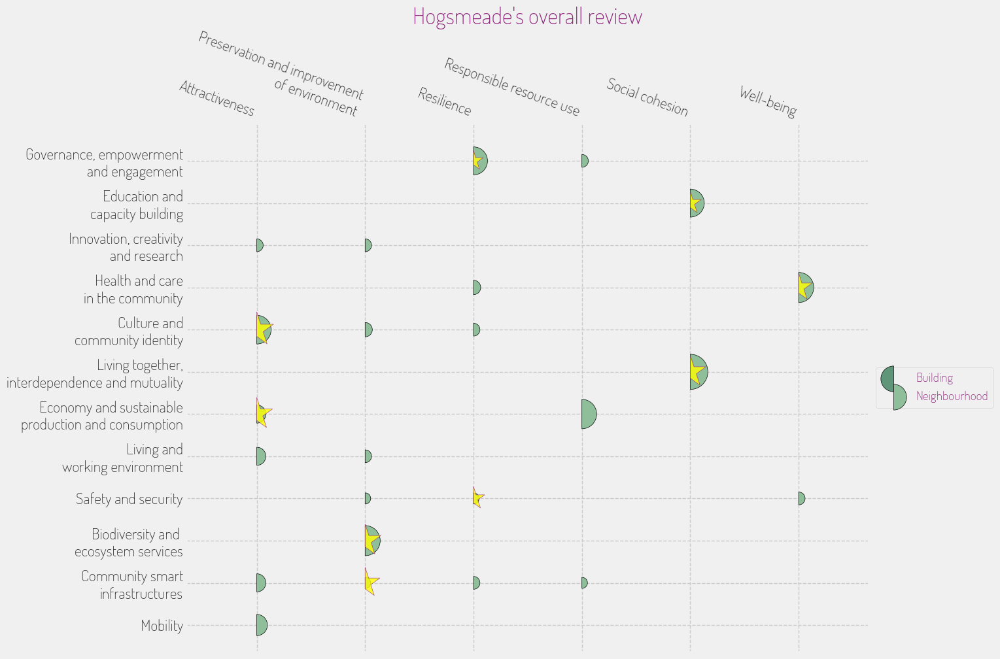

## **INITIATIVE PORTFOLIO**

### **Initiative #1: Weather-Resilient Community Hub**

**Category:** Community Safety & Resilience  
**Scale:** Neighborhood  
**Lead Stakeholder Type:** Local Government / Community Group  
**Timeline:** Immediate (< 6 months)  

**What it is:** Establish a center at the village square that provides resources and training for residents on emergency preparedness vis-à-vis severe winter storms, including workshops on preserving heat, food storage, and safe magical practices.   

**Why here:** Given Hogsmeade's long winters and the potential impact on residents' quality of life, a dedicated hub can help mitigate risks and increase community safety in the face of climate challenges.  

**Who benefits most:** Residents who may struggle to adapt to harsh weather conditions, particularly low-income families.  

**Quick win or deep change:** Quick win  
**Estimated complexity:** Simple  

### **Initiative #2: Eco-Friendly Waste Management Program**

**Category:** Green Space & Environment  
**Scale:** Neighborhood  
**Lead Stakeholder Type:** Local Government / Non-profit Partnership  
**Timeline:** Short (1 year)  

**What it is:** Implement a comprehensive waste reduction initiative that encourages both residents and businesses to adopt sustainable waste management practices, such as composting workshops and recycling campaigns specifically tailored for magical residues.  

**Why here:** To address the environmental challenges tied to increasing tourism and promote eco-friendly practices that fit within the community's unique magical context, thereby protecting the Hogsmeade River and natural surroundings.  

**Who benefits most:** All residents, especially those concerned about maintaining the village’s ecological integrity.  

**Quick win or deep change:** Systems change  
**Estimated complexity:** Moderate  

### **Initiative #3: Magical Artisans’ Market**

**Category:** Economic Development & Local Business  
**Scale:** District  
**Lead Stakeholder Type:** Community Group / Local Businesses  
**Timeline:** Medium (2-3 years)  

**What it is:** Launch a seasonal artisans’ market that showcases local craftsmanship, inviting artisans and small businesses to sell their magical wares, thus boosting the local economy while fostering a sense of community pride and identity.  

**Why here:** Hogsmeade has a rich tradition of local crafts and business, and this initiative would directly support local artisans while reducing reliance on commercial tourism.  

**Who benefits most:** Local artisans and craftsmen, along with visitors seeking authentic experiences.  

**Quick win or deep change:** Both  
**Estimated complexity:** Moderate  

### **Initiative #4: Hogsmeade Heritage Preservation Committee**

**Category:** Arts, Culture & Heritage  
**Scale:** Neighborhood  
**Lead Stakeholder Type:** Community Group / Local Government  
**Timeline:** Short (1 year)  

**What it is:** Form a committee dedicated to preserving Hogsmeade's cultural heritage by organizing events, educational programming, and restoration projects for historical buildings, actively involving residents in heritage celebration.  

**Why here:** This initiative aims to counteract fears of commercialization and ensure that the unique character of Hogsmeade is maintained and celebrated, reflecting the wishes of long-time residents.  

**Who benefits most:** Long-standing residents and history enthusiasts.  

**Quick win or deep change:** Quick win  
**Estimated complexity:** Moderate  

### **Initiative #5: Wizarding Skills Development Workshops**

**Category:** Education & Skills  
**Scale:** Neighborhood  
**Lead Stakeholder Type:** Local Community Center / Academic Institution  
**Timeline:** Medium (2-3 years)  

**What it is:** Offer workshops and classes to teach various skills ranging from potion-making to wand care, engaging residents and providing opportunities for youth to gain knowledge that enhances their employability within the wizarding economy.  

**Why here:** Young residents often leave for larger cities for better opportunities, and this initiative keeps them engaged and connected to their community with skills that can lead to jobs locally.  

**Who benefits most:** Young residents and aspiring artisans.  

**Quick win or deep change:** Deep change  
**Estimated complexity:** Complex  

### **Initiative #6: Enchanted Green Spaces Project**

**Category:** Green Space & Environment  
**Scale:** Neighborhood  
**Lead Stakeholder Type:** Non-profit / Local Government  
**Timeline:** Short (1 year)  

**What it is:** Enhance existing parks with magical landscaping features that promote community gathering and interaction while also incorporating native flora that attracts local wildlife, thus fostering an ecological balance.  

**Why here:** Hogsmeade already has a commitment to environmental justice, and improving communal green spaces directly enhances the quality of life while supporting biodiversity.  

**Who benefits most:** Families, children, and wildlife.  

**Quick win or deep change:** Quick win  
**Estimated complexity:** Simple  

### **Initiative #7: Magic-in-Motion Public Transit System**

**Category:** Mobility & Transportation  
**Scale:** City-wide  
**Lead Stakeholder Type:** Public-Private Partnership  
**Timeline:** Long (3+ years)  

**What it is:** Develop a public transport system utilizing magical means that is accessible, efficient, and eco-friendly, allowing residents and visitors to easily navigate Hogsmeade and surrounding regions without contributing to congestion.  

**Why here:** This initiative will address mobility challenges posed by rising tourism and seasonal traffic, improving accessibility while respecting Hogsmeade's unique infrastructure.  

**Who benefits most:** Residents without private magical transport and tourists.  

**Quick win or deep change:** Deep change  
**Estimated complexity:** Complex  

## **PORTFOLIO OVERVIEW**

### **Interconnections:**
- **Weather-Resilient Community Hub** and **Eco-Friendly Waste Management Program** can complement each other by not only preparing the community for adverse events but also by creating sustainable waste systems that withstand climate impacts.
- The **Magical Artisans’ Market** can benefit from the **Wizarding Skills Development Workshops** as artisan skills can be honed in workshops and later showcased and sold at the market.

### **Sequencing Recommendation:**
Start with the **Weather-Resilient Community Hub** and **Eco-Friendly Waste Management Program** as immediate priorities to build community resilience and sustainability, creating a foundation for subsequent initiatives.

### **Coverage Check:**
- **Age groups served:** Children, Youth, Working Age, Seniors  
- **Economic spectrum:** Low-income, Middle-income, Market-rate, Mixed  
- **Spatial distribution:** Concentrated (village center) and Dispersed (community-wide initiatives)

### **Missing Voice:**
The initiatives may overlook the needs of non-human magical inhabitants (like magical creatures) that could be impacted by human-centered projects, as well as the perspectives of younger individuals who may feel their needs are not fully represented.