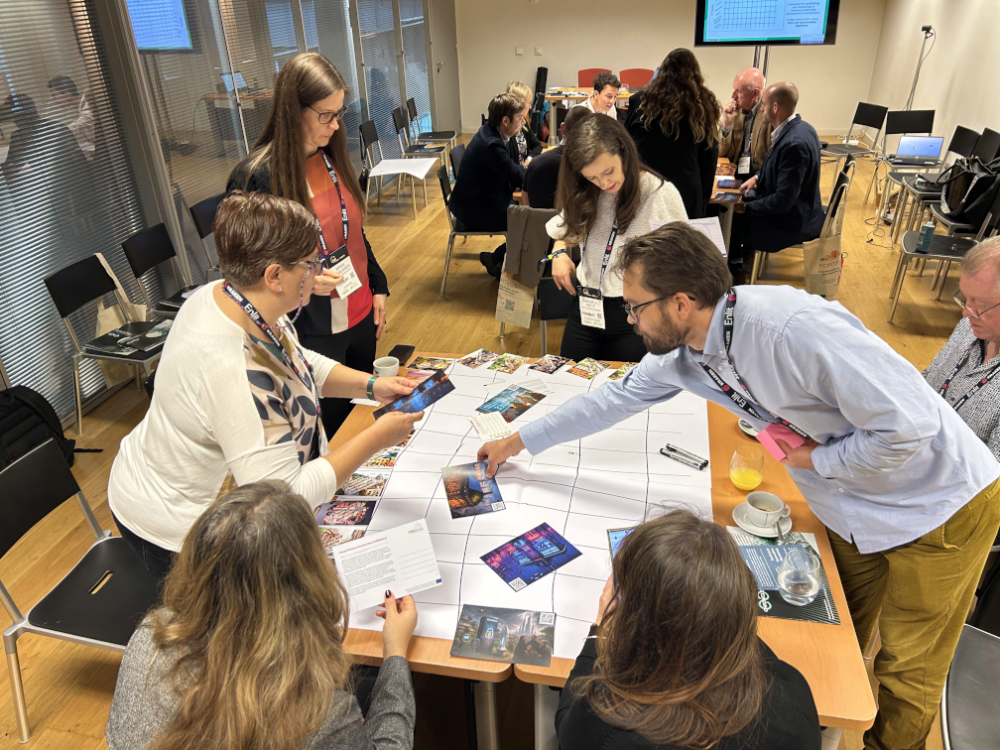

## **Placemaking Maptivity**

### A 90-minute sprint to redesign your neighbourhood

**What it is**
Placemaking Maptivity is a fast-paced, interactive workshop that helps communities map what they have and design what they need for more sustainable neighborhoods. In just 90 minutes, it transforms abstract sustainability concepts into a visual, hands-on experience where real change begins.

Built for anyone who lives, works, or cares about their city,  from teenagers to planners, residents to officials,  this workshop gets everyone collaborating on the same game board to discover gaps and opportunities hiding in plain sight.

**Why it exists**
Your city runs dozens of initiatives,  bike lanes, community programs, green spaces, youth services,  but they're often planned in isolation. Meanwhile, the best opportunities for transformation sit in the connections between them. Maptivity reveals these connections in record time, turning fragmented efforts into coordinated action while giving every voice in the room equal weight.

**How it works**
Think workshop meets strategy game meets community action. Participants gather around a large physical map or online board, working with cards representing real neighborhood projects and initiatives.

The game board itself is based on the **ISO 37101** framework for sustainable communities,  but don't worry, we translate the jargon. The board shows how city services (transport, education, housing) intersect with sustainability goals (resilience, social cohesion, resource efficiency).

Your 90-minute sprint flows through:

1. **Quick Build** (10 min) – Rapidly construct the game board together
2. **Reality Check** (20 min) – Map what actually exists in your area  
3. **Fill the Gaps** (20 min) – Brainstorm what's missing and what's needed
4. **Get Real** (10 min) – Sort ideas by impact and feasibility
5. **Make it Happen** (15 min) – Commit to concrete next steps

The remaining 15 minutes covers your introduction and icebreaker,  just enough to get comfortable before diving in.

**What makes it different**

* **Lightning fast**: 90 minutes from start to action plan,  no endless meetings
* **No experts needed**: If you use the neighborhood, you're qualified to improve it  
* **Bias toward action**: You leave with specific next steps, not just "awareness"
* **Visual and tangible**: See the gaps, spot the opportunities, understand the connections
* **Equal voices**: The format naturally balances dominant voices and quiet contributors

**Why it matters**
Most community consultations produce wish lists that gather dust. Placemaking Maptivity produces action champions,  people who leave knowing exactly what's missing, what's possible, and what they're going to do about it next week.

In 90 minutes, communities go from "someone should do something" to "here's what I'm doing next." It transforms sustainability from an abstract goal into specific, visible opportunities that real people can tackle.

## What you'll create

During the session, participants map existing initiatives and add new ideas directly onto the sustainability framework. Here's what a completed session might reveal:

# Acknowledgements

We gratefully acknowledge the funding support of the European Union Horizon 2020 research project PROBONO under grant agreement no. 101037075. Thank you to the PROBONO team.

# License

## CC by NC ND 

* © 2025  Mott MacDonald, Smart Innovation Norway  
* This work is licensed under the Creative Commons Attribution-NonCommercial-NoDerivatives 4.0 International License (CC BY-NC-ND 4.0).  
* https://creativecommons.org/licenses/by-nc-nd/4.0/

## In short

You are free to:
* Share,  copy and redistribute the material in any medium or format
* The licensor cannot revoke these freedoms as long as you follow the license terms.

Under the following terms:
* Attribution,  You must give appropriate credit , provide a link to the license, and indicate if changes were made . You may do so in any reasonable manner, but not in any way that suggests the licensor endorses you or your use.
* NonCommercial,  You may not use the material for commercial purposes .
* NoDerivatives,  If you remix, transform, or build upon the material, you may not distribute the modified material.
* No additional restrictions,  You may not apply legal terms or technological measures that legally restrict others from doing anything the license permits.

Notices:
* You do not have to comply with the license for elements of the material in the public domain or where your use is permitted by an applicable exception or limitation .
* No warranties are given. The license may not give you all of the permissions necessary for your intended use. For example, other rights such as publicity, privacy, or moral rights may limit how you use the material.