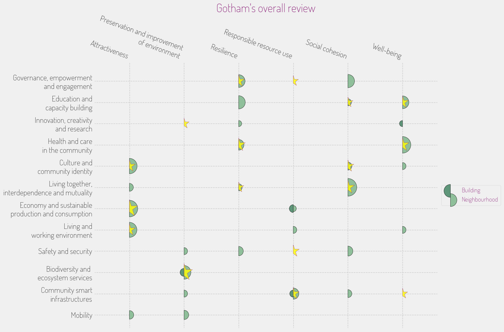

## **Placemaking Maptivity**

### A collaborative game for shaping sustainable neighbourhoods

**What it is**
Placemaking Maptivity is an interactive, map-based game that helps people imagine and plan better, greener neighbourhoods. It turns complex ideas about sustainability into something you can see, touch, and discuss together.

Designed for citizens, planners, developers, and local authorities, the Placemaking Maptivity is a way to bring everyone to the same table — literally — to explore what a “smart and sustainable” place could look like.

**Why it exists**
Cities today face huge sustainability challenges. Energy, transport, housing, green space, and social life are all connected, yet they’re often managed in silos. Maptivity bridges these gaps by helping different voices — experts and non-experts alike — find common ground and a shared vision for change.

**How it works**
The session feels like a creative workshop more than a meeting. Participants work around a large map or online board filled with cards representing real actions — such as creating a bike path, opening a community library, or improving building efficiency.

Each card links to broader sustainability goals drawn from the **ISO 37101** international framework — covering areas such as environment, well-being, social cohesion, and responsible resource use.
Through play, participants see how one small action can influence many aspects of urban life, and how collaboration leads to better results.

Workshops move through four phases:

1. **Discover** – learn the basics of sustainable placemaking.
2. **Map** – place cards and connect ideas.
3. **Synthesize** – visualize relationships and patterns.
4. **Act** – agree on priorities and next steps for real projects.

**What makes it different**

* **Playful but serious**: it’s a “serious game,” combining the creativity of play with the structure of professional planning.
* **Inclusive**: no technical expertise needed; everyone can contribute ideas.
* **Action-oriented**: each session ends with tangible insights and ideas for local improvement.
* **Grounded in standards**: it brings the ISO 37101 sustainability framework to life in everyday language and visuals.

**Why it matters**
By turning sustainability into something people can co-create, Placemaking Maptivity helps neighbourhoods move from fragmented efforts to coordinated transformation.
It empowers communities to understand their systems, connect their actions, and imagine futures that work — for people and the planet.

## An example

Following a game session, people will have place activitie and visions for their neighbourhoods. Here is an example of a report that could be generated automatically to summarize the outcomes of the session.

On this map, **stars** represent the Vision of the Place, and Circles represent Activities proposed to improve the sustainability of the neighbourhood.

A star aligned with a circle means that the activity contributes to achieving the vision.  When there's a circle but no star, it means the activity is beneficial but not directly linked to a specific vision.
Conversely, a star without a circle indicates a vision that currently lacks a supporting activity.

# Acknowledgements

We gratefully acknowledge the funding support of the European Union
Horizon 2020 research project PROBONO under grant agreement no.
101037075. Thank you to the PROBONO team.

# License

## CC by NC ND 

* © 2025  Mott MacDonald, Smart Innovation Norway  
* This work is licensed under the Creative Commons Attribution-NonCommercial-NoDerivatives 4.0 International License (CC BY-NC-ND 4.0).  
* https://creativecommons.org/licenses/by-nc-nd/4.0/

## In short

You are free to:
* Share — copy and redistribute the material in any medium or format
* The licensor cannot revoke these freedoms as long as you follow the license terms.

Under the following terms:
* Attribution — You must give appropriate credit , provide a link to the license, and indicate if changes were made . You may do so in any reasonable manner, but not in any way that suggests the licensor endorses you or your use.
* NonCommercial — You may not use the material for commercial purposes .
* NoDerivatives — If you remix, transform, or build upon the material, you may not distribute the modified material.
* No additional restrictions — You may not apply legal terms or technological measures that legally restrict others from doing anything the license permits.

Notices:
* You do not have to comply with the license for elements of the material in the public domain or where your use is permitted by an applicable exception or limitation .
* No warranties are given. The license may not give you all of the permissions necessary for your intended use. For example, other rights such as publicity, privacy, or moral rights may limit how you use the material.