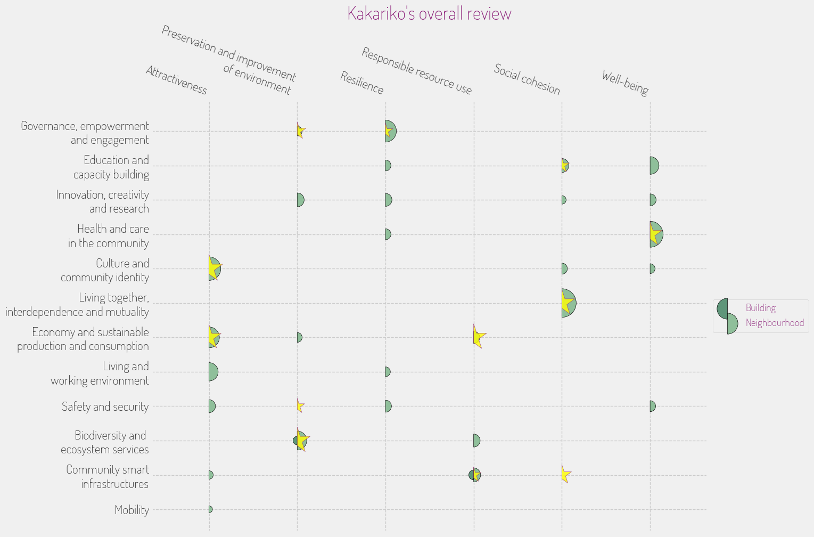

## **INITIATIVE PORTFOLIO**

### **Initiative #1: Community Flood Mitigation Plan**

**Category:** Community Safety & Resilience  
**Scale:** Neighborhood  
**Lead Stakeholder Type:** Public-Private Partnership  
**Timeline:** Immediate (< 6 months)  

**What it is:** This initiative involves the development of a community-led flood mitigation plan that includes installing permeable pavements, creating natural drainage systems, and enhancing green spaces to absorb rainwater. Workshops will train residents in adaptation techniques to protect their homes and community.  

**Why here:** Given Kakariko Village’s vulnerability to heavy rainfall and landslides, a localized flood mitigation strategy can safeguard both community safety and the natural environment, while retaining the village's aesthetic value.  

**Who benefits most:** Households in flood-prone areas, particularly those with low to middle-income residents.  

**Quick win or deep change:** Both  
**Estimated complexity:** Moderate  

### **Initiative #2: Landslide Awareness and Preparedness Program**

**Category:** Community Safety & Resilience  
**Scale:** Neighborhood  
**Lead Stakeholder Type:** Non-profit  
**Timeline:** Short (1 year)  

**What it is:** This program aims to educate residents and visitors about landslide risks through community workshops, informational signage, and a volunteer-led response team that can assist during extreme weather events.  

**Why here:** Kakariko’s mountainous terrain exposes residents to landslide risks, making it essential to cultivate awareness and preparedness within the community.  

**Who benefits most:** Local residents, particularly those living near steep slopes.  

**Quick win or deep change:** Quick win  
**Estimated complexity:** Simple  

### **Initiative #3: Artisan Market Revitalization Project**

**Category:** Economic Development & Local Business  
**Scale:** Neighborhood  
**Lead Stakeholder Type:** Community Group  
**Timeline:** Medium (2-3 years)  

**What it is:** This project will revitalize the local artisan market by providing spaces for local craftsmen to showcase and sell their products, alongside workshops that promote local craftsmanship and sustainable production methods.  

**Why here:** Kakariko's rich traditions in craftsmanship are a unique asset that can enhance economic activity while reinforcing cultural identity.  

**Who benefits most:** Local artisans, small business owners, and tourists looking for local goods.  

**Quick win or deep change:** Both  
**Estimated complexity:** Moderate  

### **Initiative #4: Green Corridor Development**

**Category:** Green Space & Environment  
**Scale:** District  
**Lead Stakeholder Type:** Government  
**Timeline:** Long (3+ years)  

**What it is:** This initiative focuses on creating a green corridor that connects various parks and natural areas in Kakariko, promoting biodiversity, enhancing scenic routes for walking and cycling, and improving stormwater management.  

**Why here:** This effort aligns with the village’s commitment to sustainable transport and environmental health, while enhancing recreational opportunities for residents.  

**Who benefits most:** All residents, particularly families and nature enthusiasts.  

**Quick win or deep change:** Deep change  
**Estimated complexity:** Complex  

### **Initiative #5: Multi-Generational Community Center Programming**

**Category:** Social Services & Health  
**Scale:** Neighborhood  
**Lead Stakeholder Type:** Non-profit  
**Timeline:** Short (1 year)  

**What it is:** This initiative will expand programming at the community center to include intergenerational activities, wellness workshops, and mental health support sessions focused on community building and individual well-being.  

**Why here:** Strengthening community ties and supporting mental health aligns with Kakariko’s strong sense of community and intergenerational values, addressing the pressure points highlighted in community feedback.  

**Who benefits most:** Seniors, children, and families.  

**Quick win or deep change:** Both  
**Estimated complexity:** Moderate  

### **Initiative #6: Cultural Heritage Trails Project**

**Category:** Arts, Culture & Heritage  
**Scale:** City-wide  
**Lead Stakeholder Type:** Public-Private Partnership  
**Timeline:** Medium (2-3 years)  

**What it is:** Develop a series of heritage trails that guide residents and tourists through Kakariko’s historical and cultural landmarks, integrating storytelling elements that highlight local legends and traditions.  

**Why here:** This initiative honors Kakariko’s rich cultural heritage while attracting sustainable tourism, creating meaningful experiences that deepen visitors’ understanding of the village’s identity.  

**Who benefits most:** Tourists, local guides, and residents interested in local history.  

**Quick win or deep change:** Both  
**Estimated complexity:** Moderate  

### **Initiative #7: Farm-to-Table Community Dinner Series**

**Category:** Food Systems  
**Scale:** Neighborhood  
**Lead Stakeholder Type:** Community Group  
**Timeline:** Short (1 year)  

**What it is:** Launch a series of community dinners where local farms provide ingredients, fostering connections between farmers and residents while highlighting Kakariko’s agricultural heritage and promoting healthy eating practices.  

**Why here:** Connecting the community through food not only supports local agriculture but also enhances social cohesion, aligning with Kakariko's community-centric values.  

**Who benefits most:** Local farmers, residents, and families.  

**Quick win or deep change:** Quick win  
**Estimated complexity:** Simple  

## **PORTFOLIO OVERVIEW**

### **Interconnections:**
The Community Flood Mitigation Plan can work in tandem with the Green Corridor Development by ensuring that green spaces are designed to handle stormwater effectively. Additionally, the Cultural Heritage Trails Project could integrate pathways created by the Green Corridor, promoting both local history and sustainable transport.

### **Sequencing Recommendation:**
Initiatives 1 and 2 should start first due to the immediate risks posed by flooding and landslides. Addressing these safety concerns will lay a solid foundation for the other initiatives to thrive.

### **Coverage Check:**
- **Age groups served:** Children, Youth, Working Age, Seniors  
- **Economic spectrum:** Low-income, Middle-income, Market-rate  
- **Spatial distribution:** Concentrated (focus on community center and artisan market)

### **Missing Voice:**
While the above initiatives cover various aspects of community development, the specific needs and voices of transient workers in tourism and seasonally employed individuals in Kakariko could still be overlooked, which may affect their integration into the community and access to services.