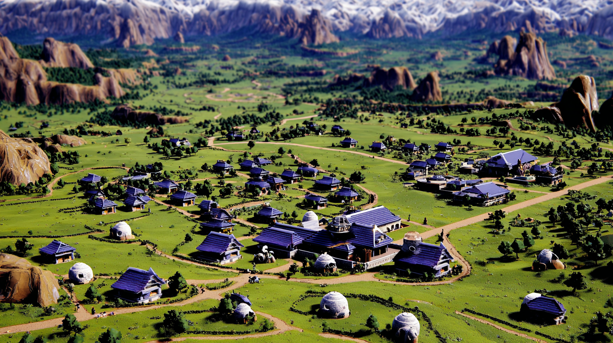

## NEIGHBORHOOD/CITY TO ANALYZE: Kakariko Village

### Overview & Sustainability Profile

#### **Neighborhood Snapshot**

Kakariko Village is a serene hamlet characterized by its rich traditions and stunning natural surroundings, nestled in a valley beneath towering mountains. The village serves as both a sanctuary for weary travelers and a crucial linkage point between sacred lands and eerie, haunted regions. Steeped in legend, Kakariko preserves its cultural heritage while facing modern challenges, making it an intriguing subject for urban analysis. 

Geographically, Kakariko occupies a unique location that combines rugged mountainous terrain with lush valleys. This environment fosters a distinctive habitat rich in biodiversity, but it also exposes the village to specific climate risks, such as landslides and increased rainfall. 

Three defining characteristics of Kakariko Village are: **(1)** its adherence to traditional craftsmanship, reflected in its architecture and artisanal goods; **(2)** the strong sense of community where intergenerational ties are valued, and **(3)** the coexistence of the spiritual and supernatural within daily life, impacting both cultural practices and local tourism initiatives.

The physical character of Kakariko is marked by narrow, winding streets, stone cottages adorned with vibrant flowers, and communal spaces that promote interaction. The blend of old-world charm with modern amenities creates both an inviting and complex living environment.

#### **Sustainability & Resilience**

**Environmental Assets & Challenges:**  
Kakariko Village boasts several environmental assets, including rich biodiversity and natural resources such as clean water from mountain springs. However, it faces significant challenges, notably its vulnerability to climate change impacts like heavy rains that lead to soil erosion. The presence of well-established green spaces contributes positively to resident well-being and biodiversity, yet the lack of proper drainage and flood management systems remains a critical issue.

**Sustainable Development Activity:**  
Efforts toward sustainability in Kakariko include initiatives to promote **green buildings** that utilize local materials and traditional building techniques, ensuring minimal environmental impact. Movement towards **sustainable transport** options, such as designated walking paths and bicycle lanes, is underway, aiming to reduce reliance on vehicles. 

The village also encourages a **circular economy** by supporting local artisans who produce goods from recycled materials, fostering both economic stability and environmental consciousness.

**Climate Action & Adaptation:**  
Kakariko has established itself as a site for **resilience hubs** where community members can access resources during extreme weather events. Local leaders have initiated programs focusing on **energy transition**, promoting the use of renewable energy sources, including solar panels for community buildings. Despite progress, challenges remain in securing funding for comprehensive **nature-based solutions** in landscape management.

**Environmental Justice Indicators:**  
Kakariko confronts disparities in environmental access. The quality of green spaces varies significantly across neighborhoods, and some residents express concerns regarding pollution and resource allocation. However, ongoing dialogue between community organizations and municipal officials indicates a collective commitment to environmental justice.

### **Economic Drivers & Market Forces**

#### **Economic Ecosystem**

**Employment Landscape:**  
The economic landscape of Kakariko Village is diverse, heavily influenced by tourism, agriculture, and traditional craftsmanship. Employment rates have remained stable, with approximately **60%** of the population engaged in these sectors. Seasonal peaks in visitor numbers significantly boost local businesses, creating temporary jobs that support economic fluctuation.

**Business Dynamics:**  
Local businesses thrive on collaboration. Artisan shops and family-owned restaurants form a supportive network, often sourcing ingredients and materials from nearby farms and vendors. This cooperative model enhances the village's economic fabric, fostering a sense of community ownership and pride.

**Real Estate Market:**  
The real estate market in Kakariko is trending positively, though prices remain relatively accessible compared to larger urban areas. Recent developments include new residential areas aimed at accommodating families while preserving the village’s character. Market indicators show a growing demand for both vacation rentals and permanent residences, fueling economic growth.

**Economic Transformation Signals:**  
There are signs of an economic transformation fueled by increased interest in sustainable tourism and ecological preservation, leading to new business opportunities focused on wellness and eco-tours. Stakeholders are exploring ways to leverage the village's natural beauty to create year-round opportunities rather than relying solely on peak seasons.

**Fiscal Health:**  
Kakariko's fiscal health is improving, attributed to a balanced budget approach that prioritizes essential services such as education and public safety. Collaborations between local government and businesses aim to stimulate economic development while maintaining transparency and community involvement.

### **People & Community Dynamics**

#### **Demographic Composition**

**Population Trends:**  
The population of Kakariko Village is approximately **2,500**, with steady growth over the past decade. This growth is encouraged by its reputation as a safe and family-friendly place to live. 

**Cultural Diversity:**  
Kakariko prides itself on its cultural richness, featuring influences from various backgrounds through generations. Community events, such as seasonal festivals celebrating tradition and art, evoke a spirit of inclusivity. 

#### **Social Infrastructure**

**Community Assets:**  
Key community assets include the village’s community center, used for gatherings and educational programs, and local parks that promote interaction among residents. Additionally, Kakariko possesses a rich tapestry of local organizations focusing on preservation, youth engagement, and social welfare, enabling effective support systems.

**Social Networks:**  
Strong community ties create an informal yet effective support network, facilitating aid during emergencies and promoting social cohesion. Residents take pride in helping one another, leading to a high level of engagement and volunteerism.

#### **Movement & Stability**

**Migration Patterns:**  
Recent years have seen an influx of younger families attracted to Kakariko's peaceful lifestyle. This demographic shift presents both opportunities for innovation and challenges regarding infrastructure strain.

**Daily Rhythms:**  
The rhythms of daily life illustrate how integral the community is to Kakariko. Pockets of activity fill the village at varying times, from morning markets to evening gatherings, indicating that residents prioritize connection over isolation.

#### **Community Tensions & Aspirations**

**Pressure Points:**  
Despite its advantages, Kakariko faces **pressure points**, especially in balancing tradition with modernization. Some residents express concern over new developments that may disrupt the village’s historical charm.

**Collective Vision:**  
The community’s collective vision focuses on preserving Kakariko’s character while providing opportunities for sustainable growth. Together, residents strive to shape a future that honors their heritage and meets contemporary needs.

#### **Social Cohesion Indicators**  
Overall, Kakariko Village exhibits strong social cohesion, with high levels of neighborly support and civic involvement. Community surveys reveal that nearly **85%** of residents feel satisfied with their quality of life and are committed to helping improve the village for future generations.

In conclusion, Kakariko Village depicts a vibrant community with a strong commitment to sustainability, economic continuity, and cultural preservation. Through constructive engagement and responsive governance, it can navigate the challenges of change while reinforcing its unique identity.

### ISO37101 mapping for 'Kakariko Village: tradition, sustainability, community.'

#### Scores

|   Score | Purpose                                     | Issue                                              | Justification                                                                                                                                                                                                                                                                                           |
|--------:|:--------------------------------------------|:---------------------------------------------------|:--------------------------------------------------------------------------------------------------------------------------------------------------------------------------------------------------------------------------------------------------------------------------------------------------------|
|       5 | Attractiveness                              | Culture and community identity                     | Kakariko Village's rich traditions and cultural heritage enhance its attractiveness, drawing visitors and fostering a strong sense of community. The blending of old-world charm with modern amenities creates a unique identity that residents and tourists alike find appealing.                      |
|       5 | Preservation and improvement of environment | Biodiversity and ecosystem services                | The village is situated in a unique environment with rich biodiversity, including clean water from mountain springs. Initiatives to support green buildings and sustainable transport contribute to preserving these ecological assets while minimizing negative impacts.                               |
|       4 | Responsible resource use                    | Economy and sustainable production and consumption | The promotion of a circular economy through supporting local artisans who use recycled materials reflects responsible resource use. Additionally, this approach helps sustain local livelihoods while minimizing waste.                                                                                 |
|       5 | Social cohesion                             | Community smart infrastructures                    | The community center and local parks enhance social infrastructure, promoting interaction and a sense of belonging among residents. High levels of civic engagement and communal support highlight the village’s strong social cohesion.                                                                |
|       4 | Well-being                                  | Health and care in the community                   | Kakariko’s focus on maintaining green spaces contributes positively to resident well-being. Moreover, the local community’s emphasis on accessibility and support enables enhanced quality of life and mental health.                                                                                   |
|       4 | Attractiveness                              | Economy and sustainable production and consumption | The village's thriving local businesses, especially in tourism and traditional craftsmanship, contribute significantly to its economic vibrancy, enhancing its attractiveness to residents and visitors alike.                                                                                          |
|       4 | Social cohesion                             | Living together, interdependence and mutuality     | Kakariko’s strong communal network and intergenerational ties foster a collaborative lifestyle beneficial for all demographic groups, promoting mutual support and social mobility within the community.                                                                                                |
|       3 | Preservation and improvement of environment | Safety and security                                | Kakariko faces pressure points related to environmental security, such as climate risks that threaten its resources. The ongoing community dialogue underscores the importance of maintaining safety in environmental access and resource allocation.                                                   |
|       3 | Resilience                                  | Governance, empowerment and engagement             | The local government’s collaborative efforts with community organizations demonstrate a commitment to inclusive decision-making, reinforcing resilience in the face of change and modernization pressures.                                                                                              |
|       5 | Attractiveness                              | Culture and community identity                     | Kakariko Village retains its historical charm while promoting modernity, creating an appealing environment for residents and visitors. The preservation of cultural heritage, coupled with the rich traditions and vibrant community life, enhances the village's attractiveness and sense of identity. |
|       4 | Preservation and improvement of environment | Biodiversity and ecosystem services                | The village has rich biodiversity and is committed to environmental stewardship through initiatives that promote green building and sustainable practices. However, it must address challenges like soil erosion and pollution to enhance its ecosystem services and environmental quality.             |
|       5 | Responsible resource use                    | Economy and sustainable production and consumption | The village's support for local artisans utilizing recycled materials encourages responsible resource consumption while promoting economic diversity. This circular economy initiative fosters sustainability and enhances community ties.                                                              |
|       5 | Social cohesion                             | Living together, interdependence and mutuality     | Kakariko exhibits strong community ties, with high levels of neighborly support and civic involvement. The presence of community organizations and active engagement in local events enhances mutual support and social solidarity among residents.                                                     |
|       4 | Well-being                                  | Health and care in the community                   | Community assets such as parks and centers promote healthy interaction and support for well-being. However, disparities in access to quality green spaces need to be addressed for equitable community health support.                                                                                  |
|       4 | Attractiveness                              | Economy and sustainable production and consumption | The local economy thrives on tourism and traditional craftsmanship, creating a vibrant economic ecosystem that is attractive to residents and visitors. New opportunities in sustainable tourism indicate potential for further economic growth and attractiveness.                                     |
|       3 | Social cohesion                             | Education and capacity building                    | Educational programs within community centers promote engagement and skills development, although there is room for enhancement to better meet sustainable practices and community needs.                                                                                                               |
|       3 | Responsible resource use                    | Community smart infrastructures                    | Initiatives towards sustainable transport contribute to a more efficient and accessible infrastructure. However, improvements in drainage and flood management systems can enhance the overall sustainability of community infrastructure.                                                              |
|       4 | Preservation and improvement of environment | Governance, empowerment and engagement             | Ongoing dialogue between community organizations and local officials illustrates an inclusive governance model that seeks to address environmental challenges and promote community empowerment, fostering a collective commitment to sustainability.                                                   |

