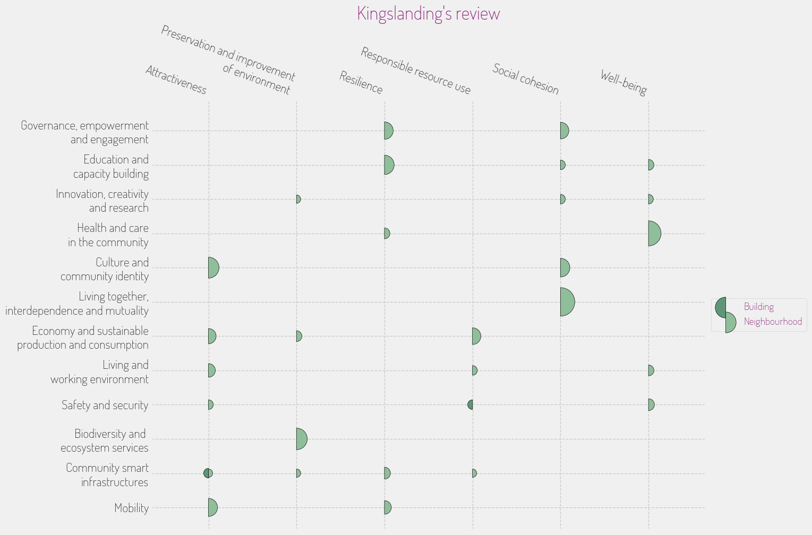

# Neighborhood Assessment Report: King's Landing

## Assessment

## Overview & Sustainability Profile

### Neighborhood Snapshot

**Executive Summary:** King's Landing, the bustling capital of the Seven Kingdoms, is a vibrant hub characterized by its rich history, diverse communities, and complex socio-economic dynamics. Known for iconic landmarks like the Iron Throne and the Red Keep, it is a place where tradition meets modernity amidst challenges that require thoughtful urban planning. This report aims to capture the essence of King's Landing and provide insight into its sustainability and resilience efforts.

**Geographic Scope & Context:** Situated near the shores of Blackwater Bay, King's Landing strategically connects trade routes between the northern and southern realms. The city’s layout features a mix of narrow alleys and grand boulevards, emphasizing both medieval charm and urban density.

**Identity Markers:** King's Landing can be defined by three characteristics: 

1. **Historical Significance:** The city is steeped in tales of political intrigue and historic events that shape its identity.
2. **Cultural Mosaic:** Home to various cultural groups, King's Landing presents a tapestry of traditions, languages, and festivals that celebrate its diversity.
3. **Political Center:** As the seat of power, its institutions reflect a complex hierarchy where governance and community intersect.

**Physical Character:** Architecturally, King's Landing manifests a blend of grand castles, bustling marketplaces, and residential quarters that showcase a mixture of opulence and necessity. The city’s infrastructure comprises traditional stone buildings alongside more modern constructions, indicating an evolving urban landscape.

### Sustainability & Resilience

**Environmental Assets & Challenges:** King’s Landing is rich in natural assets such as access to coastal resources and a variety of urban green spaces, including the renowned gardens surrounding the Red Keep. However, the city faces notable environmental challenges, including vulnerabilities to flooding from heavy rains and rising sea levels, exacerbated by climate change. Resource management is also an ongoing issue, with dependence on surrounding lands for food and clean water, creating pressure on these ecosystems.

**Sustainable Development Activity:** In recent years, the city has made strides towards **sustainable development**. Newer residential areas are incorporating **green building practices**, focusing on energy efficiency and waste reduction. Initiatives like the recently opened "Horse and Cart Lane" promote sustainable transportation options, reducing reliance on coal-powered carriages and encouraging a shift towards more eco-friendly mobility. Simultaneously, local markets are spearheading a **circular economy**, where waste is minimized and materials are reused.

**Climate Action & Adaptation:** The city is actively working on **climate action and adaptation strategies**. Resilience hubs are emerging neighborhoods that offer communal spaces designed to help residents prepare for and respond to climate-related events. Efforts to transition to renewable energy sources, such as wind and solar, are underway, demonstrating a commitment to **nature-based solutions** that integrate green spaces into urban planning.

**Environmental Justice Indicators:** Despite notable progress, some communities experience disparities in access to green spaces and clean resources. Areas such as Flea Bottom, home to many low-income residents, reveal a stark contrast in living conditions compared to the wealthier districts, highlighting the need for more equitable treatment in environmental planning.

## Economic Drivers & Market Forces

### Economic Ecosystem

**Employment Landscape:** King’s Landing serves as the economic engine of the Seven Kingdoms, offering diverse employment opportunities. The economy is driven by sectors such as trade, tourism, and public administration. Recent statistics show a steady **unemployment rate** of about 7%, lower than the national average, indicating a resilient job market despite challenges in certain sectors.

**Business Dynamics:** Small businesses flourish in the crowded market streets, providing residents with goods and services while enhancing the city's local flavor. Traditional artisans, such as blacksmiths and weavers, thrive alongside modern startups focused on technology and trade, creating a unique blend of the old and new. 

**Real Estate Market:** The real estate market is a focal point of discussion, particularly as the city experiences a **development pipeline**. High demand for housing is prompting developers to invest in both luxury and affordable housing projects. Current indicators suggest a rise in property values by approximately 5.2% over the past year, reflecting heightened interest from both local and foreign buyers.

**Economic Transformation Signals:** Recent shifts in the economy signal a gradual transformation as the city embraces more sustainable practices. Initiatives promoting local products and services are gaining traction, which supports sustainability while fostering community pride.

**Fiscal Health:** The city’s financial health appears stable. Revenue from tourism and local business taxes appears robust, though there are concerns regarding investments in necessary infrastructure upgrades, such as the aging sewer system.

## People & Community Dynamics

### Demographic Composition

**Population Trends:** King’s Landing is home to an estimated population of **400,000 residents**, reflecting significant growth over the past decade. This growth is primarily driven by migration from rural areas within the Seven Kingdoms seeking improved opportunities.

**Cultural Diversity:** This city's rich tapestry is showcased in its cultural diversity; over **30** different ethnic and cultural groups call King’s Landing home. Events such as the "Festival of Lights" celebrate this diversity, fostering a sense of inclusion among residents.

### Social Infrastructure

**Community Assets:** Numerous community organizations operate throughout King’s Landing, providing vital resources ranging from food banks to educational programs. Notable establishments include the North Star Community Center, which offers free classes and social services.

**Social Networks:** Social ties are strong in many neighborhoods, where community gathering spots—like local taverns and public squares—serve as hubs for interaction. "Everyone knows someone here," noted one local resident, underscoring the importance of personal connections.

### Movement & Stability

**Migration Patterns:** King's Landing experiences high mobility, with many residents relocating within the city and newcomers arriving regularly. This migration is often spurred by economic opportunities, yet it creates challenges regarding housing and integration.

**Daily Rhythms:** The city’s daily life often revolves around the market hours, which see heavy pedestrian traffic as locals and visitors alike engage in commerce and social interaction, highlighting its vibrancy.

### Community Tensions & Aspirations

**Pressure Points:** While King’s Landing showcases resilience, underlying tensions exist among various community factions, notably regarding housing affordability and access to resources. Some residents express feelings of exclusion from the city's privileged sectors.

**Collective Vision:** Despite challenges, community members are united in envisioning a future that prioritizes **sustainability and inclusivity**. A local resident shared, “We need to build a city that thrives together, not just on wealth but on opportunity for everyone.”

### Social Cohesion Indicators

Indicators of **social cohesion** in King’s Landing, while mixed, show promise through active engagement in community issues and initiatives. Collaboration between residents, businesses, and local government is essential to bridge divides and foster a more unified community.

This assessment of King’s Landing provides a lens through which to view the neighborhood's challenges and potential. It illustrates a vibrant urban environment steeped in history, facing the complexities of modern growth while striving toward a fair and sustainable future.