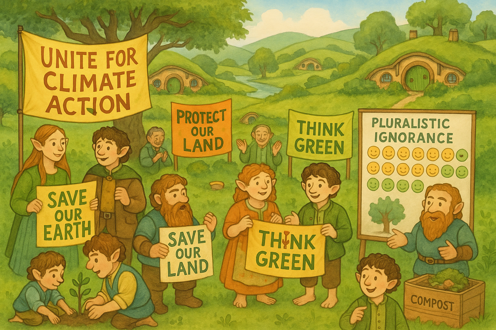

## **PROJECT IDENTIFICATION**

### **Project Title:** 
**Neighbors Together: Climate Action Collaborative**

### **Project Type:** 
Social Program

### **Scale:** 
Neighborhood

### **Timeline:** 
Short-term (1 year)

### ISO37101 mapping for 'Community climate action collaboration initiative.'

#### Scores

|   Score | Purpose                                     | Issue                                              | Justification                                                                                                                                                                                                                                                                                                                      |
|--------:|:--------------------------------------------|:---------------------------------------------------|:-----------------------------------------------------------------------------------------------------------------------------------------------------------------------------------------------------------------------------------------------------------------------------------------------------------------------------------|
|       5 | Social cohesion                             | Community smart infrastructures                    | The project emphasizes community cohesion by uniting residents around climate action, fostering a sense of belonging and collective effort. Community Climate Hubs serve as focal points for interaction, enhancing social ties while promoting collaboration towards sustainability, which is essential for social cohesion.      |
|       5 | Well-being                                  | Health and care in the community                   | The initiative aims to enhance the well-being of residents by facilitating access to climate action information and workshops that promote healthy practices. This aligns with improving both physical and mental health within the community, encouraging residents to engage in activities that benefit their well-being.        |
|       5 | Attractiveness                              | Culture and community identity                     | The project builds on local traditions and cultural practices, like seasonal fairs and community gatherings, enhancing the attractiveness of Shire through a climate action framework. By aligning with existing cultural values and practices, the initiative fosters a vibrant community identity that encourages participation. |
|       4 | Resilience                                  | Living together, interdependence and mutuality     | Neighbors Together promotes resilience by cultivating interdependence among residents through shared goals and collective actions for climate initiatives. This strengthens community bonds and prepares them for environmental challenges, enhancing overall community resilience.                                                |
|       4 | Preservation and improvement of environment | Biodiversity and ecosystem services                | The project encourages residents to take actionable steps towards reducing their carbon footprint and enhancing local environmental efforts. This active participation in environmental stewardship contributes positively to biodiversity and ecosystem services within the community.                                            |
|       4 | Attractiveness                              | Economy and sustainable production and consumption | By showcasing local green businesses and innovations during the climate fair, the project enhances economic diversity while advocating responsible consumption patterns. This sustainability focus not only attracts visitors and new residents but also supports local economic growth.                                           |
|       5 | Responsible resource use                    | Education and capacity building                    | The initiative features workshops focused on resource-saving practices, which educate residents on sustainable consumption and responsible resource management. This capacity building is crucial for instilling long-term sustainability practices within the community.                                                          |
|       4 | Social cohesion                             | Governance, empowerment and engagement             | The project empowers residents by actively involving them in decision-making regarding climate initiatives. By fostering engagement and transparency, it reinforces communal governance structures that enable collective achievements.                                                                                            |
|       3 | Resilience                                  | Innovation, creativity and research                | The project embraces innovative approaches to engage the community in climate action while encouraging creative problem-solving in mitigating climate challenges. This further enhances the community's resilience to environmental changes.                                                                                       |
|       3 | Well-being                                  | Mobility                                           | While not directly focused on mobility, the project promotes connectivity among residents through engagement activities. Improved connections among community members can lead to better mobility solutions in the context of sustainable practices.                                                                               |

## **CONTEXTUAL FOUNDATION**

### **Specific Local Challenge Addressed:**
The local community in Shire faces the significant challenge of pluralistic ignorance regarding climate action, where many residents believe they are isolated in their environmental concerns. This misunderstanding hinders collective action and reinforces the false notion that individual efforts are ineffective. According to the CERNA assessment, many people are likely unaware of the overwhelming number of community members who care about climate change. Addressing this gap is critical, as the project aims to show that the majority care, fostering a united front for potential climate initiatives.

### **Local Assets Leveraged:**
Shire has active community centers, local advocacy groups, and passionate residents already engaged in various environmental initiatives. By consolidating existing networks and enhancing visibility through community gatherings, the project capitalizes on local enthusiasm and knowledge, revitalizing and amplifying established efforts like neighborhood clean-up campaigns, tree planting drives, and local recycling programs. 

### **Cultural/Social Fit:**
The initiative aligns with Shire's community-centric values and its residents’ proclivity for neighborly cooperation. The project will build upon local traditions of gathering for seasonal fairs and celebrations, enhancing the social fabric while emphasizing collective responsibility for environmental stewardship. This fitting approach acknowledges the everyday interactions among residents and reimagines them within a climate action framework.

## **PROJECT DESCRIPTION**

### **Core Concept:** 
Neighbors Together: Climate Action Collaborative seeks to transform the perception of individual environmental efforts into a powerful collective movement. By initiating robust communication strategies alongside engaging educational campaigns, the project will empower residents to recognize their shared commitment to climate action, thus embarking on impactful, community-led sustainability initiatives.

### **Key Components:**
1. **Community Climate Hubs:** Establish designated spaces within existing community centers where residents can access information, share experiences, and participate in workshops related to climate action. These hubs will become local epicenters for the dissemination of knowledge and resources.
   
2. **Neighborhood Climate Action Workshops:** Organize a series of hands-on workshops at these hubs, focusing on specific actions residents can take to reduce their carbon footprint—such as energy-saving home practices, sustainable gardening techniques, and waste reduction strategies.
   
3. **'Climate Connections' Communication Campaign:** Develop a communication strategy that uses local media, social media platforms, and neighborhood networks to promote personal stories of climate commitment from residents. Highlight personal anecdotes and shared experiences to foster connectivity and belonging in the climate effort.

### **Implementation Approach:**
Phase 1: The project will kick off with a community gathering event, inviting residents to share their climate concerns and expectations. This will set the tone for involvement and participation, establishing a baseline for engagement.
Phase 2: The launch of the Community Climate Hubs will follow, with workshops being rolled out bi-monthly, emphasizing collaboration and shared learning. Focus will be placed on building a coalition of engaged residents to serve as climate action ambassadors within their networks.
Phase 3: With established hubs and growing attendance, the project will host a climate fair, showcasing local green businesses and innovations, thus cementing the Community Climate Hubs as the go-to places for climate action initiatives.

## **STAKEHOLDER ECOSYSTEM**

### **Champions:** 
Community leaders within Shire, such as active members of local sustainability groups and passionate residents already advocating for climate-smart solutions.

### **Partners:** 
Local government agencies focusing on sustainability, educational institutions, environmental non-profits, and businesses interested in sustainability initiatives that would provide resources or sponsorship for workshops.

### **Beneficiaries:** 
The broad Shire community benefits from increased awareness, empowerment in taking climate actions, enhanced community cohesion, and the direct impact of collective climate initiatives.

### **Potential Opposition:** 
Some may resist the initiative due to the perceived burden of participation or skepticism about climate science. Strategies to address these concerns include showcasing local success stories to build trust and emphasizing the personal and communal benefits of engaging in sustainability efforts.

## **FEASIBILITY & IMPACT**

### **Success Indicators:**
- Quantitative metric: Measure attendance rates at workshops and community gatherings.
- Qualitative metric: Collect testimonials and feedback regarding shifts in community engagement and sentiment towards climate action.
- Community-defined metric: Create a satisfaction survey among residents that measures their sense of community belonging and awareness of climate issues.

### **Ripple Effects:**
As residents connect through the climate initiatives, the project could spur additional community-driven programs ranging from local green business support to broader environmental stewardship efforts, such as conservation projects and increased community gardening.

### **Risk Mitigation:**
The primary risk concerns disengagement or skepticism. To mitigate this, ongoing dialogue with residents will be maintained to ensure programming meets their interests, while highlighting the personal benefits of climate actions in their daily lives.

## **LOCAL ADAPTATION NOTES**

### **What makes this project uniquely suited to this place:**
Neighbors Together builds upon already established community ties and the tradition of collective efforts seen in Shire, positioning the initiative within the local social framework. The balance between formal and informal engagement activities ensures that community identity remains intact while embracing the need for climate action.

### **How locals would likely describe this project in their own words:**
"This project is about us coming together. We care about our home and want to see our neighbors involved. It’s about knowing we’re not alone in wanting a cleaner, greener Shire and doing it together." 

In summary, Neighbors Together: Climate Action Collaborative is positioned to inspire collective action, fostering a stronger community identity around the shared goal of sustainability while respecting and enhancing Shire's unique local character.