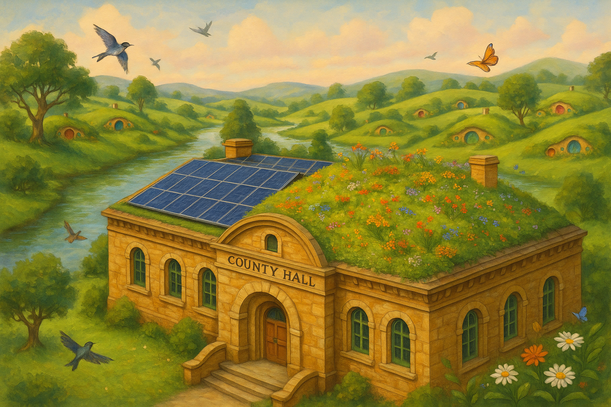

## PROJECT IDENTIFICATION

### Project Title: 
"Sky Harmony: Greening County Hall's Horizon"

### Project Type: 
Environmental

### Scale: 
City-wide

### Timeline: 
Medium-term (2-3 years)

### ISO37101 mapping for 'Sustainable rooftop transformation for County Hall.'

#### Scores

|   Score | Purpose                                     | Issue                                              | Justification                                                                                                                                                                                                                                                                                                                                          |
|--------:|:--------------------------------------------|:---------------------------------------------------|:-------------------------------------------------------------------------------------------------------------------------------------------------------------------------------------------------------------------------------------------------------------------------------------------------------------------------------------------------------|
|       5 | Attractiveness                              | Culture and community identity                     | The 'Sky Harmony' project enhances the attractiveness of County Hall by modernizing it with a green roof and solar panels, which align with the community's values of historical preservation and eco-consciousness. The project contributes to a sense of place and local identity by blending innovative design with traditional land-use practices. |
|       5 | Preservation and improvement of environment | Biodiversity and ecosystem services                | The project aims to improve environmental performance by incorporating a green roof that features native plant species, enhancing local biodiversity and providing urban wildlife habitats. This aligns with the goal of mitigating environmental impacts and actively contributing to ecological restoration.                                         |
|       4 | Resilience                                  | Health and care in the community                   | By transforming County Hall's rooftop into a dual-purpose space for renewable energy generation and green landscaping, the project enhances the building's resilience to climate challenges. The initiative supports both the physical environment and community well-being by promoting healthier urban ecosystems.                                   |
|       4 | Responsible resource use                    | Economy and sustainable production and consumption | The incorporation of solar panels and a green roof exemplifies responsible resource use by utilizing sustainable materials and technologies. This approach encourages efficient energy consumption while supporting local biodiversity, and also serves to educate the community on sustainable practices.                                             |
|       5 | Social cohesion                             | Living together, interdependence and mutuality     | 'Sky Harmony' promotes social cohesion through community engagement initiatives like educational programs and forums. By involving residents in the design and maintenance of the rooftop, the project fosters a sense of ownership and collective responsibility for community sustainability.                                                        |
|       5 | Well-being                                  | Education and capacity building                    | The project's emphasis on workshops and educational programs aims to enhance community well-being by promoting knowledge around sustainability and environmental stewardship. Engaging local schools and organizations helps build capacity for future generations, allowing them to actively participate in sustainable practices.                    |
|       4 | Attractiveness                              | Living and working environment                     | The enhancement of County Hall with a green roof and solar panels improves its visual appeal and quality of the living environment, making the area more inviting and functional for both residents and visitors. This contributes to the overall attractiveness of urban space.                                                                       |
|       4 | Preservation and improvement of environment | Community smart infrastructures                    | The implementation of smart infrastructures, like solar technology, on County Hall not only modernizes the facility but also contributes to environmental stewardship. This project serves as a model for utilizing smart infrastructures to improve urban sustainability.                                                                             |
|       4 | Resilience                                  | Governance, empowerment and engagement             | The project's community forums and collaborative approach to decision-making illustrate governance and engagement practices, ensuring that local perspectives and concerns are integrated into the project's development. This builds resilience within the community by fostering a sense of involvement and accountability.                          |
|       5 | Social cohesion                             | Culture and community identity                     | The 'Sky Harmony' initiative is rooted in local cultural values which emphasize historical preservation alongside innovation. By marrying these concepts, the project strengthens local identity and fosters community pride, reinforcing social cohesion through shared values.                                                                       |

## **CONTEXTUAL FOUNDATION**

### Specific Local Challenge Addressed:
County Hall has historically served as a central landmark within the community, yet it faces challenges of aging infrastructure and sustainability. The proposed rooftop transformation addresses the urgent need for energy efficiency and ecological resilience, as the existing building can be modernized without jeopardizing its protected status. The rooftop's transformation into a blend of solar panels and a "green roof" speaks to the necessity of adapting historic structures for modern environmental challenges while enhancing biodiversity in a coastal setting.

### Local Assets Leveraged:
The project builds upon the existing community’s prioritization of sustainability and conservation. The knowledge and support from local environmental groups and educational institutions can be harnessed to deliver community-led education programs, thereby amplifying their efforts. The presence of conservation architects and biodiversity officers further enriches this initiative, ensuring alignment with best practices in heritage preservation and environmental stewardship.

### Cultural/Social Fit:
"Sky Harmony" aligns seamlessly with local values of historical preservation and eco-consciousness, reflecting a community that cherishes its marine surroundings and is keen to embrace innovation that respects its narrative. The dual-layered rooftop, with its practical energy-generating solar panels and lush green space, pays homage to traditional land-use practices while enhancing contemporary urban life. This project not only fortifies local identity but also showcases a modern commitment to sustainability.

## PROJECT DESCRIPTION

### Core Concept:
The "Sky Harmony" initiative presents a transformative vision for County Hall that combines renewable energy generation and greening of urban structures, thereby blending innovation with heritage. By developing both a green roof and solar panels on the rooftop, the project aims to demonstrate the symbiotic relationship between technology and nature while contributing to the city’s climate resilience and biodiversity.

### Key Components:
1. **Physical/spatial element**: The bifurcated rooftop will be designed to integrate solar panels seamlessly with an expansive green roof, which will feature native plant species. This will not only enhance the building’s aesthetics but also support urban wildlife and participate in local ecological networks.
   
2. **Programming/activity element**: A series of workshops and educational programs will be established to engage the public about renewable energy, sustainable gardening, and biodiversity. Collaborations with local schools, environmental organizations, and universities will help foster a generation of eco-conscious citizens who understand the importance of sustainability in urban settings.
   
3. **Community engagement element**: Community forums will be held to discuss the design and vision for the rooftop, ensuring local input is valued and integrated. This participatory approach fosters ownership and pride in the project while addressing any concerns regarding the project's implementation and long-term maintenance.

### Implementation Approach:
- **Phase 1**: Immediate actions will include community consultation and structural assessments of the existing building to determine feasibility for the install of solar panels and green roofing materials. Partnerships with local universities will facilitate research components as well as project management.
  
- **Phase 2**: Building momentum will focus on the initial construction of the solar panel section while simultaneously beginning to cultivate the green roof using pre-grown plants from local nurseries dedicated to native species. This phase will involve outreach to local schools and conservation groups to involve them in planting and nurturing the green space.
  
- **Phase 3**: The full realization phase will highlight the completion of the rooftop. Launching educational programming with an official inauguration event will attract public engagement while promoting the duality of the roof’s uses. An ongoing maintenance schedule will be developed with local environmental groups to ensure continuous community involvement.

## STAKEHOLDER ECOSYSTEM

### Champions:
County Hall representatives will lead the initiative, with support from local environmental advocates and institutions, ensuring the project champions a cause most relevant to community interests.

### Partners:
Potential partners include local universities (for research collaboration), environmental NGOs (for expert knowledge and community outreach initiatives), historical societies (to respect and integrate local heritage), and local businesses (to leverage sponsorship and local buy-in).

### Beneficiaries:
Residents of the city will directly benefit from the increase in green space, improved air quality, and educational opportunities. Local wildlife will also benefit from new habitats, promoting biodiversity within an urban landscape.

### Potential Opposition:
Concerns may arise from those worried about alterations to a protected building or the viability of maintaining a green roof. Addressing these concerns early through open forums and showcasing research supporting the project’s benefits will be key to gaining community trust.

## FEASIBILITY & IMPACT

### Success Indicators:
- **Quantitative metric**: A measurable increase in solar energy production and green space area coverage on County Hall.
- **Qualitative metric**: Positive feedback from community engagement sessions and educational outcomes as reported by participants.
- **Community-defined metric**: Increased community participation in environmental workshops and sustained care for the green roof.

### Ripple Effects:
The successful implementation of the "Sky Harmony" project could catalyze similar initiatives across other public buildings in the city, fostering a movement toward green rooftops citywide. Enhanced community ties and a shared commitment to sustainability can also emerge, leading to broader local environmental consciousness.

### Risk Mitigation:
The primary risk involves potential structural limitations of County Hall impacting implementation. A thorough structural assessment conducted in conjunction with preservation experts will establish feasibility and ensure compliance with conservation guidelines.

## LOCAL ADAPTATION NOTES

### What makes this project uniquely suited to this place:
The "Sky Harmony" initiative creatively marries modern sustainability practices with an appreciation for the city’s historical architecture. Each element is designed to resonate with the community’s identity, ensuring that it feels like a natural extension of their existing environment rather than an imposition.

### How locals would likely describe this project in their own words:
"This project is just what we need to make our beautiful County Hall not just a landmark but a beacon for sustainability! It’s wise to cover the top with greenery and solar panels; it’s a mark of pride for our future that respects our past."