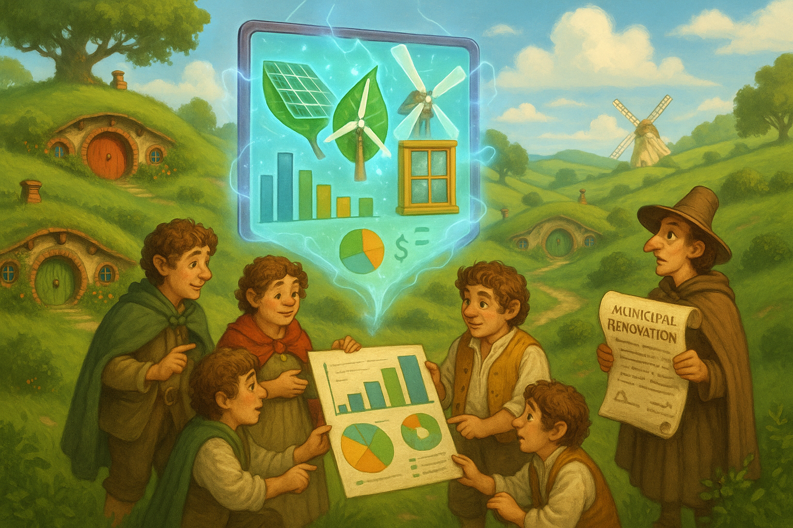

## **PROJECT IDENTIFICATION**

### **Project Title:** 
"Green Renaissance: Empowering Our Community Through Energy Excellence"

### **Project Type:** 
Hybrid

### **Scale:** 
City-wide

### **Timeline:** 
Medium-term (2-3 years)

### ISO37101 mapping for 'Empowering community energy efficiency initiative.'

#### Scores

|   Score | Purpose                                     | Issue                                              | Justification                                                                                                                                                                                                                                                                                                                                           |
|--------:|:--------------------------------------------|:---------------------------------------------------|:--------------------------------------------------------------------------------------------------------------------------------------------------------------------------------------------------------------------------------------------------------------------------------------------------------------------------------------------------------|
|       5 | Attractiveness                              | Economy and sustainable production and consumption | The project emphasizes improving energy efficiency in residential and community buildings, which enhances the attractiveness of the area. The focus on local economic benefits from energy renovations and potential job creation acts as a sustainable production mechanism. The digital tool and community engagement foster a vibrant local economy. |
|       4 | Preservation and improvement of environment | Biodiversity and ecosystem services                | The initiative aims to reduce local emissions through improved energy efficiency, contributing to better air quality. While not explicitly mentioned, enhancing building energy performance can positively impact local biodiversity by reducing environmental stressors associated with outdated buildings, thus supporting the ecosystem.             |
|       5 | Resilience                                  | Health and care in the community                   | By focusing on energy efficiency and comfort, the project addresses essential community needs, thus increasing resilience to energy price fluctuations and environmental changes. By fostering community discussions and workshops, it strengthens social fabric, enhancing collective well-being.                                                      |
|       5 | Responsible resource use                    | Living and working environment                     | The digital tool promotes informed choices and resource-efficient renovations. This approach aligns with sustainable consumption patterns and the aim to improve living conditions through better building energy performances.                                                                                                                         |
|       5 | Social cohesion                             | Living together, interdependence and mutuality     | The workshops and collaborative forums are designed to engage residents, fostering a sense of community and shared responsibility. This project encourages participation and supports cultural values, enhancing social ties.                                                                                                                           |
|       5 | Well-being                                  | Education and capacity building                    | The project includes community workshops and training sessions aimed at enlightening residents about energy efficiency. This contributes positively to the overall well-being of community members by improving living conditions and promoting health through better energy practices.                                                                 |
|       4 | Attractiveness                              | Mobility                                           | The initiative may indirectly enhance mobility by initiating conversations about broader sustainability issues, including transportation. Improved energy efficiency can lead to lower emissions that benefit overall community accessibility and attractiveness.                                                                                       |
|       4 | Preservation and improvement of environment | Innovation, creativity and research                | The use of a digital tool for energy renovations reflects innovative approaches towards sustainable practices in the built environment. This creative angle enhances environmental improvement strategies.                                                                                                                                              |
|       5 | Resilience                                  | Governance, empowerment and engagement             | The project focuses on community engagement through participatory forums. Strengthening community ties and empowering residents to advocate for their needs is vital for building resilient neighborhoods against various socio-economic challenges.                                                                                                    |
|       4 | Responsible resource use                    | Community smart infrastructures                    | The project encourages sustainable resource management through improved energy efficiency and seeks to innovate infrastructure to adapt to community needs. This aligns with smart infrastructure principles for better resource utilization.                                                                                                           |

## **CONTEXTUAL FOUNDATION**

### **Specific Local Challenge Addressed:**
The city faces significant challenges concerning building energy efficiency, comfort, and cost management. Many residences and community buildings are outdated, leading to higher energy expenses, contributing to local emissions, and negatively impacting the comfort of residents. By deploying a digital tool tailored for energy renovation, we can provide the necessary support for both individual homeowners and the municipality. This initiative allows residents to make informed decisions about energy upgrades while aligning with broader urban planning objectives, ultimately improving the quality of life and fostering a sustainable environment.

### **Local Assets Leveraged:**
The city possesses a rich history of community engagement, evident in its active neighborhood associations and civic groups that have successfully collaborated on various initiatives. Additionally, existing community resources, such as local workshops on sustainability, can be utilized to further educate and involve citizens in the energy renovation process. This project builds on these assets by amplifying local voices and integrating them into the energy renovation dialogue, thus allowing the community to take ownership of their built environment.

### **Cultural/Social Fit:**
The “Green Renaissance” initiative resonates deeply with the residents, as there’s a collective desire to further their environmental commitment without compromising the unique character of the neighborhoods. The focus on energy efficiency and sustainability aligns with local values, emphasizing harmony between historical preservation and modern advancements. It respects the community's tradition of making decisions cooperatively, ensuring that every voice is heard in the conversation about energy renovations.

## **PROJECT DESCRIPTION**

### **Core Concept:** 
"Green Renaissance" is all about empowering our community to embrace energy renovation through a user-friendly digital platform. Residents will have access to information that helps them understand the benefits of energy efficiency while enabling the municipality to effectively plan and enhance renovation projects across the city. This initiative focuses on strengthening community ties and safeguarding the environment while elevating individual comfort and energy savings.

### **Key Components:**
1. **Digital Tool Development**: A comprehensive platform that guides decision-making for energy renovations. It will include features like cost analysis, potential savings, sustainability ratings, and even lifecycle emissions assessments to ensure users grasp the full impact of their choices.
2. **Community Workshops and Training**: Regularly scheduled workshops will not only educate residents on energy efficiency but also foster community engagement, allowing local experts and trained volunteers to share their insights and experiences with energy renovations.
3. **Collaborative Policy Forums**: Create spaces for ongoing dialogue among residents, municipal leaders, and experts, enabling the community to voice concerns, provide feedback, and directly influence policy decisions regarding building renovations and sustainability efforts.

### **Implementation Approach:**
- **Phase 1**: Establish a pilot project in a targeted neighborhood to gather initial data and refine the digital tool. This phase includes the development of user-friendly functions and strategic collaboration with community leaders to raise awareness.
- **Phase 2**: Expand outreach through community workshops, integrate feedback, and involve residents in training sessions on using the digital tool. This will also include creating marketing campaigns to encourage participation and highlight early success stories.
- **Phase 3**: Full-scale city-wide implementation of the digital platform and application in municipal planning. Foster ongoing engagement through consistent forums allowing residents to update their experiences and the success of projects initiated through the platform.

## **STAKEHOLDER ECOSYSTEM**

### **Champions:** 
Local government officials, community leaders from existing neighborhood associations, and sustainability advocates will champion the project. These individuals have already demonstrated commitment to a greener city and serve as trusted voices within the community.

### **Partners:** 
The collaboration will involve local universities for research support, local businesses that focus on building and energy efficiency, municipal planning departments, and non-profit sustainability organizations. Their collective expertise will help shape the digital tool and ensure its relevance.

### **Beneficiaries:** 
All city residents will directly benefit from the initiative as they gain access to improved energy efficiency in their homes and community buildings. This project also benefits the broader community by enhancing air quality, reducing energy costs, and promoting sustainable practices.

### **Potential Opposition:** 
Some might resist the changes due to misconceptions about renovation costs or fears of gentrification. To address these concerns, proactive communication will be essential, including fact-based discussions to clarify the benefits and cost-savings of energy efficiency. Engaging influential community members will also help ease skepticism and illustrate how the project respects and preserves the community's character.

## **FEASIBILITY & IMPACT**

### **Success Indicators:**
- Quantitative metric: A measurable reduction in energy costs and emissions across the community buildings engaged within the first two years.
- Qualitative metric: Resident satisfaction surveys indicating increased comfort and a sense of ownership over energy renovation decisions.
- Community-defined metric: A growing number of local homeowners participating in the renovation process and using the digital tool, showcasing community interest and engagement.

### **Ripple Effects:**
Implementing "Green Renaissance" could spark an increase in local green jobs focused on energy renovations, catalyze conversations on transportation and public spaces, and promote more holistic sustainability strategies across other aspects of urban life. 

### **Risk Mitigation:**
One primary risk is potential underutilization of the digital tool. This can be mitigated by ensuring the platform is accessible and user-friendly, providing hands-on training, and creating incentives for participation through potential grants or programs rewarding energy renovations.

## **LOCAL ADAPTATION NOTES**

### **What makes this project uniquely suited to this place:**
The strong communal ties and culture of collaboration in the city make it an ideal environment for “Green Renaissance.” By engaging residents actively in decision-making, we can ensure the project reflects local needs, perspectives, and aspirations, differentiating it from energy initiatives imposed in more top-down approaches.

### **How locals would likely describe this project in their own words:**
Residents might say, “This is our chance to make our homes more comfortable and cut down on energy bills, and it feels like we’re all in it together. Plus, we’ll get to learn and support each other in making our community greener."

In conclusion, the "Green Renaissance" project aims not only to address the urgent need for energy efficiency in the city but also to strengthen the communal fabric, fostering a culture of sustainability in a way that ¡respects the unique character of our community. The collaborative nature of this initiative will ensure that residents not only benefit from energy renovations but take pride in the revitalization of their environment.