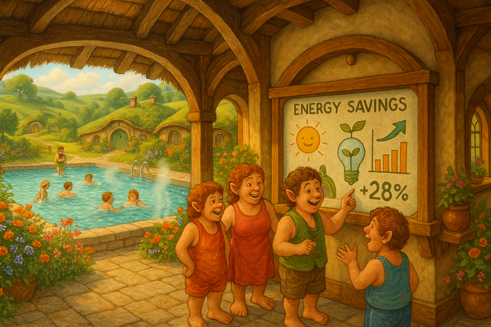

## **PROJECT IDENTIFICATION**

### **Project Title:** 
“EcoSplash Community Hub”

### **Project Type:** 
Hybrid

### **Scale:** 
Neighborhood

### **Timeline:** 
Medium-term (2-3 years)

### ISO37101 mapping for 'Community-driven environmental education hub.'

#### Scores

|   Score | Purpose                                     | Issue                                              | Justification                                                                                                                                                                                                                                                                                                                       |
|--------:|:--------------------------------------------|:---------------------------------------------------|:------------------------------------------------------------------------------------------------------------------------------------------------------------------------------------------------------------------------------------------------------------------------------------------------------------------------------------|
|       5 | Attractiveness                              | Culture and community identity                     | The EcoSplash Community Hub is designed to leverage the existing municipal pool, which serves as a central social gathering place within the community of Shire. This fosters local pride and participation by enhancing the space while aligning with the community's values of health, wellness, and environmental consciousness. |
|       4 | Preservation and improvement of environment | Biodiversity and ecosystem services                | The creation of an eco-garden around the pool area as part of the renovations represents a direct action towards preserving and enhancing local biodiversity. This initiative demonstrates sustainable gardening practices, aiming to restore ecological balance and improve the local environment.                                 |
|       5 | Social cohesion                             | Living together, interdependence and mutuality     | The project seeks to promote social integration by hosting workshops and events that engage various demographics within the community. By fostering collaborative activities, it encourages interactions and strengthens community bonds, which are essential for a sustainable neighborhood.                                       |
|       5 | Well-being                                  | Health and care in the community                   | The Community Hub emphasizes community health and wellness by providing educational opportunities focused on sustainable practices, thereby contributing to improved physical and mental health for residents. Engaging with local health services also ensures access to physical and mental well-being resources.                 |
|       4 | Responsible resource use                    | Economy and sustainable production and consumption | The project promotes responsible resource use through the integration of sustainability education at the Hub and aims to encourage environmentally-friendly practices among community members. This approach suggests a shift towards sustainable consumption patterns and local economic support.                                  |
|       5 | Resilience                                  | Education and capacity building                    | The EcoSplash Community Hub is designed to build community resilience by offering educational programs that raise awareness and skills in sustainability practices. This project ensures that the community is prepared to navigate environmental challenges and adapt to changing conditions.                                      |
|       3 | Attractiveness                              | Mobility                                           | By increasing community events and engagement at the Hub, there may be an uptick in local mobility efforts as the community promotes walking or biking to the pool, enhancing overall attractiveness and connectivity while emphasizing eco-friendly modes of transport.                                                            |
|       4 | Social cohesion                             | Governance, empowerment and engagement             | The initiative involves local residents through open houses and community dialogues to solicit feedback and input, ensuring an inclusive governance model. This empowers residents and strengthens democratic engagement in community decision-making.                                                                              |
|       4 | Well-being                                  | Living and working environment                     | The focus on creating a community-centered educational hub around the renovated swimming pool ensures that local residents have equitable access to recreational and learning opportunities. This directly influences their quality of life and overall living environment.                                                         |
|       4 | Preservation and improvement of environment | Community smart infrastructures                    | The EcoSplash Community Hub's renovations to enhance energy efficiency not only modernize the pool's infrastructure but also create a model for community engagement in smart resource management. This demonstrates effective and sustainable infrastructure development in the neighborhood.                                      |

## **CONTEXTUAL FOUNDATION**

### **Specific Local Challenge Addressed:**
In Shire, the reopening of the municipal swimming pool has introduced much-needed upgrades, significantly enhancing comfort and sustainability. However, the challenge remains in transforming this infrastructure improvement into a focal point for community engagement and education about energy efficiency and environmental stewardship. While the new systems have generated energy savings, the local community largely remains unaware of their practical importance, indicating a gap between infrastructure enhancements and community participation in sustainability practices.

### **Local Assets Leveraged:**
The renovated swimming pool serves as an existing community space with high foot traffic, making it an ideal candidate for further development as a center for environmental education. Leveraging the enthusiasm generated by the pool’s improvements, the project aims to integrate current local assets, such as volunteers interested in sustainability and organizations that advocate for community wellness. This project builds on the existing sense of community pride in the pool as a social hub, enhancing its role as a gathering place for learning and collaboration.

### **Cultural/Social Fit:**
“EcoSplash Community Hub” recognizes the cultural nuances of Shire, a place characterized by its inclusive community spirit and appreciation for local resources. Instead of merely serving as a swimming facility, the pool can evolve into a community asset that aligns with local values around health, wellness, and environmental consciousness. This project integrates comfortably into the local identity, reinforcing the commitment of Shire’s residents to maintain a connection to nature while fostering interactive learning opportunities that enhance overall community resilience.

## **PROJECT DESCRIPTION**

### **Core Concept:** 
The “EcoSplash Community Hub” aims to transform the municipal pool into a community-centered environmental education center. It will host workshops, educational events, and activities focused on sustainability, health, and wellness, encouraging residents to engage with energy efficiency and environmental issues personally. By infusing the renovated pool space with programming that highlights eco-friendly practices, we can build stronger relationships among community members while promoting collective action toward sustainability.

### **Key Components:**
1. The existing facility will undergo minor renovations to designate areas specifically for workshops and education, including creating an eco-garden around the pool area to demonstrate sustainable gardening practices.
2. A series of programming options, including family-friendly workshops, swimming classes with an environmental theme, and events featuring local experts discussing sustainability, will engage different demographics in the community.
3. A community engagement platform will be established, utilizing input from local residents to tailor programming to interests while fostering ongoing dialogue about sustainability matters. Regular outreach efforts can ensure diverse participation by focusing on underrepresented groups in the community.

### **Implementation Approach:**
- **Phase 1:** Initiate a community dialogue to gather input on programming by hosting an open house at the pool. This will generate interest, increase awareness, and attract potential volunteers. In tandem, begin the development of the eco-garden and set up associated infrastructure.
- **Phase 2:** Roll out pilot workshops and events focused on sustainability topics that resonate with the community. Partner with local schools and organizations to enhance programming and secure funding through grants and local sponsorships. Monitor participation levels and solicit feedback to improve offerings.
- **Phase 3:** Establish the EcoSplash Community Hub as a permanent institution, complete with a developed schedule of educational events and workshops. Gradually expand the programming based on community needs and successes observed in earlier phases, along with branding efforts to attract new visitors and educators.

## **STAKEHOLDER ECOSYSTEM**

### **Champions:** 
Local environmental groups and educators will champion this initiative, actively promoting its development and ensuring community buy-in. The municipal pool’s management will also play vital roles in advocating for the hub’s establishment.

### **Partners:** 
Key partnerships will include local schools, health services, environmental nonprofits, and local businesses invested in sustainability. These stakeholders will enhance capacity and resource availability, collaborating in programming and outreach efforts.

### **Beneficiaries:** 
All community members of Shire will benefit from greater accessibility to educational opportunities about environmental sustainability, health, and wellness. Families can enjoy quality time together through interactive events, while schools can integrate programs within their curricula. Additionally, local small businesses involved in eco-friendly products will see increased patronage.

### **Potential Opposition:** 
Some residents may resist changes, fearing a loss of traditional space usage for leisure purposes in favor of educational programming. To address these concerns, comprehensive communication efforts will clarify that recreational swimming will continue as a main focus, ensuring that all voices are respected in planning discussions.

## **FEASIBILITY & IMPACT**

### **Success Indicators:**
- **Quantitative metric:** Track participation numbers in workshops and community events, aiming for a 50% increase in attendance within the first year.
- **Qualitative metric:** Collect feedback from participants through surveys, looking for increased awareness of sustainability practices among attendees.
- **Community-defined metric:** Establish a local committee responsible for assessing new programming initiatives, allowing community expressions of specific interests or gaps to shape future developments.

### **Ripple Effects:**
This initiative could catalyze a broader awareness of environmental and health issues within the community, inspiring families to adopt sustainable practices at home and leading to potential collaborative environmental projects beyond the pool.

### **Risk Mitigation:**
A primary risk includes underestimating community interest. To combat this, gauging interest through preliminary surveys and open house events before full implementation will help calculate community commitment accurately and ensure engagement is matched with enthusiasm.

## **LOCAL ADAPTATION NOTES**

### **What makes this project uniquely suited to this place:**
The community-oriented cultural fabric of Shire emphasizes participation and connection. The existing municipal pool is a well-known communal asset, and repurposing this familiarity into a learning hub aligns seamlessly with local expectations around resource use. 

### **How locals would likely describe this project in their own words:**
“This is just what we need—a way to bring folks together, keep that swimming spirit alive, and learn how to make our world a better place right from our own backyard." 

In essence, “EcoSplash Community Hub” symbolizes an opportunity for Shire to deepen community ties and elevate consciousness about sustainability while celebrating the unique character and charm of local life.