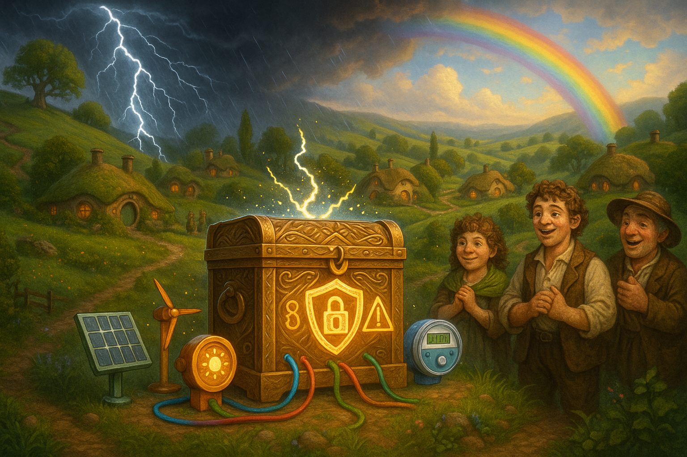

## **PROJECT IDENTIFICATION**

### **Project Title:** 
**Shire Shield: Empowering Our Microgrid**

### **Project Type:** 
Infrastructure

### **Scale:** 
Neighborhood

### **Timeline:** 
Medium-term (2-3 years)

### ISO37101 mapping for 'Empowering Shire's microgrid resilience.'

#### Scores

|   Score | Purpose                                     | Issue                                              | Justification                                                                                                                                                                                                                                                                                                                                                                                    |
|--------:|:--------------------------------------------|:---------------------------------------------------|:-------------------------------------------------------------------------------------------------------------------------------------------------------------------------------------------------------------------------------------------------------------------------------------------------------------------------------------------------------------------------------------------------|
|       5 | Attractiveness                              | Economy and sustainable production and consumption | The Shire Shield project focuses on enhancing the local economy by promoting local employment opportunities through partnerships with local suppliers and technicians involved in microgrid maintenance. By leveraging local skills and fostering economic prospects tied to sustainable energy solutions, the project also enhances the community's attractiveness as a place to live and work. |
|       4 | Preservation and improvement of environment | Biodiversity and ecosystem services                | The Shire Shield initiative aims to improve the reliability of the energy system and reduce the blackouts associated with storms. By doing so, it indirectly supports environmental preservation by fostering local energy solutions that reduce dependence on external energy sources which could have adverse environmental impacts.                                                           |
|       5 | Resilience                                  | Health and care in the community                   | This project directly addresses resilience by ensuring that the energy system can withstand storm events, thereby minimizing health hazards associated with power outages. By improving community health and safety through reliable energy access, Shire Shield enhances the community's overall resilience to environmental shocks.                                                            |
|       5 | Responsible resource use                    | Living and working environment                     | The emphasis on energy independence and sustainable management through the microgrid system demonstrates a commitment to responsible resource use. This approach promotes efficient energy consumption and aligns with creating a comfortable living and working environment for community members.                                                                                              |
|       5 | Social cohesion                             | Community smart infrastructures                    | By establishing a Community Energy Committee and engaging residents in workshops and educational activities, the project fosters social cohesion and community involvement. This initiative encourages collaboration and interaction among residents, which is crucial for building a strong community identity.                                                                                 |
|       5 | Well-being                                  | Education and capacity building                    | The community workshops designed to educate residents about energy management practices directly contribute to their overall well-being. By empowering residents with knowledge and skills related to energy technology, the project promotes mental and social development.                                                                                                                     |
|       4 | Attractiveness                              | Living together, interdependence and mutuality     | The Shire Shield project reflects commitment to community leadership and empowerment, promoting a sense of interdependence among residents as they collaborate on energy solutions. This mutual engagement enhances the attractiveness of the neighborhood as a shared living space.                                                                                                             |
|       4 | Resilience                                  | Safety and security                                | By creating a secure and efficient communication network through SecureBoxes, the project enhances safety and security in energy access for the community. This willingness to invest in resilient infrastructure underscores the community's commitment to safety during adverse weather conditions.                                                                                            |

## **CONTEXTUAL FOUNDATION**

### **Specific Local Challenge Addressed:**
Shire is a storm-prone rural community that faces frequent blackouts due to its vulnerability to inclement weather. The existing microgrid can struggle with data security and outages, impacting the quality of life for residents. The proposed initiative, Shire Shield, directly addresses this issue by implementing a SecureBox that encrypts data and creates a resilient communication network among smart meters and distributed energy resources (DER devices). The aim is to mitigate the blackout duration and improve restoration times, ultimately leading to a more stable and reliable energy system for the community.

### **Local Assets Leveraged:**
Shire boasts a strong sense of community, where residents are engaged and supportive of initiatives that enhance local infrastructure. This project capitalizes on existing neighborhood values of collaboration and resilience. Local skills in technology and community gatherings will serve as essential assets, while partnerships with local suppliers and technicians can provide employment opportunities and fresh economic prospects tied to the microgrid maintenance.

### **Cultural/Social Fit:**
Shire residents value sustainability and independence, evident in their inclination towards developing local energy solutions. The Shire Shield initiative honors these community values by enhancing the microgrid and creating a localized response to power challenges. Additionally, it respects the community's history of self-reliance by empowering residents to take ownership of energy resilience, ensuring that they are active participants in shaping their environment.

## **PROJECT DESCRIPTION**

### **Core Concept:**
The Shire Shield project envisions a robust microgrid secured by encrypted data flows and reinforced communication channels, ensuring that the community can rely on its energy supply even in the face of storms. With greater transparency and enhanced security measures in place, residents will experience fewer disruptions and more effective management of their energy needs during outages.

### **Key Components:**
1. **Physical/spatial element:** Installation of SecureBoxes throughout the neighborhood to create an interconnected microgrid infrastructure that allows for secure data transmission and improved energy management.
   
2. **Programming/activity element:** Community workshops held to educate residents on energy management practices, data privacy, and microgrid technology. These workshops will encourage residents to engage with the microgrid and promote active participation and interest in managing their power supply.

3. **Community engagement element:** Establishment of a "Community Energy Committee," composed of local stakeholders and energy enthusiasts, to oversee the implementation of the SecureBox technology, ensuring it aligns with the community's needs and expectations. This committee will facilitate transparency and encourage feedback throughout the project.

### **Implementation Approach:**
- **Phase 1:** Quick win actions will include conducting a community meeting to introduce the concept and gather input. Technical assessments for SecureBox installations will be undertaken.
  
- **Phase 2:** Building momentum through the formation of the Community Energy Committee and the scheduling of educational workshops to foster awareness and understanding of the new system and data management concepts.

- **Phase 3:** Full realization will involve the installation of the SecureBoxes, coupled with an ongoing feedback mechanism to refine and improve system functionality based on community usage and suggestions.

## **STAKEHOLDER ECOSYSTEM**

### **Champions:**
The project will be championed by local leadership, including community advocates, environmental organizations, and the town council. Their enthusiasm for energy independence and resilience will drive momentum.

### **Partners:**
Key partnerships will involve local utility companies, technology firms specializing in smart grid technologies, and educational institutions that provide expertise and training. Local non-profits focused on rural development and energy efficiency will also play a crucial role in facilitating workshops and outreach.

### **Beneficiaries:**
All residents of Shire will benefit from the project, experiencing shorter blackout periods and more reliable energy systems. Local technicians and service providers involved in the installation and maintenance of SecureBoxes will gain valuable work opportunities, promoting economic resilience.

### **Potential Opposition:**
Potential resistance may arise from those skeptical about new technology or fearful of privacy concerns. Proactive communication and education campaigns will address these fears, reassuring the community about the SecureBox's security measures and benefits to their daily lives.

## **FEASIBILITY & IMPACT**

### **Success Indicators:**
- **Quantitative metric:** Reduction in blackout duration by 50% within the first year of implementation as measured by utility data.
- **Qualitative metric:** Increased community satisfaction scores regarding energy reliability in surveys conducted annually.
- **Community-defined metric:** A measurable increase in participation rates at energy workshops reaching at least 75% of households in the neighborhoods within the first year.

### **Ripple Effects:**
The successful implementation of Shire Shield is likely to inspire further community-led initiatives in other areas of Shire, encouraging innovation and collaboration focused on sustainability and self-reliance. This can potentially uplift local economic activities centered around clean energy technologies and training programs.

### **Risk Mitigation:**
A primary risk lies in technology adoption resistance. To mitigate this, we will develop a communication strategy that focuses on community storytelling—showing how these changes will directly improve daily living—which will resonate with locals and encourage their participation.

## **LOCAL ADAPTATION NOTES**

### **What makes this project uniquely suited to this place:**
The uniqueness of Shire Shield lies in its blend of advanced technology with core community values. Most rural communities may not have the voice or opportunity to modernize their energy systems, but Shire has a strong network to capitalize on available resources and a motivated citizen base that desires self-improvement.

### **How locals would likely describe this project in their own words:**
“This is the community putting its solutions first. With the Shire Shield, we’re not just waiting for help from outside—we’re taking our energy into our own hands. This feels like us, protecting our own home against storms.”