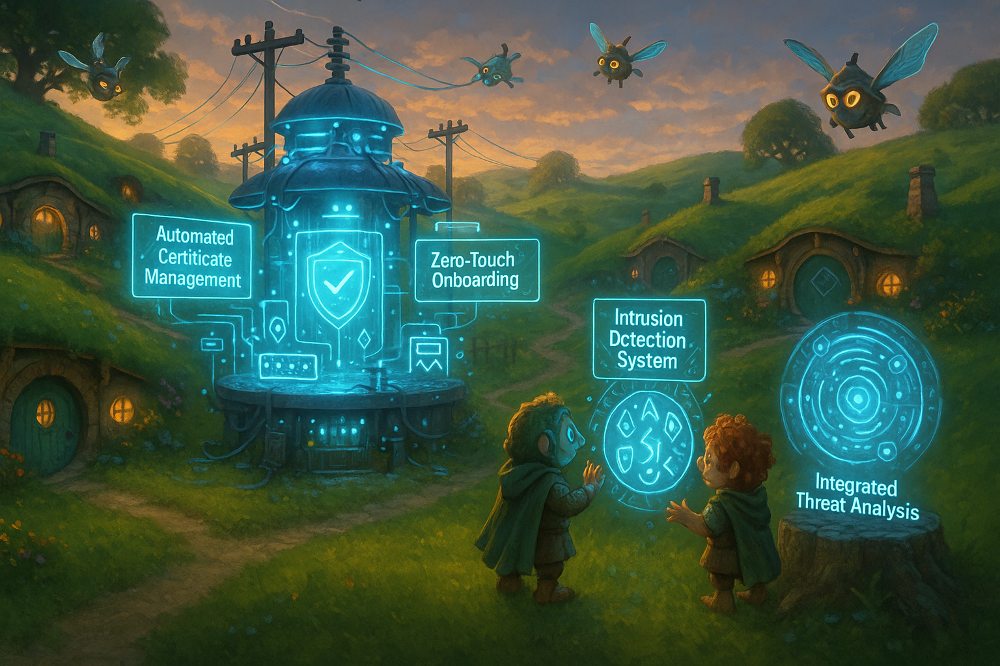

## **PROJECT IDENTIFICATION**

### **Project Title:**
"Future Secure: Empowering Our Substation"

### **Project Type:**
Hybrid (Infrastructure and Community Engagement)

### **Scale:**
Neighborhood

### **Timeline:**
Medium-term (2-3 years)

### ISO37101 mapping for 'Community tech upgrade and engagement.'

#### Scores

|   Score | Purpose                                     | Issue                                              | Justification                                                                                                                                                                                                                                                                                                                                                                                                           |
|--------:|:--------------------------------------------|:---------------------------------------------------|:------------------------------------------------------------------------------------------------------------------------------------------------------------------------------------------------------------------------------------------------------------------------------------------------------------------------------------------------------------------------------------------------------------------------|
|       5 | Attractiveness                              | Governance, empowerment and engagement             | This project aims to enhance the attractiveness of the community by integrating modern technology at the local substation while fostering community engagement. The creation of a Substation Advisory Board exemplifies a governance structure that promotes active community involvement and transparency, thereby increasing the appeal of the neighborhood as a technologically advanced and responsive environment. |
|       5 | Social cohesion                             | Culture and community identity                     | The project emphasizes collective input and respects local traditions of community engagement, fostering social cohesion. By involving diverse community members in every stage of the project, it reinforces community identity and encourages shared responsibility, fostering mutuality among residents.                                                                                                             |
|       4 | Preservation and improvement of environment | Education and capacity building                    | The objective of educating residents about technology and its environmental impacts aligns with goals of preserving and improving the neighborhood's environment. This education fosters capacity-building around sustainable practices, positioning residents to contribute positively to their community's environmental standards.                                                                                   |
|       5 | Resilience                                  | Health and care in the community                   | Enhancing the digital and operational capacity of the substation will contribute to the community's resilience, particularly regarding safety and emergency response. By developing robust technological solutions and engaging community members in health-related discussions, the project directly addresses community health and safety needs.                                                                      |
|       4 | Responsible resource use                    | Economy and sustainable production and consumption | By integrating technology and education aimed at improving operational efficiencies, the project supports responsible resource use within the neighborhood. It promotes sustainable consumption patterns through community-driven discussions and technological literacy programs, helping to foster economic diversity and encourage local businesses.                                                                 |
|       5 | Well-being                                  | Living and working environment                     | Creating an infrastructure that enhances operational safety and security contributes to the overall well-being of residents. The initiative aims to improve living conditions through technological advancements and community engagement, fostering an environment that meets residential and occupational needs.                                                                                                      |
|       4 | Attractiveness                              | Community smart infrastructures                    | The upgrades at the substation will enhance community infrastructure, making the neighborhood more attractive through improved technological capabilities and services. The emphasis on smart utilities aligns with broader goals of making neighborhoods more vibrant and technologically equipped.                                                                                                                    |
|       3 | Resilience                                  | Mobility                                           | By ensuring that the technological upgrades at the substation contribute to safety and security, the project indirectly supports mobility within the neighborhood. Enhanced safety measures may encourage more interaction and movement within community spaces.                                                                                                                                                        |

## **CONTEXTUAL FOUNDATION**

### **Specific Local Challenge Addressed:**
The core challenge in the city stems from the integration of newer technologies at the local substation, which requires not just a technical upgrade but also a shift in how the community perceives and interacts with these resources. The current system lacks efficient monitoring, which can pose risks to data integrity and operational standards, making it difficult to respond promptly to incidents. By modernizing this infrastructure and ensuring greater integration with the community, the project can mitigate potential threats while increasing local engagement and trust.

### **Local Assets Leveraged:**
This initiative capitalizes on the existing community-centric approach of the neighborhood, where residents are already engaged in local dialogues about sustainability and infrastructure. Organizations that focus on technology education will serve as vital partners, allowing the project to build on current community strengths. The project will utilize local spaces—such as community centers and schools—for workshops and programming, creating a sense of ownership and pride among residents.

### **Cultural/Social Fit:**
"Future Secure" aligns closely with the city’s values of innovation and collaboration. It respects local traditions of community engagement and collective problem-solving. The initiative will incorporate input from residents at every stage, reinforcing the idea that this upgrade is not only a technical improvement but also a communal advancement that enhances public safety and resilience through collective action.

## **PROJECT DESCRIPTION**

### **Core Concept:**
"Future Secure: Empowering Our Substation" revolves around transforming the digital capabilities of the substation while fostering greater community engagement. This project envisions enhanced automation and security that serves not just the utility's operational goals but also strengthens community-territorial relations, creating a transparent, responsive system that residents can trust.

### **Key Components:**
1. **Physical/spatial element:** Upgrades will be made at the substation to incorporate user-friendly interfaces that visually demonstrate how data is managed and monitored. This transparency will demystify the technology for community members.
2. **Programming/activity element:** Launch a series of tech literacy programs focused on automation, cybersecurity, and emergency response systems so residents can understand the upgrades being made and contribute to future discussions on ongoing improvement.
3. **Community engagement element:** Establish a "Substation Advisory Board," comprising local residents, technology experts, and utility representatives. This board will solicit community input on further upgrades, ensure transparency, and foster dialogue around technological advancements in the neighborhood.

### **Implementation Approach:**
- Phase 1: Immediate actions will include community meetings to outline the project vision and gather input and concerns from residents. Early education workshops will be scheduled for residents to learn about technology and its benefits.
- Phase 2: As the upgrades to the substation commence, residents will receive regular updates about the installations. Workshops will evolve to include hands-on demonstrations and community-led educational sessions designed to empower participants.
- Phase 3: With the physical and programming components in place, the Advisory Board will carry on as a long-term forum for community engagement, continually assessing the technology’s effectiveness and ensuring that residents feel heard and involved.

## **STAKEHOLDER ECOSYSTEM**

### **Champions:**
Local technology advocates, community leaders, and educators will serve as champions for this initiative, driving engagement and fostering a culture of collective responsibility toward the upgraded substation.

### **Partners:**
Partnerships will be crucial. Collaborating with local educational institutions, technology firms, and civic organizations, as well as neighborhoods' tech clubs, who can provide resources for workshops and training will be essential for facilitation. The utility provider itself must engage as a key partner in implementing the technological upgrades.

### **Beneficiaries:**
Immediate benefits will accrue to local residents, who will have access to upgraded infrastructure and enhanced cybersecurity measures. Additionally, students and youth will gain knowledge of valuable technological skills, making them potential future leaders in this arena.

### **Potential Opposition:**
Some community members may express skepticism regarding the integration of advanced technologies, fearing potential job losses or privacy invasion. Addressing these concerns transparently, emphasizing job creation through educational programs, and fostering community oversight will help alleviate anxieties.

## **FEASIBILITY & IMPACT**

### **Success Indicators:**
- Quantitative metric: A measurable reduction in incidents related to operational failures and threats, aiming for a 30% decrease within two years.
- Qualitative metric: Improved resident satisfaction, benchmarked by surveys conducted pre- and post-project.
- Community-defined metric: Establishment of a local technology monitoring group that engages no less than 50 residents consistently post-upgrade.

### **Ripple Effects:**
This initiative has the potential to catalyze further technological advancements in the neighborhood, inspiring a broader initiative to foster tech literacy across various age groups and demographics. It could incite further community dialogues about sustainability, resilience, and innovation.

### **Risk Mitigation:**
The primary risk involves opposition to perceived intrusive measures and mistrust in technology use. Addressing concerns through open forums, pilot tests of new systems, and consistent feedback loops will enable the community to adapt and accept changes in a supportive environment.

## **LOCAL ADAPTATION NOTES**

### **What makes this project uniquely suited to this place:**
The community’s established focus on collaboration and transparency makes it uniquely suited to have a direct voice in technological upgrades. Unlike other urban areas where technology may be viewed as an outsider imposition, here it will be developed with resident input, enabling the community to shape its future actively.

### **How locals would likely describe this project in their own words:**
“This is about us taking control of our utility: understanding what happens at the substation, helping it work better for all of us. It’s our tech upgrade, for our safety and our community!”

---
The structured project proposal outlined above encapsulates an understanding of the local context while remaining ambitious and focused on community-centered development, ensuring active participation and adaptation integrated into the planning processes.