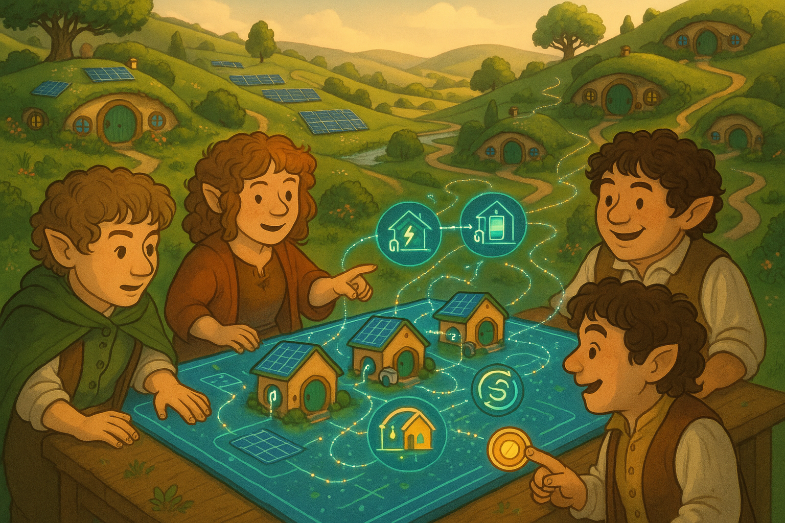

## **PROJECT IDENTIFICATION**

### **Project Title:** 
**Energy Empowerment Village**

### **Project Type:** 
**Hybrid**

### **Scale:** 
**Neighborhood**

### **Timeline:** 
**Medium-term (2-3 years)**

### ISO37101 mapping for 'Community-driven energy efficiency initiative.'

#### Scores

|   Score | Purpose                                     | Issue                                              | Justification                                                                                                                                                                                                                                                                                                                    |
|--------:|:--------------------------------------------|:---------------------------------------------------|:---------------------------------------------------------------------------------------------------------------------------------------------------------------------------------------------------------------------------------------------------------------------------------------------------------------------------------|
|       5 | Attractiveness                              | Economy and sustainable production and consumption | The project enhances the neighborhood's appeal through its focus on energy efficiency, reducing costs for residents. Additionally, by promoting local businesses in the energy sector, it contributes to economic vitality and encourages sustainable consumption patterns, appealing to both current and prospective residents. |
|       4 | Preservation and improvement of environment | Biodiversity and ecosystem services                | By optimizing energy use and potentially reducing carbon footprints, the initiative indirectly supports environmental preservation. The project encourages the use of green technologies, contributing to a sustainable ecosystem that maintains biodiversity and enhances local environmental quality.                          |
|       4 | Resilience                                  | Health and care in the community                   | The initiative prepares the community for energy-related economic shocks by providing knowledge and tools to manage consumption effectively. This builds resilience against rising energy costs, ultimately supporting the physical and mental well-being of residents through improved energy management.                       |
|       5 | Social cohesion                             | Living together, interdependence and mutuality     | The community engagement aspect of the project—through workshops and cohorts—fosters social connections and mutual support among residents. This initiative promotes inclusivity, creating a more cohesive community as participants learn from one another.                                                                     |
|       5 | Well-being                                  | Education and capacity building                    | The initiative focuses on enhancing residents' knowledge and skills regarding energy management. By providing workshops and a digital empowerment platform, it directly contributes to improved living conditions and overall well-being by enhancing residents' capabilities.                                                   |
|       4 | Responsible resource use                    | Innovation, creativity and research                | The project encourages innovative energy use strategies, promoting responsible resource management through educational efforts. By fostering creativity in energy consumption, residents are more likely to adopt sustainable practices and technologies.                                                                        |
|       4 | Attractiveness                              | Living and working environment                     | The initiative supports the overall attractiveness of the neighborhood by improving the living environment through energy efficiency, which contributes to enhanced quality of life and residential satisfaction.                                                                                                                |
|       4 | Social cohesion                             | Culture and community identity                     | The project aligns with local cultural values of sustainability and collective action, reinforcing community identity while promoting inclusivity and support among residents during the transition to smarter energy solutions.                                                                                                 |
|       3 | Well-being                                  | Safety and security                                | The project contributes to safety and security indirectly by enhancing community ties and reducing economic vulnerability through energy cost savings, although its primary focus is on energy management.                                                                                                                       |
|       5 | Preservation and improvement of environment | Community smart infrastructures                    | The development of a digital empowerment platform encourages the utilization of smart technologies, improving community infrastructures that align with sustainable energy practices. This fosters a technologically advanced neighborhood infrastructure.                                                                       |

## **CONTEXTUAL FOUNDATION**

### **Specific Local Challenge Addressed:**
The city faces challenges related to energy inefficiency and rising utility costs impacting residents' budgets. Many homeowners are unaware of how their existing smart devices, solar panels, and batteries can work together to reduce costs and increase their earnings. The pilot program's description indicates that while engagement in energy optimization has improved, the knowledge gap persists. The 'Energy Empowerment Village' initiative will provide residents with the tools and understanding needed to actively participate in energy flexibility, ultimately translating their usage into financial benefits and energy conservation.

### **Local Assets Leveraged:**
The local community already exhibits a strong interest in sustainability, as seen through the adoption of solar panels in many homes and a growing awareness of energy management solutions. Existing community centers can serve as gathering points for workshops and meetings. By harnessing these strengths, we will foster a collaborative environment where residents can learn from one another and share insights, fostering a sense of community.

### **Cultural/Social Fit:**
This project resonates deeply with the values of innovation, sustainability, and community spirit prevalent in the neighborhood. Residents are likely to be familiar with Denmark's emphasis on green practices and collective problem-solving. The project supports local traditions of neighborhood support, ensuring that no one feels left behind in the transition to smarter energy solutions. By focusing on collaboration and empowerment, we respect the community’s identity and enhance its social fabric.

## **PROJECT DESCRIPTION**

### **Core Concept:** 
The 'Energy Empowerment Village' initiative aims to equip residents with the knowledge, tools, and community support needed to optimize energy use. By creating an engaging digital platform paired with in-person community workshops, we will enable households to visualize and manage their energy consumption actively. The initiative will demonstrate the direct financial benefits of energy efficiency, motivating residents to fully utilize available technologies.

### **Key Components:**
1. **Digital Empowerment Platform:** A user-friendly digital twin interface tailored for the local community, allowing residents to simulate real-time energy behaviors and identify opportunities for flexibility.
2. **Workshops and Training Sessions:** Monthly community-oriented workshops where residents can learn about energy optimization, smart device use, and flexible energy strategies from experts and fellow community members.
3. **Community Energy Cohorts:** Establishing small groups of residents who can support each other in testing out new technologies, sharing experiences, successes, and challenges, thereby building a network of energy-savvy households.

### **Implementation Approach:**
- **Phase 1: Initial Connectivity and Awareness** (Month 1-6) – Roll out the digital platform to residents, accompanied by introductory sessions explaining its features and benefits. Host outreach events to gather input and discuss residents' energy concerns.
- **Phase 2: Education and Engagement** (Month 7-18) – Launch workshops to delve deeper into energy management strategies and encourage cohort formation. Collect data on household energy usage patterns to inform improvements to the platform.
- **Phase 3: Optimization and Incentivization** (Month 19-36) – With a robust understanding and community engagement established, create incentive programs, such as discounts on energy bills for households that achieve specific energy-saving targets or participation in flexibility events.

## **STAKEHOLDER ECOSYSTEM**

### **Champions:** 
Local energy cooperatives and environmental groups will champion and support the initiative. Community leaders known for advocating sustainability will help galvanize grassroots support, while schools and local influencers can assist in outreach.

### **Partners:** 
Collaborative partnerships will be necessary with local government's energy department, regional utility providers, tech companies specializing in energy software, and local educational institutions involved in energy research.

### **Beneficiaries:** 
The primary beneficiaries will be the diverse community of homeowners who, by maximizing their energy management capabilities, can save money and reduce their carbon footprint. Non-profits engaged with lower-income families will also ensure equitable access to the initiative, empowering even the most disadvantaged residents.

### **Potential Opposition:** 
Some residents might resist the project due to skepticism towards new technologies or concerns about potential costs associated with smart devices. Transparent communication, showcasing success stories, and addressing fears through informational sessions will be vital strategies in gaining trust.

## **FEASIBILITY & IMPACT**

### **Success Indicators:**
- **Quantitative metric:** A measurable increase in the percentage of households participating in energy-saving activities or installations of smart devices—targeting a 30% increase within the first two years.
- **Qualitative metric:** Resident satisfaction surveys indicating increased understanding and comfort in engaging with their energy systems, with a target of 80% satisfaction in educational workshop feedback.
- **Community-defined metric:** Residents will define their own benchmarks for success through community meetings, focusing on reductions in household energy bills and overall participation levels.

### **Ripple Effects:**
This project can lead to increased community cohesion as residents come together to share experiences and knowledge. A greater understanding of smart energy systems may spur further sustainable initiatives, including community gardens or local renewable energy projects, contributing to the neighborhood's sustainability.

### **Risk Mitigation:**
The regular update and feedback mechanism ensuring the platform remains user-friendly and effective can help mitigate the primary risk of technological rejection. Ongoing support and resources will also help diffuse concerns around technological costs.

## **LOCAL ADAPTATION NOTES**

### **What makes this project uniquely suited to this place:**
The initiative leverages Denmark's cultural values surrounding sustainability and collective action. Given the prevalence of solar installations in the neighborhood, the digital empowerment tool fits seamlessly into residents' existing lifestyles, showing how local pride and character produce a unique context for this project.

### **How locals would likely describe this project in their own words:**
Locals might say, "This is our chance to work together to save money and be greener. We can really understand how to use what we already have in our homes to help us, and it’s something we’re doing together as a community!" By focusing on community connection and empowerment, the 'Energy Empowerment Village' captures the spirit of the place while offering practical solutions to real challenges.