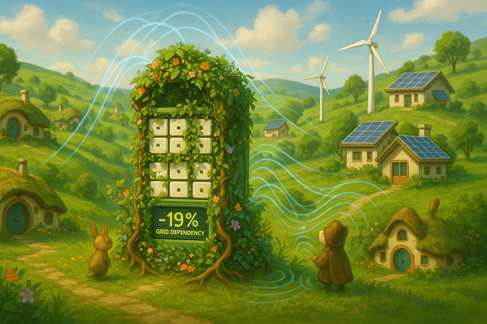

## **PROJECT IDENTIFICATION**

### **Project Title:** 
"Shire Energy Commons"

### **Project Type:** 
Hybrid

### **Scale:** 
Neighborhood

### **Timeline:** 
Medium-term (2-3 years)

### ISO37101 mapping for 'Community-driven energy independence initiative.'

#### Scores

|   Score | Purpose                                     | Issue                                              | Justification                                                                                                                                                                                                                                                                                                                                                                                |
|--------:|:--------------------------------------------|:---------------------------------------------------|:---------------------------------------------------------------------------------------------------------------------------------------------------------------------------------------------------------------------------------------------------------------------------------------------------------------------------------------------------------------------------------------------|
|       5 | Attractiveness                              | Community smart infrastructures                    | The 'Shire Energy Commons' project enhances the attractiveness of the neighborhood by integrating smart technology, local renewable energy sources, and community involvement. This innovative approach to energy management not only provides a sustainable solution to energy challenges but also creates communal hubs for education and engagement, elevating the neighborhood's appeal. |
|       4 | Preservation and improvement of environment | Biodiversity and ecosystem services                | The initiative encourages the use of local renewable energy and promotes sustainable practices, which positively contribute to environmental preservation in the Shire. The commitment to reducing peak energy demand and optimizing energy usage through smart technologies aligns with broader goals of environmental stewardship.                                                         |
|       5 | Resilience                                  | Economy and sustainable production and consumption | By providing solutions for local energy independence, the project enhances the community's resilience against fluctuations in energy prices and supply vulnerabilities. The establishment of a microgrid and energy cooperative fosters local economic activity while empowering residents to manage their energy needs sustainably.                                                         |
|       5 | Responsible resource use                    | Living and working environment                     | The project promotes responsible resource use by integrating modular battery storage and renewable energy solutions. This approach not only reduces energy consumption but also encourages responsible engagement among residents, enhancing the living and working environment by lowering costs and fostering a sense of community.                                                        |
|       5 | Social cohesion                             | Living together, interdependence and mutuality     | The Shire Energy Commons initiative is designed to foster social cohesion through community engagement and the formation of an energy cooperative. By encouraging collaborative energy management and shared responsibilities, the project strengthens community bonds and promotes interdependence among residents.                                                                         |
|       4 | Well-being                                  | Health and care in the community                   | The project focuses on improving well-being by promoting educational workshops on energy production and conservation. These initiatives not only equip residents with necessary skills but also foster a healthier community environment through sustainable practices and reduced energy burdens.                                                                                           |
|       3 | Attractiveness                              | Safety and security                                | The project supports community safety by establishing energy cooperatives that empower residents in energy decision-making processes. By enhancing transparency and education, the project may address residents' concerns about safety in energy independence, thus contributing to an overall sense of security within the community.                                                      |
|       4 | Preservation and improvement of environment | Governance, empowerment and engagement             | The Shire Energy Commons emphasizes community governance by incorporating residents in decision-making processes related to energy management. This empowerment encourages active participation in environmental stewardship, promoting collective efforts to address sustainability challenges.                                                                                             |
|       5 | Resilience                                  | Innovation, creativity and research                | The project embraces innovation by utilizing AI-driven technology to enhance energy flexibility and resilience. This focus on cutting-edge solutions encourages continuous improvement and adaptation within the community, positioning it to better respond to future energy challenges.                                                                                                    |
|       5 | Responsible resource use                    | Education and capacity building                    | Education is a core component of the Shire Energy Commons, with workshops designed to increase awareness and skills regarding energy management. By focusing on capacity building, the project lays the foundation for responsible resource usage and sustainable practices within the neighborhood.                                                                                         |

## **CONTEXTUAL FOUNDATION**

### **Specific Local Challenge Addressed:**
The Shire faces significant challenges related to energy dependency, especially during peak consumption times. The current grid dependency has resulted in increased energy costs and vulnerability during critical hours. The initiative to create a microgrid, enhanced with AI-driven flexibility services, seeks to reduce peak load demand by 19% as highlighted in the project description, thus improving local energy resilience and lowering costs for residents.

### **Local Assets Leveraged:**
Shire is already home to a network of community-minded residents who value sustainability and technological innovation. The existing smart buildings within the district provide a foundational asset for integrating a modular second-life battery system, capable of capturing and utilizing renewable energy more effectively. Additionally, the presence of local contractors and sustainability advocates positions the project to capitalize on the ingenuity and support already present within the community.

### **Cultural/Social Fit:**
The "Shire Energy Commons" initiative perfectly aligns with the local cultural values of self-sufficiency and sustainability. By encouraging community ownership of energy production and consumption, this project honors the residents’ traditions of cooperative living and resource sharing while fostering a sense of pride in local innovations that benefit everyone involved.

## **PROJECT DESCRIPTION**

### **Core Concept:** 
The "Shire Energy Commons" envisions a participatory energy management platform that combines local renewable energy sources, modular battery storage, and smart technology. By harnessing the community's collective investments in these systems, we will create a more sustainable and resilient neighborhood that actively reduces reliance on external energy sources, empowers residents with predictive analytics, and facilitates cost savings for all.

### **Key Components:**
1. **Physical/spatial element:** 
   The central feature of the initiative will be the installation of modular battery storage units in communal areas, strategically placed to optimize energy capture from local solar panels. These installations will also serve as community hubs for educational workshops on energy production and conservation.

2. **Programming/activity element:** 
   To engage the community, we will implement a series of workshops and informational sessions focused on how residents can generate energy, manage their consumption, and participate in local energy trading. This approach emphasizes practical knowledge and shared responsibilities for enhancing local energy independence.

3. **Community engagement element:** 
   Building a local energy cooperative will enhance community engagement, allowing residents to have a voice in decision-making processes related to energy management and distribution. This cooperative can operate a localized app for residents to monitor energy usage, forecast energy availability, and participate in community-led energy trading. 

### **Implementation Approach:**
- **Phase 1:** Conduct community outreach to gauge interest and inform residents about the microgrid concept and its benefits. Establish partnerships with local experts to assist in educational workshops and training sessions. Begin site assessments for ideal battery unit placements.
  
- **Phase 2:** Recruit residents to form the energy cooperative and secure funding through grants or local sponsorship. Initiate pilot projects featuring solar installations on rooftops of community buildings, showcasing real-life benefits and encouraging local investment.

- **Phase 3:** Expand fully operational battery systems and local energy trading platforms. Celebrate milestones with community events that encourage ongoing participation, education, and discussion regarding energy use and sustainability.

## **STAKEHOLDER ECOSYSTEM**

### **Champions:** 
Local advocacy groups with a history of sustainability efforts, such as the Shire Environmental Coalition, alongside community leaders and local universities with renewable energy programs will drive this project forward.

### **Partners:** 
Partnerships with local governments, renewable energy businesses, educational institutions, and potential technology firms specializing in AI-driven solutions will be crucial for successful implementation. Engaging utility companies to discuss how to align initiatives with existing grid infrastructure can also foster productive collaboration.

### **Beneficiaries:** 
All Shire residents will benefit from reduced energy costs, increased energy independence, and enhanced community cohesion. Vulnerable populations within the neighborhood will find additional support through reduced energy burdens, educational resources, and job creation in new local green industries.

### **Potential Opposition:** 
Concerns may arise from residents fearful of changes to their energy habits and dependency on technology. To address this, we will prioritize transparency and education, assuring that community input remains central to every decision.

## **FEASIBILITY & IMPACT**

### **Success Indicators:**
- **Quantitative metric:** Achieve a 19% reduction in peak grid demand within the first three years.
- **Qualitative metric:** Increase in community satisfaction regarding local energy solutions through annual surveys.
- **Community-defined metric:** Increased participation rates in energy workshops and cooperative meetings, reflecting community engagement.

### **Ripple Effects:** 
The project may catalyze further investments in green infrastructure, inspire resilience planning in adjacent neighborhoods, and create local job opportunities within the renewable energy sector, promoting broader economic development.

### **Risk Mitigation:** 
To counter potential risks related to technology failures or community reluctance, we will emphasize thorough community engagement during the planning phases and implement a phased rollout that allows for adjustments based on feedback and results.

## **LOCAL ADAPTATION NOTES**

### **What makes this project uniquely suited to this place:**
The Shire's dense community layout and existing architecture facilitate the establishment of a microgrid powered by community efforts, differentiating it from other neighborhoods where implementation may face obstacles related to distance or infrastructure.

### **How locals would likely describe this project in their own words:** 
"This is not just about energy; it’s about banding together to harness what we already have and turning our neighborhood into a beacon of sustainability. We're taking back control of our power, and that feels great!" 

This approach harnesses local insights while fostering a new sense of ownership and pride in sustainable practices, ensuring the "Shire Energy Commons" resonates deeply with its residents.