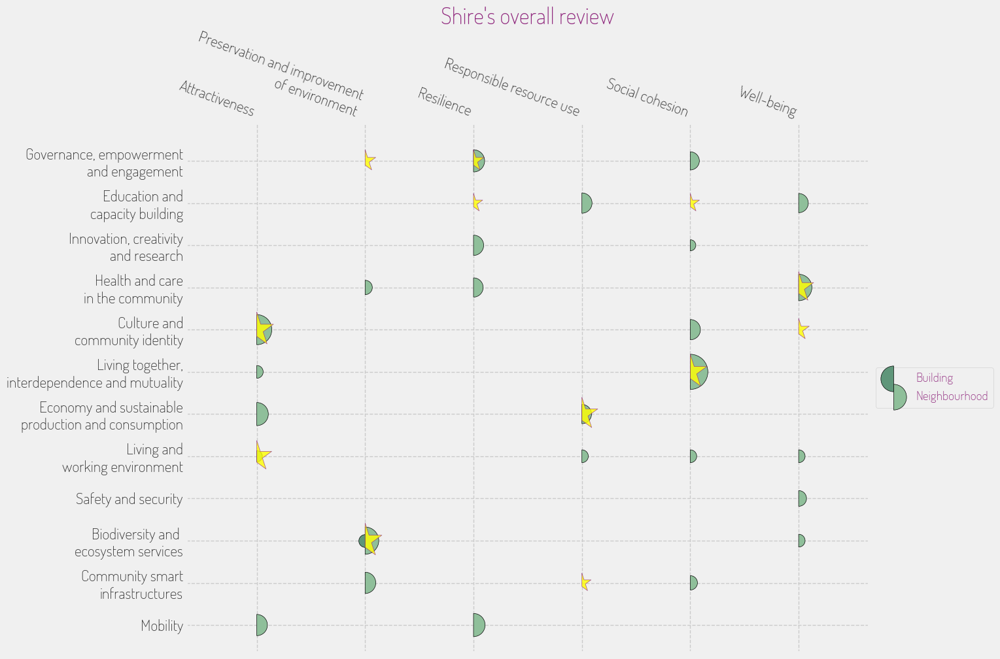

## **INITIATIVE PORTFOLIO**

### **Initiative #1: Green Flood Management Program**

**Category:** Green Space & Environment  
**Scale:** Neighborhood  
**Lead Stakeholder Type:** Community Group  
**Timeline:** Short (1 year)  

**What it is:** This initiative focuses on using community expertise to design and implement nature-based solutions, such as rain gardens and bioswales, to manage rainfall and prevent flooding. Workshops will educate residents on sustainable landscaping while enhancing biodiversity.  

**Why here:** The Shire faces increased rainfall and potential flooding threats to its agricultural lands. This program leverages the community's agricultural heritage and commitment to sustainability to ensure long-term resilience.  

**Who benefits most:** Farmers and residents living near water bodies.  

**Quick win or deep change:** Both. It offers immediate flood mitigation while fostering enduring environmental stewardship.  

**Estimated complexity:** Moderate.  

### **Initiative #2: The Hobbit Heritage Festival**

**Category:** Arts, Culture & Heritage  
**Scale:** City-wide  
**Lead Stakeholder Type:** Non-profit  
**Timeline:** Immediate (< 6 months)  

**What it is:** An annual festival celebrating hobbit culture through storytelling, crafts, and food that features local artisans and farmers. The festival will also include workshops and events that encourage the integration of diverse cultural practices.  

**Why here:** As the Shire faces demographic shifts, celebrating and sharing hobbit traditions will strengthen community identity and encourage intercultural dialogue among diverse populations.  

**Who benefits most:** Local artisans, farmers, and the broader community, including newcomers and tourists.  

**Quick win or deep change:** Quick win.  

**Estimated complexity:** Simple.  

### **Initiative #3: Digital Farm Marketplace**

**Category:** Economic Development & Local Business  
**Scale:** District  
**Lead Stakeholder Type:** Public-Private Partnership  
**Timeline:** Medium (2-3 years)  

**What it is:** A digital platform enabling local producers to sell directly to consumers, helping preserve the Shire’s agricultural heritage and supporting small businesses while connecting them with regional markets.  

**Why here:** The growing interest in local food systems and the distinct products, such as Longbottom Leaf, can be enhanced through accessible online sales, fostering economic development in the Shire.  

**Who benefits most:** Local farmers and small business owners, particularly those seeking to reach a wider audience.  

**Quick win or deep change:** Deep change.  

**Estimated complexity:** Complex.  

### **Initiative #4: Enhanced Pathway Connectivity Project**

**Category:** Mobility & Transportation  
**Scale:** Neighborhood  
**Lead Stakeholder Type:** Government  
**Timeline:** Short (1 year)  

**What it is:** Improving and expanding the existing network of pedestrian paths throughout the Shire to better connect neighborhoods, farmers' markets, and key community spaces, enhancing walkability and cycling opportunities.  

**Why here:** Given the Shire’s pedestrian-friendly environment, enhancing connectivity will support local businesses and encourage community engagement without relying on vehicles.  

**Who benefits most:** Residents and visitors who value outdoor activities and access to local amenities.  

**Quick win or deep change:** Quick win.  

**Estimated complexity:** Moderate.  

### **Initiative #5: Community Resilience Hubs**

**Category:** Community Safety & Resilience  
**Scale:** Neighborhood  
**Lead Stakeholder Type:** Non-profit  
**Timeline:** Medium (2-3 years)  

**What it is:** Establishing designated community centers as resilience hubs equipped with resources and plans for extreme weather events, providing services such as food distribution, emergency supplies, and educational resources.  

**Why here:** The Shire's growing concerns over rainfall and flooding necessitate a proactive approach to emergency preparedness and community support systems.  

**Who benefits most:** All residents, particularly vulnerable populations in areas prone to flooding.  

**Quick win or deep change:** Deep change.  

**Estimated complexity:** Moderate.  

### **Initiative #6: Local Garden Co-ops**

**Category:** Food Systems  
**Scale:** Hyperlocal  
**Lead Stakeholder Type:** Community Group  
**Timeline:** Immediate (< 6 months)  

**What it is:** Establishing community-led garden cooperatives to enhance local food production, allowing residents to cultivate shared plots and learn sustainable gardening techniques. Workshops will promote food literacy and environmental awareness.  

**Why here:** Given the Shire’s emphasis on agriculture and community gatherings, this initiative strengthens food sovereignty and educates residents about sustainable practices.  

**Who benefits most:** Families and individuals interested in gardening, cooking, and nutrition.  

**Quick win or deep change:** Quick win.  

**Estimated complexity:** Simple.  

### **Initiative #7: Intercultural Dialogue Workshops**

**Category:** Education & Skills  
**Scale:** Neighborhood  
**Lead Stakeholder Type:** Academic Institution  
**Timeline:** Medium (2-3 years)  

**What it is:** Hosting workshops and discussion groups that promote understanding and integration among diverse cultural groups in the Shire. These sessions will focus on sharing traditions, languages, and collaborative solutions to community challenges.  

**Why here:** As the Shire experiences demographic shifts, fostering intercultural dialogue will strengthen community ties and promote inclusiveness, aligning with the community's aspirations for cultural preservation.  

**Who benefits most:** Newcomers, diverse cultural groups, and long-time residents seeking improved social cohesion.  

**Quick win or deep change:** Both.  

**Estimated complexity:** Moderate.  

## **PORTFOLIO OVERVIEW**

### **Interconnections:**
- The **Local Garden Co-ops** initiative can enhance food systems and feed into the **Digital Farm Marketplace**, allowing produce from co-ops to be sold online. 
- The **Hobbit Heritage Festival** and **Intercultural Dialogue Workshops** could be complementary, as both advocate for community engagement and cultural exploration. 
- The **Enhanced Pathway Connectivity Project** enhances access to the **Community Resilience Hubs**, making it easier for residents to seek support during emergencies.

### **Sequencing Recommendation:**
The **Hobbit Heritage Festival** should start first to boost community morale and encourage participation in subsequent initiatives, fostering engagement around cultural identity.

### **Coverage Check:**
- Age groups served: Children, Youth, Working Age, Seniors
- Economic spectrum: Low-income, Middle-income, Market-rate, Mixed
- Spatial distribution: Concentrated, Dispersed

### **Missing Voice:**
The initiatives may overlook the needs of seasonal workers and migrant populations who contribute to the agricultural sector but lack stable support systems in the community.