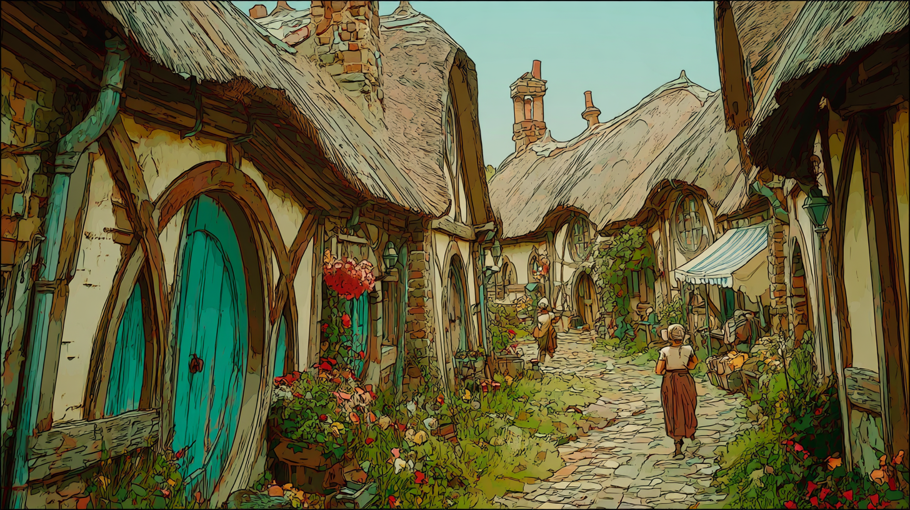

# Neighborhood Assessment Report: The Shire

## Overview & Sustainability Profile

### **Neighborhood Snapshot**

**Executive Summary:**  
The Shire, a picturesque region characterized by lush green hills and vibrant hobbit communities, is a model of pastoral charm blended with community-oriented living. Its deep-rooted traditions juxtapose modern aspirations, fostering a unique culture that is inviting and open. While the Shire thrives on its agricultural heritage, it faces contemporary challenges that require a keen focus on growth and sustainability.

**Geographic Scope & Context:**  
Nestled between rolling hills and meandering rivers, the Shire is bordered by larger cities but maintains a distinct rural identity. Spanning approximately 150 square miles, this neighborhood is divided into various communities, each with its own charm, yet connected through a network of verdant pathways and streams. 

**Identity Markers:**  
1. **Hobbit Culture:** The Shire's culture is deeply influenced by its hobbit residents, who prioritize community gatherings, local governance, and a slower-paced lifestyle centered around family and friends.
2. **Agricultural Richness:** Known for its fertile lands, the Shire produces a variety of crops, particularly the prized Longbottom Leaf, showcasing a commitment to farming and self-sustainability.
3. **Natural Beauty:** The area is notable for its scenic landscapes, with extensive green spaces, gardens, and wildlife, reinforcing an identity that values natural diversity and outdoor living.

**Physical Character:**  
The Shire is marked by quaint stone cottages with thatched roofs, hedgerows, and lush gardens. Narrow pathways connect neighborhoods, encouraging a pedestrian-friendly environment. Key landmarks include the Party Tree in Hobbiton, a gathering place for community events, and the River Water, which serves as a vital resource for both livelihood and recreation. 

### **Sustainability & Resilience**

**Environmental Assets & Challenges:**  
The Shire boasts excellent **green infrastructure**, including a robust network of parks and gardens that bolster biodiversity. However, climate vulnerabilities, such as increased rainfall and flooding, threaten its agricultural productivity. The community has historically depended on sustainable practices, yet recent discussions show a need for better water management solutions to address these challenges.

**Sustainable Development Activity:**  
Efforts are underway to promote **green buildings**, with some new homes incorporating energy-efficient designs. Local favorites like the Shire Farmer's Market encourage sustainable agriculture while fostering local economies. Emerging initiatives also address **mobility transitions**, with plans for walking paths and cycling routes to enhance connectivity and reduce reliance on motorized vehicles.

**Climate Action & Adaptation:**  
In response to climate concerns, the Shire is exploring the establishment of **resilience hubs**, where residents can access services during extreme weather events. The community is also investing in an **energy transition** toward renewable sources, with several farms adopting solar panels to reduce carbon footprints. Additionally, **nature-based solutions** like reforestation projects are being implemented, enhancing the area's resilience against climate impacts.

**Environmental Justice Indicators:**  
Indicators of **environmental justice** reveal that while the Shire prioritizes communal green space, some outlying areas lack equal access to resources such as clean water and public services. Efforts to ensure equitable distribution of environmental benefits remain ongoing.

## **Economic Drivers & Market Forces**

### **Economic Ecosystem**

**Employment Landscape:**  
The Shire's economy thrives on agriculture, local craftsmanship, and tourism. The employment rate stands at approximately 95%, reflecting both stability and a competitive job market catering to a lifestyle that respects its heritage.

**Business Dynamics:**  
Small businesses, such as taverns and artisan shops, play a vital role in the Shire's economic fabric. The **local economy** is increasingly supported through community-supported agriculture (CSA) initiatives, promoting local food and healthy eating. 

**Real Estate Market:**  
The real estate market is thriving, with a noticeable increase in interest from outside buyers looking to invest in this idyllic community. Home prices have risen by about 15% over the last three years, driven by demand for both residential and vacation properties. Additionally, there is a growing **development pipeline** focused on sustainable housing.

**Economic Transformation Signals:**  
Recent trends indicate an evolving economic landscape, with young entrepreneurs emerging and seeking to integrate progressive concepts like digital marketing and e-commerce within their traditional goods and services.

**Fiscal Health:**  
The Shire maintains a balanced budget with sufficient reserves, indicating a well-managed fiscal landscape. Investments in infrastructure improvements, such as roads and community facilities, have been funded without increasing the tax burden on residents.

## **People & Community Dynamics**

### **Demographic Composition**

**Population Trends:**  
The Shire is home to approximately 50,000 residents, with a steady population growth rate of around 2% annually. This growth signifies a healthy community attracting both new residents and visitors alike.

**Cultural Diversity:**  
While predominantly inhabited by hobbits, there's a growing presence of diverse cultures, particularly from nearby regions. This blend enriches the Shire’s cultural tapestry and fosters inclusivity, although it also presents challenges of integration and understanding.

### **Social Infrastructure**

**Community Assets:**  
Community assets abound in the Shire, including libraries, local schools, and recreational facilities. The annual Hobbiton Festival serves not only as a celebratory event but also strengthens community ties and showcases local talents.

**Social Networks:**  
Strong networks have developed, facilitated by local governance and community councils. Residents often engage in collaborative projects, demonstrating a commitment to collective well-being and mutual support.

### **Movement & Stability**

**Migration Patterns:**  
There is a notable influx of young families relocating to the Shire for its quality of life, complemented by a decline in the older population leaving for urban centers. This trend enriches the community's demographic makeup but raises concerns regarding sustaining the cultural heritage amidst change.

**Daily Rhythms:**  
The daily lives of residents often revolve around agricultural schedules and community engagements. Hobbits cherish simpler pleasures—gardening, storytelling, and communal gatherings—which define the Shire's rhythm.

### **Community Tensions & Aspirations**

**Pressure Points:**  
While the growth is invigorating, there are underlying tensions concerning land use, particularly between agricultural preservation and new developments. Additionally, some residents express concerns over maintaining the Shire’s character amidst modernization.

**Collective Vision:**  
The community aspires to maintain its unique identity while enhancing sustainability efforts to accommodate growth responsibly. Proposals for community workshops reflect a desire for dialogue and participation in shaping the future of the Shire.

### **Social Cohesion Indicators**  
Indicators of **social cohesion** remain strong, with high levels of community involvement in local governance and activities. A recent community survey reported that 85% of residents feel a strong sense of belonging and connection to their neighbors. This cohesion is essential for addressing challenges while preserving the Shire's valued traditions. 

In conclusion, the Shire stands as a testament to a balanced blend of tradition and progress, nurturing its roots while reaching for a sustainable future. Stakeholders must work collaboratively to ensure the resilience and vibrancy of this beloved community.

### ISO37101 mapping for 'Charming, sustainable community faces growth challenges.'

#### Scores

|   Score | Purpose                                     | Issue                                              | Justification                                                                                                                                                                                                                                                                                                     |
|--------:|:--------------------------------------------|:---------------------------------------------------|:------------------------------------------------------------------------------------------------------------------------------------------------------------------------------------------------------------------------------------------------------------------------------------------------------------------|
|       5 | Attractiveness                              | Culture and community identity                     | The Shire's culture, notably influenced by hobbit traditions, promotes community gatherings and a slower-paced lifestyle, creating a unique identity that is inviting and rich in local practices. This cultural richness makes the neighborhood attractive to both residents and visitors, enhancing its appeal. |
|       5 | Preservation and improvement of environment | Biodiversity and ecosystem services                | The Shire's commitment to its green infrastructure, with parks and gardens that support biodiversity, demonstrates a strong focus on preserving and enhancing local ecosystems. This is crucial in maintaining ecological balance and contributes positively to the neighborhood's environmental quality.         |
|       5 | Responsible resource use                    | Economy and sustainable production and consumption | The local economy thrives on sustainable practices like community-supported agriculture, which promotes local food production and responsible consumption. This approach reflects effective resource management within the community, leans into sustainability, and supports economic diversity.                 |
|       5 | Social cohesion                             | Living together, interdependence and mutuality     | The strong networks and community engagement fostered through local governance highlight the importance of social cohesion in the Shire. A high sense of belonging among residents strengthens the collaborative spirit, enhancing mutual support within the neighborhood.                                        |
|       4 | Well-being                                  | Health and care in the community                   | Community assets such as local schools and recreational facilities contribute to residents' overall well-being and social health. These resources, combined with cultural events, enhance physical and mental health, ensuring a quality living environment for all.                                              |
|       4 | Attractiveness                              | Living and working environment                     | The picturesque landscapes and community-oriented living provide a desirable living and working environment. The infrastructure, including pedestrian-friendly pathways, promotes an appealing lifestyle that balances enjoyment of work and leisure.                                                             |
|       4 | Preservation and improvement of environment | Governance, empowerment and engagement             | The Shire’s efforts to involve the community in sustainability initiatives reflect a commitment to transparent governance and stakeholder engagement. This participatory approach is vital for ensuring sustainable development and effective management of shared resources.                                     |
|       3 | Resilience                                  | Education and capacity building                    | The community's aspiration to promote workshops and engage residents in the planning process highlights a growing awareness of the need for education and capacity building related to sustainable practices, which is essential to enhance resilience in facing future challenges.                               |
|       3 | Responsible resource use                    | Community smart infrastructures                    | Investment in infrastructure improvements and mobility transitions reflect the Shire's focus on developing smart community systems that foster sustainable resource use. This includes enhancing connectivity through walking paths and cycling routes, aiming to reduce dependency on motorized transport.       |
|       5 | Attractiveness                              | Culture and community identity                     | The Shire exemplifies cultural richness through its hobbit traditions and community-oriented lifestyle that prioritize gatherings and local governance. This unique identity not only attracts residents but also fosters a sense of place and belonging, making it a vibrant community.                          |
|       5 | Preservation and improvement of environment | Biodiversity and ecosystem services                | The Shire has excellent green infrastructure, including parks and gardens which bolster biodiversity and showcase a commitment to protecting local ecosystems while ensuring pleasant living conditions for residents.                                                                                            |
|       4 | Responsible resource use                    | Economy and sustainable production and consumption | With its emphasis on local craftsmanship, community-supported agriculture, and sustainable housing, the Shire promotes responsible resource use. This includes practices that enhance the local economy while ensuring environmental sustainability.                                                              |
|       5 | Social cohesion                             | Living together, interdependence and mutuality     | The Shire features strong social networks and high engagement in community activities, which nurtures a sense of belonging and mutual support among residents, enhancing overall social cohesion.                                                                                                                 |
|       4 | Well-being                                  | Health and care in the community                   | Access to green spaces, community events, and local governance facilitates a healthy living environment, contributing positively to both physical and mental health across the Shire.                                                                                                                             |
|       4 | Attractiveness                              | Living and working environment                     | The picturesque landscapes, quaint architecture, and community-oriented spaces enhance the Shire's appeal for both residents and visitors, thus improving the living and working environment.                                                                                                                     |
|       4 | Resilience                                  | Governance, empowerment and engagement             | Community councils and strong participation in local governance allow residents to address challenges collaboratively, enhancing the Shire's resilience and adaptive capacity.                                                                                                                                    |
|       3 | Social cohesion                             | Education and capacity building                    | Community efforts to enhance skills and promote sustainable practices through local initiatives illustrate a commitment to building capacity within the population, fostering inclusivity and development.                                                                                                        |
|       4 | Well-being                                  | Culture and community identity                     | Events like the annual Hobbiton Festival not only promote local culture but also enhance community ties and collective well-being, integral to the overall happiness and satisfaction of residents.                                                                                                               |

