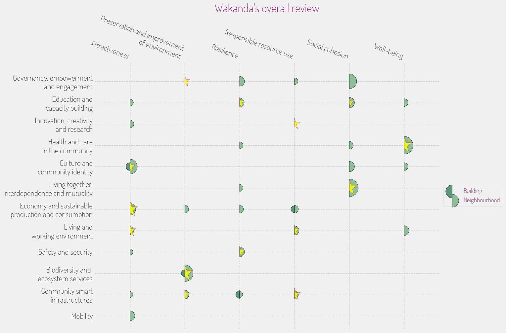

## INITIATIVE PORTFOLIO

### **Initiative #1: Climate Resilience Hubs**

**Category:** Community Safety & Resilience  
**Scale:** City-wide  
**Lead Stakeholder Type:** Government / Public-Private Partnership  
**Timeline:** Short (1 year)  
**What it is:** Establish climate resilience hubs across Wakanda equipped with resources for disaster response, emergency supplies, and community education on how to prepare for climate-related events. These hubs would also serve as community centers that facilitate local engagement and training sessions on sustainability practices.  
**Why here:** Given Wakanda’s commitment to environmental stewardship and the acknowledgment of climate vulnerabilities, this initiative builds on existing resilience efforts while fostering community cohesion.  
**Who benefits most:** Vulnerable populations and those living in areas most affected by climate events.  
**Quick win or deep change:** Both  
**Estimated complexity:** Moderate

### **Initiative #2: Eco-Community Gardens**

**Category:** Green Space & Environment  
**Scale:** Hyperlocal  
**Lead Stakeholder Type:** Community Group / Non-profit  
**Timeline:** Immediate (< 6 months)  
**What it is:** Develop community gardens that utilize local resources, promote biodiversity, and serve as educational spaces for sustainable agricultural techniques, connecting residents with their land. These gardens would use organic practices and encourage sharing among neighbors.  
**Why here:** With Wakanda’s rich cultural traditions and dedication to environmental stewardship, this initiative aligns perfectly with the community's values while addressing disparities in access to green spaces.  
**Who benefits most:** Families and individuals interested in sustainable living and growing fresh produce.  
**Quick win or deep change:** Quick win  
**Estimated complexity:** Simple

### **Initiative #3: Vibranium Innovation Incubators**

**Category:** Economic Development & Local Business  
**Scale:** District  
**Lead Stakeholder Type:** Academic Institution / Private Sector  
**Timeline:** Medium (2-3 years)  
**What it is:** Establish incubators that focus on startups leveraging vibranium technology for sustainable solutions, pairing entrepreneurs with mentorship, funding, and access to innovative networks. This would stimulate job creation and technological advancement tailored to local needs.  
**Why here:** With vibranium being a significant driver of Wakanda’s economy, supporting entrepreneurs in this field can further enhance economic stability while capitalizing on local strengths.  
**Who benefits most:** Tech entrepreneurs and small business owners.  
**Quick win or deep change:** Deep change  
**Estimated complexity:** Complex

### **Initiative #4: Inclusive Cultural Festivals**

**Category:** Arts, Culture & Heritage  
**Scale:** Neighborhood  
**Lead Stakeholder Type:** Community Group  
**Timeline:** Short (1 year)  
**What it is:** Organize annual festivals that celebrate the diverse cultures within Wakanda, including art, music, food, and traditions, with a focus on collaboration among all community groups, ensuring representation from marginalized voices.  
**Why here:** Celebrating diversity is integral to Wakanda’s social fabric; this initiative can build stronger social cohesion and promote understanding among various ethnic groups, echoing T'Challa’s sentiments on unity.  
**Who benefits most:** Various cultural groups, artists, and residents seeking connection.  
**Quick win or deep change:** Quick win  
**Estimated complexity:** Moderate

### **Initiative #5: Affordable Housing Co-ops**

**Category:** Housing & Built Environment  
**Scale:** City-wide  
**Lead Stakeholder Type:** Non-profit / Government  
**Timeline:** Long (3+ years)  
**What it is:** Develop a network of cooperative housing options targeting low- and middle-income families, integrating sustainable materials and energy systems that mirror Wakanda's environmental standards. Residents would engage in ownership and management, building community ties.  
**Why here:** Addressing rising housing costs while ensuring environmentally conscious living ensures that all community members can benefit from Wakanda’s growth.  
**Who benefits most:** Low- to middle-income families and individuals.  
**Quick win or deep change:** Deep change  
**Estimated complexity:** Complex

### **Initiative #6: Tech-Enhanced Public Transport**

**Category:** Mobility & Transportation  
**Scale:** City-wide  
**Lead Stakeholder Type:** Government / Public-Private Partnership  
**Timeline:** Medium (2-3 years)  
**What it is:** Expand and enhance the existing public transport network with electric vehicles and tech-efficient routing systems powered by local resources, ensuring affordable and accessible transit options for all residents.  
**Why here:** As population growth strains the current infrastructure, this initiative allows for sustainable transportation solutions while exemplifying Wakanda’s commitment to tech innovation.  
**Who benefits most:** Daily commuters, low-income individuals, and seniors.  
**Quick win or deep change:** Both  
**Estimated complexity:** Moderate

### **Initiative #7: Holistic Wellness Workshops**

**Category:** Social Services & Health  
**Scale:** Neighborhood  
**Lead Stakeholder Type:** Non-profit  
**Timeline:** Short (1 year)  
**What it is:** Introduce community-led workshops focusing on mental and physical wellness, including nutrition, mental health support, and traditional healing practices, building on the cultural heritage of Wakanda.  
**Why here:** Enhancing health and well-being is essential for community resilience, especially in a rapidly growing area that may experience increased stress and resource strain.  
**Who benefits most:** Families, particularly vulnerable populations.  
**Quick win or deep change:** Quick win  
**Estimated complexity:** Simple

## PORTFOLIO OVERVIEW

### Interconnections:
- The Eco-Community Gardens can directly support the Holistic Wellness Workshops by providing fresh produce and fostering knowledge-sharing about nutrition.
- The Inclusive Cultural Festivals can amplify the Affordable Housing Co-ops by showcasing residents' stories, promoting a sense of community and shared identity, thus encouraging a greater sense of belonging among residents.

### Sequencing Recommendation:
Starting with the Eco-Community Gardens and Holistic Wellness Workshops will create immediate benefits for the community while laying the groundwork for broader initiatives, like the Affordable Housing Co-ops and Vibranium Innovation Incubators, which require more significant investments and planning.

### Coverage Check:
- Age groups served: Children / Youth / Working Age / Seniors
- Economic spectrum: Low-income / Middle-income / Market-rate / Mixed
- Spatial distribution: Concentrated (specific neighborhoods) / Dispersed (all sectors benefiting)

### Missing Voice:
The perspectives of the elderly or disabled individuals, who may face barriers to accessing cultural festivals and housing initiatives, might still be overlooked in these proposals. Further engagement with their specific needs would be necessary to ensure a truly inclusive approach.